************
4 Workspaces
************

.. contents:: Contents

Introduction
============

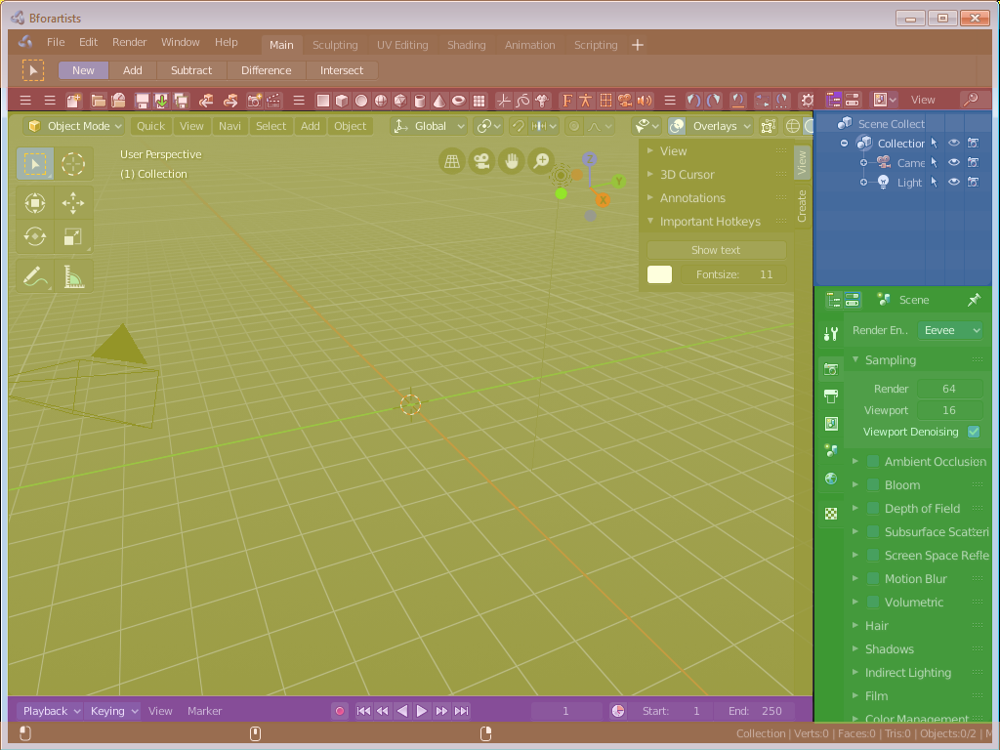

A Workspace is a layout with different editors. For example, in most workspaces you have a 3d view editor, a outliner and a properties editor. It includes Top Bar and Footer. And every workspace can have some specific settings. The Sculpting Workspace starts for example in Sculpt mode. And not in Edit Mode like the default workspace.

To switch between the workspaces simply click at the tabs. 

The chapter tabs and default workspaces is explained in the chapter Topbar. It is menu functionality. And menu functionality gets explained where the menu is. 

This chapter here is about the general functionality of workspaces.

ModifyingWorkspaces
===================

Resizing Editor Windows
-----------------------

Move the mouse over a border between the editors. The mouse cursor will turn into a double arrow. Drag the arrow around and the editor will resize with your moving mouse.

In the Default layout there are two editors that are collapsed to just show the menu. The menu bar at the top is a own editor. The Info editor. You can drag it down to reveal a text field. Here Bforartists displays all the former actions as strings. When you create a primitive for example, then it displays a string with the python command for it.

The other collapsed editor is at the bottom. The timeline.

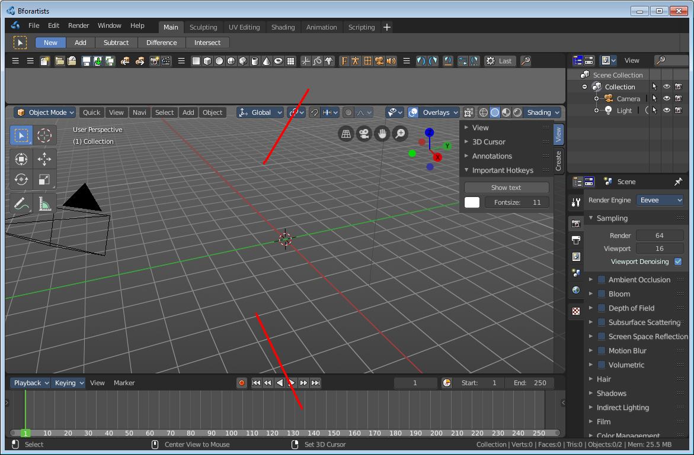

Splitting Editor Windows
------------------------

When you move the mouse over the upper corner of a editor window, then the mouse pointer turns into a white cross.

When you click and drag the mouse inwards of the current editor, then the editor splits up. You open a second 3D view for example.

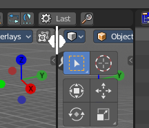

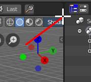

Unioning Editor Windows
-----------------------

The method is nearly the same than with splitting the editor windows. When you move the mouse over the upper corner of a editor window, then the mouse pointer turns into a white cross.

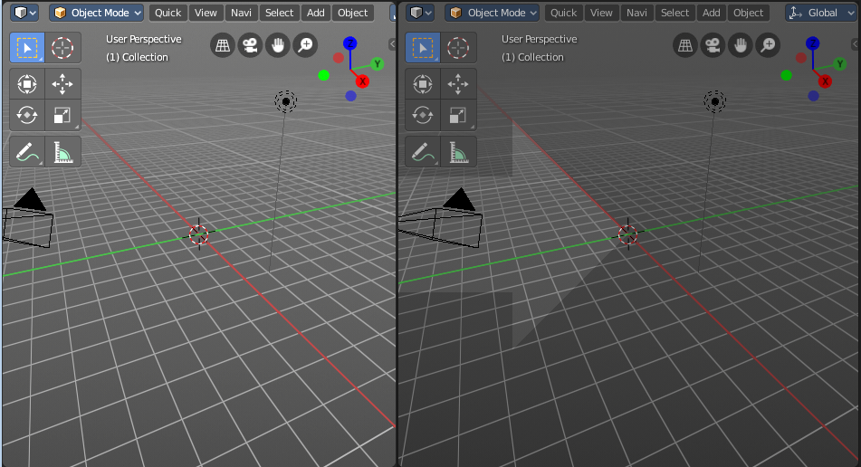

When you click and drag the mouse outwards of the current editor, then the editor unions with the neighbour editor. Note that this just works when they are in one row, horizontally or vertically. 

Swapping Contents
-----------------

You can swap the contents between two editors with clicking at the corner area, holding Ctrl,and drag into the target editor. The mouse pointer will turn into a swap icon. When you release the mouse the two editors will swap their positions.

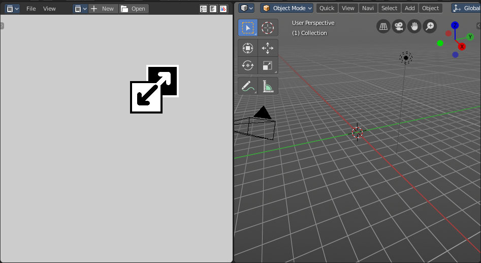

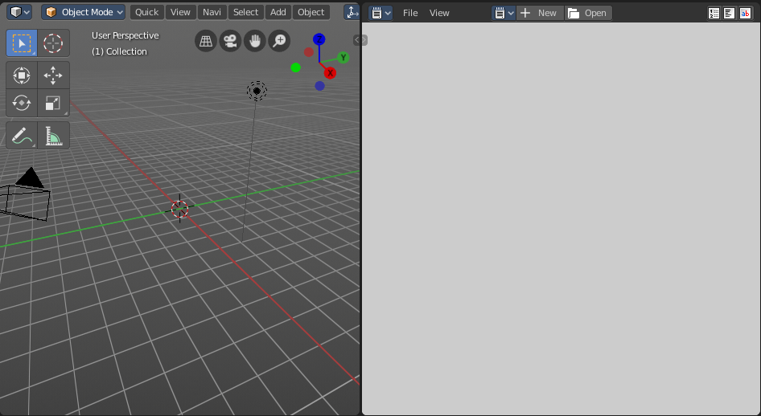

Make Editor Window floating
---------------------------

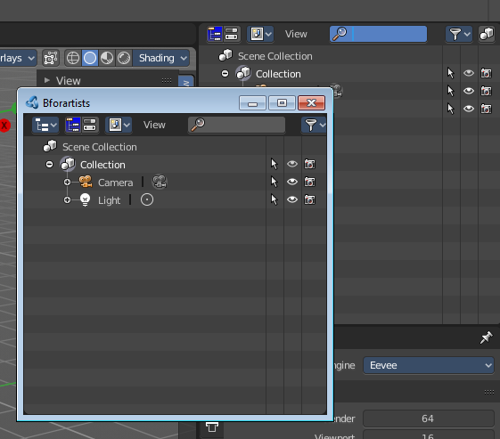

When you move the mouse over the upper corner of a editor window, then the mouse pointer turns into a white cross.

Hold down Shift, and drag the mouse. The editor will detach from the Blender surface. This is useful for a multi monitor setup for example. Now you can place this editor at Monitor 2.

Note that there is no way to reintegrate this floating editor window back into the Blender UI once it is detached. You have to close it.

Change Editor Type
==================

There is a Editor Tpye menu in every header. This menu is usually hidden in the default layouts. It can be revealed by either splitting the editor window. Or in the right click menu in the header. Hide editortype menu. See next point.

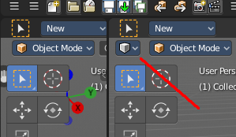

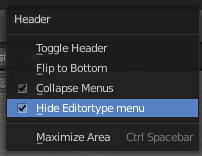

When you click at this button then a menu with all available editor types opens up. And you can change the current editor to another editor type.

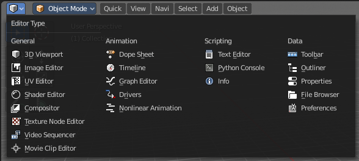

Show / Hide the editor type menu
================================

You might have noticed that the editor type menu is not available in the editors of the standard layouts. This is to reduce visual noise and to free some UI space.

You can show and hide this editor type menu. To do so right click at an empty space somewhere at the menu bar of an editor. You will see a menu now. And here you can check or uncheck the menu item Hide Editortype Menu to show or hide the Editor Type menu.

Collapse Menus
==============

The text menus can be collapsed to free some UI space. Right click at an empty space somewhere at the menu bar of an editor. You will see a menu now. Here you can choose if you want to display the text menu collapsed or expanded.

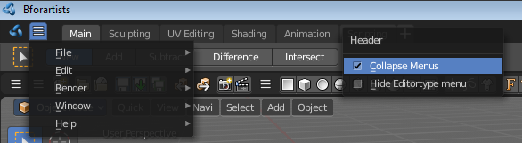

Resize Tool Shelf and Properties content
========================================

You can resize the Tool Shelf content and the Properties Sidebar content. This means that you can zoom in or out. This trick also works in the Properties Editor.Move the mouse over the upper region of the Tool Shelf. Hold down Ctrl keyClick with Middle Mouse button. The mouse pointer will turn into two white triangles.

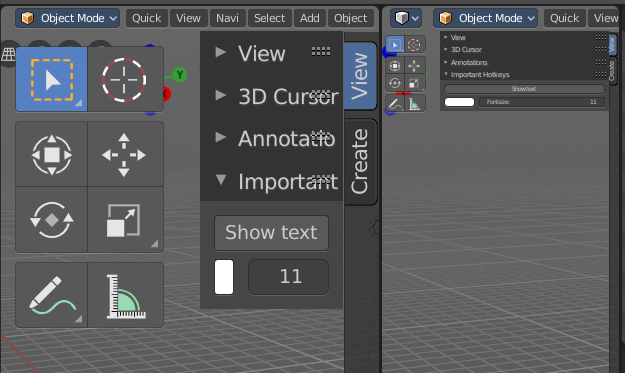

Now drag up or down to resize the area content

OR

Move the mouse over the upper region of the Tool Shelf. Simply press Numpad + or Numpad -

To reset the area content to default scale move the mouse over the area and press Home key ( german keyboard layout Pos 1)

Create new Workspace
====================

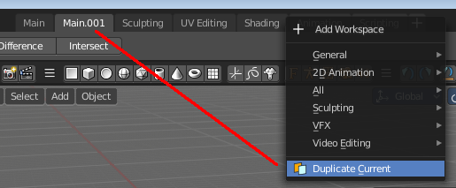

Click at the + sign at the right of the tabs. The Add Workspace menu will open up. Choose Duplicate Current. This will create a new tab. The name will be something like mycurrentworkspace.001.

To rename the new layout double click at the name. The text becomes editable.

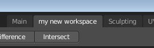

Now you can start to edit your workspace and its settings. 

Workspace Settings
==================

A workspace is not only a set of editor windows. In the Properties editor you can also find some workspace specific settings.

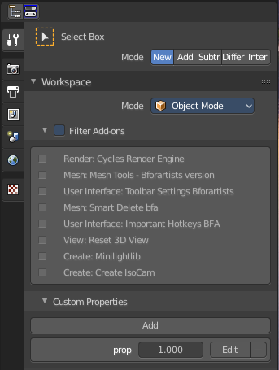

In this settings you can define in what mode the workspace starts. You can exclude addons. And you can add custom properties. Which are basically just values for scripting needs.

The settings from this panel will load every time you switch to this workspace.

Save changes at the Workspace
=============================

You cannot save new workspaces or modifications at an existing workspace directly. To save modifications at an existing workspace you have to save the Startup File. This menu item can be found in the File menu.

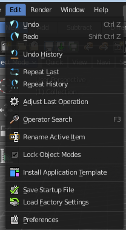

Once saved you will find this new workspace also in the add workspace menu under your template.

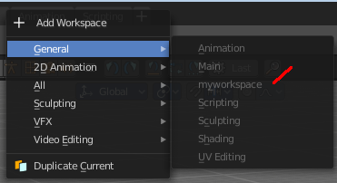

When you are in the default application template then this settings will save the new workspace to the defaults.

When you are in one of the other application templates though, then you will save the new workspace to the template. Same counts for the factory settings. You will then load the factory settings from the current active application template.

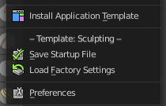

The menu entry will also look a bit different then. You will see a label that gives you a hint about the current application template in use. In this case the sculpting application template.

Note that this also affects other changes. Bforartists will for example now start with the currently active layout. And it will also preserve the changes that you did at other layouts before saving.

So when you work at a layout be sure that you don't accidentally do changes at other areas. And before you save the startup file you should switch back to the layout with which you want to start Bforartists.

DeleteWorkspace
===============

Workspace can also be deleted. To do so rigth click at the tab that you want to delete, and choose delete in the menu.

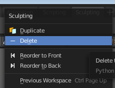

Note that you can remove your own created workspaces this way. But the default workspaces will remain in the menus. They will just vanish from the tabs. These workspaces are protected so that you cannot remove them completely.

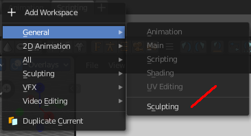

Load Workspace layout from Blend Files
======================================

Every blend file saves also the layout in which the scene is at the point of saving. Means you can load a layout from the blend file.

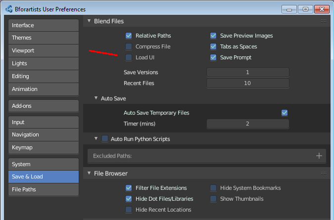

This feature is off by default since it is usually unwanted behaviour to load layouts from other people.

You can turn it on in the User Preferences in the File tab. Tick the menu item Load UI. Then save User Settings.

Note that now all Blend files that you open will load the workspace layout that the Blend files are saved with.

You can also do this at a file by file base. The file browser allows you to load a blend file with the saved layout. This setting can be found down left in the file browser.

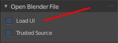

Standard Workspaces
===================

.. list-table::

	* - 	  - 
.. list-table::

	* - 	  - 
.. list-table::

	* - 	  - 
.. list-table::

	* - 	  - 
.. list-table::

	* - 	  - 
.. list-table::

	* - 	  - 
.. list-table::

	* - 	  - 
.. list-table::

	* - 	  - 
.. list-table::

	* - 	  - 
.. list-table::

	* - 	  - 
.. list-table::

	* - 	  - 
.. list-table::

	* - 	  - 
.. list-table::

	* - 	  - 
.. list-table::

	* - 	  - 
.. list-table::

	* - 	  - 
.. list-table::

	* - 	  - 
