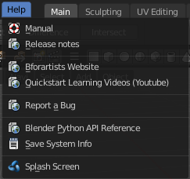
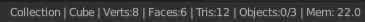

**********************
5 Topbar and Statusbar
**********************

.. contents:: Contents

Topbar Introduction
===================

The Topbar is the area at the top that is visible in all workspaces. The topbar contains some general menus like File and Edit. And it contains tabs to switch between workspaces.

Header Right Click menu
=======================

The header has, like all headers, some right click menu functionality.

Collapse Menus
--------------

Here you can make the menus in the header appear collapsed.

Hide Editortype Menu
--------------------

This menu item has no purpose in the Topbar header. The Topbar header does not have a editortype menu.

File Menu
=========

The File menu contains file related functionality.

New
---

New is a sub menu. Here you can choose to create a new file with predefined Application Templates.

Application templates is a collection of workspaces for a predefined purpose.

Standard Application Templates
------------------------------

General
-------

The general application template comes with the workspaces to create 3D content.

2D Animation
------------

The 2D Animation application template comes with the workspaces to create 2D animation.

All
---

The All application template contains all default workspaces.

Sculpting
---------

The Sculpting application template comes with the workspaces for sculpting needs.

VFX
---

The VFX application template comes with the workspaces for motion tracking.

Video Editing
-------------

The Video Editing application template comes with the workspaces for video editing.

Open
----

Open a blend file.

Open Recent
-----------

Open last recent blend files.

Revert
------

Reload the last saved file.

Recover last Session
--------------------

Open the last closed blend file. (quit.blend)

Recover Autosave
----------------

Open the last autosaved blend file.

Save
----

Save blend file.

Save As
-------

Save blend file as.

Save Copy
---------

Saves a copy of the current file.

Link
----

Link allows you to link content from another blend file. The content remains in the other blend file. The linked blend file will be required to work with the linked content.

When you click at Link then a file browser will open. Down left you will see some further options.

Advanced Filter
---------------

This filter allows you to filter the content of the blend file for specific object types.

Link from Library
-----------------

Relative Path 
--------------

Available only when linking, see **relative paths**. 

Select
------

Makes the object **Active** after it is loaded. 

Active Layer
------------

Enabled by default, the object is assigned to the visible layers in your scene. Otherwise, it is assigned to the same layers it resides on in the source file. 

Instance Collections
--------------------

This option links the collection to an object, adding it to the active scene. 

Please Note:
------------

When you select an Object type, it will be placed in your scene at the cursor. Many other data types - cameras, curves, and materials for example - must be linked to an object before they become visible.

You cannot move a linked object. Its position is defined in its source file. If you want to modify the object locally you can either use Dupli Groups or make the object local, in the 3D View, Object / Relations menu.

Appending data you already have linked, will add objects / groups to the scene, but will keep them linked (and un-editable).

Known Limitations
-----------------

In general dependencies shouldn’t go in both directions.Attempting to link or append data which links back to the current file will likely result in missing links.

When linking objects **directly** into a .blend file, the **Rigid Body** settings won’t be linked in since they’re associated with their scenes world.As an alternative you could link in the entire scene and set it as a Background Set Scene.

Append
------

Append allows you to append content from another blend file. The content will be copied over, and become part of the current blend file.

When you click at Link then a file browser will open. Down left you will see some further options.

The difference to Link is that with Append the object becomes part of the current blend file. And it is editable.

Advanced Filter
---------------

This filter allows you to filter the content of the blend file for specific object types.

Append from Library
-------------------

Select
------

Makes the object **Active** after it is loaded. 

Active Collection
-----------------

Put the new objects into the active collection.

Instance Collection
-------------------

Create instances for collections rather than adding them directly to the scene.

Fake User
---------

Set Fake User for appended objects, except Objects and Groups

Localize All
------------

Localize all appended data, including indirectly linked from other libraries.

Data Previews
-------------

Data Previews is a sub menu with functionality around the Data Preview in the Bforartists file browser. The functionality in this menu creates and handles previews of the objects in a blend file. 

Data Previews are displayed in the file browser when you link or append something from this file and when you use thumbnails as display method. It is meant for the case when you want to turn a blend file into a asset library. Materials, ready textured objects, etc. .

This feature is currently broken. You can't create data previews yet in Bforartists 2. Example images taken from Bforartists 1.

Workflow:

First create a scene with your assets. Make sure to remove the camera from the scene. It can work, but it can also make trouble, and prevent the batch generation to work at the blend file. And a asset library doesn't need a camera anyways. Not so important is lights, it does not make trouble like the camera. But you won't get a data preview icon for lights.

Save the scene. Restart Bforartists or create at least a new scene. We want to have a look what we currently get as preview when we want to link or append from this blend file. Make sure to turn the view in the file browser to thumbnails. It's always just the default icon for the assets. Left Materials, right the Objects.

Now let's run Batch Generate Previews at this blend file.

This process takes a while. Now let's try to append from the same file again. You will get proper preview thumbnails now. Left Materials, right the objects.Here you will see again that lamps have no preview icon.

Refresh Data-Block Previews
---------------------------

Refreshes the existing data-block previews.

Batch Generate Previews
-----------------------

Generates the previews for the data objects in the selected blend file(s). The scene that you want to work at should not be loaded.

Clear Data-Block Previews
-------------------------

Removes existing previews for some types in the target blend file.

Batch Clear Previews
--------------------

Removes all existing previews in the target blend file.

Import
------

Import is a sub menu with the available 3D import file formats. You will be prompted to the load dialog which provides some further import options down left in the file browser tool shelf.

Collada
-------

Imports a file in collada file format. Collada is a general file format that is able to store and load animation.

Import Data Options
-------------------

Import Units
------------

Imports the units that gots used to save the collada file . If unticked Blender Units will be used.

Armature Options
----------------

Fix Leaf Bones
--------------

Fix orientation of Leaf bones. Collada file formats only supports joints, not bones.

Find Bone Chains
----------------

Find best matching bone chains and ensure that the bones in the chain are connected.

Auto Connect
------------

Auto connect parent bones that have exactly one child bone.

Minimum Chain Length
--------------------

When searching bone chains disregard chains of length below this value.

Keep Bind Info
--------------

Store Bindpose Information in custom bone properties for later use in later collada export.

Alembic
-------

The alembic file format is for static geometry. It does not support armatures, hair or particles.

Manual Transform
----------------

Scale
-----

Here you can set the import scale factor.

Options
-------

Set Frame Range
---------------

Sets the Frame range start and end point in Bforartists to match the one in the alembic file.

Is Sequence
-----------

Import sequenced files that are split in cache parts.

Validate Meshes
---------------

Check for invalid mesh data in the file. Note that this operation may take some time.

FBX
---

FBX is a proprietary file format from Autodesk. FBX is a general file format that is able to store and load animation.

Operator Presets
----------------

Here you can store and load presets. To add a preset, adjust the import dialog, click at the + button behind the dropdown box, add the name of the preset, and click OK. The preset will be stored automatically. To use the preset simply choose it in the dropdown box. Don't get irritated by that the dropdown box still shows "Operator Presets" when you choose your preset. The values of the chosen preset are set.

To remove a preset choose it in the dropdown box, and click at the - button behind the dropdown box. Also here, don't get irritated by that the dropdown box still shows "Operator Presets" . The chosen preset will be deleted.

Main / Armatures
----------------

The FBX import dialog has two tabs. Main and Armatures. In Main you will find the general import settings. In Armatures you will find armature related settings.

Main
----

Manual Orientation
------------------

Here you can choose to adjust a custom orientation to import your data. You can adjust the Forward and Up values to your needs.

Scale 
------

Here you can adjust the scale factor at import.

!Experimental! Apply Transform
------------------------------

Bake space transform into object data. This avoids unwanted rotations when the target space is not aligned with the Bforartists space. Warning! This feature is experimental. Use at own risk.

Import Normals
--------------

Import Normals of the mesh.

Import Animation
----------------

Import animation.

Animation Offset
----------------

Here you can adjust a offset in frames for the imported animation.

Import User Properties
----------------------

Import User properties as custom properties.

Import Enums as Strings
-----------------------

Stores enumeration values as strings.

Image Search
------------

Search sub directions for associated images.

Decal Offset
------------

Displace geometry of alpha meshes. 

Use Pre/ Post Rotation
----------------------

Use Pre or Post Rotation from FBX transform. This feature may not work in all cases.

Armatures
---------

Ignore Leaf Bones
-----------------

Ignore the last bone at the end of the chain.

Force Connect Children
----------------------

Force connection of the children bones to their parent.

Automatic Bone Orientation
--------------------------

Try to align the mayor bone axis with the bone children.

Primary and secondary Bone Axis
-------------------------------

Here you can manually adjust the bone orientation per axis. Note that this features are greyed out when Automatic Bone Orientation is ticked.

Motion Capture (BVH)
--------------------

The Biovision Hierarchy (BVH) character animation file format is a file format to carry motion capture data.

Target
------

You can either target a armature or a object.

Scale
-----

The import scale.

Start Frame
-----------

The start frame for the animation.

Scale FPS
---------

Scale the framerate of the BVH file to the current scenes. With off every frame of the BVH is one frame in Bforartists.

Update Scene FPS
----------------

Sets the scene frame rate to that of the BVH file. Note that this nullifies the Scale FPS feature since the scale will be 1:1.

Update Scene Duration
---------------------

Extend the scene duration to be the one of the BVH file duration.

Loop
----

Loop the animation playback.

Rotation
--------

The rotation type.

Forward
-------

The forward orientation.

Up
--

The Up orientation.

Stanford (PLY)
--------------

The Stanford Triangle Format was designed to store three-dimensional data from 3D scanners. It is a static file format for mesh data, and cannot carry animation data.

Stanford PLY has no import options.

Wavefront(OBJ)
--------------

Wavefront Obj is a file format for static geometry. And while you can still create a sequence of meshes for animation with it (some software stores shapekeys that way for example), you cannot store animation in the file. It is also unique since it is usually made of two files. A OBJ part that contains the mesh data. And a MTL part that contains the material including the connected textures.

Operator Presets
----------------

Here you can store and load presets. To add a preset, adjust the import dialog, click at the + button behind the dropdown box, add the name of the preset, and click OK. The preset will be stored automatically. To use the preset simply choose it in the dropdown box. Don't get irritated by that the dropdown box still shows "Operator Presets" when you choose your preset. The values of the chosen preset are set.

To remove a preset choose it in the dropdown box, and click at the - button behind the dropdown box. Also here, don't get irritated by that the dropdown box still shows "Operator Presets" . The chosen preset will be deleted.

Smooth Groups
-------------

Surround smooth groups by sharp edges.

Lines
-----

Import Lines and Faces with 2 verts as edge.

Split / Keep Vert Order
-----------------------

Split splits the mesh up. Keep Vertex Order imports everything as one mesh. Both methods have some further options.

Split by Object
---------------

Import loose meshparts as single objects.

Split by Group
--------------

Import Obj Groups as meshes.

Keep Vert Order Poly Groups
---------------------------

Import Obj groups as vertex groups.

Clamp Size
----------

Clamp bounds under this value. A value of zero disables this feature.

Forward
-------

The Forward orientation at import.

Up
--

The Up orientation at import.

Image Search
------------

Search sub directions for associated images.

STL
---

STL (Standard Triangulation/Tesselation Language) is a standard format for many cad software. It is a format for static geometry, it cannot handle animation. The format is popular for 3d printing purposes.

Scale
-----

The import scale.

Scene Unit
----------

Apply the scene unit at the geometry at import.

Facet Normals
-------------

Import the geometry with faceted faces.

Forward
-------

The Forward orientation at import.

Up
--

The Up orientation at import.

Scalable Vector Graphics (SVG)
------------------------------

Scalable Vector Graphics is usually a 2D file format to describe vector graphics. But Vector graphics are also curves. Which can be used in a 3 dimensional space.

SVG has no import properties.

glTF 2.0 (glb, gltf )
---------------------

The GL Transmission Format fron the Khronos Group is a file format for 3D scenes and models, and is based at the JSON standard.

Pack Images
-----------

Pack all images into the Blend file at loading the glTF file.

Shading
-------

Here you can define the shading of the imported geometry.

Use Normal Data uses the existing normals.

Flat shading shades the whole mesh flat and facetted.

Smooth shading shades the whole mesh smooth.

Export
------

Export is a sub menu with the available export formats.

Collada
-------

Exports a file in collada file format. Collada is a general file format that is able to store and load animation.

Operator Presets
----------------

Here you can store and load presets. To add a preset, adjust the import dialog, click at the + button behind the dropdown box, add the name of the preset, and click OK. The preset will be stored automatically. To use the preset simply choose it in the dropdown box. Don't get irritated by that the dropdown box still shows "Operator Presets" when you choose your preset. The values of the chosen preset are set.

To remove a preset choose it in the dropdown box, and click at the - button behind the dropdown box. Also here, don't get irritated by that the dropdown box still shows "Operator Presets" . The chosen preset will be deleted.

The Collada exporter is divided into several subtabs since it would be too much to display all settings at once.

Main
----

Selection Only
--------------

Only export selected elements, not the whole scene.

Include Children
----------------

Export all children of selected objects, even if not selected.

Include Armatures
-----------------

Export related armatures, even if not selected.

Include Shape Keys
------------------

Export all shape keys from Mesh Objects

Texture Options
---------------

Only Selected UV Map
--------------------

Export only the selected UV map

Copy
----

Copy the textures to the same folder where the .dae file is exported.

Geom
----

The geometry export section.

Export Data Options
-------------------

Apply Modifiers
---------------

Applies the modifiers for export. The resolution can be adjusted in the dropdown box behind the Apply Modifiers checkbox. You can choose between View and Render.

Triangulate
-----------

Triangulates the mesh at export.

Arm
---

The armature export section.

Armature Options
----------------

Deform Bones only
-----------------

Only export deforming bones with armatures.

Export to SL/OpenSim
--------------------

Compatibility mode for SL, OpenSim and other compatible online worlds.

Anim
----

The Animation export section.

Include Animations
------------------

Export Animation if available.

Samples/Curves
--------------

Export samle keys or curves keys.

Transformation Type
-------------------

The transformation type for translation, scale and rotation. Matrix or TransRotLoc.

Keep Smooth Curve
-----------------

Just available with TransRotLoc transformation type. Export also the curve handles if available.

Sampling Rate
-------------

The distance between two keyframes.

Keep Keyframes
--------------

Use existing keyframes as sample points.

All Keyed Curves
----------------

Export also curves that has just one key or are completely flat.

Include all Actions
-------------------

Export also unassigned actions.

Extra
-----

Some extra export settings.

Collada Options
---------------

Use Object Instances
--------------------

Instantiate multiple objects from same data.

Use Blender Profile
-------------------

Export Blender specific settings for shader, bones, materials, etc.

Sort by Object Name
-------------------

Sort exported data by name.

Keep Bind Info
--------------

Store Bind Pose Information in custom bone properties for later use during Collada export.

Limit Precision
---------------

Reduce the precision of the exported data to 6 digits.

Alembic
-------

The alembic file format is for static geometry. It does not support armatures, hair or particles. However, there are some options to export at least some data of it.

The alembic export options are divided into four sections.

Manual Transform
----------------

Scale
-----

The export scale factor.

Scene Options
-------------

Start Frame
-----------

The start frame of the export.

End Frame
---------

The end frame of the export.

Transform Samples
-----------------

Number of times per frame at which animated transformations are sampled.

Geometry Samples
----------------

Number of times per frame at which geometry transformations are sampled.

Shutter Open
------------

The start frame to sample transform and geometry samples. Valid range is -1 to 1. -1 indicates the previous frame, 0 indicates the current frame, and 1 indicates the next frame.

Shutter Closed
--------------

The end frame to sample transform and geometry samples. Valid range is -1 to 1. -1 indicates the previous frame, 0 indicates the current frame, and 1 indicates the next frame.

Selected Objects only
---------------------

Export just selected objects.

Renderable Objects only
-----------------------

Export just renderable objects.

Visible Layers only
-------------------

Export just objects in visible layers.

Flatten Hierarchy
-----------------

Remove parent / children relationship.

Object Options
--------------

UV's
----

Export UV's. Note that Alembic just supports a single UV map.

Pack UV Islands
---------------

Export UV's with packed islands.

Normals
-------

Export Normals.

Vertex Colors
-------------

Export Vertex Colors.

Face Sets
---------

Export per Face shading group assignments.

Use Subdivision Schema
----------------------

Export meshes using Alembic's subdivision schema.

Apply Subsurf
-------------

Export subdivision surfaces as meshes. Means apply subdivision modifier before export.

Curves as Mesh
--------------

Export Curces and Nurbs surfaces as meshes.

Triangulate
-----------

Triangulate meshes before export.

Quad Method
-----------

The quad method that gets used to triangulate the meshes.

Polygon Method
--------------

The polygon method that gets used to triangulate the meshes.

Particle Systems
----------------

Alembic does not support hair or particles. However, here you can find some options to export at least some data of it.

Export Hair
-----------

Export hair particle systems as animated curves.

Export Particles
----------------

Export non-hair particles.

FBX
---

FBX is a proprietary file format from Autodesk. FBX is a general file format that is able to store and load animation. 

Operator Presets
----------------

Here you can store and load presets. To add a preset, adjust the import dialog, click at the + button behind the dropdown box, add the name of the preset, and click OK. The preset will be stored automatically. To use the preset simply choose it in the dropdown box. Don't get irritated by that the dropdown box still shows "Operator Presets" when you choose your preset. The values of the chosen preset are set.

To remove a preset choose it in the dropdown box, and click at the - button behind the dropdown box. Also here, don't get irritated by that the dropdown box still shows "Operator Presets" . The chosen preset will be deleted.

The FBX exporter is divided into several tabs since it would be too much to display all settings at once.

Main
----

Selected Objects
----------------

Export just selected objects.

Active Collection
-----------------

Export just the active collection.

Scale
-----

The scale factor for export.

Apply Unit Scale
----------------

Take the current Blender Units into account.

Apply Scalings
--------------

How to apply custom and unit scaling in the generated FBX file.

Forward
-------

The forward orientation.

Up
--

The up orientation.

Empty / Camera / Lamp / Armature / Mesh / Other
-----------------------------------------------

What kind of object you want to export. Holding shift key adds to the current selection. 

!Experimental! Apply Transform
------------------------------

Bake space transform into object data.

Custom Properties
-----------------

Export custom properties if available.

Path Mode
---------

Method used to reference paths.

Embed Textures
--------------

Just valid for method Copy. Embeds the textures into the FBX Binary.

Batch Mode
----------

Here you can adjust some further export methods. You can for example export every collection into a own FBX file.

Geometries
----------

Apply Modifiers
---------------

Apply existing modifiers before exporting.

Use Modifieres Render Settings
------------------------------

Use Render settings when applying modifiers. For example, the Subdivision Surface modifier has two independant setttings for the workspace and the rendering.

Smoothing
---------

Define what smoothing information gets exported.

Loose Edges
-----------

Export loose edges. Loose edges are polygons with just two vertices.

Tangent Space
-------------

Add binormal and tangent vectors together with the tangent space information. This feature just works with tris or quads.

Armatures
---------

Only Deform Bones
-----------------

Only export deforming bones, and none deforming ones when they have children.

Add Leaf Bones
--------------

Add a final bone at the end of every bone chain.

Primary Bone Axis
-----------------

The primary bone axis orientation.

Secondary Bone Axis
-------------------

The secondary bone axis orientation.

Armature FBX Node Type
----------------------

FBX type of node used to represent a Blender Bone.

Animation
---------

Baked Animation
---------------

Export baked keyframe animation.

Key all Bones
-------------

Force export at least one key of animation for all bones.

NLA Strips
----------

Export each non muted NLA strip.

All Actions
-----------

Export each action as a separated FBX anim stack.

Force Start/ End Keying
-----------------------

Always add a keyframe at start and end of actions for animation channels.

Sampling Rate
-------------

How often to evaluate animated values, in frames.

Simplify
--------

Here you can simplify the animation. 0.0 to disable. 1.0 does not simplify at all. Higher values simplifies the animation then.

BVH
---

The Biovision Hierarchy (BVH) character animation file format is a file format to carry motion capture data. 

To export BVH you need to have a armature with animation selected.

Scale
-----

The scale factor for the export.

Start Frame
-----------

The start frame of the animation

End Frame
---------

The end frame of the animation

Rotation
--------

The rotation order that is defined in the BVH file.

Root Translation Only
---------------------

Only write out translation values for the root bone.

Stanford (PLY)
--------------

The Stanford Triangle Format was designed to store three-dimensional data from 3D scanners. It is a static file format for mesh data, and cannot carry animation data.

Apply Modifiers
---------------

Apply all modifiers before export.

Normals
-------

Export normals.

UV's
----

Export UV's

Vertex Colors
-------------

Export Vertex Colors.

Forward
-------

The forward orientation.

Up
--

The up orientation.

Scale
-----

The scale factor for the export.

Wavefront(OBJ)
--------------

Wavefront Obj is a file format for static geometry. And while you can still create a sequence of meshes for animation with it (some software stores shapekeys that way for example), you cannot store animation in the file. It is also unique since it is usually made of two files. A OBJ part that contains the mesh data. And a MTL part that contains the material including the connected textures.

Operator Presets
----------------

Here you can store and load presets. To add a preset, adjust the import dialog, click at the + button behind the dropdown box, add the name of the preset, and click OK. The preset will be stored automatically. To use the preset simply choose it in the dropdown box. Don't get irritated by that the dropdown box still shows "Operator Presets" when you choose your preset. The values of the chosen preset are set.

To remove a preset choose it in the dropdown box, and click at the - button behind the dropdown box. Also here, don't get irritated by that the dropdown box still shows "Operator Presets" . The chosen preset will be deleted.

Selection Only
--------------

Export only the selected object(s).

Animation
---------

Write out a Obj mesh for each frame.

Apply Modifiers
---------------

Apply Modifiers before export.

Use Modifier Render Settings
----------------------------

SDS modifier has a viewport and a render resolution. When ticked the render resolution gets chosen.

Inlcude Edges
-------------

Include loose edges at export. Loose edges are defined by two vertices only.

Smooth Groups
-------------

Write sharp edges as smooth groups.

Bitflag Smooth Groups
---------------------

Write sharp edges as smooth groups, but generate smooth groups id's as bitflags.

Write Normals
-------------

Export Normals

Include UV's
------------

Export UV's

Write Materials
---------------

Export materials. Note that the OBJ file format cannot carry the Blender material settings. The Obj file format uses a primitive Phong shader.

Triangulate Faces
-----------------

Triangulate Faces at export.

Write Nurbs
-----------

Export Nurbs curves

Polygroups
----------

Export Polygroups

Objects as OBJ Objects
----------------------

Export objects as OBJ Objects.

Objects as OBJ Groups
---------------------

Export objects as OBJ groups.

Material Groups
---------------

Export material groups.

Keep Vertex Order
-----------------

Keep the vertex order at export.

Scale
-----

The scale factor for the export.

Path Mode
---------

How the paths like texture paths gets handled at export.

Forward
-------

The forward orientation.

Up
--

The up Orientation.

STL
---

STL (Standard Triangulation/Tesselation Language) is a standard format for many cad software. It is a format for static geometry, it cannot handle animation. The format is popular for 3d printing purposes.

Selected Only
-------------

Export only the selected object(s).

Scale
-----

The import scale.

Scene Unit
----------

Apply the scene unit at the geometry at export.

Ascii
-----

You can either export the file as binary format or as ascii format. 

Apply Modifiers
---------------

Apply all modifiers before export.

Batch Mode
----------

Export all geometry to one file or create a file for every object.

Forward
-------

The Forward orientation at export.

Up
--

The Up orientation at export.

glTF 2.0 (glb, gltf )
---------------------

The GL Transmission Format fron the Khronos Group is a file format for 3D scenes and models, and is based at the JSON standard.

Operator Presets
----------------

Here you can store and load presets. To add a preset, adjust the import dialog, click at the + button behind the dropdown box, add the name of the preset, and click OK. The preset will be stored automatically. To use the preset simply choose it in the dropdown box. Don't get irritated by that the dropdown box still shows "Operator Presets" when you choose your preset. The values of the chosen preset are set.

To remove a preset choose it in the dropdown box, and click at the - button behind the dropdown box. Also here, don't get irritated by that the dropdown box still shows "Operator Presets" . The chosen preset will be deleted.

glTF 2.0 exporter is divided into several tabs since it would be too much to display all settings at once.

General
-------

Format
------

Here you can choose between three export formats. Binary, Embedded and Separate.

Selected Only
-------------

Export only the selected object(s).

Apply Modifiers
---------------

Apply all modifiers before export.

Y up
----

Export with Y Up orientation.

Custom Properties
-----------------

Export custom properties as glTF extras.

Remember Export Settings
------------------------

Store glTF settings in the blender project. You need to save the project then.

Copyright
---------

Here you can enter a custom copyright string.

Meshes
------

UV's
----

Export UV's

Normals
-------

Export Normals.

Tangents
--------

Export Tangents.

Vertex Colors
-------------

Export Vertex Colors.

Materials
---------

Export Materials.

Objects
-------

Cameras
-------

Export Cameras.

Punctual Lights
---------------

Export Punctual Lights.

Animation
---------

Use Current Frame
-----------------

Export the scene in current animation frame.

Animations
----------

Export active actions and NLA tracks.

Limit to Playback Range
-----------------------

Clips animations to selected playback range.

Sampling Rate
-------------

How often to evaluate animated values in frames

Always Sample Animations
------------------------

Apply sampling to all animations.

Skinning
--------

Export Skinning data.

Bake Skinning Constraints
-------------------------

Apply skinning constraints to armatures. 

Include all Bone Influences
---------------------------

Allow vertex influences greater 4.

Shape Keys
----------

Export Shape Keys. Also called Morph Targets.

Shape Key Normals
-----------------

Export vertex normals with shape keys.

Shape Key Tangents
------------------

Export vertex tangents with shape keys.

External Data
-------------

A Blend file may work with external data. Textures for example. Or text files. Or other Blend files, used as libraries. 

In this menu you can adjust some settings for external data.

External data like textures or text files can also be packed directly into the blend file. This has some advantages, like that now all data is in one file. But also some drawbacks. Texture editing is for example not longer possible. You would have to export the texture first to be able to save the modifications.

Packed data displays a packed icon in the dropdown box. This example is from the header of the UV editor. But you can see this icon also in the material editor at the texture node then.

Library Blend files cannot be packed. Use append instead of link to have the data of another blend file in the blend file.

Automatically Pack into .blend
------------------------------

Automatically pack all files into the blend file. Don't forget to save the blend file. Note that this greys out the two menu items Pack all into Blend and Unpack packed Files.

Pack All into .blend
--------------------

Packs all external data into the blend file. Note that the paths must fit, and the external data must be available. A common pitfall here is that the textures uses absolute paths, and are moved to another location meanwhile. See Make all Paths Relative or Find missing Files. Or that you have a not longer existing file linked that shouldn't be in the blend file at all. See Outliner, Orphan Data.

You will get a warning when something is missing.

.. image:: graphics/5_Topbar_and_Statusbar/1000020100000171000000436D0D6DADAA574CDA.png

Unpack packed files
-------------------

Unpack packed files exports all packed data. You will get an options menu where you can choose between several different unpack methods.

Use Files in current Directory (create when necessary)
------------------------------------------------------

Extracts all files to the current directory of the blend file. If the files in the current directory exists, reuse it. Else extract the ones from the blend file. 

NOTE! The title is misleading, it does NOT write the files to the current directory. But into a subfolder, textures for example, in the current directory. Which gets created if necessary. And this option is not to change.

Write files to current directory (overwrite existing files)
-----------------------------------------------------------

Extracts all files to the current directory of the blend file, and writes it to the current directory. Existing content will be overwritten.

NOTE! The title is misleading, it does NOT write the files to the current directory. But into a subfolder, textures for example, in the current directory. Which gets created if necessary. And this option is not to change.

Use files in original location (create when necessary)
------------------------------------------------------

Extracts all files into their original directories where they were before packing them into the blend file. If the files in the original directory exists, reuse it. Else extract the ones from the blend file. This feature uses absolute paths.

Write files to original location(overwrite existing files)
----------------------------------------------------------

Extracts all files into their original directories where they were before packing them into the blend file. If the files in the original directory exists, reuse it. Else extract the ones from the blend file. This feature uses absolute paths.

Make All Paths Relative
-----------------------

Make all paths relative means the path will be shortened to just the file name. For example, C:\\myfolder\\mysubfolder\\mytexture.jpg turns into texture.jpg . Relative paths allows you to move the whole project folder to another location. The file paths will still be valid.

Make all Paths Absolute
-----------------------

Make all paths relative means the path will be shortened to just the file name. For example, turns into texture.jpg C:\\myfolder\\mysubfolder\\mytexture.jpg. Absolute paths requires the full valid path for all files. 

Report Missing Files
--------------------

Scans through the blend file and tries to find missing files. You will get a warning when a missing file is found.

Find Missing Files
------------------

Browse for the new location of moved files.

Quit
----

Quit Bforartists.

Edit Menu
=========

Undo
----

Reverts the last step.

Note. Bforartists uses two separated histories for the Object Mode and the Edit Mode. Means when you leave the Edit mode then you will loose the undo steps in the edit mode.

Redo
----

Rolls back your last Undo action.

Undo History
------------

The Undo History is a list of the last operations. Her you can roll back to a specific step.

Note that this Undo History is a session history, and does not save to the Blend file. 

Repeat Last
-----------

Repeat last repeats the last operation. For example, when you have moved a object by 5 in X, then it moves the object by 5 in X with every repeat last step.

Repeat History
--------------

Repeat History calls a menu with the last actions where yon can choose an action to berepeated.

Adjust Last Operation
---------------------

Some operations have settings, and can be further tweaked. It's the Blender ass forward concept for setting up a operation. In other software you set up an operation and perform it then with this settings. In Blender you first perform the operation, and tweak its settings afterwards. At least sometimes, this concept is not consistent. Bforartists is a fork of Blender. And so we have to live with this concept too.

For example, when you create a primitive, then you may want to adjust the size, or tick options like generate UV's at creation. This is done in the Last Operator panel. This Last Operator Panel is usually down left in the view.

The Adjust Last Operation calls exactly this content as a menu popup.

Note that when you perform another operation, like moving the cube after creation, then the last operation content for creation is gone. It will now display the last operation content for the transform operation.

Operator Search
---------------

This menu item calls a search menu where you can search through all available operators, and perform them if needed. Think of it as one gigantic searchable dropdown menu that contains everything available.

Even operators that have no menu entries are listed. Which is useful for scripting purposes, when you want to perform a script operation, but don't have a menu button (yet).

You can navigate with the mouse or with arrow up and down buttons. Performing an operator can be done by clicking at it or by hitting enter.

Note that this search just lists the old traditional operators from before Blender 2.80. Not the ones in the Tool Shelf, which is a completely independant tool system.

Rename active Item
------------------

Allows you to rename the currently active item. A rename dialog will pop up where you can type in a new name for the current item. You can have more than one item selected. Just the active item gets renamed.

Batch Rename
------------

Allows you to rename more than one item or parts of the name at once. It will open a rename dialog with various settings.

Data Type
---------

Here you can choose the data type that you want to process.

Rename 2 Object(s)
------------------

Rename just the selected objects, or all objects.

Operation method
----------------

Here you can choose the operation method.

Add / Remove Operator
---------------------

You can run more than one operator method at once.

Find
----

The string that you want to modify

Replace
-------

The replacement.

Case Sensitive
--------------

Operate case sensitive, or handle small and big letters as equal.

OK
--

Accept the settings and apply the batch rename operation.

Application Templates
---------------------

Here you can load a new application template.

Application templates is a predefined set of workspaces with its own setup. It can contain its own layout, theming, its own startup file, its own addon set and scripts, a own keymap and own lighting, and its own User Preferences.

Bforartists comes with six internal application templates already. Have a look at the "new" menu item in the file menu. Clicking at one of the menu items creates in fact a new scene by using one of the existing application templates.

How to create a application template
------------------------------------

A application template is basically a zip file that contains a startup.blend, a userpref.blend, a splash.png and a __init__.py file that defines this all as a application template.

startup.blend and userpref.blend can be created in the Edit menu. Save startup file and User Preferences. So tweak everything to your needs, and save those two things. 

At Windows you will find them in the appdata directory in the Bforartists folder. 

At Linux it's in /home/yourusername/.config/bforartists/2.80/config/

Copy those two files, startup.blend and userpref.blend, and throw them into a folder where you want to build the application template in. Rename this folder to AT_01, or to whatever name you want it to use.

Next create a png image as a splash screen for your template, and save it as splash.png into the AT_01 folder. The required size is 501x250. Everything else will throw an error, and you won't be able to see the new splash. You can alternatively also create a splashx2.png file in double size. This is for hidpi monitors.

The required __init__.py file is a python file with a def register and a def unregister.

def register():

print(Registering application template : {0}.format(__name__)

def unregister():

print(Unregistering application template : {0}.format(__name__)

So copy over this text, and save this file as __init__.py in the AT_01 folder

We should now have four files in the AT_01 folder. Zip the AT_01 folder. The template is finished for installing. 

But as a last step, and before you install the template, remove the startup.blend and userpref.blend that we have created to build the application template from the config directory, to have a clean environment.

Once installed you will find the new application template in the New menu.

To remove an application template you need to remove its data in the config folder. There is no functionality to uninstall it.

Save Startup File
-----------------

Saves a startup.blend with the current configuration.

A startup.blend stores layout informations. Editor layouts, default values, if a panel is open or closed, etc. .

Load Factory Settings
---------------------

Resets Bforartists into a fresh installed state. All customer modifications, like activated addons, changes at the layout, etc. will be ignored.

Preferences
-----------

Opens the Preferences window. Here you can adjust various settings.

Render Menu
===========

This menu contains functionality around rendering. 

Most of the render settings can be found in the Properties editor in the Render tab. And here you can also choose the render engine.

Rendered images can be saved in the Image menu like any other image.

Render Image
------------

Renders the current scene as an image by using thecurrent chosen renderer. 

Render Animation
----------------

Renders the current scene as an animationby using thecurrent chosen renderer.

Mixdown Audio
-------------

Mixdown and export the scene'saudio to an audio file. You will open an export dialog when you click at Mixdown Audio. Further Audio settings can be found in the Properties editor.

Options
-------

The options can be found downleft in the Save dialog.

Relative Path 
--------------

Select the file relative to the blend-file. 

Accuracy 
---------

Sample accuracy, important for animation data (the lower the value, the more accurate). 

Containers 
-----------

Here you can choose between different audio export formats.

Format
------

Some **Audio Containers** also have option to choose a codec. For more information see here. 

Split Channels 
---------------

Each audio channel will be rendered into a separate file. 

OpenGL Render Image
-------------------

Renders an Image, using the Viewport OpenGL renderer.

OpenGL Render Animation
-----------------------

Renders an animation, using the Viewport OpenGL renderer.

Open GL Render Options
----------------------

Here you can adjust the look of the Open GL rendering.

Show / Hide Render
------------------

Toggles the display of the render view.

Play rendered Animation
-----------------------

Plays back the rendered animation sequence.

Display Mode
------------

Here you can define how the render view gets displayed.

Renders are displayed in the Image Editor. You can set the way this is displayed to several different options in the Display menu. Pressing esc will close the render view.

Keep UI 
--------

The image is rendered to the Image Editor, but the UI remains the same. You will need to open the Image Editor manually to see the render result.

New Window 
-----------

A new floating window opens up, displaying the render. 

Image Editor 
-------------

One of the existing editors is replaced with the Image Editor, showing the render. 

Full Screen 
------------

The Image editor replaces the UI, showing the render. 

Lock Interface
--------------

Lock the interface during rendering in favour to give more memory to the rendering.

Window Menu
===========

Window related functionality.

New Window
----------

Creates a new instance of Bforartists. But without Top Bar.

New Main Window
---------------

Creates a new instance of Bforartists with its own workspace and scene settings and with the Top Bar.

Toggle Window Fullscreen
------------------------

Makes Bforartists fullscreen.

Next Workspace
--------------

Cycle to next workspace.

Previous Workspace
------------------

Cycle to previous workspace.

Show Top Bar
------------

Display the top bar.

Show Status Bar
---------------

Display the footer.

Save Screenshot
---------------

Saves a screenshot.

Toggle System Console
---------------------

Toggles the System console. This is a Windows feature. Under Linux and Mac you can use the bash.

Help Menu
=========

The Help menu contains some external links to useful resources. Here you can also find a utility to save the system information and to show the splash screen.

Manual
------

Opens the Bforartists Manual page in a web browser.

Release Note
------------

Opens the Bforartists Release note page in a web browser.

Bforartists Website
-------------------

Opens the Bforartists page in a web browser.

Quickstart Learning Videos
--------------------------

Opens the Bforartists Quickstart Youtube channel. Here you can find some learning videos.

Report a Bug
------------

Here you can report a bug. The link leads you to Github. You need to create a Github account to be able to report a bug.

Blender Python API reference
----------------------------

Opens the Blender Python API reference page in a web browser.

Save System Info
----------------

Here you can save your system informations to a text file.

Splash Screen
-------------

Reveals the Splash Screen.

Navigation Tabs
===============

With the tabs you can switch between different workspaces of a application template.

Application templates are a collection of Workspaces. A Workspace is a layout of screens and special setups. Like in what mode the workspace starts, how the windows are arranged and so on.

Every layout is made of several editors. The 3D View, a Properties Editor, the header and footer, the Toolbar at the top, and so on.

Adding a new tab
----------------

You can also add a new workspace to the existing ones. For this you can either add one of the existing workspaces from the Add Workspace menu that hides under the + button at the right. The greyed out menu items are already added to the Tabs.

The other way is by duplicating the current workspace, tweak it to your needs, and rename it then. This can also be done in the Add Workspace menu. Duplicate Current.

When done, save the startup file to make the change permanent. Be careful here, this overwrites the current startup.blend file with all its settings.

Rename a tab
------------

To rename a tab double click at it. The name turns into a edit box. And you can edit the name of the tab.

Tab Right Click Menu
--------------------

When you right click at a tab then you will reveal a menu with further functionality.

Duplicate
---------

Duplicates the workspace with all its settings.

Delete
------

Deletes the workspace with all its settings.

Reorder to Front
----------------

Orders the tab to be the first in the list.

Reorder to Back
---------------

Orders the tab to be the last in the list.

Previous Workspace
------------------

Cycle to the previous workspace.

Next Workspace
--------------

Cycle to the next workspace.

Edit Source
-----------

Open the Python script that contains this button in the text editor. Note that you need to have a text editor open.

Header
------

Same menu than the right click menu in the header area.

Collapse Menus
--------------

Here you can make the menus in the header appear collapsed.

Hide Editortype Menu
--------------------

This menu item has no purpose in the Topbar header. The Topbar header does not have a editortype menu.

Statusbar
=========

The statusbar is, besides the Topbar, the second UI element that will display in all workspaces. At least when you don't hide it away. Which is not recommended. Since here you can find the scene information. In this area you will also see informations and warnings about the current operation. For example, you can see the progress bar for rendering in this area. Besides that, the footer also displays some infos about navigation.

The Navigation content changes, dependant of where you have the mouse over, and what tool or functionality you want to use.

In the middle you will see things like the render status bar, when you have a render job running. But in this area you can also see some warnings occur.

And the scene info changes, dependant if you are in object or edit mode. In Object Mode you have more general informations. In Edit mode you will see informations about the mesh.

