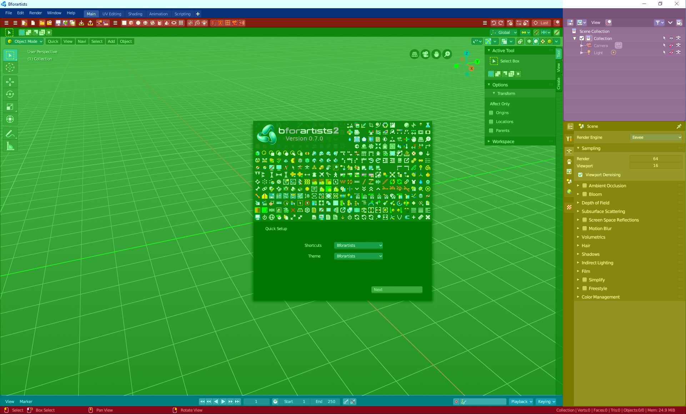
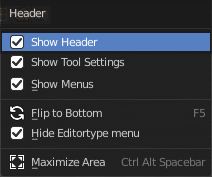
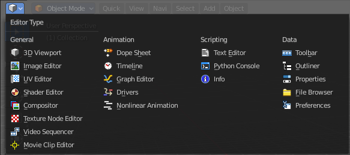
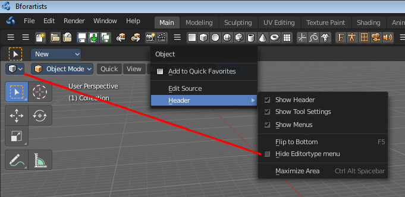
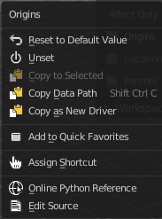
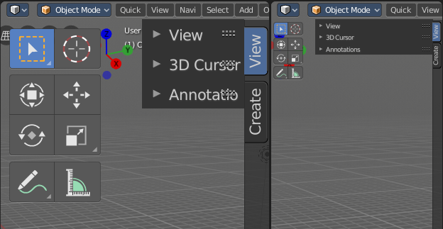

**********************
6 Editors introduction
**********************

.. contents:: Contents

Introduction
============

The Bforartists Interface is made of several workspaces.And every layout is made of several editors. 

The editors brings the functionality to the layout. Every editor type has another purpose. The 3D View for example is made to modify 3D data such as meshes or curves.

In this chapter we will talk about the general aspects of the editors. And give an overview over the available editor types and their purpose.

The detailled description happens for every editor one by one then.

Header right click menu
=======================

The header has aheader menu that appears when you right click at it.

Toggle Header
-------------

Hides the header. To reveal it you have to click at the small triangle at the right side then.

Flip to Bottom / Top
--------------------

Displays the header at the top or the bottom of the editor

Collapse Menus
--------------

Displays the text menus as one collapsed icon.

Hide Editortype Menu
--------------------

Hides the editortype menu where you can switch to other editor types.

Maximize Area
-------------

Maximizes the editor. Ctrl + spacebar will return to normal mode.

Editor Type menu
================

The Editor Type menu gives you an overview of all available editor types. And here you can switch to another editortype.

This menu is hiddenin the standard workspaces. See Header Menu, Hide Editortype menu.

RMB menus at tools
==================

Every tool or UI element has usually a RMB menu where you can find various things.

The content is varying, dependant of the tool where you right click at. Value edit boxes have for example a Reset to Default Value menu item. For other tools you might be able to add or change the shortcut here. They all have the last three menu items, Online Python Reference, Edit source and Edit translation.

A few examples below. But we will cover important right click functionality also at the specific tool.

.. list-table::

	* - 	  - 	  - 	  - 

Assign Shortcut / Change Shortcut / Non Keyboard Shortcut / Remove Shortcut
---------------------------------------------------------------------------

These buttons allows you to assign or to remove a new shortcut to the tool or to change an existing shortcut for the tool. Note that this may or may not work proper. For some tools you might need to change the shortcut in the User preferences. Non Keyboard shortcut is such a case.

Online Python Reference
-----------------------

The Online Python Reference button opens the Bforartists Online Python reference page in your browser.

Edit Source
-----------

The Edit Source button opens the corresponding Python file for this element. Note that you need to be in the Scripting layout. The file loads in the Text editor there.

Reset to Default Value 
-----------------------

Reset to Default Value is usually a RMB menu entry when you right click at a edit box. It resets the value to the default value.

Reset All to Default Value 
---------------------------

Reset All to Default Value is usually a RMB menu entry when you right click at a edit box combo made of two, three or more edit boxes together. It resets the value for all the edit boxes in the combo to the default value.

Reset Single to Default Value 
------------------------------

Reset Single to Default Value is usually a RMB menu entry when you right click at a edit box combo made of two, three or more edit boxes together. It resets the value for the single edit box under the mouse to the default value.

Unset
-----

Unset is usually a RMB menu entry when you right click at a edit box. It is somehow similar to Reset to Default Value. But it clears the property instead of resetting it to the default value. Which can end in another value.

Add Driver
----------

In Bforartists lots of things can be animated. Also buttons. Add Driver does exactly what it tells. It adds a driver for animation needs to the element.

Add Drivers
-----------

In Bforartists lots of things can be animated. Also buttons. Add Drivers does exactly what it tells. It adds a driver for animation needs to the elements.

Add Single Driver
-----------------

In Bforartists lots of things can be animated. Also buttons. Add Driver does exactly what it tells. It adds a driver for animation needs to the single element under the mouse.

Add to Keying Set
-----------------

Add to Keying Set adds the information of the element to the current keyframe.

Add All to Keying Set
---------------------

Add All to Keying Set adds the information of the element to the current keyframe.

Add single to Keying Set
------------------------

Add to Keying Set adds the information of the element to the current keyframe.

Remove from Keying Set
----------------------

Remove from Keying Set removes the information of the element from the current keyframe.

Copy Data Path
--------------

Copy Data Path copies the RNA data path for this property.

Copy to Selected
----------------

Copy to Selected copies the property of this element to selected objects or bones.

Copy as new Driver
------------------

Create a new driver with this property as input, and copy it. It can then be pasted to the target property. Or pasted as a driver variable to extend an existing driver.

Resize Tool Shelf and Properties content
========================================

You can resize the Tool Shelf content and the Properties Sidebar content. This means that you can zoom in or out. This trick also works in the Properties Editor.Move the mouse over the upper region of the Tool Shelf. Hold down Ctrl keyClick with Middle Mouse button. The mouse pointer will turn into two white triangles.

Now drag up or down to resize the area content

OR

Move the mouse over the upper region of the Tool Shelf. Simply press Numpad + or Numpad -

To reset the area content to default scale move the mouse over the area and press Home key ( german keyboard layout Pos 1)

Hotkey recognition
==================

What hotkeyset works is dependant of the mouse position, over which editor the mouse is. Means when your mouse is over the 3d View, then the hotkeys from the 3D View gets recognized. This means when your mouse is not over the 3D View but the Outliner, and you press the hotkey for let's say move, then this hotkey will not be recognized. 

A special behaviour shows the sidebars here. They are part of the editors. But to have the mouse over the toolbars at the side can already prevent a hotkey from being triggered. Your mouse needs to stay in the active part of the editor.

The editor types
================

Bforartists provides a number of different **Editor** types for different purposes. For example, the 3D view is made to modify the 3D data, such as meshes or curves. You can have more than one editor window open at the same time.

.. list-table::

	* - 	  - 
.. list-table::

	* - 	  - 
.. list-table::

	* - 	  - 
.. list-table::

	* - 	  - 
.. list-table::

	* - 	  - 
.. list-table::

	* - 	  - 
.. list-table::

	* - 	  - 
.. list-table::

	* - 	  - 
.. list-table::

	* - 	  - 
.. list-table::

	* - 	  - 
.. list-table::

	* - 	  - 
.. list-table::

	* - 	  - 
.. list-table::

	* - 	  - 
.. list-table::

	* - 	  - 
.. list-table::

	* - 	  - 
.. list-table::

	* - 	  - 
.. list-table::

	* - 	  - 
.. list-table::

	* - 	  - 
.. list-table::

	* - 	  - 
.. list-table::

	* - 	  - 
.. list-table::

	* - 	  - 
