******************************************************************
7.1.10 Editors - 3D View - Header - Mesh - Edit Mode - Vertex Menu
******************************************************************

.. contents:: Contents

Detailed Table of content
=========================

Edit Mode - Vertex Menu
=======================

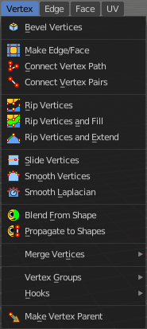

The Vertex menu just exists for mesh objects. It provides you with tools that are designed to modify vertices.

Bevel Vertices
--------------

The Bevel Tool adds a bevel to the selected vertices.

Usage: first select the geometry that you want to bevel. Then activate the tool and drag the mouse. You need to drag quite a bit outwards until you see an effect. So don't wonder when the mouse movement seem to do nothing. You can also adjust the amount in the Last Operator Bevel panel afterwards.

In the footer you can see further advice. And the current values for the bevel.

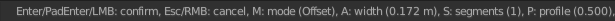

Last Operator Bevel
-------------------

Width type
----------

Width Type is a drop-down box where you can choose the Amount type for the bevel action.

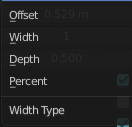

Width
-----

The Bevel amount.

Segments
--------

How many segments gets created

Profile
-------

Controls the Profile shape. 0.5 means round.

Vertex only
-----------

Bevel Vertices only.

Clamp Overlap
-------------

Do not allow bevelled geometry to overlap each other.

Loop Slide
----------

Prefer slide along edge to even widths.

Mark Seams
----------

Mark seams along the beveled edges.

Mark Sharp
----------

Mark the beveled edges sharp.

Material
--------

Material for bevelled faces. -1 is the surrounding material.

Harden Normals
--------------

Match the normals of the new faces to the adjacent faces.

Face Strength Mode
------------------

Face Strength Modecan be used in conjunction with Weight Normals Modifier (with the 'Face Influence' option checked). Here you can set if and howthe face strength at creation gets set.

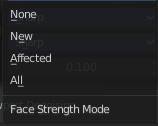

None
----

Don't set face strength.

New
---

Set the face strength of new faces along edges to Medium. And the face strength of new edges at vertices to Weak.

Affected
--------

In addition to those set for the New case, also set the faces adjacent to new faces to have strength Strong.

All
---

In addition to those set for the Affected case, also set all the rest of the faces of the model to have strength Strong.

Outer Miter
-----------

How the outer miter is set. Miter is how the bevel rounding at a corner is done.

Sharp
-----

Creates a sharp miter.

Patch
-----

This replaces the outside vertex of a miter with 3 vertices. And uses a patch pattern there.

Arc
---

This replaces the vertex of a miter with 2 vertices, joined by an arc. A separate Spread parameter says how far to move the vertices away from their original position.

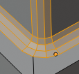

Inner Miter
-----------

How the inner miter is set.Miter is how the bevel rounding at a corner is done.

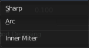

Sharp
-----

Creates a sharp miter.

Arc
---

This replaces the vertex of a miter with 2 vertices, joined by an arc. A separate Spread parameter says how far to move the vertices away from their original position.

Spread
------

Belongs to inner miter method Arc. Here you can adjust how strong the inner radius is bent.

Make Edge/Face 
---------------

Adds a face when you have edges selected. And Edges when you have Vertices selected. It's a Bridge tool.

You can have either the one method or the other. When you select two adjacent vertices, then you select the edge too. And the tool works in edge mode then. In this case just the possible faces gets created. Not edges between single vertices.

First select the edges or Vertices that you want to bridge. Then click the New Edge/Face from Vertices Button.

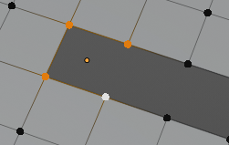

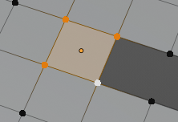

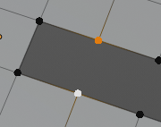

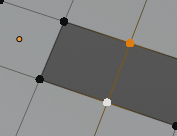

Connect Vertex Path
-------------------

Connect Vertex path connects selected vertices, but takes the vertex order into account in which you selected the vertices. It just creates edges between vertices that are not connected in this order.

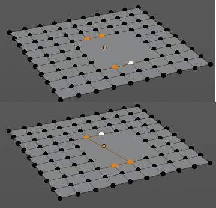

Connect Vertex Pair 
--------------------

Connect Vertex pair connects selected vertices and makes a face of the pairs. 

Rip Vertices
------------

Rip splits the edges between the selected vertices. It creates two edges out of one.

This tool works similar to the Edge Split tool. It also selects the outer edges so that you immediately move them. Right click will snap them back to the initial space.

Last Operator Rip
-----------------

Move X , Y , Z
--------------

Here you can adjust the position.

Constraint Axis
---------------

Here you can limit the position relative to the source object.

Orientation
-----------

Orientation is a drop-down box where you can choose the type of orientation for the mirroring action.

Proportional editing
--------------------

Enables proportional editing. Activating proportional editing reveals further settings.

.. image:: graphics/7.1.10_Editors_-_3D_View_-_Header_-_Mesh_-_Edit_Mode_-_Vertex_Menu/1000020100000119000000773CD5255E7E68F4C5.png

Proportional Falloff
--------------------

Here you can adjust the falloff methods.

Proportional Size
-----------------

Here you can see and adjust the falloff radius.

Connected
---------

The proportional falloff gets calculated for connected parts only.

Projected(2D)
-------------

The proportional falloff gets calculated in the screen space. Depth doesn't play a role. When it's in the radius, then it gets calculated.

Rip Vertices and Fill
---------------------

This tool works similar to the Rip tool. It splits the edges between the selected vertices. It creates two edges out of one. But it fills the gap between the new edges when you move the geometry.

This tool works similar to the Edge Split tool. It also selects the outer edges so that you immediately move them. Right click will snap them back to the initial space.

Last Operator Rip Fill
----------------------

It is the same than for Rip Vertices.

Rip Vertices and Extend
-----------------------

This tool extrudes the selected vertices.

This tool works similar to the Edge Split tool. It also selects the outer edges so that you immediately move them. Right click will snap them back to the initial space.

Last OperatorExtend Vertices
----------------------------

Move X , Y , Z
--------------

Here you can adjust the position.

Constraint Axis
---------------

Here you can limit the position relative to the source object.

Orientation
-----------

Orientation is a drop-down box where you can choose the type of orientation for the mirroring action.

Proportional editing
--------------------

Enables proportional editing. Activating proportional editing reveals further settings.

.. image:: graphics/7.1.10_Editors_-_3D_View_-_Header_-_Mesh_-_Edit_Mode_-_Vertex_Menu/1000020100000119000000773CD5255E7E68F4C5.png

Proportional Falloff
--------------------

Here you can adjust the falloff methods.

Proportional Size
-----------------

Here you can see and adjust the falloff radius.

Connected
---------

The proportional falloff gets calculated for connected parts only.

Projected(2D)
-------------

The proportional falloff gets calculated in the screen space. Depth doesn't play a role. When it's in the radius, then it gets calculated.

Slide Vertices
--------------

Slides the selected vertice(s) along the adjacent edges.

Smooth Vertex
-------------

Smooth Vertices smooths out the angles between the selected vertices. It is a tool to reduce noise at the mesh.

Last Operator Smooth Vertex
---------------------------

Smoothing
---------

Smoothing is the strength of the smoothing

Repeat
------

Repeat is the number of iterations that the smoothing action gets repeated. With 1 the smoothing is just performed once. With 10 it is performed ten times.

Axis
----

The Axis checkboxes lets you limit the smoothing to specific world axis.

Smooth Laplacian
----------------

Laplacian Smooth Vertex smooths out the angles between the selected vertices. It is a tool to reduce noise at the mesh. It works a bit different than the normal Smooth Vertex tool. And gives a different result. The Laplacian method allows you to preserve the volume, and to adjust border smoothing.

Last Operator Laplacian Smooth Vertex
-------------------------------------

Number of Iterations
--------------------

Number of Iterations is the number of iterations that the smoothing action gets repeated. With 1 the smoothing is just performed once. With 10 it is performed ten times.

Lambda Factor
-------------

Lambda Factor is the strength of the smoothing.

Lambda Factor in border
-----------------------

Lambda Factor is the strength of the smoothing in border areas.

Smooth Axis
-----------

The Smooth Axis checkboxes allows you to limit the smoothing to specific world axis.

Preserve Volume
---------------

Preserve Volume preserves the volume of the object.

Blend from Shape
----------------

This tool requires to have a shape key at the mesh. It blends the selected shape key into the mesh.

Last Operator Blend from Shape
------------------------------

Drop-down box
-------------

Here you can define which shape key should be used.

Blend edit box
--------------

Here you can adjust the blend factor between the current shape and the shape that you want to blend here.

Add
---

Add to blend shape instead of blending in.

Propagate to Shapes
-------------------

This tool requires to have a shape key at the mesh. It applies the currentvertex locations for the selected vertices to all other shape keys at the mesh.

Merge Vertices
--------------

Merge vertices together. When you pick a vertice, and add more vertices to the selection, then you get two more tools, to merge to the first or last vertice. When you box select, or use select all, then you get just the other three tools.

At First
--------

Merges the current selected vertices at the first selected vertice.

At Last
-------

Merges the current selected vertices at the last selected vertice.

At Center
---------

Merges the geometry at the centre of the selected vertices.

At Cursor
---------

Merges the geometry at the 3D Cursor.

Collapse
--------

Merges the geometry at the centre of the selected vertices.

Last Operator Merge
-------------------

Type
----

Type is the drop-down box again where you can choose what method to use for merge.

UV's
----

With UV's ticked the UV mapping will update with changes at the geometry.

By Distance
-----------

Merges vertices that are very close to each other. The merge happens at the center. When you need more control then you should use the Merge Vertices tool.

Last Operator Merge by Distance
-------------------------------

Merge Distance
--------------

Here you can adusut the distance in which the vertices gets merged.

Unselected
----------

Merge selected vertices also with other unselected vertices.

Vertex Groups
-------------

Vertex groups is a menu around vertex group functionality. The vertex groups can be found in the Object data tab in the Properties editor.

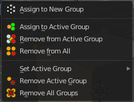

When there is no vertex group assigned yet then you can only see one menu item. The Assign To New Group button.

Once you have a vertex group assigned you will see the full functionality.

Assign to New Group
-------------------

Assigns the mesh selection to a new vertex group.

Assign to active Group
----------------------

Assigns the mesh selection to the currently active vertex group.

Remove from Active Group
------------------------

Removes the mesh selection from the currently active vertex group.

Remove from All
---------------

Removes the mesh selection from all vertex groups.

Set Active Group
----------------

Here you can select a vertex group to be the active one.

Remove Active Group
-------------------

Removes the currently active vertex group.

Remove All Groups
-----------------

Removes all vertex groups from the mesh.

Hooks
-----

Hooks is a menu with tools around the hook modifier. You could also adjust the hook modifier from the Properties editor. But the menu items are more accessible.

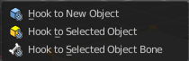

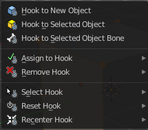

When there is no hook modifier at the mesh then you just see three menu items. When there is minimum one hook modifier applied, then you will see an extended menu.

Hook to New Object 
-------------------

Creates a new Hook Modifier for the active object and assigns it to the selected vertices. It also creates an empty at the center of those vertices, which are hooked to it.

Hook to Selected Object 
------------------------

Does the same as **Hook to New Object**, but instead of hooking the vertices to a new empty, it hooks them to the selected object (if it exists). There should be only one selected object (besides the mesh being edited). 

Last Operator Hook to Selected Object
-------------------------------------

Active Bone
-----------

Hook to the object(s) of the active bone.

Hook to Selected Object Bone 
-----------------------------

Does the same as **Hook to New Object****. B**ut it sets the last selected bone in the also selected armature as a target.

Assign to Hook 
---------------

Here you can assign the selected vertices to the chosen hook modifier. Existing hooks gets overwritten. One vertex can be assigned to more than one hook. 

Remove Hook 
------------

Removes the chosen Hook Modifierfrom the object.

Select Hook 
------------

Selects all vertices assigned to the chosen Hook Modifier.

Reset Hook 
-----------

Resets the chosen Hook Modifier.

Recenter Hook 
--------------

**Recenter** the Hook Modifier.

Make Vertex Parent
------------------

Parents another object to the selected vertice(s).

Workflow:
---------

In Object mode select the object that you want to parent to a vertex. Shift select the parent object so that both are selected. Enter Edit mode. Then select one vertex for a single point. Or three for an area. Then click the Make Vertex Parent button to make the relation.

