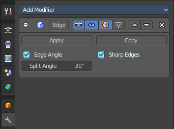

****************************************************************
7.1.11 Editors - 3D View - Header - Mesh - Edit mode - Edge Menu
****************************************************************

.. contents:: Contents

Detailed Table of content
=========================

Edit Mode - Edge Menu
=====================

BevelEdges
----------

The Bevel Tool adds a bevel to the selected Edges.

Usage: first select the geometry that you want to bevel. Then activate the tool and drag the mouse. You need to drag quite a bit outwards until you see an effect. So don't wonder when the mouse movement seem to do nothing. You can also adjust the amount in the Last Operator Bevel panel afterwards.

In the footer you can see further advice. And the current values for the bevel.

Last Operator Bevel
-------------------

Width type
----------

Width Type is a drop-down box where you can choose the Amount type for the bevel action.

Width
-----

The Bevel amount.

Segments
--------

How many segments gets created

Profile
-------

Controls the Profile shape. 0.5 means round.

Vertex only
-----------

Bevel Vertices only.

Clamp Overlap
-------------

Do not allow bevelled geometry to overlap each other.

Loop Slide
----------

Prefer slide along edge to even widths.

Mark Seams
----------

Mark seams along the beveled edges.

Mark Sharp
----------

Mark the beveled edges sharp.

Material
--------

Material for bevelled faces. -1 is the surrounding material.

Harden Normals
--------------

Match the normals of the new faces to the adjacent faces.

Face Strength Mode
------------------

Face Strength Modecan be used in conjunction with Weight Normals Modifier (with the 'Face Influence' option checked). Here you can set if and howthe face strength at creation gets set.

.. image:: graphics/7.1.11_Editors_-_3D_View_-_Header_-_Mesh_-_Edit_mode_-_Edge_Menu/100002010000009E0000007E625E8B7FE3506A18.png

None
----

Don't set face strength.

New
---

Set the face strength of new faces along edges to Medium. And the face strength of new edges at vertices to Weak.

Affected
--------

In addition to those set for the New case, also set the faces adjacent to new faces to have strength Strong.

All
---

In addition to those set for the Affected case, also set all the rest of the faces of the model to have strength Strong.

Outer Miter
-----------

How the outer miter is set. Miter is how the bevel rounding at a corner is done.

Sharp
-----

Creates a sharp miter.

Patch
-----

This replaces the outside vertex of a miter with 3 vertices. And uses a patch pattern there.

.. image:: graphics/7.1.11_Editors_-_3D_View_-_Header_-_Mesh_-_Edit_mode_-_Edge_Menu/10000201000000710000006A707A2D0EF455AB92.png

Arc
---

This replaces the vertex of a miter with 2 vertices, joined by an arc. A separate Spread parameter says how far to move the vertices away from their original position.

.. image:: graphics/7.1.11_Editors_-_3D_View_-_Header_-_Mesh_-_Edit_mode_-_Edge_Menu/10000201000000720000006A488A2A128427FD36.png

Inner Miter
-----------

How the inner miter is set.Miter is how the bevel rounding at a corner is done.

Sharp
-----

Creates a sharp miter.

Arc
---

This replaces the vertex of a miter with 2 vertices, joined by an arc. A separate Spread parameter says how far to move the vertices away from their original position.

.. image:: graphics/7.1.11_Editors_-_3D_View_-_Header_-_Mesh_-_Edit_mode_-_Edge_Menu/10000201000000720000006A488A2A128427FD36.png

Spread
------

Belongs to inner miter method Arc. Here you can adjust how strong the inner radius is bent.

Bridge Edgeloops
----------------

The Bridge edgeloops tool bridges selected edges, and adds a polygon between them. You need to have at least two edges selected.

Last Operator Bridge Edgeloops
------------------------------

Connect Loops
-------------

Here you can choose the method how to deal with bridging multiple loops.

Merge
-----

With merge ticked it will not create a bridge face, but merge the selected edges.

Merge Factor
------------

The merge factor determines at which distance between the selected edges the merge happens. 0.5 is the middle of the selected edges.

Twist
-----

The twist offset for closed loops.

Number of Cuts
--------------

Adds cuts to the bridge face.

Interpolation
-------------

Here you can choose the interpolation mode for the cuts.

Smoothness
----------

Here you can adjust the smoothness for the cuts.

Profile Factor
--------------

Here you can adjust the profile factor for the cuts.

Profile shape
-------------

Here you can adjust the profile shape for the cuts.

Subdivide
---------

Subdivide divides the selected edges. It subdivides the involved faces too, and can create new vertices.

.. image:: graphics/7.1.11_Editors_-_3D_View_-_Header_-_Mesh_-_Edit_mode_-_Edge_Menu/100002010000011600000103ED5900060311694B.png

A more unknown functionality is that it can also randomize the result with the Fractal slider in the Last operator panel.

Last Operator Subdivide
-----------------------

Number of Cuts
--------------

The number of cuts defines the amount of subdivisions.

Smoothness
----------

This value defines how smooth the subdivision result is. From flat to bent.

Create N-Gons
-------------

Create N-Gons if required. Else subdividing N-Gons creates Tris.

Quad Corner Type
----------------

Here you can adjust the corner type.

Fractal
-------

Randomize the selected vertices.

Along Normal
------------

When randomized, this value defines how strong the subdivision follows the normals of the initial vertices.

Random Seed
-----------

Randomizing value for fractal randomizing.

Subdivide Edge ring
-------------------

Subdivides the selected edge ring(s).

Last Operator Subdivide Edge ring
---------------------------------

Number of Cuts
--------------

Here you can adjust the number of cuts for the subdivision.

Interpolation
-------------

Here you can chose a interpolation method for the new geometry.

Linear ends in a equal division and a flat result. Blend Surface interpolates the surrounding geometry. And can end in a curvy result.

Smoothness
----------

The Smoothness factor for the interpolation. 

Profile Factor
--------------

The profile strength.

.. image:: graphics/7.1.11_Editors_-_3D_View_-_Header_-_Mesh_-_Edit_mode_-_Edge_Menu/100002010000008E000000A82674074748FFF4CB.png

Profile Shape
-------------

A drop-down box where you can define a profile for the generated geometry.

Un-Subdivide
------------

Decimates the geometry by trying to make one quad out of four quads. But can also end in Tris where this is not possible.

Last Operator Un-Subdivide
--------------------------

Iterations
----------

Number of iterations. This means how deep the calculation should go. One level of SDS, two levels, three levels, etc. . Down to the point where you cannot decimate any geometry anymore.

Rotate Edge CW
--------------

Rotate Edge rotates the selected edge clockwise. 

Last Operator Rotate Selected Edge
----------------------------------

Counter Clockwise
-----------------

Rotate selected edges counter clockwise.

Rotate Edge CCW
---------------

Rotate Edge rotates the selected edge counter clockwise. 

Last Operator Rotate Selected Edge
----------------------------------

Counter Clockwise
-----------------

Rotate selected edges counter clockwise.

Edge Slide
----------

Edge Slide slides the selected edge along the face that it is part of. This is for the edge at a cube into two possible directions.

Last Operator Edge Slide
------------------------

Factor
------

Factor is a sliding box Here you can adjust the slide strength numerically. The width of the face is the 0-1 range.

Even
----

Make the Edge loop match the shape of the adjacent edge loop.

Flipped 
--------

When Even Mode is active, flips between the two adjacent edge loops.

Clamp
-----

Clamp within the edge extend.

Correct UV's 
-------------

Correct UV's corrects the UV's while editing the geometry.

Edge Split
----------

Edge split splits the selected edges. It creates two edges out of one.

This tool works similar to the Rip tool. But with selected edges instead of selected vertices. And this tool has no further settings.

Edge Crease
-----------

When you use a Subdivision Surface Modifier, then you can define the sharpness of selected edges with this tool. Crease edges will be marked colored in edit mode.

You will see a value in the header that indicates the current strength when you activate the tool. Move with the mouse to increase or decrease the value. Or type in a value while you are in this mode. You can also scale into negative range. 

A negative crease value will subtract from the current active crease value in case it exists already from a former crease operation. A Crease value of -1 removes the crease from this edge.

Last Operator Edge Crease
-------------------------

Factor
------

Here you can adjust the crease factor.

Edge Bevel Weight
-----------------

This tool adjusts the edge bevel weight for selected edges when you use the Bevel modifier at the mesh. 

You need to have set the limit method to Weight. This way you can achieve a bevel weight for every individual selected edge if you want, and achieve different bevel strengths at the mesh.

You will see a value in the header that indicates the current strength when you activate the tool. Move with the mouse to increase or decrease the value. Or type in a value while you are in this mode. You can also scale into negative range. 

A negative Edge Bevel Weight value will subtract from the current active crease value in case it exists already from a former crease operation. A Edge Bevel Weight value of -1 removes the weight from this edge.

Last Operator Edge Bevel Weight
-------------------------------

Factor
------

Here you can adjust the Edge Bevel Weight factor.

Mark Sharp
----------

Mark Sharp is a tool that you need for the Edge Split modifier. Marked edges are displayed and rendered as sharp edges.

Last Operator Mark Sharp
------------------------

Vertices
--------

Calculate by the selected vertices instead of edges to mark the edges.

Clear Sharp
-----------

Clears formerly as sharp marked selected edges.

Last Operator Mark Sharp
------------------------

Vertices
--------

Calculate by the selected vertices instead of edges to mark the edges.

Mark Sharp from Vertices
------------------------

Same as Mark Sharp, but with Vertices already ticked in the Adjust Last Operation panel.

Clear Sharp from Vertice
------------------------

Same as Clear Sharp, but with Vertices already ticked in the Adjust Last Operation panel.

Mark Freestyle Edge
-------------------

Freestyle is a comic renderer that is included in Bforartists. Mark Freestyle Edges marks the selected edges as Freestyle feature edges.

Clear Freestyle Edge
--------------------

Freestyle is a comic renderer that is included in Bforartists. Clear Freestyle Edges unmarks the selected edges as Freestyle feature edges.

