*****************************************************************
7.1.12 Editors - 3D View - Header - Mesh - Edit mode - Faces menu
*****************************************************************

.. contents:: Contents

Detailed Table of content
=========================

Edit Mode - Faces menu
======================

The faces menu is just visible for Mesh objects. It provides tools to work with faces.

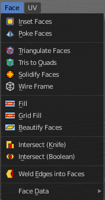

Inset Faces
-----------

Insets edges into the selected faces. Think of it as a extrude inwards the face.

While dragging with the mouse you will see some further informations and instructions in the header.

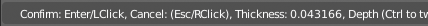

Last Operator Inset
-------------------

Boundary
--------

With Boundary ticked you will get the connect edges in the corners.

Offset Even
-----------

Scales the offset to give more even thickness.

Offset Relative
---------------

Scales the offset by surrounding geometry.

Edge Rail
---------

Inset the region along existing edges.

Thickness
---------

Thickness adjusts the thickness of the inset geometry.

Depth
-----

With depth you can bevel the inset geometry. It is then not longer coplanar to the initial face.

Outset
------

With outset ticked the Inset will not extrude inwards but outwards.

Select Outer
------------

With Select Outer the outer ring will be selected after the Inset.

Individual
----------

Inset every face individually.

Interpolate
-----------

Blend Face Data across the inset.

Poke Faces
----------

Splits the selected faces to create a triangulated geometry.

Last Operator Poke Faces
------------------------

Poke Offset
-----------

Normally the center vertice of the poke operation is planar with the rest. Here you can adjust an offset.

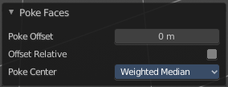

Offset Relative
---------------

Scale the offset by surrounding geometry.

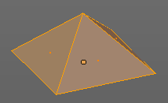

Poke Center
-----------

Poke Center is a drop-down box where you can choose what the center of the poke operation should be. You can choose between weighted mean, mean and bounds.

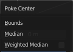

Triangulate Faces
-----------------

Triangulate Faces triangulates the faces of the selected geometry.

Last Operator Triangulate Faces
-------------------------------

Quad Method
-----------

Here you can choose how quads should be triangulated. 

Shortest diagonal
-----------------

Splits the quads based on their distance between vertices.

Fixed Alternate
---------------

Splits the quads on the second and fourth vertice.

Fixed
-----

Splits the quads on the first and third vertice.

Beauty
------

Tries to optimize the triangulation.

Polygon Method
--------------

Here you can choose how N-Gons should be triangulated. 

Clip
----

Splits the polygons with an ear clipping algorithm.

Beauty
------

Tries to optimize the triangulation.

Tris to Quads
-------------

Tris to quads tries to convert triangulated geometry back to a quad geometry by removing the edges inside of the quads.

Last Operator Tris to Quads
---------------------------

Max Face Angle
--------------

Here you can adjust the threshold to adjacent triangles.

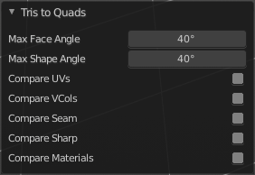

Max Shape Angle
---------------

Here you can adjust the shape angle limit.

Compare UV's
------------

Takes the UV patches for the calculation into account. Border geometry will not be calculated.

Compare VCols
-------------

Takes the Vertex colors for the calculation into account. Border geometry will not be calculated.

Compare Seam
------------

Takes the Vertex colors for the calculation into account. Border geometry will not be calculated.

Compare Sharp
-------------

Takes the as sharp marked edges for the calculation into account. Border geometry will not be calculated.

Compare Materials
-----------------

Takes the Materials colors for the calculation into account. Border geometry will not be calculated.

Solidify Faces
--------------

Gives the selected faces a thickness, and makes it solid.

There is also a Solidify modifier available.

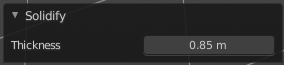

Last Operator Solidify
----------------------

Thickness
---------

Here you can adjust the thickness. You can scale also into the negative range.

Wire Frame
----------

Wireframe grabs the edges of the faces and turns them into tubes.

Last Operator Wire Frame
------------------------

Boundary
--------

Inset Face Boundaries.

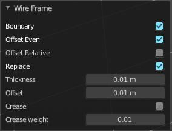

Offset Even
-----------

Scales the offset to give more even thickness.

Offset Relative
---------------

Scales the offset by surrounding geometry.

Replace
-------

Removes the source geometry.

Thickness
---------

Here you can adjust he thickness of the tubes.

Offset
------

Here you can adjust the offset of the tubes.

Crease
------

Crease adds close edges so that you have sharp corners when you use Subdivision Surface.

Crease Weight
-------------

Here you can adjust the crease weight.

Fill 
-----

Fill closes holes in the selected mesh geometry, and triangulates the faces.

Last Operator Fill
------------------

Beauty
------

Uses the best possible triangulation.

Grid Fill
---------

Grid Fill allows you to fill two edge loops with quad geometry that follows the surrounding geometry.

Usage: select two opposite edge loops. Then perform the tool.

Last Operator Grid Fill
-----------------------

Span
----

Number of sides.

Offset
------

Here you can define a offset.

Simple Blending
---------------

Uses a simple interpolation. Faster but less accurate.

Beautify Faces
--------------

Beautify faces tries to optimize triangulations.

Last Operator Beautify Faces
----------------------------

Max Angle
---------

Here you can set an angle limit.

Intersect (Knife)
-----------------

Intersect creates edges where geometry intersects.

This operation happens in Edit mode, and so all parts must be in the same mesh.

Last Operator Intersect
-----------------------

Source 
-------

Source is a drop-down box where you can choose at which mesh part you want to operate.

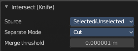

Selected/Unselectedworks between the selected and unselected geometry. 

Self Intersectworks on the overlapping geometry of the mesh. 

Separate Mode 
--------------

Separate mode is a drop-down box where you can choose the separation mode.

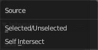

All splits the geometry at the new edge. 

Cutkeeps each side of the intersection separate without splitting the faces in half. 

Mergemerges all the geometry from the intersection. 

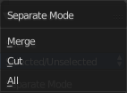

Merge Threshold 
----------------

Here you can adjust the merge threshold. Increase it when some geometry is not calculated. But keep it small for fast calculation.

Intersect ( Boolean )
---------------------

Intersect (Boolean) performs a boolean operation between the selected and unselected mesh parts.

This operation happens in Edit mode, and so all parts must be in the same mesh.

Last Operator Intersect (Boolean)
---------------------------------

Boolean
-------

Here you can choose the boolean method.

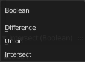

Difference subtracts the source geometry from the target geometry.

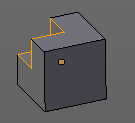

Union unions the source geometry with the target geometry. Geometry inside the source and target geometry gets removed.

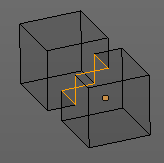

Intersect removes all geometry but the overlapping geometry.

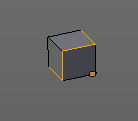

Swap
----

Inverts source and target geometry.

Merge Threshold
---------------

Here you can adjust the tolerance for the boolean operation. Increase it when some geometry is not calculated. But keep it small for fast calculation.

Weld Edges into Faces
---------------------

This tool incorporates loose wire edges into selected faces.

You need a loose edge geometry to get it to work. By converting a curve to a Mesh geometry for example. You need to join the edge into the mesh where you want to use it. The operation happens in Edit mode.

In edit mode select the edge and the face where you want it to join. And then perform the tool.

Face Data
---------

Rotate Colors
-------------

Rotates the vertex colors for the selected geometry. This tool requires to have vertex colors painted at the mesh.

Note that there is no way to display vertex colors in Edit mode. So you need to switch to Vertex paint mode to see the result.

Last Operator Rotate Colors
---------------------------

Counter Clockwise
-----------------

The tool rotates clockwise by default. With this option ticked the rotation happens counter clockwise.

Reverse Colors
--------------

Reverses the vertex colors.

Note that there is no way to display vertex colors in Edit mode. So you need to switch to Vertex paint mode to see the result.

Rotate UV's
-----------

Rotates the UV space for the selected geometry by 90 degrees. This tool requires to have a working UV mapping.

Last Operator Rotate UV's
-------------------------

The tool rotates clockwise by default. With this option ticked the rotation happens counter clockwise.

Reverse UV's
------------

Reverses the UV Space for the selected geometry. This tool requires to have a working UV mapping.

Mark Freestyle Face
-------------------

Mark selected Faces for exclusion from Freestyle Feature edge detection. Freestyle is a cartoon renderer that is also included in Bforartists.

Clear Freestyle Face
--------------------

Unmark selected Faces for exclusion from Freestyle Feature edge detection. Freestyle is a cartoon renderer that is also included in Bforartists.

