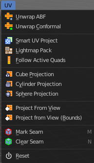
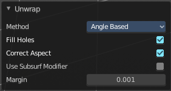
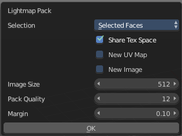

***************************************************************
7.1.13 Editors - 3D View - Header - Mesh -  Edit mode - UV menu
***************************************************************

.. contents:: Contents

Detailed Table of content
=========================

Edit Mode - UV Menu
===================

Here you find the uv mapping methods and some further functionality. You use it best in the U Editing layout. There you can see the result in the UV Editor then.

The UV menu is just available for Mesh objects.

Unwrap ABF
----------

Unwrap ABF unwraps the selected geometry with the method Angle based. ABF stands for Angle Based Flattening. ABF can give a bit better result than LSCM when unwrapping organic shapes.

Unwrap Conformal
----------------

Unwrap Conformal unwraps the selected geometry with the method LSCM, which is the short for Least Square Conformal Mapping. LSCM can give a bit better results than ABF with geometric shapes.

Last Operator Unwrap 
---------------------

Unwrap ABF and Unwrap LSCM shares the same Last Operator.

Method
------

Method is a drop down box where you can choose between Unwrap method Angle Based and Conformal.

Fill Holes
----------

Fill holes in the mesh before unwrapping.

Correct Aspect
--------------

Take the Image Aspect Ratio into account.

Use Subsurf Modifier
--------------------

Unwraps an existing Subsurf Modifier. You need to add a Subsurf Modifier first.

Margin
------

The distance between the single UV patches.

Smart UV Project
----------------

Smart UV Project projects the UV mapping from different angles. 

Smart UV Project Settings dialogue
----------------------------------

Angle Limit
-----------

The Angle Limit defines after which angle the mapping happens from the next side. With an angle of 66 you have around six sides to map from. The calculation is 360/66.

Island Margin
-------------

Island Margin defines the distance between the UV patches.

Area Weight
-----------

Weight Projection Vector by faces with larger areas.

Correct Aspect
--------------

Take the Image Aspect Ratio into account.

Last Operator Smart UV Project
------------------------------

The Last Operator for Smart UV Project contains the same settings than the Smart UV Project Settings dialogue.

Lightmap Pack
-------------

Lightmap Pack maps each face individually, and puts the result into the UV space. Without margin. 

Lightmap Pack has no Last Operator. 

Settings
--------

Selection 
----------

Selection is a drop-down box where you can choose what will be packed.

Share Tex Space
---------------

Map all objects into one lightmap.

New UV Map
----------

Create a new UV map for every new mesh.

New Image
---------

Assign new Image to every new mesh.

Image Size
----------

The size for new images.

Pack Quality
------------

The pack quality. 

Margin
------

The distance between the single UV patches.

Follow Active Quads
-------------------

Follow Active quads maps UV coordinates starting from an active face, and maps all adjacent faces in quad shape then. This way you can for example unwrap a pipe or a road. You first need to have a face selected. Then select everything. And then click at Follow Active Quads.

Settings
--------

Edge Length Mode
----------------

Edge Length Mode is a drop-down box where you can choose the Length method.

Last Operator Follow Active Quads
---------------------------------

The Last Operator contains the same settings than the Settings dialogue.

Cube Projection
---------------

Cube Projection maps the mesh from six sides, means cubic.

Last Operator Cube Projection
-----------------------------

Cube Size
---------

Cube Size defines the size of the UV mesh in the UV space.

Correct Aspect
--------------

Take Image Aspect ratio into account.

Clip to Bounds
--------------

Clip UV Coordinates to bounds after unwrapping.

Scale to Bounds
---------------

Scale UV Coordinates to bounds after unwrapping.

Cylinder Projection
-------------------

Cylinder Projection tries to map the geometry cylindric.

Last Operator Cylinder Projection
---------------------------------

Direction
---------

Direction is a drop-down box where you can choose in which direction the cylindric projection will be mapped.

Align
-----

Align is a drop-down box where you can choose the Align method.

Radius
------

Radius defines the Polar size of the UV mesh in the UV space.

Correct Aspect
--------------

Take Image Aspect ratio into account.

Clip to Bounds
--------------

Clip UV Coordinates to bounds after unwrapping.

Scale to Bounds
---------------

Scale UV Coordinates to bounds after unwrapping.

Sphere Projection
-----------------

Sphere Projection tries to map the geometry spherical.

Last Operator Sphere Projection
-------------------------------

Direction
---------

Direction is a drop-down box where you can choose in which direction the spherical projection will be mapped.

Align
-----

Align is a drop-down box where you can choose the Align method.

Correct Aspect
--------------

Take Image Aspect ratio into account.

Clip to Bounds
--------------

Clip UV Coordinates to bounds after unwrapping.

Scale to Bounds
---------------

Scale UV Coordinates to bounds after unwrapping.

Project from View
-----------------

Project from View projects the UV from the current 3D view.

Last Operator Project from View
-------------------------------

Orthographic
------------

User orthographic projection.

Camera Bounds
-------------

Map UV's to the camera region taking resolution and aspect into account.

Correct Aspect
--------------

Take Image Aspect ratio into account.

Clip to Bounds
--------------

Clip UV Coordinates to bounds after unwrapping.

Scale to Bounds
---------------

Scale UV Coordinates to bounds after unwrapping.

Project from View (Bounds)
--------------------------

Project from View projects the UV from the current 3D view.

Same as Project from View, but with Scale to Bounds ticked in the Last operator. And so it scales to the bounds.

Mark Seam
---------

The unwrap algorithms Angle based and Conformal requires to have edges marked as seams. Think of it as a cutting pattern for a trouser for example. Such a trouser is also made of fabric patterns. 

Same goes for the UV patches when you use Angle based or conformal unwrapping. You need to cut your mesh into parts and mark edges as seams, so that the algorithm knows where the seams are.

Mark seam marks the currently selected edge(s) as a seam. Seam edges will be displayed as red in the 3D viewport.

Clear Seam
----------

Clear seam removes the seam from the currently selected edge(s).

Reset
-----

Resets the UV Projection.

