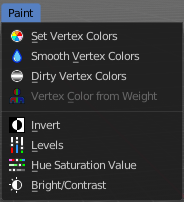
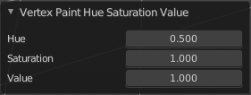

*************************************************************************
7.1.17 Editors - 3D View - Header - Mesh - Vertex Paint mode - Paint menu
*************************************************************************

.. contents:: Contents

Vertex paint Mode - Paint Menu
==============================

The Paint menu contains tools for vertex painting in Vertex paint mode.

Set Vertex Colors
-----------------

Flood fills the vertex colors with the current vertex color value.

Smooth Vertex Colors
--------------------

Smooths out the vertex colors.

Dirty Vertex Colors
-------------------

Dirty vertex colors is a special tool for ageing meshes. Let's for example imagine we have a relief. Edges that are outstanding are often touched, and tends to become brighter. While areas in the inner side of a relief are not so often touched. And here the relief collects dirt too. So this areas becomes darker. 

And that's what the tool simulates. It makes the outer edges brighter, and the inner edges darker. This calculation is somehow similar to Ambient Occlusion. Ambient Occlusion makes corners darker. The dirty tool makes edges brighter too. And it calculates with the vertices. Not Texel positions like AO.

You need to convert this result to a texture to use it in your texturing, as a mask for example. This conversion can be done by baking.

The tessellation of the mesh should not be too high for this operation. Since it calculates the angles of the mesh edges.

Last Operator Dirty Vertex Colors
---------------------------------

Blur strength
-------------

How strong the result should be blurred

Blur Iterations
---------------

The number of iterations for the blur.

Highlight Angle
---------------

The angle for the bright areas. Angles higher as this value will not be recognized as a edge to highlight.

Dirt Angle
----------

The angle for the dark areas. Angles lower as this value will not be recognized as a corner to darken.

Dirt only
---------

Ignore the highlight areas, just calculate the dirt angles.

Vertex Color from Weight
------------------------

This tool requires to have Weight Painting at the mesh. It converts the weightpaint colors into greyscale vertex colors.

Invert
------

Inverts the vertex colors.

Levels
------

This tool allows you to level the values of the vertex painting. You adjust the settings in the last operator.

Last Operator Vertex Paint Levels
---------------------------------

Offset
------

Adjust the Offset of the vertex colors.

Gain
----

Adjust the Gain of the vertex colors.

Hue Saturation Value
--------------------

This tool allows you to adjust the hue, saturation and value values of the vertex painting. You adjust the settings in the last operator.

Last Operator Vertex Paint Hue Saturation Value
-----------------------------------------------

Hue 
----

Adjust the Hue of the vertex colors.

Saturation
----------

Adjust the Saturation of the vertex colors.

Value
-----

Adjust the Value of the vertex colors.

Bright / Contrast
-----------------

This tool allows you to adjust the brightness and the contrast of the vertex painting. You adjust the settings in the last operator.

Last Operator Vertex Paint Bright/Contrast
------------------------------------------

Brightness
----------

Adjust the brightness of the vertex colors.

Contrast
--------

Adjust the contrast of the vertex colors.

