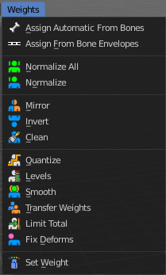
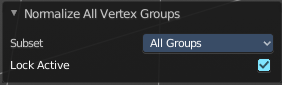
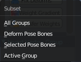
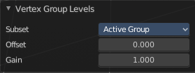
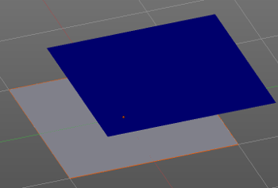
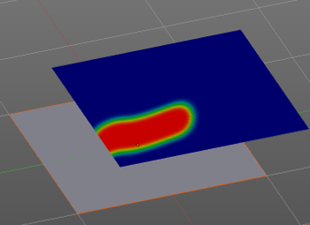
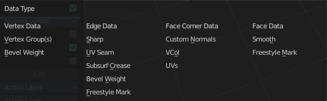
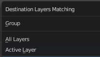
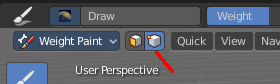
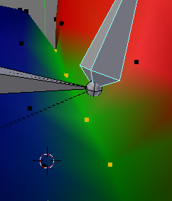

****************************************************************************
7.1.19 Editors - 3D View - Header - Mesh - Weight Paint mode -  Weights menu
****************************************************************************

.. contents:: Contents

Weight Paint Mode - Weights Menu
================================

Assign from Bone Envelopes
--------------------------

Weights the vertices from the connected bone envelopes. And takes the distance to the bone envelope into account.

Assign Automatic from Bones
---------------------------

Weights the vertices connected with the bone. And takes the distance to the bone into account.

Last Operator Weight from Bones
-------------------------------

This last operator is the same for both tools. Assign Automatic from Bones, and Assign from Bone Envelopes.

Type
----

Here you can choose if you want to Assign from Bone Envelopes, or from Bones.

Normalize All
-------------

Normalize all normalizes the weight of all Vertex groups so that the values for the single vertices in the sum is 1.

Last Operator Normalize all
---------------------------

Subset
------

Subset is a drop-down menu where you can choose the Subset method.

Lock Active
-----------

Normalize just the other groups. Not the active group.

Normalize
---------

Normalize normalizes the weight of the current selected Vertex group so that the values for the single vertices in the sum is 1. Means when there is influence from other groups, then those values are kept, but the one for the current group gets lowered so that the sum is 1.

Mirror
------

Mirror Vertex Group mirrors Vertex Groups and flips weights and/or names. It only edits selected Vertices. It flips when both sides are selected. Otherwise it copies from Unselected.

Last Operator Mirror Vertex Group
---------------------------------

Mirror Weights
--------------

With Mirror Weights ticked it mirrors the weights.

Flip Group Names
----------------

With Flip Group Names ticked it flips the Group names

All Groups
----------

Mirrors all Vertex Groups.

Topology Mirror
---------------

Uses topology based mirroring. This requires matching mirrored topology.

Invert
------

Invert inverts the weight painting for the selected vertex group.

Last Operator Invert Vertex Group
---------------------------------

Subset
------

Subset is a drop-down menu where you can choose the Subset method.

Add Weights
-----------

Add Vertices from Groups that have zero Weighting before inverting.

Remove Weights
--------------

Remove Vertices from Groups that have zero weight after inverting.

Clean
-----

Removes Vertex group assignments that are not required from the active vertex group.

Last Operator Clean Vertex Group
--------------------------------

Subset
------

Subset is a drop-down menu where you can choose the Subset method.

Limit
-----

Remove weights that are below or equal to the limit value.

Keep Single
-----------

Keep Vertices assigned to at least one vertex group when cleaning.

Quantize
--------

Quantize quantizes the weight paint values. It starts with 4 steps. With a step of 1 you have a single vertex color, no matter how you have painted it before.

Last Operator Quantize Vertex Weights
-------------------------------------

Subset
------

Subset is a drop-down menu where you can choose the Subset method.

Steps
-----

Here you adjust in how many steps the weight paint colors should be divided.

Levels
------

Adds some offset to the Weight paint, and multiplys it with some gain.

Last Operator Levels
--------------------

Subset
------

Subset is a drop-down menu where you can choose the Subset method.

Offset
------

Here you adjust the offset.

Gain
----

Here you adjust the gain.

Smooth
------

Smooths the weight for selected vertices.

Last Operator Smooth Vertex Weights
-----------------------------------

Subset
------

Subset is a drop-down menu where you can choose the Subset method.

Factor
------

Here you adjust the factor.

Iterations
----------

Here you adjust how many iterations you use.

Expand/Contract
---------------

Expand or contract the weights.

Transfer Weights
----------------

Transfer weights allows you to transfer weights from one object to another object in the same space. For example to copy the weight of a body shape to a covering cloth.

Usage
-----

Make sure the target part is at its location.

In Object mode Select the source object(s). Then shift click to select the target object too. This makes the target object the active object

Switch to Weight Paint mode. 

Click the Transfer Weight Button, and the weighting should be transfered to the target object.

You can adjust the result in the Last Operator Transfer Mesh Data panel.

Last Operator Transfer Mesh Data 
---------------------------------

Freeze Operator
---------------

Prevent the operator to rerun when you tweak the settings. So that you can tweak many settings at once, then untick to run the operator again.

Data Type
---------

A dropdown box where you can choose the data type to work with.

Create Data
-----------

Add Data layers on target object if needed.

Vertex Mapping
--------------

A dropdown box where you can choose the vertex mapping method.

Auto Transform
--------------

Automatically compute transformation to get the best possible match between source and target object.

Object Transform
----------------

Calculate the objects in Global space. Unticked means the transfer happens from and to the origin of the objects.

Only Neighbour Geometry
-----------------------

Source Objects must be closer than given distance to the target objects.

Ray Radius
----------

The ray distance for Only Neighbour Geometry.

Source Layers Selection
-----------------------

A dropdown box where you can choose the Source Layer selection method.

Destination Layers Matching
---------------------------

A dropdown box where you can choose the Destination Layers matching.

Mix Mode
--------

A dropdown box where you can choose the mix mode. That's how the mapping gets transfered into the target object.

Mix Factor
----------

The strength of the chosen mix mode.

Limit Total
-----------

Limit the number of deform weights for a vertex by removing the lowest weights. For example when five vertex groups are assigned to one vertice, and you set the limit to 4, then the vertice will just be assigned to the four vertex groups with the highest weight. This is useful for game content where the game engine has a limit for how much bones can be connected to one vertice.

Last Operator Limit Number of Weights
-------------------------------------

Subset
------

A dropdown box where you can choose to work with the Active Group or All Groups.

Limit
-----

Here you can set the limit.

Fix Deforms 
------------

When complex models are deformed to their most extreme poses, they often show visibly incorrect deformations. Shoulder or elbow for example. Fix Deforms tries to fix this incorrect deformations by modifying the positions of the selected vertices to fit better into the positions of the surrounding vertices.

The problem with this tool is that it is meant for complex models, but doesn't play well with complex models at all. More than a handful selected vertices slows even strong PC's down to a crawl. So you might be better suited to fix the incorrect deformations by simply doing manual weight painting at the trouble makers. Or by adding a shape key in the extreme pose to clean up the incorrect deformations.

Usage
-----

Make sure that there is no mirroring applied. The tool does not work with mirroring.

In Pose mode pose your mesh into the extreme pose. 

Select the mesh, switch to Weigth Paint.

In Weight Paint mode turn on Vertex Selection Masking.

Then select the trouble vertices. By Border select for example. Or by Shift LMB click.

Then click at Fix Deforms. You might or might not get a visible result. 

Play around with the Distance in the Last Operator to get other results.

Last Operator Fix Vertex Group Deform
-------------------------------------

Distance
--------

The distance to move to.

Strength
--------

A modifier for the Distance setting.

Change Sensitivity
------------------

Change the amount that the weights are altered with each iteration. The lower the value the slower the calculation.

Set Weight
----------

This tool is just active when you have either Face Selection Masking or Vertex Selection Masking activated.

The tool fills the selection with the current active weight color that you have adjusted in the Brush panel in the Tools tab in the Tool shelf.

