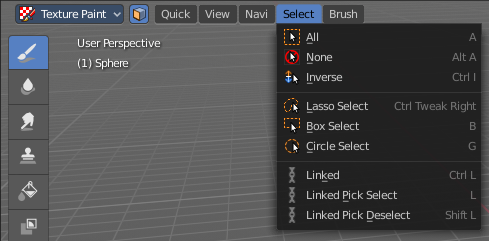
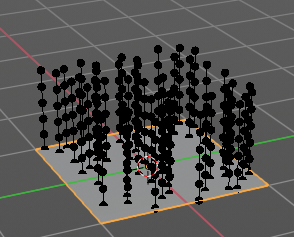

**************************************************
7.1.1 Editors - 3D View - Header tools and Options
**************************************************

.. contents:: Contents

Detailed Table of content
=========================

Introduction
============

The header in the 3D view contains various menus and tools. This chapter here is about the tools, modesand options elements in the header.

The text menus are covered in a own chapter each. They vary too much, dependant of mode and object type.

Mode Drop-down Box
==================

The Mode drop-down box allows you to switch between the different modes.

Modes are object states that allows you to edit and manipulate objects at different levels with different tool sets and goals. The sculpt mode for example allows you to sculpt a mesh object. Edit Mode allows to manipulate the mesh of the object, and so on.

The available modes can differ from object to object. A armature for example has an additional pose mode. And when you work with a grease pencil object, then several grease pencil modes becomes available.

Object Mode
-----------

This mode allows to manipulate objects at Object level. Like move it around, rotate it, etc. This mode is available for all object types.

Edit Mode
---------

The edit mode allows to edit the object. With a mesh object this means that you are able to modify and to change the geometry. With an armature you build your skeleton. And with a text object you can type in text, and choose the font etc.

Not all objects has an edit mode.

Sculpt Mode
-----------

In this mode you can sculpt the mesh. This mode is available for mesh and grease pencil objects.

Vertex Paint
------------

Vertex Paint is a mesh object only mode. In this mode you can paint vertices with colors.

Weight Paint
------------

In this mode you can adjust weight painting for an armature for example. But Weight Painted mesh objects can also be used in conjunction with particles. Also a grease pencil stroke can be weight painted.

Texture Paint
-------------

Weight Paint is a mesh object only mode. In this mode you can paint at the texture of a mesh directly. This mode requires to have a working UV mapping and a texture at the mesh object.

Edit Strokes
------------

Edit Strokes is a Grease Pencil only mode. It allows to manipulate the curves at a mesh level.

Particle Edit
-------------

Particle edit is a Particle System mode only. When you apply a particle system to a mesh object then this mode becomes available. It allows you to manipulate the particle system at a mesh level. You can comb hair particles for example.

Draw
----

Draw is a grease pencil object only mode. In this mode you draw grease pencil strokes.

Mesh Object Sub Modes
=====================

The different modes can have some submodes. For example different selection methods in mesh edit mode. Or a mask mode for texture painting. The sub mode settings can be found right from the Modes dropdown box.

Edit Mode - Mesh Select Modes
-----------------------------

When you enter the edit mode with a mesh object then you will see the mesh select modes. They allows you to switch between the three available selection modes Vertice select, Edge Select and Face Select.

Vertex Select allows you to select vertices.

Edge Select allows you to select edges.

Face select allows you to select faces.

The mesh display changes, dependant of the mode. When you have for example select vertices active, then the vertices hilights at the mesh.

You can have more than one mode active by shift clicking at the other mesh select modes.

The standard Bforartists has hotkeys to switch between the modes. X, C and V. You cannot see or edit them at the header element. There is however a sub menu in the mesh menu, called Mesh Select Mode. Here you can see and edit the hotkeys.

Vertex Paint - Mask and Vertex Selection
----------------------------------------

Paint Mask
----------

When you activate this tool then you reveal a Select menu in the header. And youcan select the mesh parts that you want to manipulate.Note that you may first want to deselect all. By default everything is selected ...

The select menu is explained in the chapter Vertex Paint modes. The menu items should be pretty self explaining though.

When you have selected a part of the mesh, then you can just paint the faces at this selected part. The edges are the border.

Vertex Selection
----------------

When you activate this tool then you reveal a Select menu in the header. And you can select the mesh parts that

you want to manipulate.This tool is meant for Weight Painting. And so the mesh displays the vertices too.

Note that you may first want to deselect all. By default everything is selected ...

The select menu is explained in the chapter Vertex Paint modes. The menu items should be pretty self explaining though.

When you have selected a part of the mesh, then you can just paint the vertices at this selected part. The difference to the Paint mask method is that here the edges are not the border of the color. But there is a gradient between the vertices.

Weight Paint - Mask and Vertex Selection
----------------------------------------

Paint Mask
----------

Mesh Object.

When you activate this tool then you reveal a Select menu in the header. And youcan select the mesh parts that you want to manipulate.Note that you may first want to deselect all. By default everything is selected ...

The select menu is explained in the chapter Vertex Paint modes. The menu items should be pretty self explaining though.

When you have selected a part of the mesh, then you can just paint the faces at this selected part. The edges are the border.

Vertex Selection
----------------

Mesh Object.

When you activate this tool then you reveal a Select menu in the header. And you can select the mesh parts that

you want to manipulate.This tool is meant for Weight Painting. And so the mesh displays the vertices too.

Note that you may first want to deselect all. By default everything is selected ...

The select menu is explained in the chapter Vertex Paint modes. The menu items should be pretty self explaining though.

When you have selected a part of the mesh, then you can just paint the vertices at this selected part. There is no real difference to the faces method. The selection is the same.

Texture Paint - Mask Selection
------------------------------

Paint Mask
----------

Mesh Object.

When you activate this tool then you reveal a Select menu in the header. And youcan select the mesh parts that you want to manipulate.Note that you may first want to deselect all. By default everything is selected ...

The select menu is explained in the chapter Vertex Paint modes. The menu items should be pretty self explaining though.

When you have selected a part of the mesh, then you can just paint the faces at this selected part. The edges are the border.

Particle Edit - Select Modes
----------------------------

Mesh Object with a particle system. You can just have one method active at a time.
----------------------------------------------------------------------------------

Path
----

No keypoints are visible, you can select/deselect only all particles.

Point
-----

You can see, selectand edit all keypoints of the particle paths.

Tip
---

You can onyl see, select and edit the tip of the particles.This includes the brushes. The comb brush is a special case here. The other pat keypoints bends of course still in this mode. But affected by the brush is just the tip key.

Grease Pencil Sub Modes
=======================

The different modes can have some submodes. For example different selection methods in mesh edit mode. Or a mask mode for texture painting. The sub mode settings can be found right from the Modes dropdown box.

Edit Mode
---------

The edit mode allows you to edit the grease pencil strokes.

Select Modes
------------

You can only have one method active at a time.

Select Only Points
------------------

When you for example border select some points of the stroke, then just this points gets selected.

Select all Stroke Points
------------------------

When you for example border select some points of the stroke, then the whole stroke gets selected.

Select all Stroke Points between other strokes
----------------------------------------------

When you for example border select some points of the stroke, and this stroke crosses another stroke, then the part of the stroke up to the crossing point gets selected.

Multiframe
----------

When this mode is active, then you can edit strokes from multiple grease pencil frames at once. The keyframes must be selected to be included.

Use Falloff
-----------

Multiframe has a setting, which becomes visible when the mode is active. 

Use Falloff when edit in Multiframe mode to compute brush effect by frame.

Interpolate Panel
-----------------

When you are animating simple shapes you can use the interpolate tools to automatically add new breakdown keyframes.

Interpolate
-----------

Interpolates strokes between the previous and next keyframe by adding a single keyframe. When you are on a frame between two keyframes and click the Interpolate button a new breakdown keyframe will be added. This way you define the final interpolation for the new stroke.

Sequence
--------

Interpolate strokes between the previous and next keyframe by adding multiple keyframes. When you are on a frame between two keyframes and click the sequence button a breakdown keyframe will be added on every frame between the previous and next keyframe.

Remove Breakdowns
-----------------

Removes the breakdowns generated by the interpolate tool. When there is no breakdown pose then the button is greyed out.

Interpolate All Layers
----------------------

When enabled, interpolated keyframes will be created on all layers, not only the active one.

Interpolate Selected Strokes
----------------------------

When enabled, only selected strokes will be interpolated.

Type
----

Interpolation method to use for the sequence.

Sculpt Mode
-----------

The sculpt mode allows you to sculpt the grease pencil strokes.

Selection Mask 
---------------

When you activate this mode, then just the selected parts gets sculpted.

Multiframe
----------

When this mode is active, then you can edit strokes from multiple grease pencil frames at once. The keyframes must be selected to be included.

Use Falloff
-----------

Multiframe has a setting, which becomes visible when the mode is active. 

Use Falloff when edit in Multiframe mode to compute brush effect by frame.

Draw Mode
---------

The draw mode is the mode in which you draw the grease prencil strokes.

Draw Strokes on Back
--------------------

Usually a new stroke is drawn on top of existing strokes. Draw Strokes on Back adds the new strokes below the existing strokes.

Add Weight Data for new strokes
-------------------------------

Add Weight data for new strokes, according to the current vertex group and weight. When no vertex group is selected, then no weight is added.

Use Additive Drawing
--------------------

When creating new frames, then thhe strokes from the previous or active frame gets included as the base for the new stroke.

Weight Paint Mode
-----------------

Multiframe
----------

When this mode is active, then you can edit strokes from multiple grease pencil frames at once. The keyframes must be selected to be included.

Use Falloff
-----------

Multiframe has a setting, which becomes visible when the mode is active. 

Use Falloff when edit in Multiframe mode to compute brush effect by frame.

Object settings
===============

.. image:: graphics/7.1.1_Editors_-_3D_View_-_Header_tools_and_Options/10000201000003170000001D929541C6CB91F600.png

The object settings just appears when the Tool Settings are hidden. This can be done in the View menu.

Parts of the object settings are just visible in Object and Edit Mode. Parts in other modes.

Transform Orientations
----------------------

You can display Transform Manipulators at your object or selectionby activating them in the tool shelf. They allow you to scale, rotate ormove objects by grabbing their controls, andmoving your mouse in the corresponding axis.The widget can be oriented in different ways by using another method in this dropdown box. The names should be self explaining.

View
----

The transform orientation aligns to the current view.

Gimbal
------

Aligns each axis to the Euler rotation axis as used for input.

Normal
------

This is of interest for bones for example. Aligns the transformation axis to average normal of the selected elements. Bone Y axis for Pose mode.

Local
-----

Uses the local orientation of the selected elements.

Global
------

Uses the global orientation for the selected elements.

Cursor
------

Uses the orientation of the 3D cursor.

Create Orientation
------------------

The create orientation button at the right adds a new orientation from the current mode and view. You can rename it.

This view is scene specific only. It does save and load with the current scene. But you cannot transfer it into another scene. When you create a new scene then this custom orientation is gone.

You can create more than one user orientation.

Last Operator Create Orientation
--------------------------------

Create Orientation has some settings.

Name 
-----

Here you can rename the orientation.

Use View
--------

Use the current view instead of the active object to create the new orientation.

Use after creation
------------------

Use this orientation after creation.

Overwrite Previous
------------------

Overwrite previous created orientation in case it has the same name.

Pivot Point
-----------

The Pivot Point is the center of your object or your selection. When you rotate or scale an object, or a group of vertices/edges/faces, you may want to shift the pivot point in 3D space. The names should be self explaining.

Only Origins
------------

When this option is enabled, then the transformation will change the positions of the object’s origins, but will not affect the object itself. 

Snapping
--------

Here you can activate snapping.

Snapping can be temporarily activated by holding CTRL key. So no need to turn snapping on and off all the time. This counts for both transform methods. The old method with the W E R hotkeys, and the new method with the widgets.

Snapping Settings
-----------------

You can snap to various scene elements. Here you can define to which other elements the current active element should snap to. The names should be self explaining. Increment snaps by a grid unit.

Absolute Grid Snap
------------------

Absolute Grid alignment while transform. Relative Grid snapping would add to the current position by one unit. Absolute snaps to the nearest ground grid point.

Affect
------

Here you can adjust what transform methods should be affected by snapping.

Proportional Editing
--------------------

Enables proportional editing. 

Proportional Editing is a way of transforming selected elements (such as vertices) while having that transformation affect other nearby elements with a falloff. For example, moving a single vertex will move unselected vertices within a given range. And the falloff means that nselected vertices that are closer to the selected vertex will move more than those farther from it. 

Settings
--------

The settings appears when you activate Proportional Editing. Here you can choose between different falloff methods for the proportional editing.

Proportional Size
-----------------

The influence of the proportional editing is defined by a radius. It is by default one standard unit. 

You can change the influence radius for proportional editing with the mouse wheel or the Page up Page down arrows while keeping the mouse button pressed down and do the translation. 

The exact radius value can be read in the header while transformation.

Last Operator Proportional Editing
----------------------------------

When you translate a object, move it around or rotate or scale it, then the last operator contains also proportional editing settings.

Proportional Editing
--------------------

Enable proportional editing.

Proportional Falloff
--------------------

Here you can adjust the falloff methods again.

Proportional Size
-----------------

Here you can see and adjust the falloff radius. Note that the white circle is not displayed when using this slider.

Connected
---------

The proportional falloff gets calculated for connected parts only.

Projected(2D)
-------------

In depth direction along the view the radius is ignored. It selects as deep as there is something to select.

Object Types Visibility
=======================

In this dropdown box you can set specific elements in the scene to either not selectable or invisible. 

When the elements are invisible then they are also not selectable.

When you have set some objects to not selectable or invisible, then the icon in the menu header changes.

Viewport Gizmo
==============

This menu allows you to adjust what gizmos shows. The button at the left turns off or on all of them.

Show Gizmo
----------

Shows or hides all available gizmos at once.

Gizmo Options
-------------

Here you can turn on or off specific widgets.

Viewport Gizmos
---------------

Navigate
--------

Turn on or off the navigate widget. The navigate gizmo is the block of buttons and the widget up right. 

Active Tools
------------

Turn on or off the active tool widget. When you activate one of the transformation buttons in the tool shelf, then a gizmo will appear at the object.

Active Object
-------------

Turn on or off the Object Gizmos. The Object Gizmos is an extra set of translate gizmos, similar to the active tool widget that shows when you activate one of the transform buttons in the tool shelf. But it shows permanent as long as you don't have another tool selected that overrides this widget. 

Object Gizmos
-------------

Transformation Orientation
--------------------------

Here you can adjust the orientation of the widget. By default it uses the transform orientation from the viewport. This set can override the transform orientation. 

You can have all transform methods on at once.

Move 
-----

Shows the move part of the widget.

Rotate
------

Shows the rotate part of the widget.

Scale
-----

Shows the scale part of the widget.

Empty
-----

Image
-----

Shows the transform gizmo at an empty of type Image. You need to hover with the mouse over the object to reveal the yellow gizmo.

Force Field
-----------

Some force field types have a gizmo. Shows the transform gizmo at a force field.

Light
-----

Size
----

Show the gizmo to adjust the size of lights. That's the blue arrow here.

Look At
-------

Show the gizmo to adjust the direction of the light. That's the yellow dot in the middle of the circle.

Camera
------

Lens
----

Show the gizmo to adjust the lens and orthographic size. The yellow square.

Focus Distance
--------------

Show to gizmo to adjust the focus distance.

You first need to turn on the Limits gizmo in the camera settings in the Viewport Display panel. Then you can turn off the focus distance gizmo part with Focus Distance.

Note that this feature is currently broken!

Show Overlays - all modes
=========================

Here you can turn on or off all overlays. This includes the ground grid, things like relationship lines, and several other elements in the viewport. Some content is available in all modes. Some content is changing, dependant of the mode you are in. In Edit mode with a mesh object you will get some normal functionality for example.

Guides
------

Grid
----

Show grid in the orthographic views. When you are in perspectivic view, then this feature is greyed out.

Floor
-----

Show the ground grid in the perspectivic views.

Axes
----

Show the colored axis lines in the 3d view. This feature just works in perspectivic view. In orthographic view this lines cannot be hidden separately.

Scale and Subdivisions
----------------------

Here you can scale and subdivide the ground grid. This works in perspectivic and orthographic view.

Text Info
---------

In the upper left corner of the 3D view there is a text info string, which can be hidden here. It tells you in what view you are, what is selected, and things like frames per second when you play a animation.

Annotations
-----------

Show or hide annotations. Annotations can be drawn at the 3D View with the annotation tool in the tool shelf.

3D Cursor
---------

Show or hide the 3D cursor. That's the white red circle in the center of the viewport.

Objects
-------

Extras
------

Show or hide object details. Including things like empty wires like lights, cameras, and other visual guides.

Relationship Lines
------------------

Show or hide relationship lines. When you for example parent one object to another then you will see a dotted line. The relationship line.

Outline Selected
----------------

Show the selected object with a outline.

Bones
-----

Show or hide bones.

Motion Paths
------------

Show or hide motion paths. Motion paths can be calculated in the Motion Paths panel. You need a animation for that.

Origins
-------

Show or hide the origin of the selected object. The origin is the center point of the object, and represented by a orange dot.

Origins(All)
------------

Show or hide the origin of all objects. Even from hidden ones. The not selected objects shows the center point with a white dot.

Geometry
--------

Geometry related settings.

Wireframe
---------

Here you can show the wireframe in object mode. With a wireframe value of 1 all edges are drawn. The lower the value, the more edges will disappear.

Face Orientation
----------------

This mode allows to check for faces with flipped normals, which cannot be seen with the defaults. Blue is pointing outwards, red is pointing inwards. 

Motion Tracking
---------------

Here you can find some motion tracking related settings. When you turn it on, then some further options appears. These features just shows before you bake the solution. Not with the resolved solution.

Camera Path
-----------

Shows the camera path.

Marker Names
------------

Shows the marker names.

Track display type
------------------

How to display the tracks.

Track size
----------

Here you can adjust the display size of the tracks of reconstructed data.

Show Overlays - Mesh Object - Edit Mode
=======================================

The Show overlays panel shows different content, dependant of mode and object type. This is with mesh object in edit mode.

Mesh Edit Mode
--------------

Edges
-----

Highlight selected and partially selected edges.

This only affects vertex and face selection mode (as edges are always highlighted in edge-selection mode).

Faces
-----

Highlight faces by using a face overlay that applies to both selected and unselected faces.

This affects all selection modes.

Center
------

Show face-center points in solid shading modes.

Only affects face-select mode.

Creases
-------

Display edges marked with a crease for the Subdivision Surface Modifier.

Sharp
-----

Display sharp edges, used with the edge split modifier.

Bevel
-----

Display weights created for the Bevel Modifier.

Seams
-----

Display the UV unwrapping seams.

Developer
---------

Indices
-------

Display the indices of selected vertices, edges and faces at the mesh.

Shading
-------

Hidden Wire
-----------

Show only front-facing wireframes.

Vertex Groups Weights
---------------------

Display weights in Edit Mode. When you activate this feature then further options appears.

Zero Weights
------------

None
----

Don't show the vertices with zero weights with a specific color. They appear blue like vertices with a very low weighting.

Active
------

Zero weights vertices are shown with a black color in the active vertex group.

All
---

Zero weights vertices are shown with a black color in all vertex groups of the mesh.

Mesh Analysis
-------------

Show the mesh analysis overlay and settings. Note that editing may be slow with mesh analysis tools on. And modifiers can make trouble.

Overhang
--------

Extrusion 3D printers have a physical limit to the overhang that can be printed. Overhang mode shows the overhang. Angle and axis can be adjusted.

Minimum/Maximum
---------------

Minimum/Maximum angle to display.

Axis
----

Here you can choose wich angle to calculate.

Thickness
---------

3D Printers have a limited wall-thickness. Too thin areas cannot be printed. This mode displays thin areas as red.

Minimum/Maximum
---------------

Minimum/Maximum thickness to display.

Samples
-------

The number of samples to use to calculate the thickness.

Intersections
-------------

A mesh can be made of more than one closed submesh. Join two spheres and you have one mesh with two closed submeshes. Such intersections can be a problem with printing. Intersect marks intersecting areas with red.

Distortion
----------

Marks distorted faces. 

Distorted geometry, means uneven quads or n-gons, can cause problems with printing. Since the triangulation of a distorted quad or n-gon is undefined. And printing works with tris. With a quad there are already two solutions in which direction the edge to triangulate the face can point.

Minimum/Maximum
---------------

Here you can adjust the minimum and maximum values after which a face gets displayed as distorted.

Sharp Edges
-----------

Similar to wall-thickness, sharp edges can be too thin to be able to print.

Minimum/Maximum
---------------

Here you can adjust the minimum and maximum values after which a edge gets displayed as sharp.

Measurement
-----------

Shows measure values at the selected elements. The units are displayed as chosen in the preferences. These values respects global/ local in the transform panel. And so the values can differ when you have scaled the mesh in object mode, and the scaling is not applied yet. Use Global to take the object scale into account.

Edge Length
-----------

Shows the length of selected edges.

Edge Angle
----------

Shows the angle of selected edges between two faces.

Face Area
---------

Show the area of selected faces.

Face Angle
----------

Show the angle of selected face corners.

Normals
-------

Show the normals for the chosen elements. They will be displayed as lines.

Display vertex normals

Display face normals at vertices (split normals)

Display face normals

Size
----

Here you can adjust the length of the line that represents the normal.

Freestyle
---------

Freestlye is the line renderer integrated into Bforartists. For freestyle you can mark edges and faces.

Edge Marks
----------

Display Freestyle edge marks, used with the Freestyle renderer.

Face Marks
----------

Display Freestyle face marks, used with the Freestyle renderer.

Show Overlays - Mesh Object - Sculpt Mode
=========================================

Mask
----

Show mask as overlay on object. The opacity of the overlay can be controlled.

Show Overlays - Mesh Object - Vertex Paint Mode
===============================================

Opacity
-------

How strong the painted color gets shown.

Show Wire
---------

Display the wire at the mesh. Normally the wire is hidden.

Show Overlays - Mesh Object - Weight Paint Mode
===============================================

Opacity
-------

The opacity of the color overlay.

Zero Weights
------------

None
----

Don't show the vertices with zero weights with a specific color. They appear blue like vertices with a very low weighting.

Active
------

Zero weights vertices are shown with a black color in the active vertex group.

All
---

Zero weights vertices are shown with a black color in all vertex groups of the mesh.

Show Weight Contours
--------------------

Show contour lines formed by points with the same interpolated weight.

Show Wire
---------

Display the wire at the mesh. Normally the wire is hidden.

Show Overlays - Mesh Object - Texture Paint Mode
================================================

Stencil Opacity
---------------

How strong the painted color gets shown.

Show Overlays - Pose Mode
=========================

Fade Geometry
-------------

This has in general nearly the sameffect than draw in front. It shows the bones on top of the mesh geometry. But you can fade the mesh geometry to black.

Show Overlays - Grease Pencil
=============================

In Object Mode
--------------

Onion Skin
----------

Show ghosts of the keyframes before and after the current frame.

Canvas
------

Display a grid over Grease Pencil drawing plane. The opacity of the grid can be controlled with a slider.

Fade 3D Objects
---------------

Fades everything in the viewport but the grease pencil color to black.

.. image:: graphics/7.1.1_Editors_-_3D_View_-_Header_tools_and_Options/100002010000012A0000009527966C379807CB02.png

In Edit, Sculpt and Weightpaint Mode
------------------------------------

Edit Lines
----------

Show the edges of the curve when editing strokes.

Show Edit Lines only in multiframe
----------------------------------

Only show edges of the curve while in multiframe edition.

Vertex Opacity
--------------

How strong the selected vertices of the stroke shows.

.. image:: graphics/7.1.1_Editors_-_3D_View_-_Header_tools_and_Options/10000201000001160000007622FE923F3ECED286.png

In Draw Mode
------------

Fade Layers
-----------

Here you can decreases the opacity of the not selected layers in the current grease pencil object.

I have set the fade layers opacity to 1 here. When you select the other layer, then the inner part becomes visible again, and the black outlines hides.

Viewport Shading
================

At the very right of the header you can find the viewport shading settings. Here you adjust the display of the viewport. The order goes from left to right.

Show X Ray
----------

This viewport setting is connected with the viewport shading. It allows you to show and edit the back geometry. Or hide it, so that you can just edit the geometry that points forwards.

Viewport Shading
----------------

Here you can define how geometry gets displayed in the viewport.

Wireframe
---------

Displays the content in the viewport as Wireframe.

Solid
-----

Displays the content in the viewport with a solid white color.

Material
--------

Displays the content in the viewport with all material settings and with OpenGL rendering. Note that this does not exist when you choose the Workbench renderer.

Rendered
--------

Displays the content in the viewport like you would have rendered it. This mode is dependant of what render engine you have currently active. 

Viewport Shading Settings
-------------------------

The viewport shading panel. Its settings changes, dependant of which viewport shading mode you have activeated. And provides you with further settings for it.

Viewport Shading Settings with Wireframe
----------------------------------------

Color
-----

Single 
-------

The selected object gets hilighted. The wireframe is the color of the selection outline. The not selected objects shows a black wireframe.

Object
------

The selected object gets hilighted. The wireframe is white. The not selected objects shows a grey wireframe.

Random
------

The selected object gets hilighted. The wireframe is a random wireframe color. The not selected objects shows a random wireframe color. You cannot influence this random color. It is random.

Background
----------

Theme
-----

Uses the viewport background color as defined in the theme.

World
-----

Uses the world background color as the viewport background color.

Viewport
--------

Here you can define a custom color for the viewport background color.

Options
-------

Show X Ray
----------

This viewport setting is connected with the viewport shading. It allows you to show and edit the back geometry. Or hide it, so that you can just edit the geometry that points forwards.

X Ray Alpha
-----------

Here you can adjust the amount of transparency.

Outline
-------

Show the not selected objects with an outline.

Outline Color
-------------

Here you can define the color of the outline for not selected objects.

Viewport shading Settings with Solid
------------------------------------

Lighting
--------

Here you can choose between different lighting methods.

Note that this methods are not for rendering the scene. This lighting methods are meant to light the viewport.

Studio
------

Uses a studio setup lighting. You can choose between several studio light setups in the library menu below. This library menu is a box with a preview of the currently active light setup.

World Space Lighting
--------------------

Make the lighting fixed to the world. And not follow the camera when you rotate around the scene.

Rotation
--------

The rotation of the light setup. This edit box is just active when you use World Space Lighting.

Show Light Preferences
----------------------

At the right of the dropdown box you will see a tiny button. It will open the preferences, where you can edit the existing studio light setups, or add new Studio light setups. This chapter is explained in the preferences manual part.

Color
-----

Here you can further influence how the objects in the scene are colored. Just one setting can be active at one time.

Material
--------

Uses the color of the material, in case a material is assigned to the object(s).

Object
------

Uses the Object color.

Vertex
------

Shows the vertex colors in case vertex colors exists.

Single
------

Here you can define a custom color. A color picker box appears when you activate single.

Random
------

Colors the objects with a random color

Texture
-------

Shows the texture in case a material with a texture is assigned to the object(s).

Background 
-----------

Here you can define the look of the viewport background

Theme
-----

Uses the background as defined in the theme.

World
-----

Uses the background as defined in the world settings of the scene.

Viewport
--------

Use a custom color. When you activate this setting, then a colorpicker field appears, where you can adjust a custom color.

Options
-------

Backface Culling
----------------

Use backface culling to hide backsides of faces.

Show X Ray
----------

This viewport setting is connected with the viewport shading. It allows you to show and edit the back geometry. Or hide it, so that you can just see and edit the geometry that points forwards.

Note that you can either have Show X Ray active. Or Shadow and Cavity. When activating Show X Ray, the other two options will be hidden.

.. image:: graphics/7.1.1_Editors_-_3D_View_-_Header_tools_and_Options/10000201000001060000007334EAA62A78DF7847.png

X Ray Alpha
-----------

Here you can adjust the strength of the transparency effect.

Shadow
------

Cast a shadow. Note that the shadow casting light is not part of the chosen studio light. It is an independant light.

Shadow Intensity
----------------

Here you adjust the strength of the shadow. Higher value means darker shadow.

Light Settings
--------------

Here you can adjust some settings of the light.

Light Direction
---------------

Click into the field and drag the mouse to change the direction of the light that casts the shadow.

Shadow Shift
------------

The shadow termination angle. This can be used to minimize self shadowing artefacts.

Shadow Focus
------------

The shadow hardness. It controlls the fallowff near the edge of the shadow.

Cavity
------

Show Cavity. Cavity highlights ridges and valleys in the scene geometry. When you activate this setting, then further settings appears.

Type
----

The method how to calculate the cavity. In worlds pace, in screen space. Or in both.

World
-----

Draw the cavity shading in world space. 

World Space / Ridge Valley
--------------------------

Factor for the cavity ridges and valleys.

Shading Options
---------------

Here you can adjust samples, distance and attenuation for the cavity ridges and valleys.

Screen
------

Draw the cavity shading in Screen space. 

Screen Space / Ridge Valley
---------------------------

Factor for the curvature ridges and valleys.

Both
----

Draw the cavity shading in both, World Space and Screen space. 

Settings see above.

Outline
-------

Show the not selected objects with an outline.

Outline Color
-------------

Here you can define the color of the outline for not selected objects.

Specular Lighting
-----------------

Render specular highlights.

Matcap
------

Matcap stands for material capture. With Matcap you use a special matcap shader at the mesh. This shader is usually something colorful, which makes for example sculpting easier.

You can choose between several matcap setups in the library menu below. This library menu is a box with a preview of the currently active matcap setup.

Show Light Preferences
----------------------

At the right of the library menu box you will see a tiny button. It will open the preferences, where you can edit the existing studio light setups, or add new Studio light setups. This chapter is explained in the preferences manual part.

Flip Matcap
-----------

Some matcaps have a direction from which the light comes. With Flip Matcap you can flip this direction.

Color
-----

Here you can further influence how the objects in the scene are colored. Just one setting can be active at one time.

Material
--------

Uses the color of the material, in case a material is assigned to the object(s).

Object
------

Uses the Object color.

Vertex
------

Shows the vertex colors in case vertex colors exists.

Single
------

Here you can define a custom color. A color picker box appears when you activate single.

Random
------

Colors the objects with a random color

Texture
-------

Shows the texture in case a material with a texture is assigned to the object(s).

Background 
-----------

Here you can define the look of the viewport background

Theme
-----

Uses the background as defined in the theme.

World
-----

Uses the background as defined in the world settings of the scene.

Viewport
--------

Use a custom color. When you activate this setting, then a colorpicker field appears, where you can adjust a custom color.

Options
-------

Backface Culling
----------------

Use backface culling to hide backsides of faces.

Show X Ray
----------

This viewport setting is connected with the viewport shading. It allows you to show and edit the back geometry. Or hide it, so that you can just see and edit the geometry that points forwards.

Note that you can either have Show X Ray active. Or Shadow and Cavity. When activating Show X Ray, the other two options will be hidden.

.. image:: graphics/7.1.1_Editors_-_3D_View_-_Header_tools_and_Options/10000201000001060000007334EAA62A78DF7847.png

X Ray Alpha
-----------

Here you can adjust the strength of the transparency effect.

Shadow
------

Cast a shadow. Note that the shadow casting light is not part of the chosen studio light. It is an independant light.

Shadow Intensity
----------------

Here you adjust the strength of the shadow. Higher value means darker shadow.

Light Settings
--------------

Here you can adjust some settings of the light.

Light Direction
---------------

Click into the field and drag the mouse to change the direction of the light that casts the shadow.

Shadow Shift
------------

The shadow termination angle. This can be used to minimize self shadowing artefacts.

Shadow Focus
------------

The shadow hardness. It controlls the fallowff near the edge of the shadow.

Cavity
------

Show Cavity. Cavity highlights ridges and valleys in the scene geometry. When you activate this setting, then further settings appears.

Type
----

The method how to calculate the cavity. In worlds pace, in screen space. Or in both.

World
-----

Draw the cavity shading in world space. 

World Space / Ridge Valley
--------------------------

Factor for the cavity ridges and valleys.

Shading Options
---------------

Here you can adjust samples, distance and attenuation for the cavity ridges and valleys.

Screen
------

Draw the cavity shading in Screen space. 

Screen Space / Ridge Valley
---------------------------

Factor for the curvature ridges and valleys.

Both
----

Draw the cavity shading in both, World Space and Screen space. 

Settings see above.

Outline
-------

Show the not selected objects with an outline.

Outline Color
-------------

Here you can define the color of the outline for not selected objects.

Flat
----

Lights the objects plain white.

Color
-----

Here you can further influence how the objects in the scene are colored. Just one setting can be active at one time.

Material
--------

Uses the color of the material, in case a material is assigned to the object(s).

Object
------

Uses the Object color.

Vertex
------

Shows the vertex colors in case vertex colors exists.

Single
------

Here you can define a custom color. A color picker box appears when you activate single.

Random
------

Colors the objects with a random color

Texture
-------

Shows the texture in case a material with a texture is assigned to the object(s).

Background 
-----------

Here you can define the look of the viewport background

Theme
-----

Uses the background as defined in the theme.

World
-----

Uses the background as defined in the world settings of the scene.

Viewport
--------

Use a custom color. When you activate this setting, then a colorpicker field appears, where you can adjust a custom color.

Options
-------

Backface Culling
----------------

Use backface culling to hide backsides of faces.

Show X Ray
----------

This viewport setting is connected with the viewport shading. It allows you to show and edit the back geometry. Or hide it, so that you can just see and edit the geometry that points forwards.

Note that you can either have Show X Ray active. Or Shadow and Cavity. When activating Show X Ray, the other two options will be hidden.

.. image:: graphics/7.1.1_Editors_-_3D_View_-_Header_tools_and_Options/10000201000001060000007334EAA62A78DF7847.png

X Ray Alpha
-----------

Here you can adjust the strength of the transparency effect.

Shadow
------

Cast a shadow. Note that the shadow casting light is not part of the chosen studio light. It is an independant light.

Shadow Intensity
----------------

Here you adjust the strength of the shadow. Higher value means darker shadow.

Light Settings
--------------

Here you can adjust some settings of the light.

Light Direction
---------------

Click into the field and drag the mouse to change the direction of the light that casts the shadow.

Shadow Shift
------------

The shadow termination angle. This can be used to minimize self shadowing artefacts.

Shadow Focus
------------

The shadow hardness. It controlls the fallowff near the edge of the shadow.

Cavity
------

Show Cavity. Cavity highlights ridges and valleys in the scene geometry. When you activate this setting, then further settings appears.

Type
----

The method how to calculate the cavity. In worlds pace, in screen space. Or in both.

World
-----

Draw the cavity shading in world space. 

World Space / Ridge Valley
--------------------------

Factor for the cavity ridges and valleys.

Shading Options
---------------

Here you can adjust samples, distance and attenuation for the cavity ridges and valleys.

Screen
------

Draw the cavity shading in Screen space. 

Screen Space / Ridge Valley
---------------------------

Factor for the curvature ridges and valleys.

Both
----

Draw the cavity shading in both, World Space and Screen space. 

Settings see above.

Outline
-------

Show the not selected objects with an outline.

Outline Color
-------------

Here you can define the color of the outline for not selected objects.

Specular Lighting
-----------------

Render specular highlights.

Viewport Shading with Look Dev
------------------------------

In this mode you can use a hdr file to light the scene.

This mode is just available with Cycles and Eevee renderer. Workspace renderer does not have this mode.

Lighting
--------

Scene Lights
------------

Use the scene lights instead of the hdr to light the scene.

Scene World
-----------

Use the scene world to light the scene. This turns off the hdr. And the further options are not longer available.

hdr file browser
----------------

Here you can pick a hdr file to light the world with.

Show light preferences
----------------------

At the right of the library menu box you will see a tiny button. It will open the preferences, where you can edit the existing studio light setups, or add new Studio light setups. This chapter is explained in the preferences manual part.

Rotation
--------

The rotation of the hdr file.

Background
----------

Show the studiolight in the background. The higher the value the more the studio light gets mixed into the hdr.

Viewport Shading with Rendered
------------------------------

With rendered shading the viewport uses the renderer settings of the chosen render engine. It has no specific shading settings therefore. And the panel is empty.

With Cycles it reveals one more button at the right though. Pause Preview.

Pause Preview
-------------

Pauses the rendering in the viewport when Cycles is chosen as the viewport renderer.

