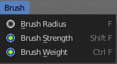

*************************************************************************
7.1.20 Editors - 3D View - Header - Mesh - Weight Paint mode - Brush menu
*************************************************************************

.. contents:: Contents

Weight Paint Mode - Brush Menu
==============================

Brush Radius
------------

Here yo can adjust the brush size. Hotkey tool! This menu entry is just there so that you are able to change the hotkey if you want, and to remind you that this hotkey exists.

Brush Strength
--------------

Here yo can adjust the brush strength. Hotkey tool! This menu entry is just there so that you are able to change the hotkey if you want, and to remind you that this hotkey exists.

Brush Weight
------------

Here yo can adjust the brush weight. Hotkey tool! This menu entry is just there so that you are able to change the hotkey if you want, and to remind you that this hotkey exists.

