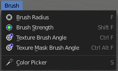

**************************************************************************
7.1.21 Editors - 3D View - Header - Mesh - Texture Paint mode - Brush menu
**************************************************************************

.. contents:: Contents

Texture Paint Mode - Brush Menu
===============================

You need to have a material and a texture at the mesh. Or the menu shows empty.

Brush Radius
------------

Here yo can adjust the brush size. Hotkey tool! This menu entry is just there so that you are able to change the hotkey if you want, and to remind you that this hotkey exists.

Brush Strength
--------------

Here yo can adjust the brush strength. Hotkey tool! This menu entry is just there so that you are able to change the hotkey if you want, and to remind you that this hotkey exists.

Texture Brush Angle
-------------------

Here yo can adjust the texture brush angle when you work with stencil maps and textures. Hotkey tool! This menu entry is just there so that you are able to change the hotkey if you want, and to remind you that this hotkey exists.

Texture Mask Brush Angle
------------------------

Here yo can adjust the texture brush angle when you work with stencil maps and textures in mask mode. Hotkey tool! This menu entry is just there so that you are able to change the hotkey if you want, and to remind you that this hotkey exists.

Color Picker
------------

Allows you to pick a color in the 3D view. Hotkey tool! 

