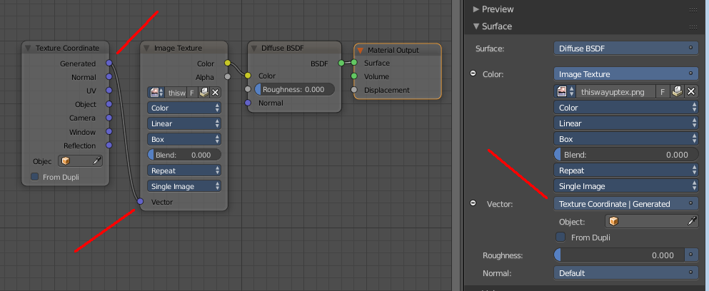
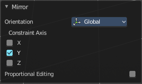
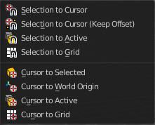

*******************************************************************
7.1.22 Editors - 3D View - Header - Curve -  Edit mode - Curve menu
*******************************************************************

.. contents:: Contents

Detailed Table of content
=========================

Edit Mode - Curve Menu
======================

The curve menu just exists for curve objects.

.. image:: graphics/7.1.22_Editors_-_3D_View_-_Header_-_Curve_-__Edit_mode_-_Curve_menu/10000201000000D3000001AB459767A3C3B7AC99.png

Transform
=========

.. image:: graphics/7.1.22_Editors_-_3D_View_-_Header_-_Curve_-__Edit_mode_-_Curve_menu/10000201000000A8000000EEA159293519CDDEFE.png

To Sphere
---------

Shapes a selection of objects into the shape of a sphere. The calculation happens with the object origins.

In Object mode this tools requires to have more than one object selected. 

Usage
-----

Select the vertices, activate the tool, then drag the mouse in the 3D viewport. In the header you will read the current factor then. Which tells you how close you are towards the sphere shape. This also works with curves in the same way.

.. image:: graphics/7.1.22_Editors_-_3D_View_-_Header_-_Curve_-__Edit_mode_-_Curve_menu/10000201000000920000002B567D115A122ADB2E.png

.. image:: graphics/7.1.22_Editors_-_3D_View_-_Header_-_Curve_-__Edit_mode_-_Curve_menu/10000201000000C2000000D566799059F4AA0E74.png

Last Operator To Sphere
-----------------------

Factor
------

The factor to transform the selection into a shape form.

Proportional editing
--------------------

Enables proportional editing. Activating proportional editing reveals further settings.

Proportional Falloff
--------------------

Here you can adjust the falloff methods.

Proportional Size
-----------------

Here you can see and adjust the falloff radius.

Connected
---------

The proportional falloff gets calculated for connected parts only.

Projected(2D)
-------------

The proportional falloff gets calculated in the screen space. Depth doesn't play a role. When it's in the radius, then it gets calculated.

Shear
-----

Shear shears the selection.

Last Operator Shear
-------------------

Offset
------

Here you can adjust an offset.

Shear Axis
----------

The shear tool works along a imaginary 2d plane. The shear axis controls if the itemas are sheared along the x or the y axes of this plane. This is the plane along which the transformation happens. You can shear along the x or the y axis of this plane.

To make things even more complicated, the orientation of this imaginary plane is defined by the Axis and Axis Ortho items below.

Axis
----

Defines one axis of the imaginary shear axis plane.

Axis Ortho
----------

Defines the other axis of the imaginary shear axis plane.

Orientation
-----------

Here you can choose the orientation for the shear action.

Proportional editing
--------------------

Enables proportional editing. Activating proportional editing reveals further settings.

.. image:: graphics/7.1.22_Editors_-_3D_View_-_Header_-_Curve_-__Edit_mode_-_Curve_menu/1000020100000119000000773CD5255E7E68F4C5.png

Proportional Falloff
--------------------

Here you can adjust the falloff methods.

Proportional Size
-----------------

Here you can see and adjust the falloff radius.

Connected
---------

The proportional falloff gets calculated for connected parts only.

Projected(2D)
-------------

The proportional falloff gets calculated in the screen space. Depth doesn't play a role. When it's in the radius, then it gets calculated.

Bend
----

Bends the selection.

Push/Pull
---------

It pushes or pulls the object positions relative to the center of the selection.

In Object mode this tool requires to have more than one object selected. 

Last Operator Push/Pull
-----------------------

Factor
------

Here you can adjust the strength of influence of the tool.

Proportional editing
--------------------

Enables proportional editing. Activating proportional editing reveals further settings.

Proportional Falloff
--------------------

Here you can adjust the falloff methods.

Proportional Size
-----------------

Here you can see and adjust the falloff radius.

Connected
---------

The proportional falloff gets calculated for connected parts only.

Projected(2D)
-------------

The proportional falloff gets calculated in the screen space. Depth doesn't play a role. When it's in the radius, then it gets calculated.

Warp
----

Warps a mesh selection between two defined points. This also works with curves.

Last operator Warp
------------------

Warp Angle
----------

The strength of the warp effect.

Offset Angle
------------

A offset angle to bend sidewards.

Min 
----

The start point.

Max
---

The end point.

Randomize Transform
-------------------

This tool allows randomizes the positions of the selected vertices. 

Last Operator Randomize Transform
---------------------------------

Amount
------

Here you can adjust the amount.

Uniform
-------

The uniform offset distance. 

Normal
------

Align the offset direction to the normals.

Random Seed
-----------

The seed value for randomization.

Shrink/Fatten
-------------

Shrink/Fatten scales the selected geometry along its normals. Transform orientation and Pivot point gets ignored.

A positive value pushes the vertices outwards. A negative value pushes the vertices inwards.

Last Operator Shrink/Fatten
---------------------------

The Last Operator Shrink/Fatten panel gives you tools to adjust the Shrink/Fatten operation. Here you have numeric input for the strength and a few more options.

Offset
------

Offset is the strength of the offset for Shrink/Fatten.

Offset Even
-----------

Offset Even scales the selection to give more thickness in even areas.

Proportional editing
--------------------

Enables proportional editing. Activating proportional editing reveals further settings.

Proportional Falloff
--------------------

Here you can adjust the falloff methods.

Proportional Size
-----------------

Here you can see and adjust the falloff radius.

Connected
---------

The proportional falloff gets calculated for connected parts only.

Projected(2D)
-------------

The proportional falloff gets calculated in the screen space. Depth doesn't play a role. When it's in the radius, then it gets calculated.

Move Texture Space
------------------

Move Texture space is meant for mesh objects, but has also functionality with a curve object.

This tool relies at the move tool. With the difference that it moves the texture space instead of the object. It has also a very special use case, and just works with a material with a Texture Coordinate / Generated node. And requires to have the shading at Material or Rendered to see a result in the viewport.

.. image:: graphics/7.1.22_Editors_-_3D_View_-_Header_-_Curve_-__Edit_mode_-_Curve_menu/10000201000000670000001C082440F4E84BF28E.png

In the viewport you will see the UV cage in black color. In the header you will see the values for the current position of the UV cage.

.. image:: graphics/7.1.22_Editors_-_3D_View_-_Header_-_Curve_-__Edit_mode_-_Curve_menu/10000201000001520000001C4E92E015F53A0F84.png

Note that once done and applied, there is no way to reset the UV cage back to zero. When you repeat the operation, then the values will start at 0 again. Even when the UV cage is already offset.

.. image:: graphics/7.1.22_Editors_-_3D_View_-_Header_-_Curve_-__Edit_mode_-_Curve_menu/100002010000028200000103C1990CAEB16A1527.png

Last Operator Translate
-----------------------

Move X, Y Z
-----------

Here you can limit the position relative to the source object.

Orientation
-----------

Orientation is a drop-down box where you can choose the type of orientation for the mirroring action.

Proportional editing
--------------------

Enables proportional editing. Activating proportional editing reveals further settings.

Proportional Falloff
--------------------

Here you can adjust the falloff methods.

Proportional Size
-----------------

Here you can see and adjust the falloff radius.

Connected
---------

The proportional falloff gets calculated for connected parts only.

Projected(2D)
-------------

The proportional falloff gets calculated in the screen space. Depth doesn't play a role. When it's in the radius, then it gets calculated.

Scale Texture Space
-------------------

Scale Texture space is meant for mesh objects, but has also functionality with a curve object.

This tool relies at the scale tool. With the difference that it scales the texture space instead of the object. It has also a very special use case, and just works with a material with a Texture Coordinate / Generated node. And requires to have the shading at Material or Rendered to see a result in the viewport.

.. image:: graphics/7.1.22_Editors_-_3D_View_-_Header_-_Curve_-__Edit_mode_-_Curve_menu/10000201000000670000001C082440F4E84BF28E.png

In the viewport you will see the UV cage in black color. In the header you will see the values for the current position of the UV cage.

.. image:: graphics/7.1.22_Editors_-_3D_View_-_Header_-_Curve_-__Edit_mode_-_Curve_menu/10000201000001520000001C4E92E015F53A0F84.png

Note that once done and applied, there is no way to reset the UV cage back to zero. When you repeat the operation, then the values will start at 0 again. Even when the UV cage is already offset.

Last Operator Resize Texture
----------------------------

Move X, Y Z
-----------

Here you can limit the position relative to the source object.

Orientation
-----------

Orientation is a drop-down box where you can choose the type of orientation for the mirroring action.

Proportional editing
--------------------

Enables proportional editing. Activating proportional editing reveals further settings.

Proportional Falloff
--------------------

Here you can adjust the falloff methods.

Proportional Size
-----------------

Here you can see and adjust the falloff radius.

Connected
---------

The proportional falloff gets calculated for connected parts only.

Projected(2D)
-------------

The proportional falloff gets calculated in the screen space. Depth doesn't play a role. When it's in the radius, then it gets calculated.

Set Dimensions
--------------

Edit Mode Only!

Normally all scale operations in Bforartists are relative to the current selection and dimensions. And you always start with a relative value of 1.

Set dimensions allows to scale mesh selections in absolute world values. No matter how the initial values are. The new values gets set in the Last Operator.

Set dimensions is an add-on. You can turn it off in the add-ons section of the user preferences when you want.

Last Operator Set Dimensions
----------------------------

New Dimensions
--------------

When you activate the tool then you will see the world coordinates of the selection. Here you can change the values to other world coordinates.

Mirror
======

Mirror mirrors the selected geometry along the defined axis. 

.. image:: graphics/7.1.22_Editors_-_3D_View_-_Header_-_Curve_-__Edit_mode_-_Curve_menu/10000201000000A8000000C897B4081B4E096A22.png

Interactive Mirror
------------------

Mirror by hotkeys. You activate the tool, type in x for x global for example, or x x for x local. And the selection gets mirrored

X Global, Y Global etc.
-----------------------

Mirrors the selection around the chosen axis.

Last Operator Mirror
--------------------

The Last Operator Mirror panel gives you tools to adjust the mirror action.

Orientation 
------------

Orientation is a drop-down box where you can choose the type of orientation for the mirroring action.

Constraint Axis
---------------

Constraint Axis gives you again the possibility to define the mirror axis. You can choose more than one axis here.

Proportional editing
--------------------

Enables proportional editing. Activating proportional editing reveals further settings.

Proportional Falloff
--------------------

Here you can adjust the falloff methods.

Proportional Size
-----------------

Here you can see and adjust the falloff radius.

Connected
---------

The proportional falloff gets calculated for connected parts only.

Projected(2D)
-------------

The proportional falloff gets calculated in the screen space. Depth doesn't play a role. When it's in the radius, then it gets calculated.

Snap
====

Here you can choose several methods to snap one element to another. The menu items should be self explaining.

Last Operator Snap
------------------

Some snap operations shows a last operation panel, some not.

.. image:: graphics/7.1.22_Editors_-_3D_View_-_Header_-_Curve_-__Edit_mode_-_Curve_menu/10000201000001190000003B7E6A699CC42AE3C5.png

Offset
------

If the selection should snap as a whole, or if each individual element of the selection should snap.

Operators
=========

Duplicate
---------

Duplicates the current selection. This can be a single control point or a whole curve.

The copy sticks to the mouse until you release it. A Right click while moving will reset the position of the duplicate. The duplicated part will be part of the same object.

When you drag the duplicate around you will see the position values in the header.

Last Operator Duplicate
-----------------------

Move X , Y , Z
--------------

Orientation
-----------

Here you can choose the orientation.

Proportional editing
--------------------

Enables proportional editing. Activating proportional editing reveals further settings.

.. image:: graphics/7.1.22_Editors_-_3D_View_-_Header_-_Curve_-__Edit_mode_-_Curve_menu/1000020100000119000000773CD5255E7E68F4C5.png

Proportional Falloff
--------------------

Here you can adjust the falloff methods.

Proportional Size
-----------------

Here you can see and adjust the falloff radius.

Connected
---------

The proportional falloff gets calculated for connected parts only.

Projected(2D)
-------------

The proportional falloff gets calculated in the screen space. Depth doesn't play a role. When it's in the radius, then it gets calculated.

Split
-----

Splits the curve at the selected control point(s). You need to select two control points to select the segment between it.

Separate
--------

Separates the selected control points, and creates a new curve object out of it. You need to select two control points to select the segment between it.

Toggle Cyclic
-------------

Toggle Cyclic closes or opens the curve.

Last Operator Toggle Cyclic
---------------------------

Direction
---------

Direction is a drop-down box where you can choose the direction in which the curve gets closed.

Decimate Curve
--------------

Decimates the currently selected geometry. It starts with a Ratio of 1. Which means no decimation. The lower the ratio the more decimation you will get.

Last Operator Decimate Curve
----------------------------

Ratio
-----

Here you can adjust the strength of decimation.

Set Spline Type
---------------

With set Spline Type you can set the type of the curve. 

Poly is a straight line between the control points. Bezier has curve handlers. A nurbs curve has a control cage.

Last Operator Set Spline Type
-----------------------------

Type
----

Type is a drop-down box where you can choose the spline type

Handles
-------

Use Handles when converting Bezier curves into polygons.

Tilt
----

Modifies the Mean Tilt.

Activate the tool, and drag the mouse. You will see a value in the header now. The selected curve path will rotate by dragging the mouse.

The Tilt angle always starts at zero. It is relative. To modify the Mean Tilt use the edit box in the Transform panel.

Last Operator Tilt
------------------

Angle
-----

The Tilt angle.

Proportional editing
--------------------

Enables proportional editing. Activating proportional editing reveals further settings.

.. image:: graphics/7.1.22_Editors_-_3D_View_-_Header_-_Curve_-__Edit_mode_-_Curve_menu/1000020100000119000000773CD5255E7E68F4C5.png

Proportional Falloff
--------------------

Here you can adjust the falloff methods.

Proportional Size
-----------------

Here you can see and adjust the falloff radius.

Connected
---------

The proportional falloff gets calculated for connected parts only.

Projected(2D)
-------------

The proportional falloff gets calculated in the screen space. Depth doesn't play a role. When it's in the radius, then it gets calculated.

Clear Tilt
----------

Sets the Mean Tilt to zero.

Set Handle Type
---------------

Handles defines the type of handle for the knots of the curve. You have the choice between Auto, Vector, Align and Free. And the Last Operator gives you a fifth possibility to toggle between Free and Align.

.. image:: graphics/7.1.22_Editors_-_3D_View_-_Header_-_Curve_-__Edit_mode_-_Curve_menu/10000201000000D20000007494DDC04FDC150728.png

Auto
----

Auto aligns the handles automatically.

Vector
------

Set Handle type to Vector.

Align
-----

Set Handle type to Align.

Free
----

Set Handle type to Free.

Toggle Free/Aligned
-------------------

Toggle Free/Aligned.

Last Operator Set Handle Type
-----------------------------

Type
----

Type is a drop-down box where you can set the handle type. You have the choice between Auto, Vector, Align, Free. And the fifth possibility toggles between Free and Align.

Recalc Normals
--------------

Recalculates the normals of the selected curve.

Last Operator Recalc Normals
----------------------------

Length
------

Recalculates the handle length too.

Show / Hide
-----------

Show Hidden
-----------

Makes all curve geometry in the scene visible again.

Hide Selected
-------------

Hides the selected curve geometry.

Last Operator Hide Selected
---------------------------

Unselected
----------

Hides the not selected curve geometry.

Hide Unselected
---------------

Hides the not selected curve geometry. The selected geometry stays visible.

Delete
------

Vertices
--------

Dissolves the selected vertices. When removing vertices in between then the curve stays intact and connected.

Segment
-------

Removes the segment between the selected vertices.

Dissolve Vertices
-----------------

Dissolves the selected vertices. When removing vertices in between then the curve stays intact and connected.

