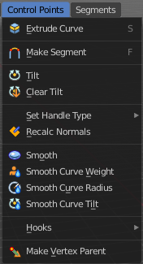

*************************************************************************************
7.1.24 Editors - 3D View - Header - Curve & Surface - Edit mode - Control points menu
*************************************************************************************

.. contents:: Contents

Detailed Table of content
=========================

Edit Mode - Control Points menu
===============================

The control points menu exists for Curve and Surface objects in edit mode.

For the surface object type there are not this much operators available. Lerft the menu with a surface object. Right the menu with a curve object.

Extrude Curve
-------------

Extrudes the selected curve point(s).

Last operator Extrude Curve and Move
------------------------------------

Mode
----

A drop-down box where you can choose between different extrude modes.

Default is Translation. Most other methods has no effect.

Move X , Y , Z
--------------

The position of the extruded point(s).

Orientation
-----------

Here you can adjust the orientation of the extrusion. It usually starts with Normal.

Proportional editing
--------------------

Enables proportional editing. Activating proportional editing reveals further settings.

.. image:: graphics/7.1.24_Editors_-_3D_View_-_Header_-_Curve_&_Surface_-_Edit_mode_-_Control_points_menu/1000020100000119000000773CD5255E7E68F4C5.png

Proportional Falloff
--------------------

Here you can adjust the falloff methods.

Proportional Size
-----------------

Here you can see and adjust the falloff radius.

Connected
---------

The proportional falloff gets calculated for connected parts only.

Projected(2D)
-------------

The proportional falloff gets calculated in the screen space. Depth doesn't play a role. When it's in the radius, then it gets calculated.

Make Segment
------------

Joins two curves by adding a segment between the end of the one and the beginning of the other. You can also create a closed curve that way.

Tilt
----

Modifies the Mean Tilt.

Activate the tool, and drag the mouse. You will see a value in the header now. The selected curve path will rotate by dragging the mouse.

The Tilt angle always starts at zero. It is relative. To modify the Mean Tilt use the edit box in the Transform panel.

Last Operator Tilt
------------------

Angle
-----

The Tilt angle.

Proportional editing
--------------------

Enables proportional editing. Activating proportional editing reveals further settings.

.. image:: graphics/7.1.24_Editors_-_3D_View_-_Header_-_Curve_&_Surface_-_Edit_mode_-_Control_points_menu/1000020100000119000000773CD5255E7E68F4C5.png

Proportional Falloff
--------------------

Here you can adjust the falloff methods.

Proportional Size
-----------------

Here you can see and adjust the falloff radius.

Connected
---------

The proportional falloff gets calculated for connected parts only.

Projected(2D)
-------------

The proportional falloff gets calculated in the screen space. Depth doesn't play a role. When it's in the radius, then it gets calculated.

Clear Tilt
----------

Sets the Mean Tilt to zero.

Set Handle Type
---------------

Handles defines the type of handle for the knots of the curve. You have the choice between Auto, Vector, Align and Free. And the Last Operator gives you a fifth possibility to toggle between Free and Align.

Auto
----

Auto aligns the handles automatically.

Vector
------

Set Handle type to Vector.

Align
-----

Set Handle type to Align.

Free
----

Set Handle type to Free.

Toggle Free/Aligned
-------------------

Toggle Free/Aligned.

Last Operator Set Handle Type
-----------------------------

Type
----

Type is a drop-down box where you can set the handle type. You have the choice between Auto, Vector, Align, Free. And the fifth possibility toggles between Free and Align.

Recalc Normals
--------------

Recalculates the normals of the selected curve.

Last Operator Recalc Normals
----------------------------

Length
------

Recalculates the handle length too.

Smooth
------

Flattens the angles of the selected control point(s).

Smooth Curve Tilt
-----------------

Smooths the curve tilt of the selected control point(s).

Smooth Curve Radius
-------------------

Smooths the curve radius of the selected control point(s).

Smooth Curve Weight
-------------------

Interpolates the weight of the selected control point(s).

Hooks
-----

Hooks is a menu with tools around the hook modifier. You could also adjust the hook modifier from the Properties editor. But the menu items are more accessible.

When there is no hook modifier at the mesh then you just see three menu items. When there is minimum one hook modifier applied, then you will see an extended menu.

Hook to New Object 
-------------------

Creates a new Hook Modifier for the active object and assigns it to the selected vertices. It also creates an empty at the center of those vertices, which are hooked to it.

Hook to Selected Object 
------------------------

Does the same as **Hook to New Object**, but instead of hooking the vertices to a new empty, it hooks them to the selected object (if it exists). There should be only one selected object (besides the mesh being edited). 

Last Operator Hook to Selected Object
-------------------------------------

Active Bone
-----------

Hook to the object(s) of the active bone.

Hook to Selected Object Bone 
-----------------------------

Does the same as **Hook to New Object****. B**ut it sets the last selected bone in the also selected armature as a target.

Assign to Hook 
---------------

Here you can assign the selected vertices to the chosen hook modifier. Existing hooks gets overwritten. One vertex can be assigned to more than one hook. 

Remove Hook 
------------

Removes the chosen Hook Modifierfrom the object.

Select Hook 
------------

Selects all vertices assigned to the chosen Hook Modifier.

Reset Hook 
-----------

Resets the chosen Hook Modifier.

Recenter Hook 
--------------

**Recenter** the Hook Modifier.

Make Vertex Parent
------------------

Parents another object to the selected vertice(s).

Workflow:
---------

In Object mode select the object that you want to parent to a vertex. Shift select the parent object so that both are selected. Enter Edit mode. Then select one vertex for a single point. Then click the Make Vertex Parent button to make the relation.

