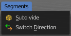
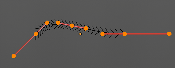
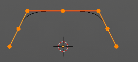
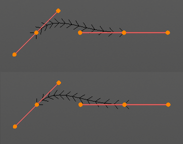

*******************************************************************************
7.1.25 Editors - 3D View - Header - Curve & Surface - Edit mode - Segments menu
*******************************************************************************

.. contents:: Contents

Edit Mode - Segments Menu
=========================

The Semgents menu exists for Curve and Surface object types. They are both curve types, but of different kind.

The added objects in edit mode becomes part of the current object geometry.

Subdivide
---------

Subdivides the selected curve geometry, and adds more control points.

Last Operator Subdivide
-----------------------

Number of Cuts
--------------

Number of subdivision cuts.

Switch Direction
----------------

Just for Bezier Curve object type. Surface Nurbs curves doesn't have a direction. Switches the direction in which the curve is pointing.

