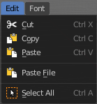

****************************************************************
7.1.27 Editors - 3D View - Header - Text - Edit mode - Edit menu
****************************************************************

.. contents:: Contents

Edit Mode - Edit Menu
=====================

Cut
---

Cuts the selection.

Copy
----

Copies the selection.

Paste
-----

Pastes a copied selection.

Paste File
----------

Opens the file browser where you can choose a text file to paste the text from. It needs to be UTF8.

Select All
----------

Selects all text.

