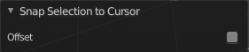

**********************************************************************************
7.1.29 Editors - 3D View - Header - Grease Pencil - Edit mode - Grease Pencil menu
**********************************************************************************

.. contents:: Contents

Detailed table of content
=========================

Edit Mode - Grease Pencil Menu
==============================

.. image:: graphics/7.1.29_Editors_-_3D_View_-_Header_-_Grease_Pencil_-_Edit_mode_-_Grease_Pencil_menu/10000201000000EB0000019F0B3642B9139EB5C7.png

Transform
=========

Bend
----

Bends the selection.

Shear
-----

Shear shears the selection.

Last Operator Shear
-------------------

Offset
------

Here you can adjust an offset.

Shear Axis
----------

The shear tool works along a imaginary 2d plane. The shear axis controls if the itemas are sheared along the x or the y axes of this plane. This is the plane along which the transformation happens. You can shear along the x or the y axis of this plane.

To make things even more complicated, the orientation of this imaginary plane is defined by the Axis and Axis Ortho items below.

Axis
----

Defines one axis of the imaginary shear axis plane.

Axis Ortho
----------

Defines the other axis of the imaginary shear axis plane.

Orientation
-----------

Here you can choose the orientation for the shear action.

Proportional editing
--------------------

Enables proportional editing. Activating proportional editing reveals further settings.

.. image:: graphics/7.1.29_Editors_-_3D_View_-_Header_-_Grease_Pencil_-_Edit_mode_-_Grease_Pencil_menu/1000020100000119000000773CD5255E7E68F4C5.png

Proportional Falloff
--------------------

Here you can adjust the falloff methods.

Proportional Size
-----------------

Here you can see and adjust the falloff radius.

Connected
---------

The proportional falloff gets calculated for connected parts only.

Projected(2D)
-------------

The proportional falloff gets calculated in the screen space. Depth doesn't play a role. When it's in the radius, then it gets calculated.

To Sphere
---------

Shapes a selection of objects into the shape of a sphere. The calculation happens with the object origins.

Usage
-----

Select the vertices, activate the tool, then drag the mouse in the 3D viewport. In the header you will read the current factor then. Which tells you how close you are towards the sphere shape.

.. image:: graphics/7.1.29_Editors_-_3D_View_-_Header_-_Grease_Pencil_-_Edit_mode_-_Grease_Pencil_menu/10000201000000920000002B567D115A122ADB2E.png

.. image:: graphics/7.1.29_Editors_-_3D_View_-_Header_-_Grease_Pencil_-_Edit_mode_-_Grease_Pencil_menu/10000201000000C2000000D566799059F4AA0E74.png

Last Operator To Sphere Panel
-----------------------------

Factor
------

The factor to transform the selection into a shape form.

Proportional editing
--------------------

Enables proportional editing. Activating proportional editing reveals further settings.

Proportional Falloff
--------------------

Here you can adjust the falloff methods.

Proportional Size
-----------------

Here you can see and adjust the falloff radius.

Connected
---------

The proportional falloff gets calculated for connected parts only.

Projected(2D)
-------------

The proportional falloff gets calculated in the screen space. Depth doesn't play a role. When it's in the radius, then it gets calculated.

Shrink/Fatten
-------------

Shrink/Fatten scales the selected geometry along its normals. Transform orientation and Pivot point gets ignored.

A positive value pushes the vertices outwards. A negative value pushes the vertices inwards.

Last Operator Shrink/Fatten
---------------------------

The Last Operator Shrink/Fatten panel gives you tools to adjust the Shrink/Fatten operation. Here you have numeric input for the strength and a few more options.

Offset
------

Offset is the strength of the offset for Shrink/Fatten.

Offset Even
-----------

Offset Even scales the selection to give more thickness in even areas.

Proportional editing
--------------------

Enables proportional editing. Activating proportional editing reveals further settings.

Proportional Falloff
--------------------

Here you can adjust the falloff methods.

Proportional Size
-----------------

Here you can see and adjust the falloff radius.

Connected
---------

The proportional falloff gets calculated for connected parts only.

Projected(2D)
-------------

The proportional falloff gets calculated in the screen space. Depth doesn't play a role. When it's in the radius, then it gets calculated.

Mirror
======

Mirror mirrors the selected geometry along the defined axis. 

Interactive Mirror
------------------

Mirror by hotkeys. You activate the tool, type in x for x global for example, or x x for x local. And the selection gets mirrored.

X Global, Y Global etc.
-----------------------

Mirrors the selection around the chosen axis.

Last Operator Mirror
--------------------

The Last Operator Mirror panel gives you tools to adjust the mirror action.

.. image:: graphics/7.1.29_Editors_-_3D_View_-_Header_-_Grease_Pencil_-_Edit_mode_-_Grease_Pencil_menu/100002010000011A000000A70C62EB24315CDC77.png

Orientation 
------------

Orientation is a drop-down box where you can choose the type of orientation for the mirroring action.

Constraint Axis
---------------

Constraint Axis gives you again the possibility to define the mirror axis. You can choose more than one axis here.

Proportional editing
--------------------

Enables proportional editing. Activating proportional editing reveals further settings.

Proportional Falloff
--------------------

Here you can adjust the falloff methods.

Proportional Size
-----------------

Here you can see and adjust the falloff radius.

Connected
---------

The proportional falloff gets calculated for connected parts only.

Projected(2D)
-------------

The proportional falloff gets calculated in the screen space. Depth doesn't play a role. When it's in the radius, then it gets calculated.

Snap
====

Here you can choose several methods to snap one element to another. The menu items should be self explaining.

Last Operator Snap
------------------

Some snap operations shows a last operation panel, some not.

Offset
------

If the selection should snap as a whole, or if each individual element of the selection should snap.

Animation
=========

Insert Blank Keyframe ( Active Layer )
--------------------------------------

Inserts a keyframe into the active layer.

Insert Blank Keyframe ( All Layers )
------------------------------------

Inserts a keyframe into all layers.

Last Operator Insert Blank Frame
--------------------------------

Some snap operations shows a last operation panel, some not.

.. image:: graphics/7.1.29_Editors_-_3D_View_-_Header_-_Grease_Pencil_-_Edit_mode_-_Grease_Pencil_menu/100002010000011A000000401D24E230B99E6B24.png

All Layers
----------

Insert into active layer or into all layers.

Duplicate Active Keyframe ( Active Layer )
------------------------------------------

Duplicates the active keyframe in the active layer.

Duplicate Active Keyframe ( All Layers )
----------------------------------------

Duplicates the active keyframe in all layers.

Last Operator Insert Blank Frame
--------------------------------

Some snap operations shows a last operation panel, some not.

Mode
----

Duplicate the active keyframe in the active layer or in all layers.

Delete Active Keyframe ( Active Layer )
---------------------------------------

Deletes the active keyframe in the active layer.

Delete Active Keyframe ( All Layers )
-------------------------------------

Deletes the active keyframe in all layers

Single Operators
================

Duplicate
---------

Duplicates the current selection.

When you duplicate a selection, then it sticks to the mouse until you left click. And moves around. A right click repositions the duplicated geometry at its original location.

Last Operator Duplicate
-----------------------

Mode
----

Not to find out. No tooltip, no entry in the Blender manual. Good Job Blender Developers.

Move X, Y, Z
------------

Here you can adjust the position.

Orientation 
------------

Orientation is a drop-down box where you can choose the type of orientation for the mirroring action.

Constraint Axis
---------------

Constraint Axis gives you again the possibility to define the mirror axis. You can choose more than one axis here.

Proportional editing
--------------------

Enables proportional editing. Activating proportional editing reveals further settings.

Proportional Falloff
--------------------

Here you can adjust the falloff methods.

Proportional Size
-----------------

Here you can see and adjust the falloff radius.

Connected
---------

The proportional falloff gets calculated for connected parts only.

Projected(2D)
-------------

The proportional falloff gets calculated in the screen space. Depth doesn't play a role. When it's in the radius, then it gets calculated.

Duplicate Active Frame
----------------------

Duplicates the active frame in the active layer.

Duplicate Active Frame All Layers
---------------------------------

Duplicates the active frame in all layers.

Last Operator Duplicate Frame
-----------------------------

Mode
----

Choose between Duplicate Active Frame and Duplicate Active Frame All Layers.

Split
-----

Splits the selection.

Copy
----

Copies the selection.

Paste
-----

Pastes a copied selection to active layer. You can have more than one layer.

Paste by Layer
--------------

Pastes a copied selection to same, original layer. You can have more than one layer.

Last operator Paste Strokes
---------------------------

Type
----

Here you can choose between the paste methods again.

Delete
------

Points
------

Delete selected stroke points.

Strokes
-------

Delete the stroke where the current selection belongs to.

Frame
-----

Delete the grease pencil frame where the current selection belongs to.

Last Operator Delete
--------------------

Type
----

Here you can again choose what you want to delete.

Delete Active Keyframe(Active Layer)
------------------------------------

Deletes the active keyframe in the current active layer.

Delete Active Keyframe(All Layers)
----------------------------------

Deletes the active keyframe in all layers.

Dissolve
--------

Dissolve is a union operation. Two edges becomes one edge by removing the vertice in between.

Dissolve
--------

Dissolves the selection.

Dissolve Between
----------------

Dissolves the vertices between the selected vertices.

Dissolve Unselect
-----------------

Dissolves the vertices that are not selected.

Last Operator Dissolve
----------------------

Type
----

Here you can again choose how you want to dissolve.

Cleanup
-------

Delete Loose Points
-------------------

Deletes not connected stroke geometry that is made of loose points.

Last Operator Clean Loose Points
--------------------------------

Limit
-----

The number of vertices below which a stroke gets counted as a loose point.

Merge by Distance
-----------------

Merges vertices that are close to each other.

Last Operator Clean Loose Points
--------------------------------

Threshold
---------

The distance.

Unselected
----------

Merge also unselected geometry.

Boundary Strokes
----------------

Removes boundary "No Fill" strokes in the current active frame.

Boundary Strokes all Frames
---------------------------

Removes boundary "No Fill" strokes in the all frames.

Last Operator Clean Fill Boundaries
-----------------------------------

Mode
----

Current active frame or all frames.

Reproject Strokes
-----------------

Reproject the selected strokes onto a new plane from the current viewport. So that all strokes are on one plane.

Reproject Strokes menu
----------------------

Using this tool opens a popup menu where you can choose the projection type method.

Last Operator Reproject Strokes
-------------------------------

Projection Type
---------------

A popup menu where you can choose the projection type method.

Show / Hide
-----------

Show Hidden Layer
-----------------

Makes all layers in the scene visible again.

Hide Selected Layer
-------------------

Hides the selected layer.

Last Operator Hide Layers
-------------------------

Unselected
----------

Hides the not selected layers.

Hide Unselected
---------------

Hides the not selected layers. The selected layers stays visible.

Toggle Opacity
--------------

Toggles the opacity of the stroke. With opaque stroke the vertices are hidden behind the stroke, and can't be seen.

Separate Strokes
----------------

Separates the selection into a new grease pencil object.

Selected Points
---------------

Separate the selected points with its edges.

Selected Strokes
----------------

Separate the whole stroke of the current seletion.

Active Layer
------------

Separate all the strokes at the current active layer.

