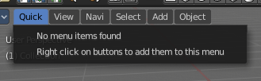
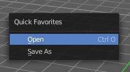
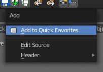
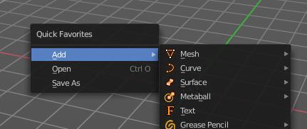

*************************************************
7.1.2 Editors - 3D View - Header - Quick Menu.odt
*************************************************

.. contents:: Contents

Quick Menu
==========

The quick menu, or in long Quick Favourites menu, is a menu that can be customized to your needs. Here you can add operators for quick access.

It is located in the header of the 3D view, But it can be called by hotkey Q directly under the mouse. This hotkey works in other editors too. 

When the menu is empty, then you will see the message "No Menu Items found". This means that you first have to add some tools to the menu. It is a user configurable menu.

Note that added operators in this menu does not have icons. Just text.

Adding an operator to the Quick menu
------------------------------------

Open the panel or the menu where your operator is that you want to add. 

Let's add the open command from the File menu. Open the File menu, right click at open, and choose Add to Quick Favourites.

Do the same with Save As. We should now have two new menu items in the Quick menu, which you can use now.

As a rule of thumb, when the right click menu has a Add to Quick Favourites, then you can add it to the quick menu.

Note that you can also add operators from the tool shelf at the left. And also operators from other editor types. Some other editors have their own quick menu though. The Image Editor for example. These operators gets added in the quick menu of the image editor then. And does not show in the quick menu ijn the header of the 3D view.

Adding a menu to the Quick menu
-------------------------------

It is also possible to add a menu to the Quick menu. For example the whole Add menu. The way is the same. Right click at it, and choose Add to Quick Favourites.

Order
-----

You might notice that the add menu adds at the top of the menu, and not at the bottom as you would expect. First comes menus, then comes operators. And they get added in the order in which you add them. 

Besides that, operators and menus gets added in the order that you add them. They cannot be sorted afterwards. So be careful how you add them. You can of course always remove operators and menus, and readd them at the end of the list.

Removing an operator from the Quick menu
----------------------------------------

Removing is as simple as adding. Right click at the operators in the Quick menu, and choose Remove from Quick favourites.

Context and mode dependant content
----------------------------------

The quick favourites menu exists in nearly all editors. But it is just in the 3D view available in the header. So that you know this functionality exists. In the other editors you call it with hotkey Q.

The content of the quick favourites menu changes, dependant over which editor you are, and in what mode you are. When you add for example an operator from the image editor, then this operator just shows in the quick menu when you call the menu from the image editor. Same goes for the modes. Edit mode tools will just show in edit mode. And so on.

