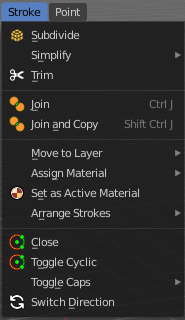
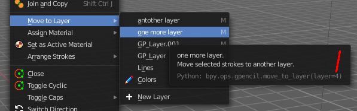
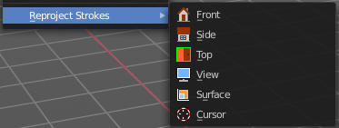

***************************************************************************
7.1.30 Editors - 3D View - Header - Grease Pencil - Edit mode - Stroke menu
***************************************************************************

.. contents:: Contents

Edit Mode - Stroke Menu
=======================

In Edit Mode you will also see a add menu for some object types. The number of objects that you can add is limited to the same object type that you are in edit mode with. You can just add mesh geometry to a mesh geometry. And just curve geometry to curve geometry.

The added objects in edit mode becomes part of the current object geometry.

Subdivide
---------

Subdivides the selected grease pencil geometry.

Last Operator Subdivide
-----------------------

Number of Cuts
--------------

Number of subdivision cuts.

Smooth
------

Smoothen the stroke, not just the new added vertices

Repeat
------

The number of times to repeat the procedure.

Selected Points
---------------

Limits the effect to only the selected points within the stroke.

Position
--------

The operator affects the points location.

Thickness
---------

The operator affect the points thickness.

Strength
--------

The operator affect the points strength (alpha).

UV
--

The operator affect the UV rotation on the points.

Simplify
--------

Simplifies the stroke.

Fixed
-----

Deletes every second point in the stroke, except the start and end points.

Last Operator Simplify Fixed Stroke
-----------------------------------

Steps
-----

How much levels of simplifying.

Adaptive
--------

This method uses an algorithm called RDP algorithm (Ramer-Douglas-Peucker algorithm) for points deletion. The algorithm tries to keep the shape with the remaining points.

Last Operator Simplify Stroke
-----------------------------

Factor
------

How strong the simplification should be performed.

Sample
------

Samples points along the shape of the stroke, and increases the length of the edges.

Last Operator Sample Stroke
---------------------------

Factor
------

How long the edges between the points should be.

Trim
----

Trims down selected stroke geometry to first loop or intersection.

Join
----

Join selected strokes by connecting points.

Join and copy
-------------

Join selected strokes by connecting points in a new stroke.

Last Operator Join Strokes
--------------------------

Type
----

Join or Join and Copy.

Leave Gaps
----------

Don't connect the strokes by geometry.

Move to Layer
-------------

Here you can move the current selected stroke to another grease pencil layer. It lists the current layers.

New Layer
---------

New Layer button adds a new grease pencil layer.

Last Operator Move Strokes to Layer
-----------------------------------

Grease Pencil Layer
-------------------

Internal the layers are enumerated. So here you move by number. 

The number of a layer can be found out in the tool tip, in the Python part of it.

Assign Material
---------------

Here you can assign a new material to the current selected stroke geometry.

The materials can be found and edited in the Properties editor. Here you can also create new materials.

Last Operator Change Stroke Color
---------------------------------

Material
--------

The materials are defined by its name. So when you want to use another material, then change the name here.

Set as active material
----------------------

Sets the current selected material as the active material.

Arrange
-------

Changes the drawing order of the strokes in the 2D layer.

Bring Forward
-------------

Moves the selected points/strokes upper the next one in the drawing order.

Send Backward
-------------

Moves the selected points/strokes below the previous one in the drawing order.

Bring to Front
--------------

Moves to the top the selected points/strokes.

Send to Back
------------

Moves to the bottom the selected points/strokes.

Last Operator Arrange Stroke
----------------------------

Direction
---------

Here you can choose the method again.

Close
-----

Closes the current stroke by connecting the first vertice with the last vertice by a stroke. See also Toggle Cyclic.

Toggle Cyclic
-------------

When the curve is open, then it Closes the current stroke by connecting the first vertice with the last vertice by a stroke. When the curve is closed, then it removes the connection between first and last vertice, and makes the curve open.

Last Operator Set Cyclical State
--------------------------------

Type
----

Here you can choose the method again.

Close all
---------

Close all open selected strokes.

Open all
--------

Open all closed selected strokes.

Toggle
------

Close or Open selected strokes as required.

Create geometry
---------------

When enabled, points are added for closing the strokes like when using the Close tool. If disabled, the stroke is closed with just one edge.

Toggle Caps
-----------

Toggles if the start and endpoints of the strokes are rounded or flat.

Default
-------

Sets stroke start and end points to rounded (default).

Both
----

Toggle stroke start and end points caps to flat or rounded.

Start
-----

Toggle stroke start point cap to flat or rounded.

End
---

Toggle stroke end point cap to flat or rounded.

Last Operator Set Caps Mode
---------------------------

Type
----

Here you can choose the method again.

Switch Direction
----------------

Switches the direction of the stroke geometry.

Reproject Strokes
-----------------

Reprojects the selected stroke points in the selected view method.

Last Operator Reproject Strokes
-------------------------------

Projection Type
---------------

Here you can choose the method again.

