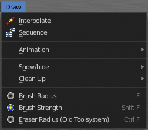
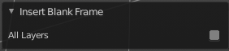

*************************************************************************
7.1.32 Editors - 3D View - Header - Grease Pencil - Draw mode - Draw menu
*************************************************************************

.. contents:: Contents

Draw Mode - Draw Menu
=====================

Interpolate
-----------

Interpolates strokes between the previous and next keyframe by adding a single keyframe. When you are on a frame between two keyframes and click the Interpolate button a new breakdown keyframe will be added. This way you define the final interpolation for the new stroke.

Sequence
--------

Interpolate strokes between the previous and next keyframe by adding multiple keyframes. When you are on a frame between two keyframes and click the sequence button, then a breakdown keyframe will be added on every frame between the previous and next keyframe.

Animation
---------

Insert Blank Keyframe ( Active Layer )
--------------------------------------

Inserts a keyframe into the active layer.

Insert Blank Keyframe ( All Layers )
------------------------------------

Inserts a keyframe into all layers.

Last Operator Insert Blank Frame
--------------------------------

Some snap operations shows a last operation panel, some not.

All Layers
----------

Insert into active layer or into all layers.

Duplicate Active Keyframe ( Active Layer )
------------------------------------------

Duplicates the active keyframe in the active layer.

Duplicate Active Keyframe ( All Layers )
----------------------------------------

Duplicates the active keyframe in all layers.

Last Operator Insert Blank Frame
--------------------------------

Some snap operations shows a last operation panel, some not.

Mode
----

Duplicate the active keyframe in the active layer or in all layers.

Delete Active Keyframe ( Active Layer )
---------------------------------------

Deletes the active keyframe in the active layer.

Delete Active Keyframe ( All Layers )
-------------------------------------

Deletes the active keyframe in all layers

Show/Hide
---------

Show all Layers
---------------

Makes all layers in the scene visible .

Last Operator Hide Layers
-------------------------

Select
------

Shows just selected layers.

Hide Active Layer
-----------------

Hides the active layer.

Hide inactive Layers
--------------------

Hides the not selected layers. The selected layers stays visible.

Last Operator Hide Layers
-------------------------

Unselected
----------

Hides the not selected layers.

Clean Up
--------

Delete loose Points
-------------------

Deletes loose stroke points.

Last Operator Clean loose points
--------------------------------

Limit
-----

Here you can adjust with how much vertices a stroke gets count as loose geometry.

Boundary Strokes
----------------

Remove "no fill" boundary strokes from the active frame.

Boundary Strokes all Frames
---------------------------

Remove "no fill" boundary strokes from all frames.

Last Operator Clean Fill Boundaries
-----------------------------------

Mode
----

Here you can again choose if you want to remove the "no fill" boundary strokes just from the active frame, or from all frames.

Brush Radius
------------

Adjust the brush radius by hotkey. Hotkey only tool! The menu entry just exists to tell you that the functionality is available.

Brush Strength
--------------

Adjust the brush strength by hotkey. Hotkey only tool! The menu entry just exists to tell you that the functionality is available.

Eraser Radius ( Old Toolsystem)
-------------------------------

Adjust the eraser brush radius by hotkey. Hotkey only tool! The menu entry just exists to tell you that the functionality is available.

