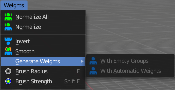

************************************************************************************
7.1.33 Editors - 3D View - Header - Grease Pencil - Weight Paint Mode - Weights Menu
************************************************************************************

.. contents:: Contents

WeightPaint Mode - Weights Menu
===============================

Normalize All
-------------

Normalizes the weight of all Vertex groups so that the values for the single vertices in the sum is 1.

Last Operator Normalize all Vertex Group
----------------------------------------

Lock Active
-----------

Keep the values of the active group while normalizing others.

Normalize
---------

Normalize normalizes the weight of the current selected Vertex group so that the values for the single vertices in the sum is 1. Means when there is influence from other groups, then those values are kept, but the one for the current group gets lowered so that the sum is 1.

Invert
------

Invert inverts the weight painting for the selected vertex group.

Smooth
------

Smooths the weight for selected vertices.

Last Operator Smooth Vertex Group
---------------------------------

Factor
------

Here you adjust the factor.

Iterations
----------

Here you adjust how many iterations you use.

Generate Weights
----------------

The menu items are greyed out as long as there is no weight painting at the grease pencil stroke. And you need to have the grease pencil stroke parented to an armature. Or you will get an error. 

With empty Groups
-----------------

Parents the vertices to the bones, but with empty vertex groups.

With automatic Weights
----------------------

Parents the vertices to the bones, but tries to apply automatic weighting, based at the envelope weight of the bones.

Last OperatorGenerate Automatic Weights
---------------------------------------

Mode
----

With empty groups or with automatic weights.

Armature
--------

Which armature to use. There can be more than one armature in the hierarchy.

Ratio
-----

The ratio between bone lenght and influence radius. This adjusts the envelope weight of the bones.

Decay
-----

Factor to reduce influence depending of distance to bone axis. This adjusts the envelope weight of the bones.

Brush Radius
------------

Adjust the brush radius by hotkey. Hotkey only tool! The menu entry just exists to tell you that the functionality is available.

Brush Strength
--------------

Adjust the brush strength by hotkey. Hotkey only tool! The menu entry just exists to tell you that the functionality is available.

