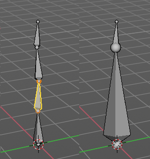

************************************************************************
7.1.34 Editors - 3D View - Header - Armature - Edit mode - Armature menu
************************************************************************

.. contents:: Contents

Detailed Table of content
=========================

Edit Mode - Armature Menu
=========================

.. image:: graphics/7.1.34_Editors_-_3D_View_-_Header_-_Armature_-_Edit_mode_-_Armature_menu/10000201000000C90000023806E910F0BD38DCEE.png

Transform
=========

To Sphere
---------

Shapes a selection of objects into the shape of a sphere. The calculation happens with the object origins.

In Object mode this tools requires to have more than one object selected. 

Usage
-----

Select the vertices, activate the tool, then drag the mouse in the 3D viewport. In the header you will read the current factor then. Which tells you how close you are towards the sphere shape. With a skeleton the to sphere operation is everything but accurate though. The bones gets stretched or compressed

Last Operator To Sphere Panel
-----------------------------

Factor
------

The factor to transform the selection into a shape form.

Proportional editing
--------------------

Enables proportional editing. Activating proportional editing reveals further settings.

Proportional Falloff
--------------------

Here you can adjust the falloff methods.

Proportional Size
-----------------

Here you can see and adjust the falloff radius.

Connected
---------

The proportional falloff gets calculated for connected parts only.

Projected(2D)
-------------

The proportional falloff gets calculated in the screen space. Depth doesn't play a role. When it's in the radius, then it gets calculated.

Shear
-----

Shear shears the selection.

Last Operator Shear
-------------------

Offset
------

Here you can adjust an offset.

Shear Axis
----------

The shear tool works along a imaginary 2d plane. The shear axis controls if the itemas are sheared along the x or the y axes of this plane. This is the plane along which the transformation happens. You can shear along the x or the y axis of this plane.

To make things even more complicated, the orientation of this imaginary plane is defined by the Axis and Axis Ortho items below.

Axis
----

Defines one axis of the imaginary shear axis plane.

Axis Ortho
----------

Defines the other axis of the imaginary shear axis plane.

Orientation
-----------

Here you can choose the orientation for the shear action.

Proportional editing
--------------------

Enables proportional editing. Activating proportional editing reveals further settings.

.. image:: graphics/7.1.34_Editors_-_3D_View_-_Header_-_Armature_-_Edit_mode_-_Armature_menu/1000020100000119000000773CD5255E7E68F4C5.png

Proportional Falloff
--------------------

Here you can adjust the falloff methods.

Proportional Size
-----------------

Here you can see and adjust the falloff radius.

Connected
---------

The proportional falloff gets calculated for connected parts only.

Projected(2D)
-------------

The proportional falloff gets calculated in the screen space. Depth doesn't play a role. When it's in the radius, then it gets calculated.

Bend
----

Bends the selection.

Push/Pull
---------

It pushes or pulls the object positions relative to the center of the selection.

In Object mode this tool requires to have more than one object selected. 

Last Operator Push/Pull
-----------------------

Factor
------

Here you can adjust the strength of influence of the tool.

Proportional editing
--------------------

Enables proportional editing. Activating proportional editing reveals further settings.

Proportional Falloff
--------------------

Here you can adjust the falloff methods.

Proportional Size
-----------------

Here you can see and adjust the falloff radius.

Connected
---------

The proportional falloff gets calculated for connected parts only.

Projected(2D)
-------------

The proportional falloff gets calculated in the screen space. Depth doesn't play a role. When it's in the radius, then it gets calculated.

Warp
----

Warps a mesh selection between two defined points.

Last operator Warp
------------------

Warp Angle
----------

The strength of the warp effect

Offset Angle
------------

A offset angle to bend sidewards.

Min 
----

The start point.

Max
---

The end point.

Randomize Transform
-------------------

This tool allows randomizes the positions of the selected vertices. 

Last Operator Randomize Transform
---------------------------------

Amount
------

Here you can adjust the amount.

Uniform
-------

The uniform offset distance. 

Normal
------

Align the offset direction to the normals.

Random Seed
-----------

The seed value for randomization.

Align Bones
-----------

Aligns the selected bones to the orientation of the active bone.

Mirror
======

Mirror mirrors the selected geometry along the defined axis. 

Interactive Mirror
------------------

Mirror by hotkeys. You activate the tool, type in x for x global for example, or x x for x local. And the selection gets mirrored

X Global, Y Global etc.
-----------------------

Mirrors the selection around the chosen axis.

Last Operator Mirror
--------------------

The Last Operator Mirror panel gives you tools to adjust the mirror action.

.. image:: graphics/7.1.34_Editors_-_3D_View_-_Header_-_Armature_-_Edit_mode_-_Armature_menu/100002010000011A000000A70C62EB24315CDC77.png

Orientation 
------------

Orientation is a drop-down box where you can choose the type of orientation for the mirroring action.

Constraint Axis
---------------

Constraint Axis gives you again the possibility to define the mirror axis. You can choose more than one axis here.

Proportional editing
--------------------

Enables proportional editing. Activating proportional editing reveals further settings.

Proportional Falloff
--------------------

Here you can adjust the falloff methods.

Proportional Size
-----------------

Here you can see and adjust the falloff radius.

Connected
---------

The proportional falloff gets calculated for connected parts only.

Projected(2D)
-------------

The proportional falloff gets calculated in the screen space. Depth doesn't play a role. When it's in the radius, then it gets calculated.

Snap
====

.. image:: graphics/7.1.34_Editors_-_3D_View_-_Header_-_Armature_-_Edit_mode_-_Armature_menu/10000201000000DD000000B2EBA6A7D76926CCBF.png

Here you can choose several methods to snap one element to another. The menu items should be self explaining.

Last Operator Snap
------------------

Some snap operations shows a last operation panel, some not.

.. image:: graphics/7.1.34_Editors_-_3D_View_-_Header_-_Armature_-_Edit_mode_-_Armature_menu/10000201000001190000003B7E6A699CC42AE3C5.png

Offset
------

If the selection should snap as a whole, or if each individual element of the selection should snap.

Bone Roll
=========

Recalculate Bone Roll Recalculate Roll is a menu where you can recalculate the bone roll in various ways.

The menu items are pretty self explaining. So we will not repeat the descriptions here.

Last Operator Recalculate Roll
------------------------------

Type
----

Type is a drop-down box where you can choose the recalculation method again.

Flip Axis
---------

Negates the alignment axis.

Shortest Rotation
-----------------

Ignore the axis direction, and use the shortest rotation to align the bone(s)

SetBone Roll
------------

This operation is relative to the starting value, and starts always with zero. It does not display the Bone Roll value from the Transform panel. It adds or subtracts the amount of the operation to/from the Roll value then.

While operating you will see the current relative Roll value in the header.

Last Operator Transform
-----------------------

The only interesting value is the X value right at the top. The other settings here are simply dysfunctional. You cannot turn on proportional editing, axis and orientation doesn't play any role since it always rotates around the bone orientation. And so we will not go into detail here.

Unfortunately even the X value to display the amount of the roll is broken. It displays the amount in Radians, while the Bone roll is in degrees.

Clear Roll
----------

Here you can set the bone roll value directly.

Last Operator Clear Roll
------------------------

Roll
----

Here you can set the bone roll.

Single Operators
================

Extrude
-------

Extrudes out a bone from the selected joints.

Last Operator Extrude
---------------------

Forked
------

You need to tick X Axis Mirror.When you tick Forked, then the bone that you extrude to the one side will now be extruded to the other side too. The extrude gets mirrored along the x axis. This allows you to create a symmetrical armature.

.. image:: graphics/7.1.34_Editors_-_3D_View_-_Header_-_Armature_-_Edit_mode_-_Armature_menu/10000201000000DD000000BB35F79213E178CEB7.png

.. image:: graphics/7.1.34_Editors_-_3D_View_-_Header_-_Armature_-_Edit_mode_-_Armature_menu/10000201000001BA000000D86A7288F2A7BA862B.png

Move X , Y, Z
-------------

The transform values for the new created joint(s)

Orientation
-----------

Orientation is a drop-down box where you can choose the type of orientation for the mirroring action.

Proportional editing
--------------------

Proportional editing is disfunctional. You cannot activate it.

Extrude Forked
--------------

You need to tick X Axis Mirror.When you tick Forked, then the bone that you extrude to the one side will now be extruded to the other side too. The extrude gets mirrored along the x axis. This allows you to create a symmetrical armature.

.. image:: graphics/7.1.34_Editors_-_3D_View_-_Header_-_Armature_-_Edit_mode_-_Armature_menu/10000201000000DD000000BB35F79213E178CEB7.png

.. image:: graphics/7.1.34_Editors_-_3D_View_-_Header_-_Armature_-_Edit_mode_-_Armature_menu/10000201000001BA000000D86A7288F2A7BA862B.png

Merge Bones
-----------

Merges two connected bones in a chain into one bone.

When you click the Merge Bones button then you will get a pop-up where you can choose between exactly nothing since there is one choice. Within chains.

Last Operator Merge Bones
-------------------------

Type
----

Type is a drop-down box where you can choose between exactly nothing since there is one choice. Within chains.

Fill between Joints
-------------------

Fill between joints fills a bone between two selected joints. 

When there is just one joint selected, then the bone is created between this selected joint and the 3D cursor.

Split
-----

Split splits the selected bone(s) from connected bones. They are still part of the armature. But the bone is now floating. And you can pull this bone(s) around without pulling the rest of the armature around.

The Last operator for Split has no content.

Separate
--------

Separate separates the selected bone(s) from the armature. And creates a new, independent, armature.

The Last operator for Separate has no content.

Symmetrize
----------

Creates a symmetrical mirrored copy of the currently selected bones along the X axis. The mirror center is the pivot of the armature.

The bones that you want to symmetrize needs to follow the left right name conventions for bones. Bones without this left right naming are not affected by the tool. If there is a lower or upper case “L”, “R”, “left” or “right” with a separating dotin the bone name, then this tool creates and renames the bones names to its counter part. Bone.L becomes Bone.R. 

Last Operator Symmetrize
------------------------

Direction
---------

Here you can define the calculation direction. From -X to + X or from +X to -X

Subdivide
---------

Subdivide subdivides the current selection.

Last Operator Subdivide Multi
-----------------------------

Number of Cuts
--------------

Adjust the number of subdivisions.

Switch Direction
----------------

Switches the direction in which the selected bones are pointing.

Names
-----

Bforartists has some internal name conventions for a symmetrical armature. Bones are for example named mybone.L or mybone.R, dependant at which side of the mirror axis they are. The Names items allows you to rename the bone names to this name convention.

Autoname Left/Right
-------------------

Renames the bones from left to right.

Autoname Front/Back
-------------------

Renames the bones from front to back.

Autoname Top/Bottom
-------------------

Renames the bones from top to bottom.

Last operator Autoname by Axis
------------------------------

Axis
----

Here you can choose the autoname axis again. Left/Right is X axis, Front/Back is Y axis, and Top/Bottom is Z axis.

Flip Names
----------

When you mirror a half of a armature you end in names like Bone.001.R.001. But what we need is Bone.001.L for a symmetrical armature. Flip names flips the names to follow the left right name conventions.

Last operator Autoname by Axis
------------------------------

Strip Numbers
-------------

Tries to remove the numbers in the names if possible.

Change Armature Layers
----------------------

Armatures have its own layer system. This menu item opens a popup where you can put the whole armature onto another layer.

Last Operator Change Armature Layers
------------------------------------

Layer
-----

Here you can again put the armature onto another layer.

Change Bone Layers
------------------

Armatures have its own layer system. This menu item opens a popup where you can put single selected bone(s) onto another layer.

Last Operator Change Bone Layers
--------------------------------

Layer
-----

Here you can again put the selected bones onto another layer.

Parent
------

Make Parent
-----------

Adds a parent relationship.

Select a bone, hold down shift, select the bone that you want to parent it to. Perform Make Parent. In the popup choose the method that you want to use. 

Connected
---------

The child bone will jump to the position of the tail joint of the parent bone. 

Keep Offset
-----------

The bone will remain in its original position. The relationship will be displayed by a black dottet line.

Last Operator Make Parent
-------------------------

Parent Type
-----------

Here you can choose between Connected and Keep Offset method again.

Clear Parent
------------

Clears the parent relationship of the selected bone(s). It calls a popup menu where you can choose between two methods.

Clear Parent
------------

Clears the parent relationship of the selected bone(s).

Disconnect Bone
---------------

The parentship is kept. Turns a Connected parent relationship into a Keep Offset parent relationship. You can move the disconnected bone around without to pull the parent with it.

Last Operator Clear Parent
--------------------------

Clear Type
----------

Here you can choose between Clear Parent and Disconnect Bone method again.

Bone Settings
-------------

Bone Settings is a menu with menu items to toggle special checkboxes in the Properties editor. But here you can do it for a selection too, and not just one object.

Last Operator Collection Boolean Set
------------------------------------

Each of the menu items uses the same Last Operator. With different strings for the booleans.

Show/Hide
---------

Here you can show or hide the selected bones in the viewport. 

Show Hidden
-----------

Makes all bones visible again.

Hide Selected
-------------

Hides the selected bones.

Hide Unselected
---------------

Hides the not selected bones. The selected bones stays visible.

Delete selected bones
---------------------

Deletes the selected bones. The hierarchy is kept. The involved bones becomes disconnected.

.. image:: graphics/7.1.34_Editors_-_3D_View_-_Header_-_Armature_-_Edit_mode_-_Armature_menu/1000020100000126000001432AFB655D0EE28DB5.png

Dissolve selected bones
-----------------------

Merges the selected bone or joint with its hierarchical neighbour bones.

