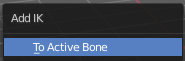

*********************************************************************
7.1.35 Editors - 3D View - Header - Armature -  Pose mode - Pose menu
*********************************************************************

.. contents:: Contents

Detailed Table of content
=========================

Pose Mode - Pose Menu
=====================

The Pose menu contains the tools to work with Armature objects in Pose mode. This means here you find all the tools that you need to pose and animate your armature.

Clear Transform
===============

Clear Transform
---------------

Clear transform is a menu with some Clear functionality. You need to have the bones selected where you want to perform the operation. Unselected bones will not be calculated.

All
---

Resets location, rotation and scale back to the Rest pose.

Clear User Transforms
---------------------

Resets Pose of selected bones back to keyframe state.

Location
--------

Resets location back to the Rest pose.

Rotation
--------

Resets rotation back to the Rest pose.

Scale
-----

Resets scale back to the Rest pose.

Reset Unkeyed
-------------

Resets the pose for the selected bones back to the state of the latest keyframe.

Last Operator Clear User Transforms
-----------------------------------

Only Selected
-------------

Clear User transform for selected armature part, or for the whole armature.

Apply
=====

Apply is a menu with some Apply functionality.

Apply Pose as Rest Pose
-----------------------

You need a rest pose where you can reset the pose back to. With this tool you can set the current pose to be the new Rest pose.

Apply Selected as Rest Pose
---------------------------

You need a rest pose where you can reset the pose back to. With this tool you can set the current pose of the selected bones to be the new Rest pose.

Last Operator Apply Pose as Rest Pose
-------------------------------------

Selected only
-------------

Just apply the pose to the selected part.

Apply Visual Transform to Pose
------------------------------

Apply final constrained position of posed bones to their transform. 

Assign Custom Property Values as Default
----------------------------------------

Assigns the current values of custom properties as their defaults. This allows to use them as part of the rest pose state in nLA track mixing.

Last Operator Assign Custom Property Values as Default
------------------------------------------------------

Process data properties
-----------------------

Include the process data properties.

Process bone properties
-----------------------

Include the process bone properties.

Snap
====

.. image:: graphics/7.1.35_Editors_-_3D_View_-_Header_-_Armature_-__Pose_mode_-_Pose_menu/10000201000000DD000000B2EBA6A7D76926CCBF.png

Here you can choose several methods to snap one element to another. The menu items should be self explaining.

Last Operator Snap
------------------

Some snap operations shows a last operation panel, some not.

.. image:: graphics/7.1.35_Editors_-_3D_View_-_Header_-_Armature_-__Pose_mode_-_Pose_menu/10000201000001190000003B7E6A699CC42AE3C5.png

Offset
------

If the selection should snap as a whole, or if each individual element of the selection should snap.

Animation
=========

Animation is a sub menu around animation functionality. You need to have an object in the scene. 

Insert Keyframe
---------------

Opens a menu where you can insert a keyframe with a defined keying set.

Delete Keyframes
----------------

Deletes keyframes at the current frame.

Clear Keyframes
---------------

Deletes all keyframes.

Change Keying Set
-----------------

Opens a menu where you can change the keying set.

In-Betweens
===========

In Between
----------

In Between are tools to influence the look of the pose between the keyframes.

For example, record a keyframe at frame 1, then record a keyframe at frame 20. Then go to frame 10, and activate one of the tools. Now you can play around with the settings. And when you are satisfied with the result then you can record a keyframe at this position.

Header values
-------------

When you activate one of the tools, then you will see a percentage value in the header. And some hotkeys. The hotkeys W, E and R stands for the usual transform modes move, rotate or scale. Hotkey B stands for Bendy Bones. And C is for a custom property. This hotkeys are hard coded, and cannot be changed in the input manager.

Push Pose from Rest Pose
------------------------

Exxagerrates the current pose. Pushes the current pose further away from the rest pose.

Last Operator Push Pose from Rest Pose
--------------------------------------

Percentage
----------

The percentage of exxageration.

Previous Keyframe
-----------------

The keyframe position before the current frame.

Next Keyframe
-------------

The keyframe position after the current frame.

Channels
--------

Here you can limit the push effect to specific channels.

Axis Lock
---------

Here you can limit the push effect to specific axis.

Relax Pose to Rest Pose
-----------------------

Relaxes the current pose towards the Rest pose.

Last Operator Relax Pose to Rest Pose
-------------------------------------

Percentage
----------

The percentage of relaxing. 

Previous Keyframe
-----------------

The keyframe position before the current frame.

Next Keyframe
-------------

The keyframe position after the current frame.

Channels
--------

Here you can limit the relax effect to specific channels.

Axis Lock
---------

Here you can limit the relax effect to specific axis.

Push Pose from Breakdown
------------------------

Exxagerrates the current pose. Pushes the current pose further away from the previous pose.

Last Operator Push Pose
-----------------------

Percentage
----------

The percentage of exxageration.

Previous Keyframe
-----------------

The keyframe position before the current frame.

Next Keyframe
-------------

The keyframe position after the current frame.

Channels
--------

Here you can limit the push effect to specific channels.

Axis Lock
---------

Here you can limit the push effect to specific axis.

Relax Pose to Breakdown
-----------------------

Relaxes the current pose.

Last Operator Relax Pose toBreakdown
------------------------------------

Percentage
----------

The percentage of relaxing. 

Previous Keyframe
-----------------

The keyframe position before the current frame.

Next Keyframe
-------------

The keyframe position after the current frame.

Channels
--------

Here you can limit the relax effect to specific channels.

Axis Lock
---------

Here you can limit the relax effect to specific axis.

Breakdowner
-----------

Creates a suitable breakdowner pose on the current frame.

Last Operator Pose Breakdowner
------------------------------

Percentage
----------

The percentage of exxageration. 

Previous Keyframe
-----------------

The keyframe position before the current frame.

Next Keyframe
-------------

The keyframe position after the current frame.

Channels
--------

Here you can limit the breakdowner pose to specific channels.

Axis Lock
---------

Here you can limit the breakdowner pose to specific axis.

Propagate
=========

The Propagate tool automates the process of copying and pasting between keyframes. It copies the pose of the selected bones on the current frame over to the keyframes by the chosen Termination mode in the Last Operator Propagate Pose.

The different Propagate methods can be adjustetd in the Last operator too. Here you will find even more methods. The menu just lists the common ones.

The methods are quite self explaining, but are explained in the last operator section.

Usage example with Termination mode "On Selected Keyframes".

Create a little armature.Set a keyframe at frame 0.Set a keyframe at frame 20.Pose frame 20.Set a keyframe at frame 40. It will most probably be identical with Frame 20. Now select those Keyframes at position 40 in the Dope Sheet Editor. Set position to Frame 0.Press Propagate, and in the Last operator Propagate Pose choose On Selected Keyframes. The selected keyframes at frame 40 will now turn into the corresponding keyframes from position 0.

Last Operator Propagate Pose
----------------------------

Terminate Mode 
---------------

A dropdown box where you can choose between different termination modes for Propagate.

While Held 
-----------

While held it tries to guess when to stop propagating by examining the pauses in the animation curves per control (This means all F-Curves for a bone instead of per F-Curve). 

To Next Keyframe 
-----------------

Copies the pose to the first keyframe after the current frame. 

To Last Keyframe 
-----------------

Replaces the last keyframe.

Before Frame 
-------------

Copies to all keyframes between current frame and the **End frame** option. 

Before Last Keyframe 
---------------------

To all keyframes from current frame until no more are found. 

On Selected Keyframes 
----------------------

Applies the pose of the selected bones to all selected keyframes. 

On Selected Markers 
--------------------

Copies to all keyframes on frames with Scene Markers after the current frame. 

End Frame
---------

Defines the end frame for the Propagate.

Single Operators
================

Copy 
-----

Copies the current pose. You copy what you have selected.

Paste
-----

Pastes a previous copied pose.

Paste Flipped
-------------

Pastes a previous copied pose, but flipped along X axis. 

Last Operator Paste Pose
------------------------

Flipped on X Axis
-----------------

Paste the pose flipped along X Axis.

On Selected Only
----------------

Paste just on the selected bones. Not on the unselected.

Pose Library
------------

The content of this menu belongs to the Pose library. Which can be found in the Properties editor.

Browse Poses
------------

With this feature you can browse through the available poses in the 3D view. While operation you will see informations in the header. It shows you what the current pose is, and how to navigate to the next or previous pose.

Note that you need to have the bones selected for which you want to display the poses. When in doubt, select all bones.

Last Operator Pose lib Browse Poses
-----------------------------------

Pose
----

Here you can scroll through the poses.

Add Pose
--------

Here you can add a new pose for your armature to the pose library.

Note that you need to have the bones selected for which you want to add the pose. It just records the pose for the selected bones.

Calling the tool opens a popup where you can choose how you want to add the current pose.

Add New
-------

Adds a new pose.

Add New (Current Frame)
-----------------------

Adds a new pose at the current frame. It does NOT record a keyframe.

Replace Existing
----------------

Here you can replace an existing pose.

Last Operator Pose Lib Add Pose
-------------------------------

Frame
-----

The frame at which this pose should be created

Pose Name
---------

Here you can rename the pose while creation.

Rename Pose
-----------

Here you can rename a pose. It opens a popup menu where you can choose the pose to rename, and where you can rename it. One pose at a time.

Last Operator Pose Lib Rename Pose
----------------------------------

New Pose Name
-------------

Here you can enter the new pose name.

Pose
----

Here you can choose the pose that you want to rename.

Remove Pose
-----------

Removes the currently active pose. The tool opens a popup where you can choose the pose to remove.

Last Operator Pose Lib Remove Pose
----------------------------------

Pose
----

Here you can again choose which pose to remove.

Attention! This dialog is bugged. When you have two animations in the library and remove one, then the box shows empty. When you now switch to the other pose here, then you remove both poses. There is no way back, since you can't select the previous pose anymore.

Motion Paths
------------

Objects can be animated. Let's say you send them from a to b to c. The object will move to b, then to c. Some kind of a path. This path is not visible by default. 

With motion paths you can calculate this path, and make it visible.

Calculate 
----------

Calculates the motion path of the selected object. It opens a panel where you can define the start and end frame of the calculation.

Last Operator Calculate Object Path
-----------------------------------

Start 
------

Defines the start frame of the calculation.

End 
----

Defines the end frame of the calculation.

Bake Location
-------------

Where to draw the curve. At the head or at the tail of the bone(s)

Clear
-----

Clear remove the motion path from the object.

Bone Groups
-----------

Bone Groups is a menu to handle bone group functionality from within a menu in the 3D view. The bone groups themselves can be found in the Properties editor.

Assign to New Group
-------------------

Assigns the selected bone(s) to a new group.

Assign to Group
---------------

Assigns the selected bone(s) to a existing group.

Last operator Add Selected to Bone Group
----------------------------------------

This last operator belongs to both tools. Assign to New Group, and Assign to Group.

Bone Group Index
----------------

Here you can adjust the Bone Group Index. An Index of 0 creates a new bone group. Higher values tries to assign the bone to existing bone groups instead. 

Remove selected from Bone Groups
--------------------------------

Removes the selected bone(s) from the assigned bone groups.

Remove Bone Group
-----------------

Removes the currently active bone group.

Parent
------

Parenting the skin or other armatures happens in Object mode. You can also parent in Pose Mode. It just does not make much sense since you need to enter Object mode for one of the objects anyways. The only somehow relevant settings in the parenting menu here is clear parent. But even this is better done in Object Mode.

The parenting menu is already explained in the Object menu in Object mode. So we won't repeat the whole description here.

Inverse Kinematics
------------------

Inverse Kinematics is a menu with two isolated items from the whole bone constraints menu. The Inverse Kinematics. You could also add an Inverse Kinematics bone constraint by the Constraints / Add (With Targets) menu item from above. It is in the list. But this menu allows quick access without big search.

Add IK to Bone
--------------

Add IK to boneadds an IK bone constraint to the selected bone. When you add an IK constraints with just the bone selected, then it adds an empty as a handler too, and fills it in as a target.

Add IK calls a popup. When you have just one bone selected then you can choose between adding an empty as the target or to create the bone constraint without target.

When you have more than one bone selected then you can just add the constraint to the active bone.

You can define a own target object too. The armature needs to be in pose mode. Let's create a cube or another primitive. Select it. Now hold down Shift, and click at the bone where you want to add the constraint too. Then choose Add (with Targets), and choose your constraint method. The cube will now be chosen as the target object.

Last Operator Add IK to Bone
----------------------------

With Targets
------------

Here you can define if you want to add the IK constraints with or without a target.

Remove IK
---------

Removes all IK bone constraint(s) at the selected bone(s).

Constraints
-----------

Constraints is a menu that contains some tools around constraints.

Add (With Targets)
------------------

Add (With Targets) calls the Constraints menu where you can choose the constraint that you want to add. When you add an IK constraints with just the bone selected, then it adds an empty as a handler too, and fills it in as a target. Which is similar to what you can do with the Add IK to Bone from the IK menu. 

But you can add more than just the IK constraint. It is the same menu that you can open by clicking at the Add Bone Constraint dropdown menu in the Properties editor.

You can define a own target object too. The armature needs to be in pose mode. Let's create a cube or another primitive. Select it. Now hold down Shift, and click at the bone where you want to add the constraint too. Then choose Add (with Targets), and choose your constraint method. The cube will now be chosen as the target object.

Copy Constraints to selected Bones
----------------------------------

Copies the constraints with all its settings to the selected bone. 

Usage:

Select the bone where you want to copy the constraints to. Hold down shift, then select the bone that contains the constraints. Then perform the tool. The constraints will be copied.

Clear Pose Constraints
----------------------

Removes all bone constraints modifiers from the bone.

AutoName Left/Right
-------------------

This tool automatically adds a suffix to all selected bones, based on their local position relative to the armature center.

Bones with a positive X Coordinate will receive a .L suffix. Bones with a negative X coordinate will receive a .R suffix.

AutoName Front/Back
-------------------

This tool automatically adds a suffix to all selected bones, based on their local position relative to the armature center.

Bones with a positive Y Coordinate will receive a .Fr suffix. Bones with a negative Y coordinate will receive a .Bk suffix.

AutoName Top/Bottom
-------------------

This tool automatically adds a suffix to all selected bones, based on their local position relative to the armature center.

Bones with a positive Z Coordinate will receive a .Top suffix. Bones with a negative Z coordinate will receive a .Bot suffix.

Flip Names
----------

This tool requires to follow some name conventions. If there is a lower or upper case “L”, “R”, “left” or “right” with a separating dotin the bone name, then this tool renames the names of the selected bones to its counterpart. Bone.L becomes Bone.R. 

This tool is useful when you mirror parts of the armature, and don't want to rename all the bones one by one.

Flip Quats
----------

This feature flips the quaternion rotation values of the currently selected bone(s). Positive values becomes negative, and negative values becomes positive.

Change Armature Layers
----------------------

Armature and bones has its own layer system. This menu item opens a popup where you can put the whole armature onto another layer.

Last Operator Change Armature Layers
------------------------------------

Layer
-----

Here you can again put the armature onto another layer.

Change Bone Layers
------------------

Armature and bones has its own layer system. This menu item opens a popup where you can put single selected bone(s) onto another layer.

Last Operator Change Bone Layers
--------------------------------

Layer
-----

Here you can again put the selected bones onto another layer.

Show/Hide
---------

Here you can show or hide the selected geometry

Show Hidden
-----------

Makes all hidden geometry visible again.

Hide Selected
-------------

Hides the selected geometry.

Hide Unselected
---------------

Hides the not selected geometry. The selected geometry stays visible.

Bone Settings
-------------

Bone Settings is a menu with menu items to toggle special checkboxes in the Properties editor. But here you can do it for a selection too, and not just one object.

Last Operator Collection Boolean Set
------------------------------------

Each of the menu items uses the same Last Operator. With different strings for the booleans.

