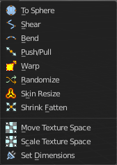
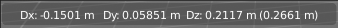
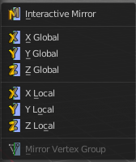

**********************************************************************
7.1.36 Editors - 3D View - Header - Lattice - Edit mode - Lattice menu
**********************************************************************

.. contents:: Contents

Detailed Table of content
=========================

Edit Mode - Lattice Menu
========================

In Edit Mode you will also see a add menu for some object types. The number of objects that you can add is limited to the same object type that you are in edit mode with. You can just add mesh geometry to a mesh geometry. And just curve geometry to curve geometry.

The added objects in edit mode becomes part of the current object geometry.

Transform
=========

To Sphere
---------

Shapes a selection of objects into the shape of a sphere. The calculation happens with the object origins.

In Object mode this tools requires to have more than one object selected. 

Usage
-----

Select the vertices, activate the tool, then drag the mouse in the 3D viewport. In the header you will read the current factor then. Which tells you how close you are towards the sphere shape.

.. image:: graphics/7.1.36_Editors_-_3D_View_-_Header_-_Lattice_-_Edit_mode_-_Lattice_menu/10000201000000920000002B567D115A122ADB2E.png

.. image:: graphics/7.1.36_Editors_-_3D_View_-_Header_-_Lattice_-_Edit_mode_-_Lattice_menu/10000201000000C2000000D566799059F4AA0E74.png

Last Operator To Sphere Panel
-----------------------------

Factor
------

The factor to transform the selection into a shape form.

Proportional editing
--------------------

Enables proportional editing. Activating proportional editing reveals further settings.

Proportional Falloff
--------------------

Here you can adjust the falloff methods.

Proportional Size
-----------------

Here you can see and adjust the falloff radius.

Connected
---------

The proportional falloff gets calculated for connected parts only.

Projected(2D)
-------------

The proportional falloff gets calculated in the screen space. Depth doesn't play a role. When it's in the radius, then it gets calculated.

Shear
-----

Shear shears the selection.

Last Operator Shear
-------------------

Offset
------

Here you can adjust an offset.

Shear Axis
----------

The shear tool works along a imaginary 2d plane. The shear axis controls if the itemas are sheared along the x or the y axes of this plane. This is the plane along which the transformation happens. You can shear along the x or the y axis of this plane.

To make things even more complicated, the orientation of this imaginary plane is defined by the Axis and Axis Ortho items below.

Axis
----

Defines one axis of the imaginary shear axis plane.

Axis Ortho
----------

Defines the other axis of the imaginary shear axis plane.

Orientation
-----------

Here you can choose the orientation for the shear action.

Proportional editing
--------------------

Enables proportional editing. Activating proportional editing reveals further settings.

.. image:: graphics/7.1.36_Editors_-_3D_View_-_Header_-_Lattice_-_Edit_mode_-_Lattice_menu/1000020100000119000000773CD5255E7E68F4C5.png

Proportional Falloff
--------------------

Here you can adjust the falloff methods.

Proportional Size
-----------------

Here you can see and adjust the falloff radius.

Connected
---------

The proportional falloff gets calculated for connected parts only.

Projected(2D)
-------------

The proportional falloff gets calculated in the screen space. Depth doesn't play a role. When it's in the radius, then it gets calculated.

Bend
----

Bends the selection.

Push/Pull
---------

It pushes or pulls the object positions relative to the center of the selection.

In Object mode this tool requires to have more than one object selected. 

Last Operator Push/Pull
-----------------------

Factor
------

Here you can adjust the strength of influence of the tool.

Proportional editing
--------------------

Enables proportional editing. Activating proportional editing reveals further settings.

Proportional Falloff
--------------------

Here you can adjust the falloff methods.

Proportional Size
-----------------

Here you can see and adjust the falloff radius.

Connected
---------

The proportional falloff gets calculated for connected parts only.

Projected(2D)
-------------

The proportional falloff gets calculated in the screen space. Depth doesn't play a role. When it's in the radius, then it gets calculated.

Warp
----

Warps a mesh selection between two defined points.

Last operator Warp
------------------

Warp Angle
----------

The strength of the warp effect

Offset Angle
------------

A offset angle to bend sidewards.

Min 
----

The start point.

Max
---

The end point.

Randomize Transform
-------------------

This tool allows randomizes the positions of the selected vertices. 

Last Operator Randomize Transform
---------------------------------

Amount
------

Here you can adjust the amount.

Uniform
-------

The uniform offset distance. 

Normal
------

Align the offset direction to the normals.

Random Seed
-----------

The seed value for randomization.

Move Texture Space
------------------

This tool relies at the move tool. With the difference that it moves the texture space instead of the object. It has also a very special use case, and just works with a material with a Texture Coordinate / Generated node. And requires to have the shading at Material or Rendered to see a result in the viewport.

In the viewport you will see the UV cage in black color. In the header you will see the values for the current position of the UV cage.

Note that once done and applied, there is no way to reset the UV cage back to zero. When you repeat the operation, then the values will start at 0 again. Even when the UV cage is already offset.

.. image:: graphics/7.1.36_Editors_-_3D_View_-_Header_-_Lattice_-_Edit_mode_-_Lattice_menu/100002010000028200000103C1990CAEB16A1527.png

Last Operator Translate
-----------------------

Move X, Y Z
-----------

Here you can limit the position relative to the source object.

Orientation
-----------

Orientation is a drop-down box where you can choose the type of orientation for the mirroring action.

Proportional editing
--------------------

Enables proportional editing. Activating proportional editing reveals further settings.

Proportional Falloff
--------------------

Here you can adjust the falloff methods.

Proportional Size
-----------------

Here you can see and adjust the falloff radius.

Connected
---------

The proportional falloff gets calculated for connected parts only.

Projected(2D)
-------------

The proportional falloff gets calculated in the screen space. Depth doesn't play a role. When it's in the radius, then it gets calculated.

Scale Texture Space
-------------------

This tool relies at the scale tool. With the difference that it scales the texture space instead of the object. It has also a very special use case, and just works with a material with a Texture Coordinate / Generated node. And requires to have the shading at Material or Rendered to see a result in the viewport.

In the viewport you will see the UV cage in black color. In the header you will see the values for the current position of the UV cage.

Note that once done and applied, there is no way to reset the UV cage back to zero. When you repeat the operation, then the values will start at 0 again. Even when the UV cage is already offset.

.. image:: graphics/7.1.36_Editors_-_3D_View_-_Header_-_Lattice_-_Edit_mode_-_Lattice_menu/10000201000003E1000001989B188B3DC790D0A9.png

Last Operator Resize Texture
----------------------------

Move X, Y Z
-----------

Here you can limit the position relative to the source object.

Orientation
-----------

Orientation is a drop-down box where you can choose the type of orientation for the mirroring action.

Proportional editing
--------------------

Enables proportional editing. Activating proportional editing reveals further settings.

Proportional Falloff
--------------------

Here you can adjust the falloff methods.

Proportional Size
-----------------

Here you can see and adjust the falloff radius.

Connected
---------

The proportional falloff gets calculated for connected parts only.

Projected(2D)
-------------

The proportional falloff gets calculated in the screen space. Depth doesn't play a role. When it's in the radius, then it gets calculated.

Set Dimensions
--------------

Edit Mode Only!

Normally all scale operations in Bforartists are relative to the current selection and dimensions. And you always start with a relative value of 1.

Set dimensions allows to scale mesh selections in absolute world values. No matter how the initial values are. The new values gets set in the Last Operator.

Set dimensions is an add-on. You can turn it off in the add-ons section of the user preferences when you want.

Last Operator Set Dimensions
----------------------------

New Dimensions
--------------

When you activate the tool then you will see the world coordinates of the selection. Here you can change the values to other world coordinates.

Mirror
======

Mirror mirrors the selected geometry along the defined axis. 

Interactive Mirror
------------------

Mirror by hotkeys. You activate the tool, type in x for x global for example, or x x for x local. And the selection gets mirrored

X Global, Y Global etc.
-----------------------

Mirrors the selection around the chosen axis.

Last Operator Mirror
--------------------

The Last Operator Mirror panel gives you tools to adjust the mirror action.

.. image:: graphics/7.1.36_Editors_-_3D_View_-_Header_-_Lattice_-_Edit_mode_-_Lattice_menu/100002010000011A000000A70C62EB24315CDC77.png

Orientation 
------------

Orientation is a drop-down box where you can choose the type of orientation for the mirroring action.

Constraint Axis
---------------

Constraint Axis gives you again the possibility to define the mirror axis. You can choose morethan one axis here.

Proportional editing
--------------------

Enables proportional editing. Activating proportional editing reveals further settings.

Proportional Falloff
--------------------

Here you can adjust the falloff methods.

Proportional Size
-----------------

Here you can see and adjust the falloff radius.

Connected
---------

The proportional falloff gets calculated for connected parts only.

Projected(2D)
-------------

The proportional falloff gets calculated in the screen space. Depth doesn't play a role. When it's in the radius, then it gets calculated.

Snap
====

.. image:: graphics/7.1.36_Editors_-_3D_View_-_Header_-_Lattice_-_Edit_mode_-_Lattice_menu/10000201000000DD000000B2EBA6A7D76926CCBF.png

Here you can choose several methods to snap one element to another. The menu items should be self explaining.

Last Operator Snap
------------------

Some snap operations shows a last operation panel, some not.

.. image:: graphics/7.1.36_Editors_-_3D_View_-_Header_-_Lattice_-_Edit_mode_-_Lattice_menu/10000201000001190000003B7E6A699CC42AE3C5.png

Offset
------

If the selection should snap as a whole, or if each individual element of the selection should snap.

Flip
====

Here you can flip the lattice object along the world axis X, Y or Z .

Last Operator Flip (Distortion Free)
------------------------------------

Flip Axis
---------

Here you can again flip the lattice object along the world axis X, Y or Z .

Single Operators
================

Make Regular
------------

Set the UVW controlpoints by a uniform distance apart.

Hooks
-----

Hooks is a menu with tools around the hook modifier. You could also adjust the hook modifier from the Properties editor. But the menu items are more accessible.

You need to have at least one vertice of the lattice object selected.

When there is no hook modifier at the mesh then you just see three menu items. When there is minimum one hook modifier applied, then you will see an extended menu.

Hook to New Object 
-------------------

Creates a new Hook Modifier for the active object and assigns it to the selected vertices. It also creates an empty at the center of those vertices, which are hooked to it.

Hook to Selected Object 
------------------------

Does the same as **Hook to New Object**, but instead of hooking the vertices to a new empty, it hooks them to the selected object (if it exists). There should be only one selected object (besides the mesh being edited). 

Last Operator Hook to Selected Object
-------------------------------------

Active Bone
-----------

Hook to the object(s) of the active bone.

Hook to Selected Object Bone 
-----------------------------

Does the same as **Hook to New Object****. B**ut it sets the last selected bone in the also selected armature as a target.

Assign to Hook 
---------------

Here you can assign the selected vertices to the chosen hook modifier. Existing hooks gets overwritten. One vertex can be assigned to more than one hook. 

Remove Hook 
------------

Removes the chosen Hook Modifierfrom the object.

Select Hook 
------------

Selects all vertices assigned to the chosen Hook Modifier.

Reset Hook 
-----------

Resets the chosen Hook Modifier.

Recenter Hook 
--------------

**Recenter** the Hook Modifier.

Make Vertex Parent
------------------

Parents an object to the selected vertice(s)

In Object mode select the object that you want to parent to a vertex. Shift select the Lattice object so that both are selected. Enter Edit mode. Then select one vertex for a single point. Or three for an area. Then click the Make Vertex Parent button to make the relation.

