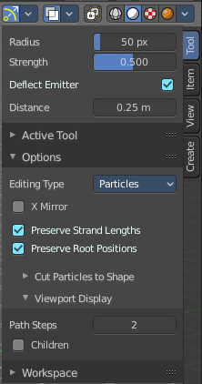
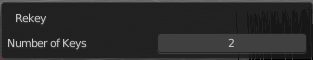
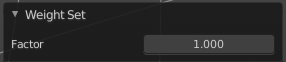

****************************************************************************
7.1.37 Editors - 3D View - Header - Particle - Particle mode - Particle menu
****************************************************************************

.. contents:: Contents

Particle Mode - Particle Menu
=============================

Mirror
------

Mirrors the selected particles.

If you want a symmetrical haircut, first select all particles, then mirror the particles, then tick X Mirror in the Particle panel.

Remove Doubles
--------------

Remove double vertices that are very close to each other. This can for example happen when you mirror the particles.

Unify Length
------------

Unifies the length of the selected hair particles. The length is calculated by the average length of the selection.

Rekey
-----

You need to have some hair particles selected.

Rekey changes the number of keys for the selected particles, including root and tip keys. This tool brings up a popup where you can adjust the number of keys. Two means you have only a root and a tip key. Everything more subdivides the selected hair particle with more keys.

Weight Set
----------

Here you can manually set a weight for the selected keys to interpolate between the current key weight and the brushes weight.

Last Operator Weight Set
------------------------

Factor
------

The strength of the keys weighting.

Delete
------

Delete either the whole particle, or just the selected key of the particle.

Show/Hide
---------

Here you can show or hide the selected geometry

Show Hidden
-----------

Makes all hidden geometry visible again.

Hide Selected
-------------

Hides the selected geometry.

Hide Unselected
---------------

Hides the not selected geometry. The selected geometry stays visible.

Brush Radius
------------

Adjust the brush radius.This is a hotkey tool, and should be performed in the viewport.

Brush Strength
--------------

Adjust the brush strength.This is a hotkey tool, and should be performed in the viewport.

