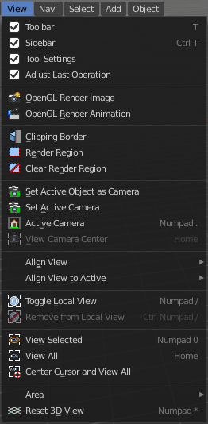
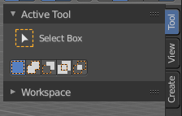
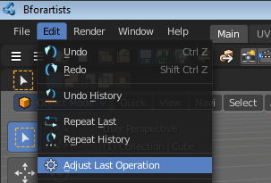
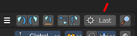
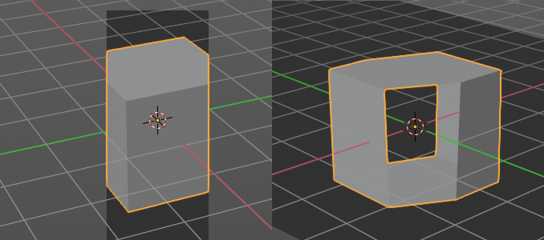
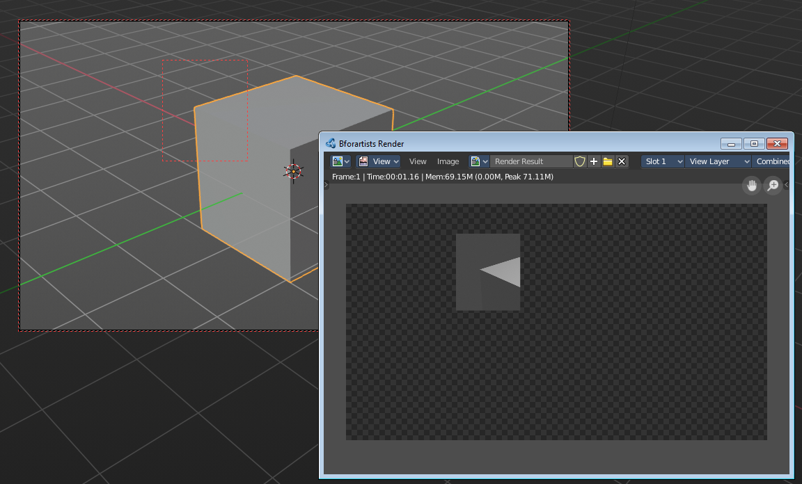
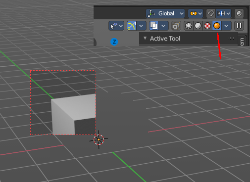
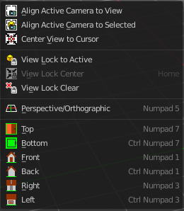

********************************************
7.1.3 Editors - 3D View - Header - View Menu
********************************************

.. contents:: Contents

View Menu
=========

The View menu contains all View related tools. The range goes from tools to maximize the current window across align view tools up to rendering related tools for the viewport like Render Border.

Toolbar
-------

Shows or hides the toolbar at the left in the 3D view.

Sidebar
-------

Shows or hides the sidebar at the right in the 3D view.

Tool Settings
-------------

Shows or hides the tool settings above the header in the 3D view.

Adjust Last Operation
---------------------

Shows or hides the Adjust Last Operation panel down left in the 3D view.

Note that the Adjust Last Operation panel can also be called from the edit menu at the top. And from the toolbar at the right. Here you can also add a hotkey to call it with a hotkey.

OpenGL Render Animation
-----------------------

Renders an animation, using the Viewport OpenGL renderer. This can be useful for preview renderings. 

.. Note:: Note that this menu item is a double menu entry. The same menu item exists in the Render menu in the Info Header. But this is required when you work with more than one 3D view. When you use the entry in the Render menu, then it picks an arbitrary 3D view. When you use the menu entry in the 3D view, then it renders from this 3D view. 

OpenGL Render Image
-------------------

Renders an Image, using the Viewport OpenGL renderer. This can be useful for preview renderings. 

.. Note:: Note that this menu item is a double menu entry. The same menu item exists in the Render menu in the Info Header. But this is required when you work with more than one 3D view. When you use the entry in the Render menu, then it picks an arbitrary 3D view. When you use the menu entry in the 3D view, then it renders from this 3D view. 

Clipping Border
---------------

With clipping you can draw a rectangle that excludes the display of everything outside of this rectangle. That way you can look inside the geometry when you rotate the viewport. To clear the clipping use the tool again. It is a toggle.

Render Region
-------------

With the Render Region tool you can drag a rectangle at the viewport to define a portion of the screen to render. The benefit here is to have much faster preview renderings. You just render what you want to judge, and not the whole image.

It has two use cases. The one is with the rendering through the camera. Just what is marked gets rendered. The other is directly in the viewport, with the Viewport shading method Rendered. Render border works with all renderers.

You can have both render border cases active at the same time. When you remove it then just the render border from the current case gets deleted. Either you are in camera view, or you are in viewport view.

Clear Render Region
-------------------

Removes the Render Region rectangle from the viewport.

Set Active Object as Camera
---------------------------

With this tool you can set any object to be the active camera where you render from.

Active Camera
-------------

Switches to Camera view and back to Viewport Camera.

View Camera Center
------------------

This tool is of use when you are in camera view. Else it is greyed out and inactive. There is a grey passepartout around the camera view. It can be that this passepartout does not fit into the viewport. It can be too big or too small. And so you might want to zoom out or in.

Normally when you are in camera view, then you zoom in or out the view with the zoom tool. Not this passepartout. But with lock camera off you can zoom the passepartout to reach geometry that is not in the camera view.

The other way is View Camera Center. It fits the camera view into the viewport.

Align View
----------

Align View is a menu where you can choose between different view align methods. The view gets aligned at the world coordinates. Here we also find a few more align methods.

Align Active Camera to View
---------------------------

Aligns the active camera to the current view. This means you can navigate with the viewport camera, select the render camera, and align it with this tool, so that the render camera has the same position and angle than the viewport camera.

Align Active Camera to Selected
-------------------------------

Aligns the active camera to the current selected object. This means you can navigate with the viewport camera, select the render camera, and align it with this tool, so that the render camera has the same position and angle than the selected object.

Center View to Cursor
---------------------

Centers the view at the 3D cursor position. 

View Lock to Active
-------------------

Locks the view to the currently active object.

View Lock Center
----------------

Centres the view to the currently active and locked object. This tool is just active when you have performed a View Lock to Active before.

View Lock Clear
---------------

Removes the View Lock to Active from the object.

Perspective/Orthographic
------------------------

Toggles between perspectivic and orthographic view in the 3D viewport. Perspectivic view acts like a real camera with the perspectivic distortions. Orthographic view acts like a mathematical display of an object, without distortions.

Top, Bottom, etc.
-----------------

Switches to Top view, Bottom View, etc.

Align View to Active
--------------------

Align View to Active is a menu where you can choose between different view align methods. The view gets aligned relative to the rotation of the currently active object. Not in World coordinates. The menu items should be self explaining. So we won't list them one by one.

Toggle Local View
-----------------

Toggle Local View zooms in or out until the Selection is displayed fitting in the viewport. And hides all other objects but the Selection.

Remove from local View
----------------------

It can be that you select more than one object, and switch to local view. Then you decide that one of the objects is in the way. With remove from local view you can remove this object without to leave the local view.

This menu item is greyed out when you are not in local view.

View Selected
-------------

View Selected zooms in or out in the 3d viewport until the Selection is displayed fitting in the viewport.

View All
--------

View all zooms in or out in the 3d viewport until all objects in the scene are displayed fitting in the viewport.

Center Cursor and View All
--------------------------

Center Cursor and View all centers the 3D Cursor at 0/0/0, and zooms in or outin the 3d viewport until all objects in the scene are displayed fitting in the viewport.

Area
----

This menu contains general view functionality. And exists in most other editor types too.

Toggle Quad view
----------------

Displays the 3D View divided into four split screen parts. Note that the orthographic views cannot be switched in this mode. They remain ortographic, you cannot rotate them.

To return to single view reuse the menu item in the View menu.

Horizontal Split
----------------

Splits the current view horizontally into two independant editor windows.

Vertical Split
--------------

Splits the current view vertically into two independant editor windows.

Duplicate Area into New Window
------------------------------

Duplicate Area into New Window makes the selected editor window floating. You can then drag it around at the monitor. It is not connected with the rest of the UI anymore.

A separated window cannot be merged into the main window again. You have to close it when not longer needed.

Toggle Maximize Area
--------------------

Displays the editor maximized with menus.

To return from the maximized view press hotkey ctrl + spacebar. Or reuse the menu item in the area menu.

Toggle Full screen Area
-----------------------

Displays the editor maximized without menus.

To return from the full screen view press hotkey ctrl + alt + spacebar.

Reset 3D View
-------------

Resets the 3D view to the defaults.

Note that this is an addon, and can be turned off in the addons section of the preferences.

