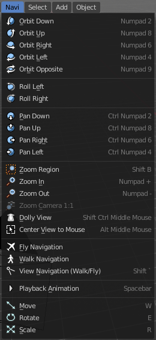
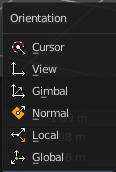

**************************************************
7.1.4 Editors - 3D View - Header - Navigation Menu
**************************************************

.. contents:: Contents

All Modes - Navigation Menu
===========================

The Navigation menu provides you with all tools around viewport navigation. It is available in all modes.

Orbit Down
----------

Orbits downwards.

Orbit Up 
---------

Orbits upwards.

Orbit Right
-----------

Orbits to the right.

Orbit Left
----------

Orbits to the left.

Orbit Opposite
--------------

Rotates the view by 180 degree.

Roll Left
---------

Rolls the viewport counter clockwise.

Roll Right
----------

Rolls the viewport clockwise.

Pan Down
--------

Pans the viewpoint downwards. The scene moves up.

Pan Up
------

Pans the viewpoint upwards. The scene moves down.

Pan Right
---------

Pans the viewpoint to the right. The scene moves to the left.

Pan Left
--------

Pans the viewpoint to the left. The scene moves to the right.

Zoom Region
-----------

Draws a rectangle and zooms then to fit the size of this rectangle.

Zooming in is done with drawing the rectangle with left mouse button. Zooming out is done with drawing the rectangle with middle mouse button.

Zoom In
-------

Zooms into the viewport. Works also in camera view.

Zoom Out
--------

Zooms out of the viewport. Works also in camera view.

Zoom Camera 1:1
---------------

Zooms the camera fitting to match the render output size by factor 1:1

Dolly View
----------

Dolly View is a special zoom mode. 

Be careful with this navigation method, you can easily trap yourself to not zoom able anymore!

Center View to Mouse
--------------------

Centers the view to the current mouse position.

Fly Navigation
--------------

Switches to Fly navigation. In this view mode the camera acts like an air plane. Right click leaves the fly mode.

Walk Navigation
---------------

Switches to Walk Navigation. In this view mode the camera acts like a player in a first person shooter. Gravity will pull you down, The ground grid is the ground. And you can move around with wasd keys. Right click leaves the walk mode.

View Navigation
---------------

Switches to View Navigation Mode. In this view mode the view gets rotated moved and scaled from the Camera view point. Right Click leaves the view mode.

Playback Animation
------------------

Plays back an existing animation.

Move
----

Moves the selected object in the viewport by moving the mouse.

Last Operator Move
------------------

Move X , Y, Z
-------------

Here you can adjust the position values for the three values

Orientation
-----------

Orientation is a drop-down box where you can choose the type of orientation for the transform action.

Proportional Editing
--------------------

When you turn on proportional editing then further settings appears.

Proportional Editing is a drop-down box where you can choose to use proportional editing. When you choose one of the active methods then the neighbour geometry gets influenced by Shrink/Fatten too in a proportional way.

Proportional Falloff
--------------------

Proportional Editing Falloff is a drop-down box where you can choose a method for the falloff for the proportional editing.

Proportional Size
-----------------

Proportional size is a edit box where you can adjust the strength of the Proportional falloff.

Connected
---------

Just edit geometry that is directly connected with the current selection.

Projected ( 2D)
---------------

Edit geometry that is in 2d space aligned with the current selection. This one goes from the current view in depth direction.

Rotate
------

Rotates the selected object in the viewport by moving the mouse.

Last Operator Rotate
--------------------

Angle
-----

Here you can adjust the rotation angle.

Axis
----

Around which axis to rotate. X, Y or Z.

Orientation
-----------

Orientation is a drop-down box where you can choose the type of orientation for the mirroring action.

Proportional Editing
--------------------

When you turn on proportional editing then further settings appears.

Proportional Editing is a drop-down box where you can choose to use proportional editing. When you choose one of the active methods then the neighbour geometry gets influenced by Shrink/Fatten too in a proportional way.

Proportional Falloff
--------------------

Proportional Editing Falloff is a drop-down box where you can choose a method for the falloff for the proportional editing.

Proportional Size
-----------------

Proportional size is a edit box where you can adjust the strength of the Proportional falloff.

Connected
---------

Just edit geometry that is directly connected with the current selection.

Projected ( 2D)
---------------

Edit geometry that is in 2d space aligned with the current selection. This one goes from the current view in depth direction.

Scale
-----

Scales the selected object in the viewport by moving the mouse.

Last Operator Scale
-------------------

Scale X Y Z
-----------

Here you can adjust the position values for the three values

Orientation
-----------

Orientation is a drop-down box where you can choose the type of orientation for the mirroring action.

Proportional Editing
--------------------

When you turn on proportional editing then further settings appears.

Proportional Editing is a drop-down box where you can choose to use proportional editing. When you choose one of the active methods then the neighbour geometry gets influenced by Shrink/Fatten too in a proportional way.

Proportional Falloff
--------------------

Proportional Editing Falloff is a drop-down box where you can choose a method for the falloff for the proportional editing.

Proportional Size
-----------------

Proportional size is a edit box where you can adjust the strength of the Proportional falloff.

Connected
---------

Just edit geometry that is directly connected with the current selection.

Projected ( 2D)
---------------

Edit geometry that is in 2d space aligned with the current selection. This one goes from the current view in depth direction.

