**********************************************
7.1.5 Editors - 3D View - Header - Select Menu
**********************************************

.. contents:: Contents

Detailed Table of content
=========================

Select menu
===========

The Select menu provides you with all functionality around selecting. The content differs, dependant in which mode you are, and what object type you have selected. Some select functionality is very special for just one object type in one special mode. But not every mode has a select menu.

Object Mode - Select menu
=========================

The select menu in Object mode is for all object types equal. It provides you with several selection methods.

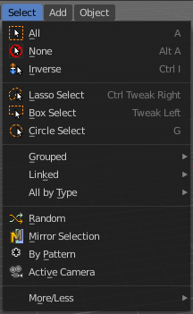

All 
----

Select everything.

None
----

Select nothing.

Inverse
-------

Invert the current selection.

Lasso Select
------------

Note that this select method works independant from the lasso select tool in the tool shelf. 

In this select mode you can select elements by dragging a form around what you want to select. And what's inside of the rectangle gets selected then. It adds to selection by default. 

To subtract from selection hold down Shift key. 

The selection gets applied when you release the mouse. You leave the mode automatically when you release the mouse.

Box Select
----------

Note that this select method works independant from the lasso select tool in the tool shelf. 

In this select mode you can select elements by dragging a rectangle. And what's inside of the rectangle gets selected then. It adds to selection by default. 

To subtract from selection hold down Shift key. 

The selection gets applied when you release the mouse. You leave the mode automatically when you release the mouse.

Circle Select
-------------

Circle select enters the Circle Select mode. This is a special select mode where you can select elements by moving with the mouse over it. It adds to selection by default. 

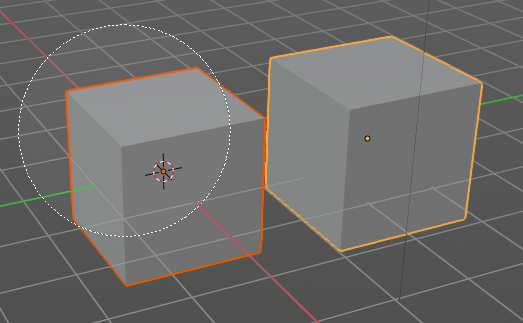

To subtract from selection hold down Shift key. To exit the Circle select click with the right mouse button.

The pencil radius of the circle select tool can be adjusted with the scroll wheel.

Grouped
-------

Here you can select different types of objects within the group. It requires to have a group selected.

The menu items are pretty self explaining. So we won't go into detail here.

Last Operator Select Grouped
----------------------------

Extend
------

Extends existing selection instead of deselecting everything first.

Type
----

Type is a drop-down list where you can choose the Linked type again.

Linked
------

Linked is a menu where you can select different types.

Here you can select all objects that shares a common data-block with the active object. **Select Linked** uses the active object as a basis to select all others. 

Object Data 
------------

Selects every object that is linked to the same Object Data.

Material 
---------

Selects every object that is linked to the same material data-block. 

Instanced Collection
--------------------

Selects every object that is linked to the instanced collection.

Particle System 
----------------

Selects all objects that use the same **Particle System**. 

Library 
--------

Selects all objects that are in the same Library.

Library (Object Data) 
----------------------

Selects all objects that are in the same Library and limited to **object data**. 

All by Type
-----------

Here you can select objects of a specific type.

The menu items are pretty self explaining. So we won't cover every single menu item here.

Last Operator Select By Type
----------------------------

Extend
------

With this option activated the selection does not clear before performing the selection operation, but extends. This means when you have a mesh object selected, and want to select all objects by type curve, then the mesh object is still selected. Without Extend just the curve objects are selected. The mesh object gets deselected.

Type
----

Type is a drop-down box where you can choose the object type to select again.

Random
------

Selects random objects.

Last Operator Select Random
---------------------------

Percent
-------

The Percentage of objects that should be selected randomly.

Random Seed
-----------

The Seed for the random number generator.

Action
------

Action is a drop-down box where you can choose if you want to select or to deselect random.

Mirror Selection
----------------

Select the mirrored parts of an object. For example for L.Sword it selects R.Sword.

Last Operator Select Mirror
---------------------------

Extend
------

Extends existing selection instead of deselecting everything first.

By Pattern
----------

Selects all objects whose name matches the entered string. For missing parts you need to add an asterix. 

For example, you have four cubes in the scene. Cube, Cube.001, Cube.002 and mycube3. Then the term " Cube " will just select the first cube. While the term " Cube\* " will select the first three. And " \*cube\* " will select all four.

Supported wild-cards: 

\* matches everything? matches any single character[abc] matches characters in “abc”[!abc] match any character not in “abc”

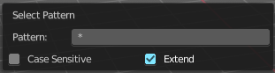

The tool operates immediately at entering the string.

Pattern
-------

Here you can type in your string.

Case Sensitive
--------------

When ticked then the string comparison happens by taking upper and lower letters into account.

Extend
------

Extends existing selection instead of deselecting everything first.

Last Operator Select Pattern
----------------------------

The Last Operator Select Pattern contains the same menu items than the pop-up. So see above. Also, it does not appear in the 3D view. But when you call it from the edit menu or with hotkey.

Active Camera 
--------------

Selects the active camera.

More/ Less
----------

More
----

More requires to have a parent or child relationship.It expands the selection.

Less
----

Less requires to have a parent or child relationship. It reduces the selection.

Parent
------

Parent requires to have a parent or child relationship. It selects the parent object of the currently selected object(s).

Child 
------

Child requires to have a parent or child relationship. It selects the child object(s) of the currently selected object(s).

Parent extended
---------------

Parent extended requires to have a parent or child relationship. It selects the parent object of the currently selected object(s). But keeps the active object in the selection, even when it's not currently selected.

Child Extended
--------------

Child Extended requires to have a parent or child relationship. It selects the child object(s) of the currently selected object(s). But keeps the active object in the selection, even when it's not currently selected.

Edit Mode - Mesh Menu
=====================

The select menu for a mesh object in Edit mode. 

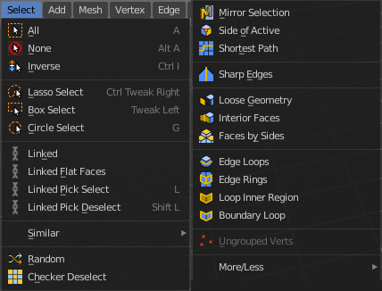

A few tools here acts different, dependant in which mesh select mode you are. For example, when you are in mesh select method vertices, then the Random operator picks random vertices. 

So you might want to check the mesh select mode when something does not work in an expected way.

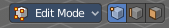

All 
----

Select everything.

None
----

Select nothing.

Inverse
-------

Invert the current selection.

Lasso Select
------------

Note that this select method works independant from the lasso select tool in the tool shelf. 

In this select mode you can select elements by dragging a form around what you want to select. And what's inside of the rectangle gets selected then. It adds to selection by default. 

To subtract from selection hold down Shift key. 

The selection gets applied when you release the mouse. You leave the mode automatically when you release the mouse.

Box Select
----------

Note that this select method works independant from the lasso select tool in the tool shelf. 

In this select mode you can select elements by dragging a rectangle. And what's inside of the rectangle gets selected then. It adds to selection by default. 

To subtract from selection hold down Shift key. 

The selection gets applied when you release the mouse. You leave the mode automatically when you release the mouse.

Circle Select
-------------

Circle select enters the Circle Select mode. This is a special select mode where you can select elements by moving with the mouse over it. It adds to selection by default. 

To subtract from selection hold down Shift key. To exit the Circle select click with the right mouse button.

The pencil radius of the circle select tool can be adjusted with the scroll wheel.

Linked
------

Select the geometry that is directly linked with the current geometry. You can for example have a mesh with several closed submeshes. Those submeshes are not linked together, but are part of the object.

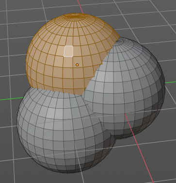

Last Operator Select Linked All
-------------------------------

Delimit
-------

Here you can add a limit to the selection. For example, just select up to the next seam.

Linked Flat Faces
-----------------

Select the geometry that is coplanar to the current selection. It works also in other selection modes, but you need to have face geometry selected.

Last Operator Select Linked Flat Faces
--------------------------------------

Here you can adjust the angle up to which a face counts as coplanar.

Linked Pick Select
------------------

Same as with Linked. But works with what is under the mouse cursor.

Linked Pick Deselect
--------------------

Same as with Linked. But works with what is under the mouse cursor. And deselects the selection.

Last Operator Select Linked
---------------------------

Deselect
--------

Select or deselect.

Delimit
-------

Here you can add a limit to the selection. For example, just select up to the next seam.

Similar 
--------

Here you can select geometry based on how similar certain properties are to it. The methods changes, dependant in which mesh selection mode you are. There is a pitfall with having more than one mesh selection method selected. Then you just get the face regions type presented. Vertices, Edges, Faces, more than one ...

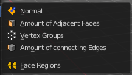

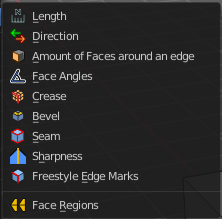

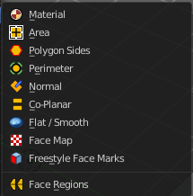

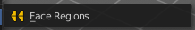

Last Operator Select Similar
----------------------------

Type
----

Here you can choose the select similar method again.

Compare
-------

Compare with method less, greater or equal.

Threshold
---------

Here you can adjust the threshold value after which the element counts as similar.

Random 
-------

Selects a random group of vertices, edges, or faces, dependant of the mesh selection method.

Last Operator SelectRandom
--------------------------

Percent
-------

How much percent will be random selected.

Random Seed
-----------

The random seed value.

Action
------

Select or deselect.

Checker Deselect 
-----------------

Deselect alternating faces, edges or vertices to create a checker like pattern. The result is dependant of the mesh selection method.

Last Operator Checker Deselect
------------------------------

Nth Element
-----------

Here you can define how much elements gets unchecked. With 2 you have a checker board pattern. Every second element gets deselected.

Skip
----

Skip elements before the checker algorithm deselects again.

Offset
------

Here you can offset the deselected elements.

Mirror selection

Requires to have a symmetrical mesh. Selects the mirrored mesh parts from a selection.

Last Operator Select Mirror
---------------------------

Axis
----

The world axis to mirror at.

Extend
------

Keep the current selection. Without extend the current selection gets deselected.

Side of Active
--------------

Selects all mesh data in direction of a single axis, starting from the current selection.

Last Operator Side of Active
----------------------------

Axis mode
---------

The axis orientation to work with.

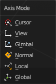

Axis Sign
---------

In which direction to work form the current selection.

Axis
----

The axis to work with.

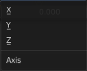

Threshold
---------

Here you can define a threshold to extend the selection.

Shortest Path 
--------------

Select the shortest edge path between two selected mesh elements. This can be vertices, edges or faces. A start and a end point must be selected.

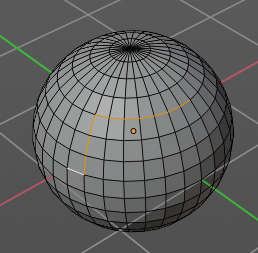

Last Operator Select shortest path
----------------------------------

Edge Tag
--------

With Select shortest path you can not only select the shortest path, but also already modify it. Like mark it as seam.

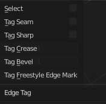

The available methods should be pretty self explaining.

Face Stepping
-------------

Traverse connected faces.

Topology Distance
-----------------

Find the minimum number of steps instead of the shortest distance.

Fill Region
-----------

Select the region faces too.

Nth Element
-----------

Don't select the whole path, but just every nth element of it.

Skip
----

This is connected to nth element. Number of elements to skip at once.

Offset
------

This is connected to nth element. Start with an offset.

Sharp Edges
-----------

Select all edges that are marked as sharp.

Last Operator Select Sharp Edges
--------------------------------

Sharpness
---------

The angle after which a sharp edge gets selected.

Loose Geometry
--------------

Selects loose geometry.

Last Operator Select Loose Geometry
-----------------------------------

Extend
------

Extend the current selection.

Interior Faces
--------------

Select faces where all edges have more than 2 faces. In the picture here we have inlaying faces by joining two cubes together, then merge the vertices by distance. So the two faces from the former two cubes are now interior faces. That's usually unwanted geometry that you want to select and to remove.

Faces by Sides
--------------

Selects faces that has the same number of edges, or better said vertices. Tris, quads, N-gons.

Last Operator Select Faces by Side
----------------------------------

Sharpness
---------

Extend the current selection.

Number of vertices
------------------

How many numbers of vertices the face should have. 4 is a quad.

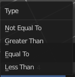

Type
----

Selection type.

Extend
------

Extend the current selection.

Edge Loop
---------

Selects a loop of edges from a selected edge. The method stops at poles. That's vertices where three or more than four edges comes together. At a UV sphere the north and south pole ...

Last Operator Multi Select Loops
--------------------------------

Ring
----

Select edge ring instead of edge loop.

Edge Ring
---------

Selects edges parallel to a selected edge in the same ring of faces. The method stops at poles. That's vertices where three or more than four edges comes together. At a UV sphere the north and south pole ...

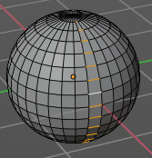

Last Operator Multi Select Loops
--------------------------------

Ring
----

Select edge ring instead of edge loop.

Loop Inner-Region
-----------------

Select everything that is enclosed by an edge loop. When the loop is not closed, then it might select everything ...

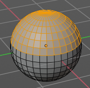

By default the smaller enclosed part gets selected. The Inner-Region.

Last Operator Select Loop Inner-Region
--------------------------------------

Select Bigger
-------------

Select the bigger enclosed part instead of the smaller enclosed part.

Boundary Loop
-------------

Select the edges that encloses a selection of faces.

Ungrouped Verts
---------------

Selects ungrouped Vertices.Just active in vertex selection mode. And requires to have at least one vertex group assigned.

Last Operator Select Ungrouped
------------------------------

Extend
------

Extends the current selection.

More / Less
-----------

More
----

Extends the current selection.

Less
----

Reduces the current selection.

Next Active
-----------

Selects the next active element. For example, when you have two vertices selected, then the next vertice in the row with the same distance will be selected as the next active.

Previous Active
---------------

Like next active, but deselects in the other direction down to the first selected vertice with every step.

Curve Object - Edit Mode
========================

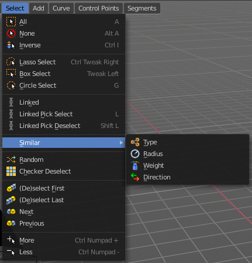

All 
----

Select everything.

None
----

Select nothing.

Inverse
-------

Invert the current selection.

Lasso Select
------------

Note that this select method works independant from the lasso select tool in the tool shelf. 

In this select mode you can select elements by dragging a form around what you want to select. And what's inside of the rectangle gets selected then. It adds to selection by default. 

To subtract from selection hold down Shift key. 

The selection gets applied when you release the mouse. You leave the mode automatically when you release the mouse.

Box Select
----------

Note that this select method works independant from the lasso select tool in the tool shelf. 

In this select mode you can select elements by dragging a rectangle. And what's inside of the rectangle gets selected then. It adds to selection by default. 

To subtract from selection hold down Shift key. 

The selection gets applied when you release the mouse. You leave the mode automatically when you release the mouse.

Circle Select
-------------

Circle select enters the Circle Select mode. This is a special select mode where you can select elements by moving with the mouse over it. It adds to selection by default. 

To subtract from selection hold down Shift key. To exit the Circle select click with the right mouse button.

The pencil radius of the circle select tool can be adjusted with the scroll wheel.

Linked
------

Select the geometry that is directly linked with the current geometry. You can for example have a mesh with several closed submeshes. Those submeshes are not linked together, but are part of the object.

Last Operator Select Linked All
-------------------------------

Delimit
-------

Here you can add a limit to the selection. For example, just select up to the next seam.

Linked Pick Select
------------------

Same as with Linked. But works with what is under the mouse cursor.

Linked Pick Deselect
--------------------

Same as with Linked. But works with what is under the mouse cursor. And deselects the selection.

Last Operator Select Linked
---------------------------

Deselect
--------

Select or deselect.

Delimit
-------

Here you can add a limit to the selection. For example, just select up to the next seam.

Similar
-------

Here you can select curve geometry based on how similar certain properties are to it.

Last Operator Select Similar
----------------------------

Type
----

Here you can choose the select similar method again.

Compare
-------

Compare with method less, greater or equal.

Threshold
---------

Here you can adjust the threshold value after which the element counts as similar.

Random 
-------

Selects a random group of curve points.

Last Operator SelectRandom
--------------------------

Percent
-------

How much percent will be random selected.

Random Seed
-----------

The random seed value.

Action
------

Select or deselect.

Checker Deselect 
-----------------

Deselect alternating curve points.

Last Operator Checker Deselect
------------------------------

Nth Element
-----------

Here you can define how much elements gets unchecked. With 2 you have a checker board pattern. Every second element gets deselected.

Skip
----

Skip elements before the checker algorithm deselects again.

Offset
------

Here you can offset the deselected elements.

De/Select First
---------------

Select or deselect first curve point.

De/Select Last
--------------

Select or deselect last curve point.

Next Active
-----------

Selects the next active element. For example, when you have two vertices selected, then the next vertice in the row with the same distance will be selected as the next active.

Previous Active
---------------

Like next active, but deselects in the other direction down to the first selected vertice with every step.

More
----

Extends the current selection.

Less
----

Reduces the current selection.

Surface Object - Edit Mode
==========================

All 
----

Select everything.

None
----

Select nothing.

Inverse
-------

Invert the current selection.

Lasso Select
------------

Note that this select method works independant from the lasso select tool in the tool shelf. 

In this select mode you can select elements by dragging a form around what you want to select. And what's inside of the rectangle gets selected then. It adds to selection by default. 

To subtract from selection hold down Shift key. 

The selection gets applied when you release the mouse. You leave the mode automatically when you release the mouse.

Box Select
----------

Note that this select method works independant from the lasso select tool in the tool shelf. 

In this select mode you can select elements by dragging a rectangle. And what's inside of the rectangle gets selected then. It adds to selection by default. 

To subtract from selection hold down Shift key. 

The selection gets applied when you release the mouse. You leave the mode automatically when you release the mouse.

Circle Select
-------------

Circle select enters the Circle Select mode. This is a special select mode where you can select elements by moving with the mouse over it. It adds to selection by default. 

To subtract from selection hold down Shift key. To exit the Circle select click with the right mouse button.

The pencil radius of the circle select tool can be adjusted with the scroll wheel.

Linked
------

Select the geometry that is directly linked with the current geometry. You can for example have a mesh with several closed submeshes. Those submeshes are not linked together, but are part of the object.

Last Operator Select Linked All
-------------------------------

Delimit
-------

Here you can add a limit to the selection. For example, just select up to the next seam.

Similar
-------

Here you can select curve geometry based on how similar certain properties are to it.

Last Operator Select Similar
----------------------------

Type
----

Here you can choose the select similar method again.

Compare
-------

Compare with method less, greater or equal.

Threshold
---------

Here you can adjust the threshold value after which the element counts as similar.

Random 
-------

Selects a random group of control points.

Last Operator SelectRandom
--------------------------

Percent
-------

How much percent will be random selected.

Random Seed
-----------

The random seed value.

Action
------

Select or deselect.

Checker Deselect 
-----------------

Deselect alternating control points.

Last Operator Checker Deselect
------------------------------

Nth Element
-----------

Here you can define how much elements gets unchecked. With 2 you have a checker board pattern. Every second element gets deselected.

Skip
----

Skip elements before the checker algorithm deselects again.

Offset
------

Here you can offset the deselected elements.

Control Point Row
-----------------

Selects a row of control points, including the active one.

More
----

Extends the current selection.

Less
----

Reduces the current selection.

Metaball Object - Edit Mode
===========================

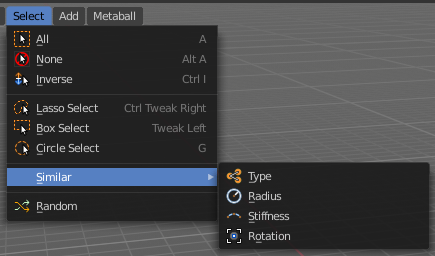

All 
----

Select everything.

None
----

Select nothing.

Inverse
-------

Invert the current selection.

Lasso Select
------------

Note that this select method works independant from the lasso select tool in the tool shelf. 

In this select mode you can select elements by dragging a form around what you want to select. And what's inside of the rectangle gets selected then. It adds to selection by default. 

To subtract from selection hold down Shift key. 

The selection gets applied when you release the mouse. You leave the mode automatically when you release the mouse.

Box Select
----------

Note that this select method works independant from the lasso select tool in the tool shelf. 

In this select mode you can select elements by dragging a rectangle. And what's inside of the rectangle gets selected then. It adds to selection by default. 

To subtract from selection hold down Shift key. 

The selection gets applied when you release the mouse. You leave the mode automatically when you release the mouse.

Circle Select
-------------

Circle select enters the Circle Select mode. This is a special select mode where you can select elements by moving with the mouse over it. It adds to selection by default. 

To subtract from selection hold down Shift key. To exit the Circle select click with the right mouse button.

The pencil radius of the circle select tool can be adjusted with the scroll wheel.

Similar
-------

Here you can select metaball geometry based on how similar certain properties are to it.

Last Operator Select Similar
----------------------------

Type
----

Here you can choose the select similar method again.

Compare
-------

Compare with method less, greater or equal.

Threshold
---------

Here you can adjust the threshold value after which the element counts as similar.

Random 
-------

Selects a random metaball element.

Last Operator SelectRandom
--------------------------

Percent
-------

How much percent will be random selected.

Random Seed
-----------

The random seed value.

Action
------

Select or deselect.

Grease Pencil Object - Edit Mode, Sculpt Mode
=============================================

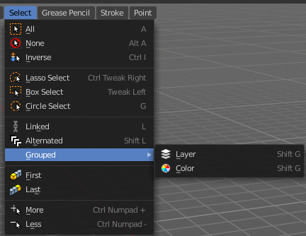

All 
----

Select everything.

None
----

Select nothing.

Inverse
-------

Invert the current selection.

Lasso Select
------------

Note that this select method works independant from the lasso select tool in the tool shelf. 

In this select mode you can select elements by dragging a form around what you want to select. And what's inside of the rectangle gets selected then. It adds to selection by default. 

To subtract from selection hold down Shift key. 

The selection gets applied when you release the mouse. You leave the mode automatically when you release the mouse.

Box Select
----------

Note that this select method works independant from the lasso select tool in the tool shelf. 

In this select mode you can select elements by dragging a rectangle. And what's inside of the rectangle gets selected then. It adds to selection by default. 

To subtract from selection hold down Shift key. 

The selection gets applied when you release the mouse. You leave the mode automatically when you release the mouse.

Circle Select
-------------

Circle select enters the Circle Select mode. This is a special select mode where you can select elements by moving with the mouse over it. It adds to selection by default. 

To subtract from selection hold down Shift key. To exit the Circle select click with the right mouse button.

The pencil radius of the circle select tool can be adjusted with the scroll wheel.

Linked
------

Select the geometry that is directly linked with the current geometry. You can for example have a mesh with several closed submeshes. Those submeshes are not linked together, but are part of the object.

Last Operator Select Linked All
-------------------------------

Delimit
-------

Here you can add a limit to the selection. For example, just select up to the next seam.

Alternated
----------

Select every second element.

Last Operator Alternated
------------------------

Unselect Ends
-------------

The end points are always unselected.

Grouped
-------

Select grouped strokes by layer or color.

Last Operator Select Grouped
----------------------------

Type
----

Here you can again adjust if you want to select by layer or color.

First
-----

Select the first element in the stroke.

Last Operator Select First 
---------------------------

Selected Strokes only
---------------------

Only select the first point of strokes that has already some geometry selected.

Extend
------

Extend the current selection.

Last
----

Select the last element in the stroke.

Last Operator Select Last 
--------------------------

Selected Strokes only
---------------------

Only select the last point of strokes that has already some geometry selected.

Extend
------

Extend the current selection.

More
----

Extends the current selection.

Less
----

Reduces the current selection.

Armature Object - Edit Mode
===========================

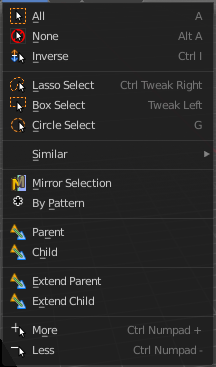

All 
----

Select everything.

None
----

Select nothing.

Inverse
-------

Invert the current selection.

Lasso Select
------------

Note that this select method works independant from the lasso select tool in the tool shelf. 

In this select mode you can select elements by dragging a form around what you want to select. And what's inside of the rectangle gets selected then. It adds to selection by default. 

To subtract from selection hold down Shift key. 

The selection gets applied when you release the mouse. You leave the mode automatically when you release the mouse.

Box Select
----------

Note that this select method works independant from the lasso select tool in the tool shelf. 

In this select mode you can select elements by dragging a rectangle. And what's inside of the rectangle gets selected then. It adds to selection by default. 

To subtract from selection hold down Shift key. 

The selection gets applied when you release the mouse. You leave the mode automatically when you release the mouse.

Circle Select
-------------

Circle select enters the Circle Select mode. This is a special select mode where you can select elements by moving with the mouse over it. It adds to selection by default. 

To subtract from selection hold down Shift key. To exit the Circle select click with the right mouse button.

The pencil radius of the circle select tool can be adjusted with the scroll wheel.

Similar
-------

Here you can select metaball geometry based on how similar certain properties are to it.

Most methods are self explaining. Immediate children selects just the direct children of the active object, while Children selects everything downwards the hierarchy.

Last Operator Select Similar
----------------------------

Type
----

Here you can choose the select similar method again.

Compare
-------

Compare with method less, greater or equal.

Threshold
---------

Here you can adjust the threshold value after which the element counts as similar.

Mirror Selection
----------------

Select the mirrored parts of an object. For example for L.bone it selects R.bone.

Last Operator Select Mirror
---------------------------

Extend
------

Extends existing selection instead of deselecting everything first.

By Pattern
----------

Selects all objects whose name matches the entered string. For missing parts you need to add an asterix. 

For example, you have four cubes in the scene. Cube, Cube.001, Cube.002 and mycube3. Then the term " Cube " will just select the first cube. While the term " Cube\* " will select the first three. And " \*cube\* " will select all four.

Supported wild-cards: 

\* matches everything? matches any single character[abc] matches characters in “abc”[!abc] match any character not in “abc”

The tool operates immediately at entering the string.

Pattern
-------

Here you can type in your string.

Case Sensitive
--------------

When ticked then the string comparison happens by taking upper and lower letters into account.

Extend
------

Extends existing selection instead of deselecting everything first.

Last Operator Select Pattern
----------------------------

The Last Operator Select Pattern contains the same menu items than the pop-up. So see above. Also, it does not appear in the 3D view. But when you call it from the edit menu or with hotkey.

Parent
------

Parent requires to have a parent or child relationship. It selects the parent object of the currently selected object(s).

Child 
------

Child requires to have a parent or child relationship. It selects the child object(s) of the currently selected object(s).

Extend Parent
-------------

Extend Parent requires to have a parent or child relationship. It selects the parent object of the currently selected object(s). But keeps the active object in the selection, even when it's not currently selected.

Extend Child
------------

Extend Child requires to have a parent or child relationship. It selects the child object(s) of the currently selected object(s). But keeps the active object in the selection, even when it's not currently selected.

More
----

More requires to have a parent or child relationship.It expands the selection.

Less
----

Less requires to have a parent or child relationship. It reduces the selection.

Armature Object - Pose Mode
===========================

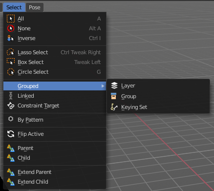

All 
----

Select everything.

None
----

Select nothing.

Inverse
-------

Invert the current selection.

Lasso Select
------------

Note that this select method works independant from the lasso select tool in the tool shelf. 

In this select mode you can select elements by dragging a form around what you want to select. And what's inside of the rectangle gets selected then. It adds to selection by default. 

To subtract from selection hold down Shift key. 

The selection gets applied when you release the mouse. You leave the mode automatically when you release the mouse.

Box Select
----------

Note that this select method works independant from the lasso select tool in the tool shelf. 

In this select mode you can select elements by dragging a rectangle. And what's inside of the rectangle gets selected then. It adds to selection by default. 

To subtract from selection hold down Shift key. 

The selection gets applied when you release the mouse. You leave the mode automatically when you release the mouse.

Circle Select
-------------

Circle select enters the Circle Select mode. This is a special select mode where you can select elements by moving with the mouse over it. It adds to selection by default. 

To subtract from selection hold down Shift key. To exit the Circle select click with the right mouse button.

The pencil radius of the circle select tool can be adjusted with the scroll wheel.

Grouped
-------

Select grouped bones by type.

Constraint Targets
------------------

Select the bones used as targets for the currently selected bone.

By Pattern
----------

Selects all objects whose name matches the entered string. For missing parts you need to add an asterix. 

For example, you have four cubes in the scene. Cube, Cube.001, Cube.002 and mycube3. Then the term " Cube " will just select the first cube. While the term " Cube\* " will select the first three. And " \*cube\* " will select all four.

Supported wild-cards: 

\* matches everything? matches any single character[abc] matches characters in “abc”[!abc] match any character not in “abc”

The tool operates immediately at entering the string.

Pattern
-------

Here you can type in your string.

Case Sensitive
--------------

When ticked then the string comparison happens by taking upper and lower letters into account.

Extend
------

Extends existing selection instead of deselecting everything first.

Last Operator Select Pattern
----------------------------

The Last Operator Select Pattern contains the same menu items than the pop-up. So see above. Also, it does not appear in the 3D view. But when you call it from the edit menu or with hotkey.

Flip Active 
------------

Mirrors the bone selection. Works with a armature with mirrored parts.

Last Operator Flip Active/Selected Bone
---------------------------------------

Active Only
-----------

Only select the mirror part of the active bone.

Extend
------

Extend the current selection.

Parent
------

Parent requires to have a parent or child relationship. It selects the parent object of the currently selected object(s).

Child 
------

Child requires to have a parent or child relationship. It selects the child object(s) of the currently selected object(s).

Extend Parent
-------------

Extend Parent requires to have a parent or child relationship. It selects the parent object of the currently selected object(s). But keeps the active object in the selection, even when it's not currently selected.

Extend Child
------------

Extend Child requires to have a parent or child relationship. It selects the child object(s) of the currently selected object(s). But keeps the active object in the selection, even when it's not currently selected.

Lattice Object - Edit Mode
==========================

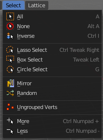

All 
----

Select everything.

None
----

Select nothing.

Inverse
-------

Invert the current selection.

Lasso Select
------------

Note that this select method works independant from the lasso select tool in the tool shelf. 

In this select mode you can select elements by dragging a form around what you want to select. And what's inside of the rectangle gets selected then. It adds to selection by default. 

To subtract from selection hold down Shift key. 

The selection gets applied when you release the mouse. You leave the mode automatically when you release the mouse.

Box Select
----------

Note that this select method works independant from the lasso select tool in the tool shelf. 

In this select mode you can select elements by dragging a rectangle. And what's inside of the rectangle gets selected then. It adds to selection by default. 

To subtract from selection hold down Shift key. 

The selection gets applied when you release the mouse. You leave the mode automatically when you release the mouse.

Circle Select
-------------

Circle select enters the Circle Select mode. This is a special select mode where you can select elements by moving with the mouse over it. It adds to selection by default. 

To subtract from selection hold down Shift key. To exit the Circle select click with the right mouse button.

The pencil radius of the circle select tool can be adjusted with the scroll wheel.

Mirror
------

Select the mirrored parts to the current selection.

Last Operator Select Mirror
---------------------------

Axis
----

Here you can choose the world axis to mirror at.

Extend
------

Extends existing selection instead of deselecting everything first.

Ungrouped Verts
---------------

Selects ungrouped Vertices.Requires to have at least one vertex group assigned.

Last Operator Select Ungrouped
------------------------------

Extend
------

Extends the current selection instead of deselecting everything first.

More
----

Extends the current selection.

Less
----

Reduces the current selection.

