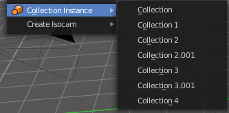

*******************************************
7.1.6 Editors - 3D View - Header - Add Menu
*******************************************

.. contents:: Contents

Add Menu
========

The Add menu contains everything that can be added to the scene. Geometry, camera, lights and so on.

When you create a primitive then the Adjust Last Operator Panel down left shows some settings for this primitive. 

Note that the adjust last operator panel does not show when you add a primitive from the toolbar at the top. Then you have to open the adjust last operation panel from the toolbar.

Note also that those settings are not longer available when you perform any operation at the object. And be it to move the primitive. Some of those settings might still be available in the Properties editor. But things like create UV not. So when you want to adjust those settings, then do it immediately after creation.

Several object types can be edited. A Mesh Primitive for example. They have different modes available then. Some not. Like an Empty. There is just the Object mode available for an Empty.

You can add some primitives in edit mode too. In object mode you have the whole range available. In Edit mode you usually just have the object type available with which you are in edit mode.

For example, when you are in edit mode with a mesh, then the add menu just shows the mesh content. When you add geometry in edit mode, then the added geometry becomes part of the current object.

Mesh
====

The Mesh section contains the primitives that are made of meshes.

Mesh objects are geometrical objects made of vertices, edges and faces. The geometry can be editet in various ways in edit mode. They can be sculpted in sculpt mode. The vertices can be painted in vertex paint mode. They can be used as a skin for a skeleton, and you can weight paint them so that it deforms with the armature. And you can add textures by UV mapping.

Plane
-----

Plane creates a simple quad face mesh.

Last Operator Add Plane Panel
-----------------------------

Size is in real the size of the plane.Generate UV's creates UV's for this primitive.Align aligns the geometry to the chosen view. World, View or 3D cursor.Location Here you can adjust the location of the Plane.Rotation defines the rotation of the Plane.

Cube
----

Cube creates a Cube mesh.

Last Operator Add Cube Panel
----------------------------

Size is in real the size of the Cube.Generate UV's creates UV's for this primitive.Align to view aligns the geometry to the chosen view. World, View or 3D cursor.Location defines the location of the Cube.Rotation defines the rotation of the Cube.

Circle
------

Circle creates a Circle mesh.

Last Operator Add Circle Panel
------------------------------

Verticesdefines of how much vertices the circle is made.Radiusdefines the radius of the circle.Fill Type defines how the Circle mesh is filled.- Nothing means you have pure edge geometry.- N-Gon means that the circle face is a N-Gon face.- Triangle Fan means that the circle face is triangulated.Generate UV's creates UV's for this primitive.Align to view aligns the geometry to the chosen view. World, View or 3D cursor.Location defines the location of the Circle.Rotation defines the rotation of the Circle.

UV Sphere
---------

UV Sphere creates a sphere mesh.

Last Operator Add UV Sphere Panel
---------------------------------

Segments defines of how much segments the sphere has vertically.Rings defines how much rings the sphere has horizontally.Size defines the radius of the UV Sphere.Generate UV's creates UV's for this primitive.Align to view aligns the geometry to the chosen view. World, View or 3D cursor.Location defines the location of the Sphere.Rotation defines the rotation of the Sphere.

Ico Sphere
----------

Ico Sphere creates a sphere mesh.

Last Operator Add Ico Sphere Panel
----------------------------------

Subdivisions defines the subdivision level of the Ico Sphere.Size defines the radius of the Ico Sphere.Generate UV's creates UV's for this primitive.Align to view aligns the geometry to the chosen view. World, View or 3D cursor.Location defines the location of the Sphere.Rotation defines the rotation of the Sphere.

Cylinder
--------

Cylinder creates a Cylinder mesh.

Last Operator Add Circle Panel
------------------------------

Verticesdefines of how much vertices the circle is made.Radiusdefines the radius of the Cylinder.Depth defines the length of the Cylinder.Cap Fill Type defines how the cap face is filled.- Nothing means you have no face at the top and the bottom of the Cylinder.- N-Gon means that the cap face is a N-Gon face.- Triangle Fan means that the cap face is triangulated.Generate UV's creates UV's for this primitive.Align to view aligns the geometry to the chosen view. World, View or 3D cursor.Location defines the location of the Cylinder.Rotation defines the rotation of the Cylinder.

Cone
----

Cone creates a Cone mesh

Last Operator Add Cone Panel
----------------------------

Verticesdefines of how much vertices the circle is made.Radius 1defines the base radius of the Cone.Radius 2defines the top radius of the Cone.Depth defines the length of the Cone.BaseFill Type defines how the Base face is filled.- Nothing means you have no base face.- N-Gon means that the base face is a N-Gon face.- Triangle Fan means that the base face is triangulated.Generate UV's creates UV's for this primitive.Align to view aligns the geometry to the chosen view. World, View or 3D cursor.Location defines the location of the Cone.Rotation defines the rotation of the Cone.

Torus
-----

Torus creates a Torus mesh

Last Operator Add Torus Panel
-----------------------------

Operator Presetsallows you to store presets for the Torus. So that you don't have to start from scratch when you need different tori with different setup. This presets are temporary. And cannot be stored between sessions.Align to viewaligns the geometry to the chosen view. World, View or 3D cursor.Location defines the location of the Torus.Rotation defines the rotation of the Torus.Major segmentsdefines the segment division of the Torus.Minor segmentsdefines the circle division of the Torus.Torus Dimensions defines the method to use when changing Major and Minor Radius.Major Radius changes the radius of the Torus.Minor Radiuschanges the thickness of the Torus.

Grid
----

Grid creates a subidividable plane mesh

Last Operator Add Grid Panel
----------------------------

X Subdivisions defines the number of subdivisions in x direction.X Subdivisions defines the number of subdivisions in Y direction.Size is in real the size of the plane.Generate UV's creates UV's for this primitive.Align to viewaligns the geometry to the chosen view. World, View or 3D cursor.Location Here you can adjust the location of the Plane.Rotation defines the rotation of the Plane.

Monkey
------

Monkey creates a monkey head mesh.

Last Operator Add Monkey Panel
------------------------------

Radius is in real the size of the object.Align to viewaligns the geometry to the chosen view. World, View or 3D cursor.Location Here you can adjust the location of the Monkey head mesh.Rotation defines the rotation of the Monkey head mesh.

Curve
=====

Here you can add curves primitives.

Curve objects are mathematical curves that are definded by a start and endpoint. You can edit the shape of the curve by handlers. Curves have several purposes. They can be used as a path. Or you use them as the base for a mesh object. 

The curve types are very similar. But do have some small differences. The difference between Bezier and Nurbs is that with Bezier you have handlers at the curve. And with a Nurbs you have a control geometry to influence the curve.

Note that Curves is no mesh data. You have to convert the Curves data to Mesh data when you want to work with it like with a mesh. Note also that you cannot convert it back to curve then. 

Bezier
------

Bezier creates a Bezier type curve.

Circle
------

Circle creates a Bezier circle type curve.

Nurbs Curve
-----------

Nurbs Curve creates a Nurbs type curve.

Nurbs Circle
------------

Nurbs Circle creates a Nurbs type circle curve.

Path
----

Path creates a Nurbs type curve.

Last Operator Add Curve
-----------------------

The Last Operator add panel is for all curves equal.

Radius is in real the size of the object.Align to viewaligns the geometry to the chosen view. World, View or 3D cursor.Location Here you can adjust the location of the curve.Rotation defines the rotation of the curve.

Surface
=======

Surfaces are some kind of curves. But curves with which you can construct surfaces. Surfaces are all of type Nurbs curves.

Note that Surfaces similar to Curves is no mesh data. You have to convert the Surfaces data to Mesh data when you want to work with it like with a mesh. Note also that you cannot convert it back to Surface then. 

Surface Curve
-------------

Surface Curve creates a Nurbs type curve.

Surface Circle
--------------

Surface Circle creates a Nurbs type circle.

Surface Surface
---------------

Surface Surface creates a Nurbs type Surface.

Surface Cylinder
----------------

Surface Cylinder creates a Nurbs type cylinder.

Surface Sphere
--------------

Surface Sphere creates a Nurbs type sphere.

Surface Torus
-------------

Surface Torus creates a Nurbs type Torus.

Last Operator Add Surface
-------------------------

The Last Operator add panel is for all curves equal.

Radius is in real the size of the object.Align to view aligns the geometry to the chosen view. World, View or 3D cursor.Location Here you can adjust the location of the surface.Rotation defines the rotation of the surface.

Metaball
========

Meta-balls are procedural primitives. They are not defined by vertices or curves. The interesting behaviour of meta-balls is that you can stick them into each other. And they have one surface then. Like merging two water drops. And this works in Object mode already.

Ball
----

Ball creates a meta-ball in Sphere shape.

Capsule
-------

Capsule creates a meta-ball in Capsule shape.

Plane
-----

Plane creates a meta-ball in Plane shape.

Ellipsoid
---------

Ellipsoid creates a meta-ball in Ellipsoid shape.

Cube
----

Cube creates a meta-ball in Cube shape.

Last Operator Add Meta ball
---------------------------

The Last Operator add panel is for all Meta-balls equal.

Primitive is a drop-down box where you can change the Meta ball type.Radius is in real the size of the object.Align to viewaligns the geometry to the chosen view. World, View or 3D cursor.Location Here you can adjust the location of the surface.Rotation defines the rotation of the surface.

Text
====

Text creates a text object. With a text object you can create a text in the 3D viewport. Text is not mesh geometry. It is a special curve geometry. But you can convert it to a mesh. See Object menu , Convert to.

Text can be cut, copied and pasted in the usual way by ctrl x, ctrl c and ctrl v

There is a limit of characters, which is by 50.000.

Objects as Fonts
----------------

You can also “create” your own “font” inside Bforartists! This is quite a complex process, so let’s detail it:

- First, you must create your chars. Each char is an object **of any type** (mesh, curve, meta...). They all must have a name following the schema: common prefix followed by the char name (e.g. ft.a, ft.b, etc.). 
- Then, for the **Text** object, you must enable the **Dupli Verts** button (**Object** context - **Anim Settings** panel). 
- Back in **Editing** context, in the **Font** panel, fill the **Ob Family** field with the **common prefix** of your “font” objects. 

Now, each time a char in your text matches the **suffix part** of a “font” object’s name, this object is duplicated on this char. **The original chars remain visible**. The objects are duplicated so that their center is positioned at the **lower right corner** of the corresponding chars.

.. Note:: ``Y``ou can enter the Edit mode with the standard hotkey. But you cannot switch back to Object mode with the standard hotkey. Since this hotkey gets count as input for the text object in Edit mode. You have to use the mode drop-down box to leave the Edit mode.

Editing Text
------------

Editing text is different from other object types in Bforartists. You edit on the one hand a curve type object, but also a text. And so the text editing standards applies. Like hitting backspace to delete parts of the text.

Inserting Text
--------------

You can type in new text. You can also copy text from a text editor and paste it. Or you can load a text file.

To load text from a text file, use the Edit / Paste File tool. This will bring up a **File Browser** window for navigating to a valid UTF-8 file. 

Accent Characters
-----------------

Many special characterscan be “composed” using a combination of two other characters. The hotkey for it is the character follwed by Alt-Backspace followed by the desired key to produce the accent character. Note that the following key combinations works with the US keyboard layout, even when you use the german keyboard layout.

Some examples.

ã - A, Alt-Backspace, ~

á - A, Alt-Backspace, '

à - A, Alt-Backspace, Backslash

â - A, Alt-Backspace, ^

å - A, Alt-Backspace, O

æ - A, Alt-Backspace, E

ª - A, Alt-Backspace, Minus

ë - E, Alt-Backspace, "

ç - C, Alt-Backspace, Comma

¢ - C, Alt-Backspace, \|

ø - O, Alt-Backspace, Slash

§ - S, Alt-Backspace, S

† - \|, Alt-Backspace, Minus

‡ - \|, Alt-Backspace, =

© - O, Alt-Backspace, C

® - O, Alt-Backspace, R

™ - T, Alt-Backspace, M

½ - 1, Alt-Backspace, 2

÷ - Minus, Alt-Backspace, :

± - Minus, Alt-Backspace, Plus

Last Operator Add Text
----------------------

Radius is in real the size of the Text object.Align to view aligns the geometry to the chosen view. World, View or 3D cursor.Location Here you can adjust the location of the Text object.Rotation defines the rotation of the Text object.

You can navigate the cursor with the arrow buttons. Enter adds a new paragraph. When you use the navigator you will see a last operator Move Cursor with further options.

Last Operator Move Cursor
-------------------------

Type
----

The different methods to set the cursor.

Grease Pencil
=============

With a grease pencil object you can draw in the 3D viewport. It can be use to make traditional 2D animation, cut-out animation, motion graphics or use it as storyboard tool among other things.

You add a grease pencil object, switch to draw mode, choose the color or add a new one. And when done with drawing you can manipulate the grease pencil object in edit mode or in weight paint mode even further.

The colors are materials.

Blank
-----

Adds a blank grease pencil object with just one black color and no geometry.

Stroke
------

Adds a grease pencil stroke with some predefined colors.

Monkey
------

Adds the drawing of a monkey as an example with some predefined colors.

Last Operator Add Grease Pencil
-------------------------------

The Last Operator add Grease Pencil panel is for all grease pencil objects equal.Radius is in real the size of the object.Alignaligns the geometry to the chosen view. World, View or 3D cursor.Location Here you can adjust the location of the surface.Rotation defines the rotation of the surface.

Type Here you can choose the grease pencil type to create again.

Armature
========

Armatureadds the first bone of a skeleton. This bone can be furhter extended in edit mode. And you can animate the created skeleton in pose mode.

Last Operator Add Armature
--------------------------

Radius is in real the size of the Armature object.Alignaligns the geometry to the chosen view. World, View or 3D cursor.Location Here you can adjust the location of the Armature object.Rotation defines the rotation of the Armature object.

Lattice
=======

A lattice object is a control cage to control deforming at another object.

Usage
-----

Create a Lattice object. Make sure it is bigger than the object that you want to deform, and is around this object. Add a Lattice Modifier to the object that you want to deform. In the Object box of the Lattice Modifier add our created Lattice object.

Select Lattice Object. Enter Edit mode. And here you can deform the Lattice Object now, and the object to deform will follow.

Last Operator Add Lattice object
--------------------------------

Radius is in real the size of the Lattice object.Type is a drop-down box where you can choose any other object type to create.Alignaligns the geometry to the chosen view. World, View or 3D cursor.Location Here you can adjust the location of the Lattice object.Rotation defines the rotation of the Lattice object.

Empty
=====

An Empty is an object without any data attached. It is basically just a container. It is empty. Empties can be used as anchor objects. Or as visible handlers at a skeleton for example. 

The empty types differs just by how they gets displayed in the viewport.

The empty of type image allows you to load an image to display the empty. This image can be adjusted and loaded in the object data panel of the empty object.

.. image:: graphics/7.1.6_Editors_-_3D_View_-_Header_-_Add_Menu/100002010000015700000176D8CBB3C75D0F9798.png

The image empty has also a transform widget, presented by the yellow color. It becomes visible when you hover with the mouse over the object.

Empties, no matter what shape, does not render to file.

Last Operator Add Empty
-----------------------

Type is a drop-down box where you can define the type of Empty object.Radius is in real the size of the Empty object.Alignaligns the geometry to the chosen view. World, View or 3D cursor.Location Here you can adjust the location of the Empty object.Rotation defines the rotation of the Empty object.

Image
=====

Image objects allows you to import and display images in the viewport. Image objects are nothing else than Empties of type Image. So in the outliner they will show up as empties.

When you create an image object, then the file browser opens, where you can choose the image that you want to use as the reference image. It loads with the correct ratio.

Neither reference images nor background images does render to file. They are just meant to display images in the viewport.

Reference
---------

A reference image is for example used to model along the shape of a car at an image.

The image has also a transform widget, presented by the yellow color. It becomes visible when you hover with the mouse over the object.

.. image:: graphics/7.1.6_Editors_-_3D_View_-_Header_-_Add_Menu/100002010000015700000176D8CBB3C75D0F9798.png

Important, the reference image loads oriented in the current screen orientation. So when you need the image in the side view, then you should be in the side view when you create a reference image.

This image can be adjusted and changed in the object data panel of the object. Don't wonder about the panel name, which is Empty. As told above, the reference image is in fact nothing else than a special form of the image empty.

Background
----------

Background images are meant to display images in the background of the viewport, while rendering.

There is just one difference between a Reference and a Background image. 

A reference image is double sided. A background image not. When you look from the back side, then it is transparent.

Speaker
=======

A speaker object allows you to add a sound source to the scene. This can be used in a movie for example.

Last Operator Add Speaker
-------------------------

Align aligns the geometry to the chosen view. World, View or 3D cursor.Location Here you can adjust the location of the Speaker object.Rotation defines the rotation of the Speaker object.

Camera
======

A camera object allows you to render your scene.

Camera objects can be further adjusted in the properties editor.

Last Operator Add Camera
------------------------

Location Here you can adjust the location of the Camera object.Rotation defines the rotation of the Camera object.

Light
=====

Lights lights the scene. 

The lights that you add here lights the rendered scene. Not the scene in the viewport. Viewport lighting is managed in the viewport shading panel.

Lights can be further adjusted in the properties editor.

Point
-----

Point creates a Point Light. A point light shines into all directions.

Sun
---

Sun creates a light that behaves like a sun. It's a directional light.

Spot
----

Spot creates a Spot light. It's a directional light.

Area
----

Area creates a Area light. It's a directional light.

Last Operator Add Light
-----------------------

The Last Operator add panel is for all lights equal.

Type is a drop-down box where you can change the light type.Radius is in real the size of the lamp.Alignaligns the geometry to the chosen view. World, View or 3D cursor.Location Here you can adjust the location of the object.Rotation defines the rotation of the object.

Light Probe
===========

Light Probe objects are used by the Eevee render engine as support objects. They precompute lighting information locally in order to light the scene using indirect lighting. Which speeds things up.

There are three different light probe types. One for diffuse light lighting, two for specular lighting.

Light probes are a feature for realtime render engines. This means Light probes does not work for the other renderers in Bforartists. Just in Eeevee. 

The light probes can be further adjusted in the Properties Editor.

Reflection Cubemap
------------------

Adds a reflective light probe in cubemap shape.

Reflection Plane
----------------

Adds a reflective light probe in plane shape.

Irradiance Volume
-----------------

Adds a volumetric array light probe. 

Last Operator Add Light Probe
-----------------------------

The Last Operator add panel is for all light probes equal.

Type is a drop-down box where you can change the light type.Radius is in real the size of the light probe.Alignaligns the geometry to the chosen view. World, View or 3D cursor.Location Here you can adjust the location of the object.Rotation defines the rotation of the object.

Force Field
===========

A Force Field is for physical simulations. It provides you with tools to add different forces to objects. Wind, Smoke, Gravity, Magnetic, etc. .

.. image:: graphics/7.1.6_Editors_-_3D_View_-_Header_-_Add_Menu/10000201000000A20000012616BE90C625EAFA58.png

The added Force Fields can be further adjusted in the Properties panel.

A Force Field is internally also called Effector. So our Last Operator panel has the title Add Effector.

Last Operator Add Effector
--------------------------

Type is a drop-down box where you can define the type of Effector.Radius is in real the size of the Effector.Alignaligns the geometry to the chosen view. World, View or 3D cursor.Location Here you can adjust the location of the Effector.Rotation defines the rotation of the Effector.

Collection Instance
===================

Here you can add a instance of a existing collection. By default it is just one. But the menu lists all available collections in the scene. 

Last Operator Add Collection Instance
-------------------------------------

Name Here you can name your new collection.Radius A dropdown box where you can choose the collection.Alignaligns the geometry to the chosen view. World, View or 3D cursor.Location Here you can adjust the location of the collection.Rotation defines the rotation of the collection.

Create Isocam
=============

The add menu is also a common menu where addons adds their entries. Create Isocam is such an addon. It comes with Bforartists, and is activated by default.

Create Isocam is a script that creates an orthographic camera with which you can render isometric views for 2d isometric games. You can of course set the whole thing up by hand. This script saves you the work though.

True Isocam
-----------

Greates a camera that has the mathematical isometric angles compared to the ground plane.

The camera has a rotation of 54.736 degrees.

Game Isocam
-----------

Greates a camera that has the isometric angles for a 2d isometric game. This angle differs a bit from the mathematical angle. With the mathematical angle we would get some not fitting stairs.

.. image:: graphics/7.1.6_Editors_-_3D_View_-_Header_-_Add_Menu/100000000000014000000060F98ED2789F4DB16D.png

With the angle of 60 degrees for the camera we get a fitting result for an isometric game tile with the common 2:1 ratio.

GameIso4to3cam
--------------

There is another special view that fits together like the one with the 2:1 ratio . Here we don’t have a basetile of 64×32 and a ratio of 2:1, but one with 64×48 and a ratio of 4:3. It is of course not a power of two graphics anymore. And far away from the true isometric view. But the old graphics card limits are long gone. And when you need a more topdown view, then this is perfect.

For that the camera has a rotation of 41.5 Grad.

Groundplane
-----------

Adds a groundplane that fits into the camera view of the iso cams.

