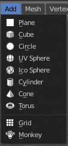
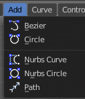
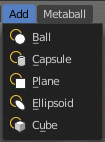
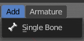
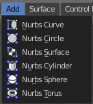

*******************************************************
7.1.7 Editors - 3D View - Header - Edit mode - Add menu
*******************************************************

.. contents:: Contents

Edit Mode - Add Menu
====================

In Edit Mode you will see a add menu for some object types. The number of objects that you can add in edit mode is limited to the same object type that you are in edit mode with. You can just add mesh geometry to a mesh geometry. And just curve geometry to curve geometry.

The added objects in edit mode becomes part of the current object geometry. It is one object.

Last Operator 
--------------

The last operators are the same than in object mode. Please read the add menu chapter in object mode.

