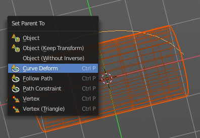
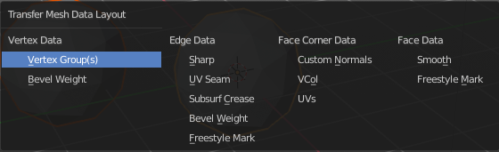

**********************************************
7.1.8 Editors - 3D View - Header - Object menu
**********************************************

.. contents:: Contents

Detailed Table of content
=========================

Object menu
===========

The object menu in Object mode provides you with tools to work at Object level.

It contains things like undo redo, copy and paste, delete and other general tools. But also some object specific tools, like the Convert to menu. Or Transform items, and many more.

There are lots of tools in this menu. So we will divide it into sub chapters.

Transform
=========

The transform sub menu contains functionality for some kind of transformations.

To Sphere
---------

Shapes a selection of objects into the shape of a sphere. The calculation happens with the object origins.

In Object mode this tools requires to have more than one object selected. 

Usage
-----

Select the objects, activate the tool, then drag the mouse in the 3D viewport. In the header you will read the current factor then. Which tells you how close you are towards the sphere shape.

.. image:: graphics/7.1.8_Editors_-_3D_View_-_Header_-_Object_menu/10000201000000920000002B567D115A122ADB2E.png

Last Operator Add Ico Sphere Panel
----------------------------------

Factor
------

The factor to transform the selection into a shape form.

Proportional editing
--------------------

Enables proportional editing. Activating proportional editing reveals further settings.

Proportional Falloff
--------------------

Here you can adjust the falloff methods.

Proportional Size
-----------------

Here you can see and adjust the falloff radius.

Connected
---------

The proportional falloff gets calculated for connected parts only.

Projected(2D)
-------------

The proportional falloff gets calculated in the screen space. Depth doesn't play a role. When it's in the radius, then it gets calculated.

Shear
-----

Shear shears the selection.

In Object mode this tools requires to have more than one object selected. 

Last Operator Shear
-------------------

Offset
------

Here you can adjust an offset.

Shear Axis
----------

The shear tool works along a imaginary 2d plane. The shear axis controls if the itemas are sheared along the x or the y axes of this plane. This is the plane along which the transformation happens. You can shear along the x or the y axis of this plane.

To make things even more complicated, the orientation of this imaginary plane is defined by the Axis and Axis Ortho items below.

Axis
----

Defines one axis of the imaginary shear axis plane.

Axis Ortho
----------

Defines the other axis of the imaginary shear axis plane.

Orientation
-----------

Here you can choose the orientation for the shear action.

Proportional editing
--------------------

Enables proportional editing. Activating proportional editing reveals further settings.

.. image:: graphics/7.1.8_Editors_-_3D_View_-_Header_-_Object_menu/1000020100000119000000773CD5255E7E68F4C5.png

Proportional Falloff
--------------------

Here you can adjust the falloff methods.

Proportional Size
-----------------

Here you can see and adjust the falloff radius.

Connected
---------

The proportional falloff gets calculated for connected parts only.

Projected(2D)
-------------

The proportional falloff gets calculated in the screen space. Depth doesn't play a role. When it's in the radius, then it gets calculated.

Bend
----

Bends the selection.

In Object mode this tools requires to have more than one object selected. 

Push/Pull
---------

It pushes or pulls the object positions relative to the center of the selection.

In Object mode this tool requires to have more than one object selected. 

Last Operator Push/Pull
-----------------------

Factor
------

Here you can adjust the strength of influence of the tool.

Proportional editing
--------------------

Enables proportional editing. Activating proportional editing reveals further settings.

Proportional Falloff
--------------------

Here you can adjust the falloff methods.

Proportional Size
-----------------

Here you can see and adjust the falloff radius.

Connected
---------

The proportional falloff gets calculated for connected parts only.

Projected(2D)
-------------

The proportional falloff gets calculated in the screen space. Depth doesn't play a role. When it's in the radius, then it gets calculated.

Move Texture Space
------------------

This tool relies at the move tool. With the difference that it moves the texture space instead of the object. It has also a very special use case, and just works with a material with a Texture Coordinate / Generated node. And requires to have the shading at Material or Rendered to see a result in the viewport. 

The yellow cage represents the texture space. The actual UV mapping does not change.

Last Operator Move
------------------

Move
----

Here you can adjust in which directions you want to transform.

Orientation
-----------

Here you can choose the orientation.

Proportional editing
--------------------

Enables proportional editing. Activating proportional editing reveals further settings.

Proportional Falloff
--------------------

Here you can adjust the falloff methods.

Proportional Size
-----------------

Here you can see and adjust the falloff radius.

Connected
---------

The proportional falloff gets calculated for connected parts only.

Projected(2D)
-------------

The proportional falloff gets calculated in the screen space. Depth doesn't play a role. When it's in the radius, then it gets calculated.

Scale Texture Space
-------------------

Scale Texture space is similar to the Move texture Space. With the only difference that it scales the UV space instead of moving it.

Last Operator Resize
--------------------

Move
----

Here you can adjust in which directions you want to transform.

Orientation
-----------

Here you can choose the orientation.

Proportional editing
--------------------

Enables proportional editing. Activating proportional editing reveals further settings.

Proportional Falloff
--------------------

Here you can adjust the falloff methods.

Proportional Size
-----------------

Here you can see and adjust the falloff radius.

Connected
---------

The proportional falloff gets calculated for connected parts only.

Projected(2D)
-------------

The proportional falloff gets calculated in the screen space. Depth doesn't play a role. When it's in the radius, then it gets calculated.

Align to Transform Orientation
------------------------------

Align to Transform Orientation rotates the selected objects so that their local orientation matches the active transform orientation in the Transform orientation panel or the Orientation selection in the Transform Operator panels.

For example when you have a few cubes that are rotated differently, then perform align to transform orientation with Global coordinates, then the cubes rotations gets set back to 0/0/0

Last Operator Transform
-----------------------

Values
------

These values can't be editet. The tool aligns to zero, so the values turns to zero.

Axis
----

These values doesn't matter. Changing them does nothing.

Orientation
-----------

Here you can choose the orientation in which the transform should happen.

Proportional editing
--------------------

Enables proportional editing. Activating proportional editing reveals further settings.

Proportional Falloff
--------------------

Here you can adjust the falloff methods.

Proportional Size
-----------------

Here you can see and adjust the falloff radius.

Connected
---------

The proportional falloff gets calculated for connected parts only.

Projected(2D)
-------------

The proportional falloff gets calculated in the screen space. Depth doesn't play a role. When it's in the radius, then it gets calculated.

Randomize Transform
-------------------

This tool allows to randomize position rotation and scale of selected objects. Each object gets threaten individually by a random value.

It starts with zeroed values. You need to adjust the values in the last operator.

Last Operator Randomize Transform
---------------------------------

Random Seed
-----------

Here you can adjust the random seed value.

Transform Delta
---------------

Randomize Delta transform values instead of the regular transform values.

Randomize Location checkbox
---------------------------

With this checkbox ticked the location of the selected objects gets randomiz

Location edit boxes
-------------------

Here you can adjust the strength of the transform for the single axis.

Randomize Rotation checkbox
---------------------------

With this checkbox ticked the rotation of the selected objects gets randomiz

Rotation edit boxes
-------------------

Here you can adjust the strength of the transform for the single axis.

Randomize Scale checkbox
------------------------

With this checkbox ticked the scale of the selected objects gets randomized.

Scale Even
----------

Use the same scale values for all axis.

Scale edit boxes
----------------

Here you can adjust the strength of the transform for the single axis.

Align Objects
-------------

Align Objects allows you to align the selected objects in various ways. You need to adjust the settings in the Last operator panel. The align operation happens in world coordinates.

Last Operator Align Objects
---------------------------

High Quality
------------

When ticked the calculation gets performed in a higher precision.

Align Mode
----------

Align Mode is a drop-down box where you can choose between different align modes.

Relative To
-----------

Relative to is a drop-down box. Here you adjust in what method the alignment happens.

Relative to the active object, to the center of selection, to the 3D cursor or to the scene origin.

Align
-----

Here you can turn on or off the single axis for the align operation.

Set Origin
==========

Set origin sets the origin of the selected objects to a chosen location.

Geometry to Origin
------------------

Sets the geometry to origin.

Origin to Geometry
------------------

Sets the origin to geometry.

Origin to 3D cursor
-------------------

Sets the origin to the 3D cursor.

Origin to Center of Mass(Surface)
---------------------------------

Sets the origin to the center of mass, calculating it from the center of the surface area.

Origin to Center of Mass(Volume)
--------------------------------

Sets the origin to the center of mass, calculating from the center of the Volume. It must be manifold geometry with consistent normals.

Last Operator Set Origin
------------------------

The last operator is the same for all set origin methods.

Type
----

Here you can choose the method again.

Center
------

Use the median center or the bounds center for calculation.

Mirror
======

Mirrors the selection.

Interactive Mirror
------------------

Mirrors the selection. 

Usage: 
-------

Activate the tool. In the header you will now see further instructions. Which is: type in the axis at which you want to mirror. Interactive mirroring starts in Global space. You can change the orientation in the last operator.

X Y Z Global
------------

Mirrors along the global axis.

X Y Z Local
-----------

Mirrors along the object axis.

Last Operator Mirror
--------------------

Orientation
-----------

Here you can choose the orientation in which the transform should happen.

Proportional editing
--------------------

Enables proportional editing. Activating proportional editing reveals further settings.

Proportional Falloff
--------------------

Here you can adjust the falloff methods.

Proportional Size
-----------------

Here you can see and adjust the falloff radius.

Connected
---------

The proportional falloff gets calculated for connected parts only.

Projected(2D)
-------------

The proportional falloff gets calculated in the screen space. Depth doesn't play a role. When it's in the radius, then it gets calculated.

Clear
=====

Clear
-----

Clear Transform is a menu where you can clear the transform for location, rotation, scale and Origin. Clear means in this conjunction that the values gets reset. 

When you have for example a cube at X 5, and clear the location, then the cube gets positioned at position X 0.

Location
--------

Resets the location of the selected object(s).

Last Operator Clear Location
----------------------------

Clear Delta
-----------

With Clear Delta ticked it clears the delta transform instead of the transform.

Rotation
--------

Resets the rotation of the selected object(s).

Last Operator Clear Rotation
----------------------------

Clear Delta
-----------

With Clear Delta ticked it clears the delta transform instead of the transform.

Scale
-----

Resets the scaling of the selected object(s).

Last Operator Clear Scale
-------------------------

Clear Delta
-----------

With Clear Delta ticked it clears the delta transform instead of the transform.

Origin
------

Clear Origin requires to have a parent child relationship selected. It sets the child object to the position of the parent object.

Apply
=====

Apply
-----

Apply is a menu where you can apply transforms in various combinations. For example, when you create a cube, then move it to let's say 3, then apply the location, then the origin gets set to 0. The position is "applied". Of special Interest is apply scale, since it resets the scale factor to 1.

Apply just works with single user objects. And it does **not** apply to pose position, animation curves or constraints. These tools should be used before rigging and animation.

Location, Rotation, Scale, All Transforms and Rotation&Scale
------------------------------------------------------------

This applies the location, rotation and scale of the object.

Last Operator Apply Object Transform.
-------------------------------------

Location
--------

Applies the position, and resets origin to 0

Rotation
--------

Applies the rotation.

Scale
-----

Applies the Scale. 

Apply Properties
----------------

Properties such as Curve Vertex Radius. Font Size and bone envelope gets applied.

Location, Rotation, Scale and All Transforms to Deltas
------------------------------------------------------

Transforms are absolute to the world coordinates. Delta Transforms are relative to the current transformation. 

The delta transform values can be found in the Object properties, in the Delta Transform Panel.

Example use case:

Keyframe a object rotation from 0 to 90 degrees. Rotate the object by 45 degrees. When you play the animation it will still rotate from 0 to 90 degrees.Now keyframe a delta rotation from 0 to 90 degrees and rotate the object by 45 degrees. When you playback the animation it will rotate from 45 to 135 degrees now. (a 90 degree difference from the current state) 

Last Operator Transforms to Deltas
----------------------------------

Mode
----

Mode is a drop-down box where you can choose the transform mode again.

Reset Values
------------

Clears the transform values after transferring to Deltas.

Animated Transform to Deltas 
-----------------------------

Converts the “normal” transformation animations to Delta transforms. This tool requires to have key frames at the object.

Visual Transform
----------------

Applies (set) the result of a constraint, and applies this back to the Object’s location, rotation and scale. 

Make Instances Real
-------------------

Make Instances real makes any duplicates attached to this Object real so that they can be edited.

Last Operator Make Instances Real
---------------------------------

Parent
------

Parent newly created objects to the original duplicator.

Keep Hierarchy
--------------

Keep Parent Child relationship.

Snap
====

Selection to Cursor
-------------------

Snaps the currently selected object(s) to the cursor location.

Selection to Cursor(Keep Offset)
--------------------------------

Snaps the currently selected object(s) to the cursor location, but keeps the offset of the selected objects to each other. Means the center of the current selection goes to cursor position. Not every individual object.

Last operator Snap Selection to Cursor
--------------------------------------

Offset
------

Keep the offset of the selected objects to each other.

Selection to Active
-------------------

Snaps the currently selected object(s) to the active object.

Selection to Grid
-----------------

Snaps the currently selected object(s) to the nearest grid point.

Cursor to Selected
------------------

Moves the cursor to the center of the selected object(s).

Cursor to World Origin
----------------------

Moves the cursor to the world origin.

Cursor to Active
----------------

Moves the cursor to the center of the active object.

Cursor to Grid
--------------

Moves the cursor to the nearest grid point.

From Duplicate ... to Paste
===========================

Duplicate Objects
-----------------

Duplicates selected objects. The copy is completely independent. All containing data gets duplicated too. And you can edit the object instances completely independent. then.

You are automatically in grab mode, and so you can easily move the object out of position. Which is sometimes wanted, since you can position the duplicate then. But sometimes this is unwanted. A right click after releasing the mouse lets the object snap back into its creation position.

When you drag the duplicate around you will see the position values in the header.

Last Operator Duplicate
-----------------------

Duplicate Objects
-----------------

Linked
------

With this option ticked the duplication happens with linked data.

Move X , Y , Z
--------------

The Position of the duplicated object.

Orientation
-----------

Orientation is a drop-down box where you can choose the type of orientation for the duplicate action.

Proportional editing
--------------------

Enables proportional editing. Activating proportional editing reveals further settings.

.. image:: graphics/7.1.8_Editors_-_3D_View_-_Header_-_Object_menu/1000020100000119000000773CD5255E7E68F4C5.png

Proportional Falloff
--------------------

Here you can adjust the falloff methods.

Proportional Size
-----------------

Here you can see and adjust the falloff radius.

Connected
---------

The proportional falloff gets calculated for connected parts only.

Projected(2D)
-------------

The proportional falloff gets calculated in the screen space. Depth doesn't play a role. When it's in the radius, then it gets calculated.

Duplicate Linked
----------------

Duplicates selected objects. The instance has its own transforms. But the duplicate shares some data with the first instance. This means when you for example edit the mesh of one of the instances, then the other instance gets modified too. As you can see this in the screenshot. Here you can also see that the mesh name is the same. The object name is different though.

If you want to make changes to an object in the new linked duplicate independently of the original object, then you will have to manually make the object a “single-user” . This can be done for example in the Outliner, in the right click menu of the object. (Currently broken). Or in the Object menu. Here you can choose what attached data you want to make single user.

When you duplicate an object, then you are automatically in grab mode. And so you can easily move the object out of position. which is sometimes wanted, since you can position the duplicate then. But sometimes this is unwanted. A right click after releasing the mouse lets the object snap back into its creation position.

Duplicate linked instances the object data.

Explanation: Each Bforartists object type (mesh, lamp, curve, camera **etc.**) is composed from two parts: an **Object** and **Object Data** (sometimes abbreviated to **ObData**):

Object - Holds information about the position, rotation and size of a particular element. 

Object Data - Holds everything else. For example. Meshes stores geometry, material lists, vertex groups, etc. . Cameras stores focal length, depth of field, sensor size, etc. .

Each object has a link to its associated object-data, and a single object-data, like a material, may be shared by many objects.

Last Operator Duplicate Linked
------------------------------

Duplicate Objects
-----------------

Linked
------

With this option ticked the duplication happens with linked data.

Move X, Y, Z
------------

The Position of the duplicated object

Orientation
-----------

Orientation is a drop-down box where you can choose the type of orientation for the duplicate action.

Proportional editing
--------------------

Enables proportional editing. Activating proportional editing reveals further settings.

.. image:: graphics/7.1.8_Editors_-_3D_View_-_Header_-_Object_menu/1000020100000119000000773CD5255E7E68F4C5.png

Proportional Falloff
--------------------

Here you can adjust the falloff methods.

Proportional Size
-----------------

Here you can see and adjust the falloff radius.

Connected
---------

The proportional falloff gets calculated for connected parts only.

Projected(2D)
-------------

The proportional falloff gets calculated in the screen space. Depth doesn't play a role. When it's in the radius, then it gets calculated.

Join
----

Joins two independant objects together and makes them one object.

This works with mesh objects and with curve objects. What does not work is to try to join mesh objects with curve objects. They are of different type.

Delete
------

Delete deletes the selected object(s).

Delete Global
-------------

It can be that you have more than one scene open. Delete deletes the selected object(s) in all scenes.

Copy
----

Copies the selected object(s).

Paste
-----

Pastes copied object(s).

Last Operator Paste Selection from Buffer
-----------------------------------------

Select
------

Select pasted object(s).

Active Collection
-----------------

Put the pasted objects into the active collection.

Parent
======

The parent menu provides you with all parenting methods at object level.

To use parenting you first have to select the source object, hold down shift, then select the target object so that both are selected. This also works in the outliner (here you can also simply hold down shift and drag the source object at the target object to make it a child). The source object becomes the child object then.

The methods are object type dependant. The armature methods requires to have a mesh and a armature. The path methods a curve. The available methods for the current selection can also be found out by pressing the hotkey ctrl P. This calls the parenting menu with just the available methods.

Object
------

Sets the parent to selected object.

Object ( Keep Transform)
------------------------

Sets the parent to selected object, but applies all transform before the operation.

Armature parenting creates a armature modifier at the mesh.

Armature Deform
---------------

Sets the parent to selected Armature.

With empty Groups
-----------------

Sets the parent to selected Armature, using empty groups.

With Envelope Weights
---------------------

Sets the parent to selected Armature, using envelope weights

With automatic Weights
----------------------

Sets the parent to selected Armature, with automatic weights.

Bone
----

Sets the parent absolute to selected Bone.

Bone Relative
-------------

Sets the parent relative to selected Bone.

Curve Deform
------------

Curve Deform allows you to deform a mesh by a curve shape. It adds a curve modifier at the mesh.

Usage:

Create a curve. Bend it in edit mode to your needs. Create a mesh. I have for demonstration purposes created a cylinder with several subdivisions.

To demonstrate the only pitfall, by parenting the center of the object goes to the start point of the curve. So you better put the origin at the bottom of the cylinder before parenting.

Follow Path
-----------

Attaches an object to a curve. The curve then gets used to animate the object position. Every vertice of the curve is one keyframe.

Create a curve, create an object, hold down shift and select the curve, make parent ...

Take care of the position and rotation of the object before parenting it to the curve. It influences how the object behaves.

There is a constraint with the same name and functionality. But parenting with follow path will not create such a constraint.

Path Constraint
---------------

Path constraint adds a AutoPath constraint at the mesh object, which is most probably a wrong labeled path constraint. It is not documented by the Blender developers.

Create a curve, create an object, hold down shift and select the curve, make parent ...

Take care of the position and rotation of the object before parenting it to the curve. It influences how the object behaves.

Lattice Deform
--------------

Parents a lattice object to the object.

You need a lattice object and a mesh object. Lattice deformations just works with mesh objects.

Create a lattice, create an object, hold down shift and select the lattice, make parent ...

Parent the mesh object to the lattice object with method Lattice Deform. A Lattice Deform constraint will be added at the mesh object. 

Take care of the position and size of the lattice object. It influences how the deformation works.

Enter Edit Mode with the lattice object. Deform it. The mesh object will follow the deformation. 

Vertex
------

Vertex parents the current object to a vertex of the target object. The vertex will be chosen automatically, it's the

closest vertice of the parent object. When you want to assign the object to a specific vertice, then you have to do

the vertex parenting in Edit mode. You need to have an object type that has vertices. Mesh or curve.

Create a mesh or curve object, create an object, hold down shift and select the mesh object, make parent ...

Vertex (Triangle)
-----------------

Vertex (Triangle) parents the current object to a face of the target object. The face will be chosen automatically.

It's the closest face of the parent object. When you want to assign the object to a specific face, then you have to

do the vertex parenting in Edit mode. You need to have an object type that has vertices. Mesh or curve.

Create a mesh or curve object, create an object, hold down shift and select the mesh object, make parent ...

Last Operator Make Parent
-------------------------

Type
----

Here you can choose the make parent method again. This last operator counts for most of the parent actions.

Keep Transform
--------------

Apply transform before parenting.

Object (without inverse)
------------------------

With normal parenting the child object keeps its world transformation. 

Without inverse parenting the child object uses the coordinate system of the parent object. As one of the effects you will see that the child objects will jump to the origin of the parent object when parenting.

Clear Parent
------------

Clear Parent clears the parent relation completely, including involved modifiers.

Clear and Keep Transformation
-----------------------------

Clear Parent clears the parent relation completely, including involved modifiers.

But keeps the current visual transformation.

Clear Parent Inverse
--------------------

Clear Parent Inverse resets the transform corrections applied to the parenting relationship. It does not remove

the parenting itself.

Last Operator Clear Parent
--------------------------

Here you can change the type of clearing. 

Relations
=========

This sub menu contains relations related functionality.

Make Proxy
----------

Makes the active linked object into a local proxy, appending “_proxy” to its name.

How to:
-------

Create a library file. A file with a cube for example. I called it mylibrarycube for this example. Create a new scene. And link the mylibrarycube object from the library.

The linked cube will reside now in the middle of the viewport. You cannot move it, you cannot edit it.

Now go to Relations, Make Proxy, and make it a proxy object.

In the viewport the linked cube is not longer visible now. Just the created proxy object. And this proxy object is now editable, and you can move it around.

In the outliner the linked cube greys out, and a new instance called mylibrarycube_proxy is created. This is the editable instance. And the ghost icon tells you that it is a proxy object.

Possible changes are restricted. You can mainly edit and anmiate transformations of the proxy object and its constraints. Any changes remains local in the current scene, and does not affect the library object.

Make Library Override
---------------------

Add a local library override to this collection. 

This tool works different from Add Override in the outliner. It iterates through the hierarchy of objects and collections based on the selection. And tries to override everything linked. 

To work properly, it is important that all the collections needed by the character are children of the root object Both, linked and instantiated. Otherwise the automated overriding may fail.

Library Overrides is the new system designed to replace and supersede Proxies. Most types of linked data-blocks can be overridden, and the properties of those overrides can then be edited. When the library data change, unmodified properties of the override one will be updated accordingly.

Make Instance Face
------------------

Make Instance Face, formerly Make Dupli Face, is a relict from the past, when there wasno instancing or parenting feature available in Blender.When you turn an object into a Dupli Face object, then thisobject becomes an instancing container for this object. Allobjects in this container just exists once in ram when youduplicate it. No matter how often you duplicate it. Thisallows to plant whole forests without to run into a memoryproblem. Since the tree object just loads once into ram.And gets just drawn at different screen positions then.

Usage:
------

Create an object. Make Instance Face. The name will be extended by a _dupli term.

Now in the outliner go into the hierarchy of the dupli object. And duplicate the Cube.001 object inside of it. This is the parent object that you can duplicate. You will see that the duplicated copies will now be connected by a dotted line with the parent object.

Make Local
----------

You need to have a linked object for that. Make library linked datablocks local to this file. The link to the library object will be lost. And the object acts like you would have created it in the current scene.

There are four different methods available. With which you can also make the dependencies of the library object local. Materials for example.

Make Single User
----------------

Make linked data local to each object. Additionally, it can also make single-user copies of its dependencies, like meshes, curves, materials, animations…

Transfer Mesh Data
------------------

Transfers mesh data from active to selected object.

Select the object that you want to copy the data to, hold down shift, select the source object with the modifications at it. Choose Transfer Mesh Data. A popup with the available methods will appear. Choose what you want to do.

The caveat here is that the operator works in object mode. When you switch modes then the operator quits. And so you can't check if the uv seam transfer for example arrives as it should. This means that you sometimes end in trial and error with the last operator setting until you have your desired result.

Last Operator Transfer Mesh Data
--------------------------------

Freeze Operator
---------------

Prevent changes to settings to re-run the operator. This is useful if you are editing several settings at once with heavy geometry. 

Data Type
---------

The popup from above. Here you can again choose what you want to do.

Create Data
-----------

Add data layers on destination meshes if needed.

Edge Mapping
------------

Edge mapping determines how edge data gets transfered.

Topology
--------

This method expects to have the same number of items at both objects. Identical objects that gots deformed differently for example.

Nearest Vertice
---------------

Uses the nearest vertice of the source object for calculation.

Nearest Edge
------------

Uses the nearest edge of the source object for calculation.

Nearest Face Edge
-----------------

Uses the nearest edge of sources nearest face of the source object for calculation.

Projected Edge Interpolation
----------------------------

A sampling process that casts several rays from along the destination's edge for calculation.

Auto Transform
--------------

Automatically computes the transformation to get the best possible match between source and destination meshes.

Only Neighbor Geometry
----------------------

Source elements must be closer than given distance from destination one. Turning this on reveals further settings.

Max Distance
------------

Maximum allowed distance between source and destination element (for non-topology mappings).

Ray Radius
----------

The width of rays.

Mix Mode
--------

How to affect destination elements with source values.

Below Threshold
---------------

Only replaces destination value if it is below given threshold Mix Factor. How that threshold is interpreted depends on data type, note that for boolean values this option fakes a logical OR.

Above Threshold
---------------

Only replaces destination value if it is above given threshold Mix Factor. How that threshold is interpreted depends on data type, note that for boolean values this option fakes a logical AND.

Replace
-------

Replaces everything in destination (note that Mix Factor is still used).

Mix Factor
----------

How much of the transferred data gets mixed into existing one (not supported by all data types).

Transfer Mesh Data Layout
-------------------------

Transfers the layout of data layer(s) from active to selected meshes.

Select the object that you want to copy the data to, hold down shift, select the source object with the modifications at it. Choose Transfer Mesh Data Layout. A popup with the available methods will appear. Choose what you want to do.

The menu has basically the same menu items like Transfer Mesh Data. The difference is in what you can do in the last operator. It transfers the whole data layer.

Last Operator Transfer Mesh Data Layout
---------------------------------------

Data Type
---------

Here you can again choose what you want to do.

Exact Match
-----------

Also Delete some data layers from destination if necessary, so that it matchesthe source exactly.

Source Layers Selection
-----------------------

Which layers to transfer, in case of multi-layer types.

Mygroup
-------

Mygroup is in this case a vertex group i have created for demonstration purposes.

Active Layer
------------

Only transfer the active data layer.

All Layers
----------

Transfer all data layers.

Destination Layers Matching
---------------------------

How to match source and destination layers.

By Name
-------

Match target data layers to affect by name.

By Order
--------

Match target data layers to affect by order (indices).

Active Layer
------------

Only transfer the active data layer.

Constraints
===========

The constraints menu contains some functionality that could also be done in the constraints tab in the Properties editor. Those buttons provides a quicker access though.

Constraints provides you with various limitation methods connected to a target object. For example, you can limit the X position of an object to the X position of the target object. And when you move the target object, then the object will change its X position too.

Add Constraints ( With Targets)
-------------------------------

Add Constraints ( With Targets) calls a menu where you can choose the constraints type. It's the same content than in the Constraints tab in the Properties editor. 

.. image:: graphics/7.1.8_Editors_-_3D_View_-_Header_-_Object_menu/10000201000002310000012F4891CD426F47CBDA.png

We will not explain every single constraint type here. Please have a look at the constraint types in the manual part for the Properties editor.

Usage:

Select the target object. Hold down Shift key. Now select the object where you want to add the constraints to. Both should be selected. Then choose the constraints type in the menu that you want to add. 

As a result a constraints panel gets created in the Constraints tab in the Properties editor. Here you can tweak the settings then further if required. In our example we wanted to limit the X axis. So we added a Copy Location constraint, and unticked Y and Z axis. And when we move the cube around then the sphere will follow in X axis. But not in Y and Z.

In the 3D view a dotted line indicates the relationship.

Last Operator Add Constraints (with Target)
-------------------------------------------

Type
----

Type is a drop-down box where you can choose the constraints type again.

Copy Constraints to Selected Objects
------------------------------------

Copy Constraints to Selected Objects copies a constraint from one object to another.

Usage:

Select the object where you want to copy the constraint to. Hold down Shift and select the object with the constraint. Both should be selected. Then click at Copy Constraints to Selected Objects. This copies the constraint to the object.

Clear Object Constraints
------------------------

Removes all constraints from the object.

Track
=====

Track constraints are constraints. And adding them could also be done in the constraints tab in the Properties editor. Those buttons provides a quicker access though.

Damped Track Constraint
-----------------------

The Damped Track constraint constrains one local axis of the owner to always point towards Target. It is a Look At constraint.

Usage: select the source object, hold down shift, select the target object, add Damped Track Constraint.

The wrong constraint name called AutoTrack is a Blender bug.

Track to Constraint
-------------------

This constraint is similar to Damped Track constraints, but provides some more control.

Usage: select the source object, hold down shift, select the target object, add Damped Track Constraint. Constraint will be added at source object.

The wrong constraint name called AutoTrack is a Blender bug.

Lock Track Constraint
---------------------

The Locked Track constraint is basically a Track To constraint. But with a locked axis. Means an axis that cannnot rotate. So the constraint can just follow in one defined axis.

The wrong constraint name called AutoTrack is a Blender bug.

Usage: select the source object, hold down shift, select the target object, add Track Constraint. Constraint will be added at source object.

Clear Track
-----------

You need to have a Track constraint applied. It removes the track constraint.

Last Operator Clear track
-------------------------

Type
----

Type is a drop-down box where you can choose between Clear Track and Clear Track Keep Transformation.

Clear Track - Keep Transformation
---------------------------------

This menu item is just relevant when you have a Track constraint applied. Removes the track constraint. But keeps the current position.

Last Operator Clear track
-------------------------

Type
----

Type is a drop-down box where you can choose between Clear Track and Clear Track Keep Transformation.

Make Links
==========

Links objects between scenes or data-blocks of the active object to all selected objects. In some case (i.e. Object Data, Modifier) the target objects must be of the same type than the active one or capable of receiving the data. If targets already have some data linked to them, it will be unlinked first.

Object to Scene
---------------

In Bforartists you can have more than one scene in the blend file. See Scenes tab. The make links menu allows you to link or copy objects between those scenes. 

Object to Scene makes the selected object available in the chosen scene. This makes the object exist in two different scenes at once, including position and animation data.

When you want the object not to be shared across two scenes anymore, then you have to make it single user again, wich can be done in the relations menu.

Object Data, Materials .. etc
-----------------------------

Link this specific data blocks between selected objects.

Select the source object, hold down shift, select the target objects. Perform the action.

Last Operator Link Data
-----------------------

Type
----

Here you can choose the data type again that you want to transfer.

Transfer UV Map
---------------

Copies the UV map from one object to another. If the selected object doesn’t have any UV maps, then it is created. The Objects must be of type mesh and must have a matching topology.

Select the source object, hold down shift, select the target object. Perform Transfer UV Map.

Shade Smooth and Shade Flat
===========================

Sets the shading for the object to either smooth or flat. Flat means that every face of the object shows facettet, with a sharp edge. Smooth means that the edges are not longer to see.

Animation
=========

Insert Keyframe
---------------

Inserts a keyframe.

When your object does have a active keying set, then a click at the button inserts thekeyframe directly. When a keying set is missing then you will see a Insert Keyframe menu where you can choose the keying method.

Insert Keyframe Menu
--------------------

The keying set defines what kind of key frames gets recorded. When you start with an

animation, and your object does not have a keying set yet, then you will be prompted with amenu where you can choose the proper keying set. The Insert Keyframe menu.

Note that this just adds a keying set to the current keyframe. And not to the whole object. That's why the keying set menu down right stays empty when you add a keyframe this way.

Delete Keyframe
---------------

Removes the current active keyframe for the selected object. You will get a confirmationdialogue.

Clear Keyframes
---------------

Clears all animation, and removes all key frames for the selected object.

Bake Action
-----------

Bake Action bakes the object animation to a new action.Bake action calls a panel where you can adjust the settings for the newaction.

The panel has the same settings than the last operator panel.

Last Operator Bake Action
-------------------------

Start Frame
-----------

Defines the start frame for baking.

End Frame
---------

Defines the end frame for baking.

Frame Step
----------

Defines the frame step for baking.

Only Selected Bones
-------------------

Pose Baking only.

Visual Keying
-------------

Keyframe from the final transform.

Clear Constraints
-----------------

Remove all constraints from keyed objects / bones, and do visual keying.

Clear Parents
-------------

Bake animation onto the object, then clear parents (objects only)

Overwrite current Action
------------------------

Bake Action into current action instead of creating a new one.

Bake Data
---------

Which data transformations to bake to. You have the choice between Pose and Object here.

Rigid Body
==========

Rigid Bodies belongs to phyiscs. And can be added and modified in the physics tab in the Properties editor. This menu items here is just a quick way to add and modify the most basic things from within the 3D view.

The greyed out menu items becomes active when a rigid body is at the object.

Add Active
----------

Add Active adds a rigid body to the selected object. The type of this rigid body is active. This is useful for any

actively moving object. Characters, bullets, etc.

Add Passive
-----------

Add Active adds a rigid body to the selected object. The type of this rigid body is passive. This is useful for any

static object, like ground for example.

Last Operator Add Rigid bodies
------------------------------

The rigid body type is a drop-down box where you can choose if the type of the rigid bodyis active or passive.

Remove
------

Remove simply removes the rigid body from the current object. 

Change shape
------------

Change Shape opens a pop-up menu where you can change the shape of your rigid body.

Last Operator Change Collision shape
------------------------------------

Rigid Body Shape is a pop-up menu where you can change the shape of your rigid body again.

Calculate Mass
--------------

Calculate Mass does NOT calculate the mass. Butgives you a long pop-up menu list where you can choosebetween different predefined mass set-ups. Thecorresponding value will then be set in the physicssettings in the Rigid Body settings.

Last Operator Calculate Mass
----------------------------

Material Preset
---------------

Material Preset is a pop-up menu where you can choose the type of preset again.

Density
-------

Here you can set a custom density for the material preset.

Quick Effects
=============

The quick effects menu contains some predefined basic Particle effects. They can be tweaked further in the Properties editor then.

You need to have a mesh object selected.

Quick Fur
---------

Adds a particle system with Fur settings.

Quick Explode
-------------

Adds a particle system that lets the selected object explode into pieces.

Hit play to play the animation.

Quick Smoke
-----------

Adds a particle system with a simple smoke.

Hit play to play the animation.

Quick Fluid
-----------

Adds a particle system with Fluid settings.

This feature does not completely work out of the box. You need tobake the animation first. This can be done in the Properties Editor,Particles Tab, Fluid Panel in the Bake subpanel.

Subdivide
=========

Subdivide is a menu where you canquickly set the subdivision level of theselection.What it does is to add a SDS modifierin the Properties Editor if required. And set the SDS level to the needed value.Crtrl 0 sets SDS to level 0. Ctrl 1 sets SDS level to 1 , and so on.

SDS happens at Object mode level. Even when you apply it in the Edit Mode!And it happens at the whole object.

Last Operator Subdivision Set
-----------------------------

Level
-----

Here you can adjust the SDS level.

Relative
--------

Applies the Subsurf Level as an offset relative to the current level.

Convert to
==========

Convert to is a menu to convert curves object types to meshobjects or grease pencil strokes, and mesh object types to curves.

Curve from Mesh/Text
--------------------

Converts a selected Mesh or Text Object to a Curve Object.

Mesh from Curve/Meta/Surf/Text
------------------------------

Converts a selected Curve, Metaball, Surface or Text Object to a Mesh Object.

Grease Pencil from Curve
------------------------

Converts a selected curve to a grease pencil stroke.

Last Operator Convert to
------------------------

Target
------

Target is a drop-down box where you can again choose between the convert methods.

Keep Original
-------------

With this option ticked the original object gets kept. And a new object gets created.

Show/Hide
=========

Show/Hide is a menu. Here you can show or hide objects in the viewport. 

Show Hidden
-----------

Makes all geometry visible again.

Hide Selected
-------------

Hides the selected geometry.

Hide Unselected
---------------

Hides the not selected geometry. The selected geometry stays visible.

Object specific menu items
==========================

Some object types have some extra menu entries in the object menu. Those operators can usually be found at the end of the menu when you have such an object selected.

Curve and Text
--------------

Text is a special kind of a curve type. So this menu items also shows with text objects.

Extrude Size
------------

Extrudes a surface out of a curve or text object.

In the header you can see the height of the extrusion. In the Transform panel in the sidebar you can adjust this height also afterwards. The Z value.

Width Size
----------

Width size is just of interest when you have a extruded surface at the curve. It scales the surface size in x and z direction.

Empty, Image and Force Fields
-----------------------------

Reference and Background Image is nothing else than a empty of type Image. So this menu entry also shows for the image types. Same counts for Force Fields. They are empties of a special kind.

Empty Draw Size
---------------

Scale the size of the empty in the viewport.

Note, this value does not show elsewhere. And there is no way to reset it to the default size except to scale it again with Empty Draw Size. The value in the header will help you.

Camera
------

Camera Lens Angle
-----------------

Changes the focal length of the camera. You can adjust it afterwards in the properties editor.

DOF Distance
------------

Changes the focus distance for depth of field. You can adjust it afterwards in the properties editor. The values in the depth of field are not as exact as the dof distance values though.

Light
-----

Energy
------

Light energy adjusts the power of the light.

Radius
------

Radius adjusts the radius of the light.

Spot Size
---------

Spotlight only.

Spot size adjusts the angle of the spotlight beam. Note that the value in the header is in radians, while the value in the panel is in degrees.

Spot Blend
----------

Spotlight only.

Spot blend adjusts softness of the spotlight edge.

Size X
------

Area light only.

Size X scales the size of the area light.

