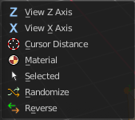
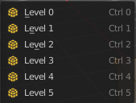

***************************************************************
7.1.9 Editors - 3D View - Header - Mesh - Edit mode - Mesh menu
***************************************************************

.. contents:: Contents

Detailed Table of content
=========================

Edit Mode - Mesh Menu
=====================

The Mesh Menu in Edit Mode contains the tools to manipulate the mesh geometry in Edit mode. It just exists for Mesh Objects.

.. image:: graphics/7.1.9_Editors_-_3D_View_-_Header_-_Mesh_-_Edit_mode_-_Mesh_menu/10000201000001560000010FB5751106237FFCDB.png

Lots of functionality that could also belong here can also be found in the Tool Shelf. The difference is that the tools in the tool shelf are easier to access. And so it contains the most used tools for the daily work. While the Mesh menu contains the not so often used tools. Or tools where you use the hotkey anyway. Delete for example.

Transform
=========

.. image:: graphics/7.1.9_Editors_-_3D_View_-_Header_-_Mesh_-_Edit_mode_-_Mesh_menu/10000201000000A8000000EEA159293519CDDEFE.png

To Sphere
---------

Shapes a selection of objects into the shape of a sphere. The calculation happens with the object origins.

In Object mode this tools requires to have more than one object selected. 

Usage
-----

Select the vertices, activate the tool, then drag the mouse in the 3D viewport. In the header you will read the current factor then. Which tells you how close you are towards the sphere shape.

.. image:: graphics/7.1.9_Editors_-_3D_View_-_Header_-_Mesh_-_Edit_mode_-_Mesh_menu/10000201000000920000002B567D115A122ADB2E.png

Last Operator To Sphere Panel
-----------------------------

Factor
------

The factor to transform the selection into a shape form.

Proportional editing
--------------------

Enables proportional editing. Activating proportional editing reveals further settings.

Proportional Falloff
--------------------

Here you can adjust the falloff methods.

Proportional Size
-----------------

Here you can see and adjust the falloff radius.

Connected
---------

The proportional falloff gets calculated for connected parts only.

Projected(2D)
-------------

The proportional falloff gets calculated in the screen space. Depth doesn't play a role. When it's in the radius, then it gets calculated.

Shear
-----

Shear shears the selection.

Last Operator Shear
-------------------

Offset
------

Here you can adjust an offset.

Shear Axis
----------

The shear tool works along a imaginary 2d plane. The shear axis controls if the itemas are sheared along the x or the y axes of this plane. This is the plane along which the transformation happens. You can shear along the x or the y axis of this plane.

To make things even more complicated, the orientation of this imaginary plane is defined by the Axis and Axis Ortho items below.

Axis
----

Defines one axis of the imaginary shear axis plane.

Axis Ortho
----------

Defines the other axis of the imaginary shear axis plane.

Orientation
-----------

Here you can choose the orientation for the shear action.

Proportional editing
--------------------

Enables proportional editing. Activating proportional editing reveals further settings.

.. image:: graphics/7.1.9_Editors_-_3D_View_-_Header_-_Mesh_-_Edit_mode_-_Mesh_menu/1000020100000119000000773CD5255E7E68F4C5.png

Proportional Falloff
--------------------

Here you can adjust the falloff methods.

Proportional Size
-----------------

Here you can see and adjust the falloff radius.

Connected
---------

The proportional falloff gets calculated for connected parts only.

Projected(2D)
-------------

The proportional falloff gets calculated in the screen space. Depth doesn't play a role. When it's in the radius, then it gets calculated.

Bend
----

Bends the selection.

Push/Pull
---------

It pushes or pulls the object positions relative to the center of the selection.

In Object mode this tool requires to have more than one object selected. 

Last Operator Push/Pull
-----------------------

Factor
------

Here you can adjust the strength of influence of the tool.

Proportional editing
--------------------

Enables proportional editing. Activating proportional editing reveals further settings.

Proportional Falloff
--------------------

Here you can adjust the falloff methods.

Proportional Size
-----------------

Here you can see and adjust the falloff radius.

Connected
---------

The proportional falloff gets calculated for connected parts only.

Projected(2D)
-------------

The proportional falloff gets calculated in the screen space. Depth doesn't play a role. When it's in the radius, then it gets calculated.

Warp
----

Warps a mesh selection between two defined points.

Last operator Warp
------------------

Warp Angle
----------

The strength of the warp effect

Offset Angle
------------

A offset angle to bend sidewards.

Min 
----

The start point.

Max
---

The end point.

Randomize Transform
-------------------

This tool allows randomizes the positions of the selected vertices. 

Last Operator Randomize Transform
---------------------------------

Amount
------

Here you can adjust the amount.

Uniform
-------

The uniform offset distance. 

Normal
------

Align the offset direction to the normals.

Random Seed
-----------

The seed value for randomization.

Skin Resize
-----------

This tool requires to have a skin modifier at the mesh. It scales the thickness of the skin.

While the operation you will see in the header the strength value for the skin.

Last Operator Skin Resize
-------------------------

Vector
------

Here you can adjust the position values for the three values.

Scale X, Y, Z
-------------

Here you can limit the position relative to the source object.

Orientation
-----------

Orientation is a drop-down box where you can choose the type of orientation for the mirroring action.

Proportional editing
--------------------

Enables proportional editing. Activating proportional editing reveals further settings.

Proportional Falloff
--------------------

Here you can adjust the falloff methods.

Proportional Size
-----------------

Here you can see and adjust the falloff radius.

Connected
---------

The proportional falloff gets calculated for connected parts only.

Projected(2D)
-------------

The proportional falloff gets calculated in the screen space. Depth doesn't play a role. When it's in the radius, then it gets calculated.

Shrink/Fatten
-------------

Shrink/Fatten scales the selected geometry along its normals. Transform orientation and Pivot point gets ignored.

A positive value pushes the vertices outwards. A negative value pushes the vertices inwards.

Last Operator Shrink/Fatten
---------------------------

The Last Operator Shrink/Fatten panel gives you tools to adjust the Shrink/Fatten operation. Here you have numeric input for the strength and a few more options.

Offset
------

Offset is the strength of the offset for Shrink/Fatten.

Offset Even
-----------

Offset Even scales the selection to give more thickness in even areas.

Proportional editing
--------------------

Enables proportional editing. Activating proportional editing reveals further settings.

Proportional Falloff
--------------------

Here you can adjust the falloff methods.

Proportional Size
-----------------

Here you can see and adjust the falloff radius.

Connected
---------

The proportional falloff gets calculated for connected parts only.

Projected(2D)
-------------

The proportional falloff gets calculated in the screen space. Depth doesn't play a role. When it's in the radius, then it gets calculated.

Move Texture Space
------------------

This tool relies at the move tool. With the difference that it moves the texture space instead of the object. It has also a very special use case, and just works with a material with a Texture Coordinate / Generated node. And requires to have the shading at Material or Rendered to see a result in the viewport.

.. image:: graphics/7.1.9_Editors_-_3D_View_-_Header_-_Mesh_-_Edit_mode_-_Mesh_menu/10000201000000670000001C082440F4E84BF28E.png

In the viewport you will see the UV cage in black color. In the header you will see the values for the current position of the UV cage.

.. image:: graphics/7.1.9_Editors_-_3D_View_-_Header_-_Mesh_-_Edit_mode_-_Mesh_menu/10000201000001520000001C4E92E015F53A0F84.png

Note that once done and applied, there is no way to reset the UV cage back to zero. When you repeat the operation, then the values will start at 0 again. Even when the UV cage is already offset.

Last Operator Translate
-----------------------

Move X, Y Z
-----------

Here you can limit the position relative to the source object.

Orientation
-----------

Orientation is a drop-down box where you can choose the type of orientation for the mirroring action.

Proportional editing
--------------------

Enables proportional editing. Activating proportional editing reveals further settings.

Proportional Falloff
--------------------

Here you can adjust the falloff methods.

Proportional Size
-----------------

Here you can see and adjust the falloff radius.

Connected
---------

The proportional falloff gets calculated for connected parts only.

Projected(2D)
-------------

The proportional falloff gets calculated in the screen space. Depth doesn't play a role. When it's in the radius, then it gets calculated.

Scale Texture Space
-------------------

This tool relies at the scale tool. With the difference that it scales the texture space instead of the object. It has also a very special use case, and just works with a material with a Texture Coordinate / Generated node. And requires to have the shading at Material or Rendered to see a result in the viewport.

.. image:: graphics/7.1.9_Editors_-_3D_View_-_Header_-_Mesh_-_Edit_mode_-_Mesh_menu/10000201000000670000001C082440F4E84BF28E.png

In the viewport you will see the UV cage in black color. In the header you will see the values for the current position of the UV cage.

.. image:: graphics/7.1.9_Editors_-_3D_View_-_Header_-_Mesh_-_Edit_mode_-_Mesh_menu/10000201000001520000001C4E92E015F53A0F84.png

Note that once done and applied, there is no way to reset the UV cage back to zero. When you repeat the operation, then the values will start at 0 again. Even when the UV cage is already offset.

.. image:: graphics/7.1.9_Editors_-_3D_View_-_Header_-_Mesh_-_Edit_mode_-_Mesh_menu/10000201000003E1000001989B188B3DC790D0A9.png

Last Operator Resize Texture
----------------------------

Move X, Y Z
-----------

Here you can limit the position relative to the source object.

Orientation
-----------

Orientation is a drop-down box where you can choose the type of orientation for the mirroring action.

Proportional editing
--------------------

Enables proportional editing. Activating proportional editing reveals further settings.

Proportional Falloff
--------------------

Here you can adjust the falloff methods.

Proportional Size
-----------------

Here you can see and adjust the falloff radius.

Connected
---------

The proportional falloff gets calculated for connected parts only.

Projected(2D)
-------------

The proportional falloff gets calculated in the screen space. Depth doesn't play a role. When it's in the radius, then it gets calculated.

Set Dimensions
--------------

Edit Mode Only!

Normally all scale operations in Bforartists are relative to the current selection and dimensions. And you always start with a relative value of 1.

Set dimensions allows to scale mesh selections in absolute world values. No matter how the initial values are. The new values gets set in the Last Operator.

Set dimensions is an add-on. You can turn it off in the add-ons section of the user preferences when you want.

Last Operator Set Dimensions
----------------------------

New Dimensions
--------------

When you activate the tool then you will see the world coordinates of the selection. Here you can change the values to other world coordinates.

Mirror
======

Mirror mirrors the selected geometry along the defined axis. 

.. image:: graphics/7.1.9_Editors_-_3D_View_-_Header_-_Mesh_-_Edit_mode_-_Mesh_menu/10000201000000A8000000C897B4081B4E096A22.png

Interactive Mirror
------------------

Mirror by hotkeys. You activate the tool, type in x for x global for example, or x x for x local. And the selection gets mirrored

X Global, Y Global etc.
-----------------------

Mirrors the selection around the chosen axis.

Last Operator Mirror
--------------------

The Last Operator Mirror panel gives you tools to adjust the mirror action.

.. image:: graphics/7.1.9_Editors_-_3D_View_-_Header_-_Mesh_-_Edit_mode_-_Mesh_menu/100002010000011A000000A70C62EB24315CDC77.png

Orientation 
------------

Orientation is a drop-down box where you can choose the type of orientation for the mirroring action.

Constraint Axis
---------------

Constraint Axis gives you again the possibility to define the mirror axis. You can choose more than one axis here.

Proportional editing
--------------------

Enables proportional editing. Activating proportional editing reveals further settings.

Proportional Falloff
--------------------

Here you can adjust the falloff methods.

Proportional Size
-----------------

Here you can see and adjust the falloff radius.

Connected
---------

The proportional falloff gets calculated for connected parts only.

Projected(2D)
-------------

The proportional falloff gets calculated in the screen space. Depth doesn't play a role. When it's in the radius, then it gets calculated.

Mirror Vertex Group
-------------------

This tool requires to have a vertex group assigned. It mirrors the selected vertex group.

This tool works only with a perfectly symmetrical mesh along the local X axis. Vertices that have no corresponding vertex on the other side will not be affected.

Last Operator Mirror Vertex Group
---------------------------------

Mirror Weights
--------------

Mirrors the Weight Painting informations from the symmetrical counterpart. When both are selected it will become a group and weight information exchange. If only one is selected, then the information from the unselected vertice will go to the selected vertice.

Flip Group Names
----------------

Flip selected group names. This works with vertex groups with symmetrical name conventions. Like .L , .R, right, left.

All Groups
----------

Pass information to all groups instead of the active one.

Topology Mirror
---------------

Use topology based mirroring.

Snap
====

.. image:: graphics/7.1.9_Editors_-_3D_View_-_Header_-_Mesh_-_Edit_mode_-_Mesh_menu/10000201000000DD000000B2EBA6A7D76926CCBF.png

Here you can choose several methods to snap one element to another. The menu items should be self explaining.

Last Operator Snap
------------------

Some snap operations shows a last operation panel, some not.

.. image:: graphics/7.1.9_Editors_-_3D_View_-_Header_-_Mesh_-_Edit_mode_-_Mesh_menu/10000201000001190000003B7E6A699CC42AE3C5.png

Offset
------

If the selection should snap as a whole, or if each individual element of the selection should snap.

Single Operators
================

Duplicate
---------

Duplicates the current selection.

When you duplicate a selection, then it sticks to the mouse until you left click. And moves around. A right click repositions the duplicated geometry at its original location.

Last Operator Duplicate
-----------------------

Mode
----

Not to find out. No tooltip, no entry in the Blender manual. Good Job Blender Developers.

Move X, Y, Z
------------

Here you can adjust the position.

Orientation 
------------

Orientation is a drop-down box where you can choose the type of orientation for the mirroring action.

Constraint Axis
---------------

Constraint Axis gives you again the possibility to define the mirror axis. You can choose more than one axis here.

Proportional editing
--------------------

Enables proportional editing. Activating proportional editing reveals further settings.

Proportional Falloff
--------------------

Here you can adjust the falloff methods.

Proportional Size
-----------------

Here you can see and adjust the falloff radius.

Connected
---------

The proportional falloff gets calculated for connected parts only.

Projected(2D)
-------------

The proportional falloff gets calculated in the screen space. Depth doesn't play a role. When it's in the radius, then it gets calculated.

Split
-----

Split splits the edges between the selected vertices. It creates two edges out of one. And splits the edge by that. 

The mode doesn't matter. There will always the edges be splitted.

Bisect
------

Bisect cuts geometry along a plane. This description is a bit misleading though. You simply cut through the whole geometry by defining a line. And the cut goes through the geometry from the current view.

When you release the mouse then a widget appears with which you can position the cut.

Last Operator Bisect
--------------------

Plane Point
-----------

Defines the start point of the Bisect cut.

Plane Normal
------------

The direction in which the bisect points.

Fill
----

Fills the cut.

Clear Inner
-----------

Removes the inner part of the face to cut.

Clear Outer
-----------

Removes the outer part of the face to cut.

Axis threshold
--------------

Axis threshold.

Knife Project
-------------

Knife Project uses an object as a knife to cut edges into a mesh. 

Usage: Create a cube. Create a circle. Rotate the circle by 90 degrees, and move it in front of the cube so that it does not overlap the cube. Now go into front view. Select circle, hold down shift, select Cube. Enter Edit Mode. Click the Knife Project tool.

.. list-table::

	* - 	  - 	  - 	  - 

Last Operator Knife Project
---------------------------

Cut through
-----------

The cut goes through the whole object when the Cut through checkbox is ticked.

.. image:: graphics/7.1.9_Editors_-_3D_View_-_Header_-_Mesh_-_Edit_mode_-_Mesh_menu/100002010000011C000001120E21B941CA4BA56C.png

Convex Hull
-----------

Creates a convex hull around the outside of selected vertices. The old faces and inlaying vertices gets removed.

Last Operator Convex Hull
-------------------------

Delete Unused
-------------

Removes vertices that are not part of the convex geometry.

Use existing Faces
------------------

Use existing input faces that lies on the hull where possible. This option allows to have N-Gons in the convex hull.

Make Holes
----------

Deletes edges and faces in the hull that were part of the input. This allows to delete faces between the existing mesh and the convex hull.

Join Triangles
--------------

Joins adjacent triangles into quads.

Max Face Angle 
---------------

Max Face Angle belongs to the Join Triangles setting. Here you can set the maximum face angle.

Max Shape Angle
---------------

Max Face Angle belongs to the Join Triangles setting. Here you can set the maximum shape angle.

Compare UV's
------------

Takes existing UV patches for the calculation into account.

Compare Vcols
-------------

Takes existing Vertex colors for the calculation into account.

Compare Seam
------------

Takes existing seams for the calculation into account.

Compare Sharp
-------------

Takes existing sharp edges for the calculation into account.

Compare Materials
-----------------

Takes existing materials for the calculation into account.

Symmetrize
----------

The Symmetrize tool mirrors the selected geometry symmetrical along a world axis.

Last Operator Symmetrize
------------------------

Direction
---------

Direction is a drop down box where you can define the mirroring direction.

Threshold
---------

Here you can adjust a distance after which the mirroring should happen, relative to the mirror axis. 0 means it mirrors the geometry directly at the axis.

Snap to Symmetry
----------------

Tries to snap the selected vertices symmetrical along the chosen world orientation. 

Last Operator Snap to Symmetry
------------------------------

Direction
---------

The calculation direction. 

Threshold
---------

The threshold defines the radius in which matching vertices gets located. When you get a warning that snapping failed try increasing the threshold value.

Factor
------

The snapping factor. Blend mirrored locations from one side to the other. 0.5 is blending both sides equal.

Center
------

Snap vertices in the center axis to zero.

Smart Delete
------------

Smart delete deletes what is selected in an intelligent way. When you for example delete an edge then the edge gets deleted. But it also deletes the vertices connected to this edge. It performs a Dissolve operation under the hood.

.. image:: graphics/7.1.9_Editors_-_3D_View_-_Header_-_Mesh_-_Edit_mode_-_Mesh_menu/10000201000001A8000000E460F9C3D47718DA63.png

There is also a Delete and Dissolve menu in the Mesh menu, where you can choose different methods for deleting if required.

Smart delete is an addon. And can be deactivated if desired.

Normals
=======

This menu contains functionality about dealing with normals. Normals influences the shading and the direction of a face. They can point inwards or outwards. And edges can be split. So that two adjacent faces have a sharp edge.

You can activate the display of normals in the Overlays panel in Edit mode.

Recalculate Outside
-------------------

Recalculates the normals of the selected geometry so that everything points outwards.

Last Operator Recalc Outside
----------------------------

Inside
------

Inside recalculates the normals of the selected geometry so that everything points inwards.

Recalculate Inside
------------------

Recalculates the normals of the selected geometry so that everything points inwards.

Flip
----

Flips the direction of the normals of the selected geometry.

Set from Faces
--------------

Sets the vertex normals from the selected faces. This tool requires to have Autosmooth activated!

Rotate 
-------

Rotate the normals of the selected vertices manually.

Last Operator Rotate Normals
----------------------------

Angle
-----

The angle of the selected normal(s).

Axis
----

The axis to rotate around.

Orientation
-----------

Here you can choose the type of orientation, in which coordinate system the action should happen.

Constraint Axis
---------------

Constraint specific axis.

Point Normals to Target
-----------------------

All vertex normals will point to a specific target. This target can be chosen from hotkeys. They show in the header.

Pressing R for Reset will reset the normals to where they were before the operation.

Last Operator Point Normals to Target
-------------------------------------

Invert
------

The normal directions are reversed from what is specified.

Align
-----

All normals will point in the same direction.

Target
------

The target position.

Spherize
--------

Each normal will be interpolated between its original value and the direction to the target.

Merge
-----

Merge all of the normals at selected vertices, making one average normal for all of the faces.

Split
-----

Split the normals at all selected vertices so that there are separate normals for each face, pointing in the same direction as those faces.

Average
-------

Average all of the normals in each fan of faces between sharp edges at a vertex.

Custom Normal
-------------

Take the average of vertices normals.

Face Area
---------

Set all vertices normals by face area.

Corner Angle
------------

Set all vertices by corner angle.

Last Operator Average Normals
-----------------------------

Type

Here you can choose the average type again.

Weigh
-----

Just for custom normals method. Weight applied by face.

Threshold
---------

Just for custom normals method. Threshold value for different weights to be considered as equal.

Copy Vectors
------------

Copys the normals of a single selected vertice. 

Paste Vectors
-------------

Pastes the normals from a formerly copied selected vertice to the currently selected vertice.

Last Operator Normals Vector Tools
----------------------------------

Absolute Coordinates
--------------------

When you paste normals then they get pasted relative to the current orientation of the selected vertice. With absolute coordinates the normals gets pasted in world coordinates.

Smoothen Vectors
----------------

Smooth custom normals towards the adjacent vertex normals.

Last Operator Smooth Normals Vectors
------------------------------------

Factor
------

Adjust how strong the smoothen should be.

Reset Vectors
-------------

Resets the normal of the selected element(s).

Select by Face Strength
-----------------------

Face strength gets used by the Weighted Normals modifier. See Face Influence checkbox.

Here you can select faces with either weak or medium or strong face strength.

Set Face Strength
-----------------

Face strength gets used by the Weighted Normals modifier. See Face Influence checkbox.

Here you can set selected faces to either a weak, a medium or a strong face strength.

Shading
=======

Sets the shading of the selected elements to either smooth or flat.

Shading is under the hood a normals operation.

Weights
=======

The Weights menu contains Weight tools. Those tools are meant to modify the weight mapping. At characters for example. The Weight Tools requires Vertex Groups to work with. Such Vertex groups gets created when you do weight painting at a character for example. Here is defined what bone is connected to what vertice.

In Edit Mode the weightmapping doesn't show. Here you work with the Vertex Groups.

In Weight paint mode the weight painting shows with colors. Here you usually paint the weighting.

This menu items also exists in Weight Paint mode.

.. image:: graphics/7.1.9_Editors_-_3D_View_-_Header_-_Mesh_-_Edit_mode_-_Mesh_menu/100002010000024B00000158E93BCE6A64FC1F70.png

Normalize All
-------------

While weight painting it can happen that a vertice gets several weightings assigned. Normalize all normalizes the weight of all Vertex groups so that the values for the single vertices in the sum is 1.

Last Operator Normalize all
---------------------------

Subset
------

Subset is a drop-down menu where you can choose the Subset method.

Lock Active
-----------

Keep the values of the active group while normalizing others.

Normalize
---------

Normalize normalizes the weight of the current selected Vertex group so that the values for the single vertices in the sum is 1. Means when there is influence from other groups, then those values are kept, but the one for the current group gets lowered so that the sum is 1.

The Last Operator Normalize panel has no adjustable settings.

Mirror
------

Mirror Vertex Group mirrors Vertex Groups and flips weights and/or names. It only edits selected Vertices. It flips when both sides are selected. Otherwise it copies from Unselected.

Last Operator Mirror Vertex Group
---------------------------------

Mirror Weights
--------------

With Mirror Weights ticked it mirrors the weights.

Flip Group Names
----------------

With Flip Group Names ticked it flips the Group names.

All Groups
----------

Mirrors all Vertex Groups

Topology Mirror
---------------

Uses topology based mirroring. This requires matching mirrored topology.

Invert
------

Invert inverts the weight painting for the selected vertex group.

Last Operator Invert Vertex Group
---------------------------------

Subset
------

Subset is a drop-down menu where you can choose the Subset method.

Add Weights
-----------

Add Vertices from Groups that have zero Weighting before inverting.

Remove Weights
--------------

Remove Vertices from Groups that have zero weight after inverting.

Clean
-----

Removes Vertex group assignments that are not required from the active vertex group.

Last Operator Clean Vertex Group
--------------------------------

Subset
------

Subset is a drop-down menu where you can choose the Subset method.

Limit
-----

Remove weights that are below or equal to the limit value.

.. image:: graphics/7.1.9_Editors_-_3D_View_-_Header_-_Mesh_-_Edit_mode_-_Mesh_menu/10000201000000A10000007DF3CA0CA96799137A.png

Keep Single
-----------

Keep Vertices assigned to at least one vertex group when cleaning.

Quantize
--------

Quantize quantizes the weight paint values. It starts with 4 steps. With a step of 1 you have a single vertex color, no matter how you have painted it before.

Last Operator Quantize
----------------------

Subset
------

Subset is a drop-down menu where you can choose the Subset method.

Steps
-----

Here you adjust in how many steps the weight paint colors should be divided.

Levels
------

Adds some offset to the Weight paint, and multiplys it with some gain.

Last Operator Vertex Group Levels
---------------------------------

Subset
------

Subset is a drop-down menu where you can choose the Subset method.

Offset
------

Here you adjust the offset.

Gain
----

Here you adjust the gain.

Smooth
------

Smooths the weight for selected vertices.

Last Operator Smooth Vertex Weights
-----------------------------------

Subset
------

Subset is a drop-down menu where you can choose the Subset method.

Factor
------

Here you adjust the factor.

Iterations
----------

Here you adjust how many iterations you use.

Expand/Contract
---------------

Expand or contract the weights.

Limit Total
-----------

Limit number of Weights per vertex. The lowest weights gets removed. 

This is of interest when you have for example five bones associated with a vertice. But your game engine just allows four ...

Last Operator Limit Number of Weights per Vertex
------------------------------------------------

Subset
------

Subset is a drop-down menu where you can choose the Subset method.

Limit
-----

Here you adjust how many weights are allowed.

Fix Deforms
-----------

Modify the position of selected vertices by changing only their respective group weights.

This tool may operate slow at too many vertices.

Last Operator Fix Deforms
-------------------------

Distance
--------

Adjust the distance.

Strength
--------

Adjust the strength.

Change Sensitivity
------------------

Adjust the sensitivity.

Sort Elements
=============

Sort Elements is a menu with different sorting methods. It allows you to reorder the mesh indices of the selected mesh elements by various methods.

The indices can be turned on in the Overlays menu in the Developer section.

View Z Axis
-----------

Sorts along the active view’s Z axis, from farthest to nearest. You can use **Reverse**if you want it the other way.

View Y Axis
-----------

Sorts along the active view’s Y axis, from farthest to nearest. You can use **Reverse** if you want it the other way.

Cursor Distance
---------------

Sorts from nearest to farthest away from the 3D cursor position.

Material
--------

Faces only! Sorts faces by their lowest material index up to highest material index. Order of faces inside each of those material groups remains unchanged.

Note that the **Reverse** option only reverses the order of the materials**. ****And** the order of the faces inside them.

Selected
--------

Moves all selected elements to the beginning without affecting their relative orders. Attention, this option will also affect unselected element indices!

Randomize
---------

Randomizes the indices of selected elements. This option does not affect the unselected elements.

Reverse
-------

Reverses the order of the selected elements.

Last Operator Sort Mesh Elements
--------------------------------

Sort Elements always brings up the same last operator. But with a small difference for Randomize and Reverse. Reverse has no checkbox. And Randomize has a Seed checkbox.

Type
----

This is a drop-down box where you can choose the sort method again.

Vertices, Edges or Faces
------------------------

Here you can adjust if the sort will affect the vertices, edges or faces.

Reverse Checkbox
----------------

Reverses the sorting.

Seed Edit box (Randomize only)
------------------------------

The seed option allows you to get another randomization – the same seed over the same mesh/set of selected elements will always give the same result! 

Subdivide
=========

Subdivide is a menu where you can quickly add and change a subdivision surface modifier with a predefined resolution in a quick way. Especially when you use the hotkey for it. The subdivision surface modifier panel can then as usual be found in the Properties editor in the Modifier tab.

Last Operator Subdivision Set
-----------------------------

Level
-----

Here you can set the level of subdivisions

Relative
--------

Applies the sub surf level as an offset to the already existing sub surf level.

Show / Hide
===========

The Show/Hide menu is available for all object types and in all modes. It is usually in the object related menu to find. In Object mode it's the Object menu, for a curve object in edit mode it is the Curve menu. It always contains three menu items. Show Hidden, Hide Selected and Hide Unselected.

Show Hidden
-----------

Makes all hidden elements in the scene visible again.

Hide Selected
-------------

Hides the selected elements.

Hide Unselected
---------------

Hides the not selected elements. The selected elements stays visible.

Last Operator Reveal Hidden / Hide Selected
-------------------------------------------

Select
------

Here you can define if the selected or the unselected elements gets hidden or revealed.

Separate
========

Separate separates the selected geometry, and creates a new object. The geometry becomes uneditable, since it is now a new object. You will have to leave the Edit mode, select the new object, and re-enter Edit mode when you want to edit it.

Selection
---------

Selection separates the current selection.

By Material
-----------

By Material separates all geometry that has the same material than the current selection.

By Loose Parts
--------------

By Loose parts separates all geometry that is connected by edges to the current selection.

Cleanup
=======

In the Cleanup menu you will find tools to clean up the current geometry.

Delete Loose
------------

Delete loose deletes not connected geometry. Vertices, Edges, and Faces. The tool starts with deleting Vertices and Edges. But you can tick Faces in the Last Operator too, and then it also removes not connected Faces.

Last Operator Delete Loose
--------------------------

Vertices
--------

Delete Vertices.

Edges
-----

Delete Edges.

Faces
-----

Delete Faces.

Decimate Geometry
-----------------

Decimate Geometry decimates the currently selected geometry. It starts with a Ratio of 1. Which means no decimation. The lower the ratio the more decimation you will get. The Decimate Modifier works with Tris!

Last Operator Decimate Geometry
-------------------------------

Ratio
-----

Here you can adjust the strength of decimation.

Vertex Group
------------

Use active Vertex Group as an influence. You need to have a Vertex Group.

Weight
------

Here you can adjust the Vertex Group Strength.

Invert
------

Invert Vertex Group Influence.

Symmetry
--------

Here you can make the decimation geometry symmetric along a chosen world axis.

Degenerate Dissolve
-------------------

Removes zero size Faces and Edges.

Make Planar Faces
-----------------

Make Planar Faces tries to make the selected faces planar. Quads or N-Gons for example can have vertices that are not planar. 

Last Operator Make Planar Faces
-------------------------------

Factor
------

Here you adjust how strong the influence should be.

Iterations
----------

Here you adjust how often it should repeat in the try to find a solution.

Split Non-Planar Faces
----------------------

Split Non Planar Faces splits up non planar Quads and N-Gons to end in planar faces.

Last Operator Split Non-Planar Faces
------------------------------------

Max Angle
---------

Here you can limit the action to a maximum angle.

Split Concave Faces
-------------------

Splits concave faces to make the geometry more stable. This tool is thought for N-Gons.

Merge by Distance
-----------------

Merges vertices that are very close to each other. The merge happens at the center. When you need more control then you should use the Merge Vertices tool.

Last Operator Merge by Distance
-------------------------------

Merge Distance
--------------

Here you can adusut the distance in which the vertices gets merged.

Unselected
----------

Merge selected vertices also with other unselected vertices.

Fill Holes
----------

Fill holes closes holes in the mesh geometry.

Fill holes can just calculate one face size at one time. So when you have several holes in the mesh, let's say one is a tri, and one is a quad, then you need to calculate twice.

Last Operator Fill Holes
------------------------

Sides
-----

Here you can define what face size will be filled.

Delete
======

The smart delete addon usually does the delete job already fine. It deletes the selected element(s).

There are sometimes some situations where you need more control over what you want to delete. The tools for this can be found in the Delete menu.

Vertices
--------

Deletes the selected vertices, and all with it connected edges and faces.

Edges
-----

Deletes the selected edges and the connected faces.

Faces
-----

This one works similar to the smart delete. It deletes the selected faces.

Only Edges and Faces
--------------------

This mode is of interest when you have more than one selection mode activated. It deletes then just the selected edges and faces. And not single vertices.

Only Faces
----------

This mode is of interest when you have more than one selection mode activated. Just selected faces gets deleted. Not single edges or vertices.

Edge Loops
----------

This method works similar to the smart delete tool. It deletes the edge loop. But it selects the faces of the edge ring. And the Last operator offers you the option to split off face corners.

Last Operator Delete Edge Loop
------------------------------

Face Split
----------

Split off face corners to maintain surrounding geometry.

Dissolve
========

Dissolve operations removes for examples selected vertices, edges and faces. But they are not delete operations. They are union tools. 

When you for example choose Delete vertices from the mesh menu, then the involved faces can get deleted too. When you choose Dissolve vertices, then the vertices gets removed, and the faces stays intact. The edges gets unioned.

Dissolve is a union operation.

Dissolve Vertices
-----------------

Dissolve Vertices dissolves the selected Vertices.

Note that pressing DEL in Vertice select mode calls Dissolve Vertices already. It's the same operator. But you don't get the Last operator that way.

Last Operator Dissolve Vertices
-------------------------------

Face Split
----------

Split off Face corners to maintain surrounding geometry

Tear Boundary
-------------

Split off Face corners instead of merging faces.

Dissolve Edges
--------------

Dissolve Edges dissolves the selected Edges.

Note that pressing DEL in Edge select mode calls Dissolve Edges already. It's the same operator. But you don't get the Last operator that way.

Last Operator Dissolve Edges
----------------------------

Dissolve Verts
--------------

When the dissolve operation leaves vertices behind, then this vertices will be dissolved too.

Face Split
----------

Split off Face corners to maintain surrounding geometry

Dissolve Faces
--------------

Dissolve Faces removes the inlaying edges of the selected faces. This faces becomes one big N-Gon.

Last Operator Dissolve Faces
----------------------------

Dissolve Verts
--------------

When the dissolve operation leaves vertices behind, then this vertices will be dissolved too.

Limited Dissolve
----------------

Limited Dissolve dissolves the selected Edges and Vertices, limited by the surrounding geometry.

Last Operator Limited Dissolve
------------------------------

Max Angle
---------

The limiting angle.

All Boundaries
--------------

All Boundaries dissolves in-between face boundaries.

Delimit
-------

You can also delimit by other methods than normals.

Edge Collapse
-------------

Edge Collapse collapses the selected edges to a vertice at the centre of the selection.

Mesh Select Mode
================

Mesh Select mode is a sub menu where you can set the current mesh select mode. Its functionality is equal to the mesh select mode buttons in the header. Just that you can't select more than one mode directly here. 

This menu just exists to show and to edit the hotkeys. Not to work with it.

