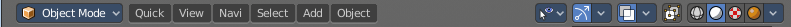
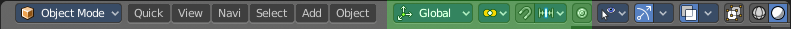
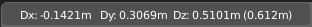
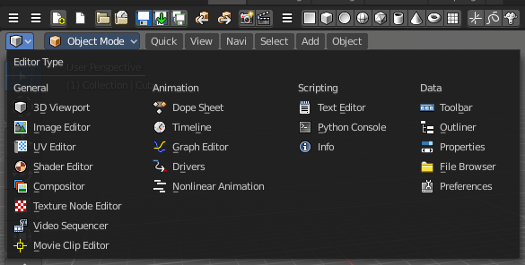
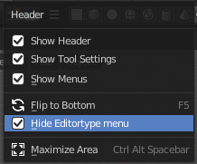

******************************
7.1 Editors - 3D View - Header
******************************

.. contents:: Contents

Introduction
============

The 3D View editor is the editor where you edit your 3D data. Here you can display and modify all the scene data like meshes, curves, metalballs, etc. 

It has by default a grid in the middle. And you can navigate around in this view. 

The 3D View has several areas. In this chapter we will cover the header area. Pink color.

.. image:: graphics/7.1_Editors_-_3D_View_-_Header/10000201000004000000030019FC93C9EC96020D.png

Header
======

The Header contains various menus, navigation elements and tools for the 3d view. This content vary, dependant of mode and object type. The Mesh menu just exists with a mesh object in Edit mode. The Object menu exists just in Object mode and so on.

The header is divided into three areas. Left is the mode dropdown box. At the right of it is the text menus. And at the right side you will find some scene related settings.

When the Tool Settings are hidden, the area above the header, then you will also see some object related settings from there.

The header not only provides tools and menus. It is also the place where you will see specific informations when you perform an operation. When you move an object for example, then the menus hides, and you will see the actual transformation values in the header in real time.

The text menus will be explained one by one and mode by mode in their own chapters.

Header right click menus
========================

The general right click menu functionality is explained in chapter 6 Editors introduction.

Editortype Menu
===============

Bforartist is made of several editor types. Headers can display a menu where you can switch to other editor types.

This menu is hidden by default. It is meant to edit the layouts, and should not be necessary for regular work. You can reveal it in the header right click menu. 

