**********************************
7.1 Editors - 3D View - Tool Shelf
**********************************

.. contents:: Contents

Detailed Table of content
=========================

Introduction
============

The 3D View is made of several areas.

Yellow is the Tool Shelf.Blue is the Header or Menu bar. It can be at the top or the bottom.

Green is the Viewport. Here you will see and work with your 3D data.

Red is the Properties Sidebar.

The content of the Tool Shelf , the Header and the Properties Sidebar can vary. It depends of the type of the objects and the modes that you are in.

This chapter here is about the Tool Shelf.

Tool Shelf
==========

The Tool Shelf is split into two areas. The upper area with the tabs is the actual tool shelf where you find your tools. It is also a usual place where add-ons gets installed, and adds their tab too.

The lower area is the so called Last Operator panel. Here you will find settings of various types. For example adjustable settings for a new created primitive. In other software you will get this settings before you perform the tool. In Blender you get the settings after you perform the tool.

The tool shelf shelf part is made of several tabs. Tabs and content is varying dependant of what object type you use, and in what object mode you are. We will go through the tools by modes and object types.

The tool shelf itself contains icon buttons by default. The tool tips tells you the name of the tool. But you can also turn the buttons into Text and Icon Buttons. Which makes it easier to recognize what is whatat the beginning. Or when you search for a specific tool and cannot remember the icon for it.

To display the buttons as pure icons or as icon and text buttons can be turned on or of in the Display tab in the Properties Sidebar at the right side of the 3D View.

The reference manual will in the following shots provide both, the icon button toolbars and the text and icon toolbars where necessary and available.

Tool Shelf in Object Mode
=========================

The Tool Shelf in Object Mode provides you the tools to work with the objects at object level. Things like position, rotation, scale, mirror, or join or group etc. . 

The Object mode is available for all object types. 

Tool Shelf in Object Mode - Tools Tab
=====================================

Edit Panel
----------

The Edit panel contains tools around editing the selected object(s) at object level. Mirroring, set Origin, etc.

Object Type Mesh, Curve, Surface
--------------------------------

Mirror
------

Mirror mirrors the selected geometry along the defined axis. Click the Mirror button, type in X, Y or Z, then confirm with enter.

Last Operator Mirror
--------------------

The Last Operator Mirror panel gives you tools to adjust the mirror action.

Constraint Axis
---------------

Constraint Axis gives you again the possibility to define the mirror axis. You can choose more than one axis here.

Orientation 
------------

Orientation is a drop-down box where you can choose the type of orientation for the mirroring action.

.. image:: graphics/7.1.xx_Editors_-_3D_View_-_old_Tool_Shelf/1000020100000090000000932D2EC1559DCA838C.png

Proportional Editing
--------------------

Proportional Editing is a drop-down box where you can choose to use proportional editing. When you choose one of the active methods then the neighbour geometry gets influenced by Shrink/Fatten too in a proportional way.

.. image:: graphics/7.1.xx_Editors_-_3D_View_-_old_Tool_Shelf/100002010000009C0000007DAE5F5F7DCA1CA15A.png

Proportional Editing Falloff
----------------------------

Proportional Editing Falloff is a drop-down box where you can choose a method for the falloff for the proportional editing.

Proportional size 
------------------

Proportional size is a edit box where you can adjust the strength of the Proportional falloff.

Edit Grease Pencil
------------------

Edit Grease Pencil edits the selected Grease Pencil strokes.

Confirm on Release
------------------

With Confirm on Release checked the action gets performed when you release the mouse button.

Join
----

The join tool unions the selected mesh parts to one object.

Join has no settings in the Last Operator panel.

Set Origin
----------

- Geometry to Origin sets the geometry to the origin.- Origin to Geometry sets the origin to the centre of the object.- Origin to 3D Cursor sets the origin to the 3D cursor.- Origin to centre of mass sets the origin to the centre of the mass of the object.

Last Operator Set Origin
------------------------

Type
----

Type is a drop-down box where you can again choose how you want to set the origin.

Centre 
-------

Centre is a drop-down box where you can choose to use the Bounding Box centre of the object, or the Median Centre. The two are not necessarily at the same location.

Shading 
--------

Smooth makes the shading of the object smooth. Last Operator Set Smooth has no settings.

Flat makes the shading of the object faceted. Last Operator Set Flat has no settings.

Auto Smooth
-----------

Auto Smooth just appears in the Shading section when you have a Mesh object selected. With Auto smooth you can define the angle after which the shading is set to smooth instead of faceted. It gives you fine control between the two extremes smooth and faceted.

You need to have the Shading set to Smooth. Then tick Auto Smooth. And then you can adjust behind what angle the shading is set to smooth instead of faceted with the angle slider.

Note that the Auto Smooth feature also exists in the Data Properties of the object.

Data Transfer
-------------

Contains the data transfer tools Data, Data Layout and UV Map

Data
----

Opens a Transfer Mesh data menu where you can choose different methods to transfer data layers from active to selected objects.

Last Operator Transfer Mesh Data
--------------------------------

Last Operator Transfer Mesh Data displays different content, dependant of what data you want to transfer. To document all possible combinations would be a manual at its own. So we will just show the content for Edge Data Sharp here.

Freeze Operator
---------------

Prevent changes to the settings when rerun the operator.

Data Transfer
-------------

Opens a Transfer Mesh data menu where you can choose different methods to transfer data layers from active to selected objects.

Create Data
-----------

Add Data Layers on Destination Meshes if needed.

Edge Mapping
------------

Edge Mapping is a drop-down box where you can choose the method for Edge Mapping

Auto Transform
--------------

Automatically compute transformation to get the best possible match between Source and Destination Object.

Object Transform
----------------

Evaluate Source and Destination object in Global Space.

Only Neighbour Geometry
-----------------------

Source Elements must be closer than given distance. This one reveals a Max Distance slider.

Ray Radius
----------

Width of Rays.

Mix Mode
--------

Mix Mode is a drop-down box where you can choose the Mix Mode.

Mix Factor
----------

A slider to adjust the Mix mode.

Data Layout
-----------

opens a menu where you can choose different methods to transfer the layout of data from active to selected objects.

Last Operator Transfer Mesh Data Layout
---------------------------------------

Last Operator Transfer Mesh Data displays different content, dependant of what data you want to transfer. To document all possible combinations would be a manual at

its own. So we will just show the content for Vertex Group here.

Data Type
---------

opens a menu where you can choose different methods to transfer the layout of data from active to selected objects.

Exact Match
-----------

Also delete some data layers from destination if necessary. So that it matches exactly the source.

Source Layers Selection
-----------------------

A drop-down box where you can choose which Layers to transfer.

Destination Layers Matching
---------------------------

A drop-down box where you can choose how to match source and destination layers.

Join UV's / UV Map
------------------

Transfers the UV map from selected to active object. Requires to have matching geometry and the same vertex order.

Select the target mesh. Hold Shift and click to add the source object to the selection. Then perform the tool. The target mesh will now have the UV map from the source object.

Object Type Meta ball, Lamp, Camera, Speaker, Empties, Force Fields
-------------------------------------------------------------------

Mirror
------

The Mirror tool mirrors the selected geometry. 

When activated type in x y or z to define the mirror axis. Then hit enter.

Last Operator Mirror
--------------------

The Last Operator Mirror panel gives you tools to adjust the mirror action.

Constraint Axis
---------------

Constraint Axis gives you again the possibility to define the mirror axis. You can choose more than one axis here.

Orientation 
------------

Orientation is a drop-down box where you can choose the type of orientation for the mirroring action.

Proportional Editing
--------------------

Proportional Editing is a drop-down box where you can choose to use proportional editing. When you choose one of the active methods then the neighbour geometry gets influenced by Shrink/Fatten too in a proportional way.

Proportional Editing Falloff
----------------------------

Proportional Editing Falloff is a drop-down box where you can choose a method for the falloff for the proportional editing.

Proportional size 
------------------

Proportional size is a edit box where you can adjust the strength of the Proportional falloff.

.. image:: graphics/7.1.xx_Editors_-_3D_View_-_old_Tool_Shelf/10000201000000BA000000D5C32417D7CA2D08A2.png

Edit Grease Pencil
------------------

Edit Grease Pencil edits the selected Grease Pencil strokes.

Confirm on Release
------------------

With Confirm on Release checked the action gets performed when you release the mouse button.

Tool Shelf in Object Mode - Create Tab
======================================

The Create tab provides you with some pre made objects. Mesh Objects, Lamps, Empties, etc. .

When you create a primitive then the Last Operator Panel shows some settings for this primitive. 

Note that those settings are not longer available when you perform any operation at the object. And be it to move the primitive. Some of those settings might still be available in the Properties editor. But things like create UV not. So when you want to adjust those settings, then do it immediately after creation.Several object types can be edited. A Mesh Primitive for example. They have different modes available then. Some not. Like an Empty. There is just the Object mode available for an Empty.

.. list-table::

	* - 

Mesh Panel
----------

Mesh
----

The Mesh section contains the primitives that are made of meshes.

Mesh primitives are a good starting point for polygon modelling.

Plane
-----

Plane creates a simple quad mesh

Last Operator Add Plane Panel
-----------------------------

Radius is in real the size of the plane.Generate UV's creates UV's for this primitive.Align to view aligns the Plane to the current view.Location Here you can adjust the location of the Plane.Rotation defines the rotation of the Plane.

Cube
----

Cube creates a Cube mesh.

Last Operator Add Cube Panel
----------------------------

Radius is in real the size of the Cube.Generate UV's creates UV's for this primitive.Align to view aligns the Cube to the current view.Location defines the location of the Cube.Rotation defines the rotation of the Cube.

Circle
------

Circle creates a Circle mesh.

Last Operator Add Circle Panel
------------------------------

Verticesdefines of how much vertices the circle is made.Radiusdefines the radius of the circle.Fill Type defines how the Circle mesh is filled.- Nothing means you have pure edge geometry.- N-Gon means that the circle face is a N-Gon face.- Triangle Fan means that the circle face is triangulated.Generate UV's creates UV's for this primitive.Align to view aligns the Circle to the current view.Location defines the location of the Circle.Rotation defines the rotation of the Circle.

.. image:: graphics/7.1.xx_Editors_-_3D_View_-_old_Tool_Shelf/10000201000000920000007BC18029A21018F187.png

UV Sphere
---------

UV Sphere creates a sphere mesh.

Last Operator Add UV Sphere Panel
---------------------------------

Segments defines of how much segments the sphere has vertically.Rings defines how much rings the sphere has horizontally.Size defines the radius of the UV Sphere.Generate UV's creates UV's for this primitive.Align to view aligns the Sphere to the current view.Location defines the location of the Sphere.Rotation defines the rotation of the Sphere.

Ico Sphere
----------

Ico Sphere creates a sphere mesh.

Last Operator Add Ico Sphere Panel
----------------------------------

Subdivisions defines the subdivision level of the Ico Sphere.Size defines the radius of the Ico Sphere.Generate UV's creates UV's for this primitive.Align to view aligns the Sphere to the current view.Location defines the location of the Sphere.Rotation defines the rotation of the Sphere.

Cylinder
--------

Cylinder creates a Cylinder mesh.

Last Operator Add Circle Panel
------------------------------

Verticesdefines of how much vertices the circle is made.Radiusdefines the radius of the Cylinder.Depth defines the length of the Cylinder.Cap Fill Type defines how the cap face is filled.- Nothing means you have no face at the top and the bottom of the Cylinder.- N-Gon means that the cap face is a N-Gon face.- Triangle Fan means that the cap face is triangulated.Generate UV's creates UV's for this primitive.Align to view aligns the Cylinder to the current view.Location defines the location of the Cylinder.Rotation defines the rotation of the Cylinder.

.. image:: graphics/7.1.xx_Editors_-_3D_View_-_old_Tool_Shelf/10000201000000920000007BC18029A21018F187.png

Cone
----

Cone creates a Cone mesh

Last Operator Add Cone Panel
----------------------------

Verticesdefines of how much vertices the circle is made.Radius 1defines the base radius of the Cone.Radius 2defines the top radius of the Cone.Depth defines the length of the Cone.BaseFill Type defines how the Base face is filled.- Nothing means you have no base face.- N-Gon means that the base face is a N-Gon face.- Triangle Fan means that the base face is triangulated.Generate UV's creates UV's for this primitive.Align to view aligns the Cone to the current view.Location defines the location of the Cone.Rotation defines the rotation of the Cone.

.. image:: graphics/7.1.xx_Editors_-_3D_View_-_old_Tool_Shelf/10000201000000920000007BC18029A21018F187.png

Torus
-----

Torus creates a Torus mesh

Last Operator Add Torus Panel
-----------------------------

Operator Presetsallows you to store presets for the Torus. So that you don't have to start from scratch when you need different tori with different setup. This presets are temporary. And cannot be stored between sessions.Align to view aligns the Cone to the current view.Location defines the location of the Torus.Rotation defines the rotation of the Torus.Major segmentsdefines the segment division of the Torus.Minor segmentsdefines the circle division of the Torus.Torus Dimensions defines the method to use when changing Major and Minor Radius.Major Radius changes the radius of the Torus.Minor Radiuschanges the thickness of the Torus.

Grid
----

Grid creates a subidividable plane mesh

Last Operator Add Grid Panel
----------------------------

X Subdivisionsdefines the number of subdivisions in x direction.X Subdivisionsdefines the number of subdivisions in Y direction.Radius is in real the size of the plane.Generate UV's creates UV's for this primitive.Align to view aligns the Plane to the current view.LocationHere you can adjust the location of the Plane.Rotation defines the rotation of the Plane.

Monkey
------

Monkey creates a monkey head mesh.

Last Operator Add Monkey Panel
------------------------------

Radius is in real the size of the Monkey head mesh.Align to view aligns the Monkey head mesh to the current view.Location Here you can adjust the location of the Monkey head mesh.Rotation defines the rotation of the Monkey head mesh.

.. list-table::

	* - 

Misc Panel
----------

The Misc Panel provides you with the buttons to create several types of objects. Here you will find mainly the objects that are not for modelling. But everything else. Lights, Bones, Camera, Empties etc.

And it containst the Group Instance menu and the legacy Add menu, which gets used for older addons. Quite a few, like the Sapling addon, places their entries here.

Text
----

Text creates a text object. Text is not mesh geometry. It is a special curve geometry.

.. Note:: ``Y``ou can enter the Edit mode with the standard hotkey. But you cannot switch back to Object mode with the standard hotkey. Since this hotkey gets count as input for the text object in Edit mode. You have to use the mode drop-down box to leave the Edit mode.

Last Operator Add Text
----------------------

Radius is in real the size of the Text object.Align to view aligns the Text object to the current view.Location Here you can adjust the location of the Text object.Rotation defines the rotation of the Text object.

Armature
--------

Armature creates a Armature. It adds the first bone of a skeleton.

Last Operator Add Armature
--------------------------

Radius is in real the size of the Armature object.Align to view aligns the Armature object to the current view.Location Here you can adjust the location of the Armature object.Rotation defines the rotation of the Armature object.

Lattice
-------

Lattice creates a Lattice. Which is a control cage to control deforming at another object.

Usage
-----

Create a Lattice object. Make sure it is bigger than the object that you want to deform, and is around this object. Add a Lattice Modifier to the object that you want to deform. In the Object box of the Lattice Modifier add our created Lattice object.

Select Lattice Object. Enter Edit mode. And here you can deform the Lattice Object now, and the object to deform will follow.

Last Operator Add Lattice object
--------------------------------

Radius is in real the size of the Lattice object.Type is a drop-down box where you can define the type of Lattice object.Align to view aligns the Lattice object to the current view.Location Here you can adjust the location of the Lattice object.Rotation defines the rotation of the Lattice object.

Camera
------

Camera creates a Camera object.

Last Operator Add Camera
------------------------

Location Here you can adjust the location of the Camera object.Rotation defines the rotation of the Camera object.

Speaker
-------

Speaker creates a Speaker object.

Last Operator Add Speaker
-------------------------

Location Here you can adjust the location of the Speaker object.Rotation defines the rotation of the Speaker object.

Group Instance
--------------

Group Instance is a drop-down box that contains the current groups. And you can add another instance of an existing group by clicking at the group in this drop-down list.

First create a group. It will display in the list. Then click at one of the list items to add an instance of the group to the scene.

Addons Add
----------

The Addons Add menu exists for historical reasons. Quite a few Blender addons adds their entries into this add menu. And so we have to keep it in Bforartists too. But it is now in the Tool Shelf, and not in the Header menu anymore like in Blender.

There are a handful of double menu entries left that cannot be removed for exact this reason. We would make some addons disfunctional.

.. list-table::

	* - 

Curve Panel
-----------

The Curve section contains the Curve primitives. Curves are handy to create curved shapes. Or a camera path. 

The curve types are very similar. But do have some small differences. The difference between Bezier and Nurbs is that with Bezier you have handlers at the curve. And with a Nurbs you have a control geometry to influence the curve.

Note that Curves is no mesh data. You have to convert the Curves data to Mesh data when you want to work with it like with a mesh. Note also that you cannot convert it back to curve then. 

Bezier
------

Bezier creates a Bezier type curve.

Circle
------

Circle creates a Bezier circle type curve.

Nurbs Curve
-----------

Nurbs Curve creates a Nurbs type curve.

Nurbs Circle
------------

Nurbs Circle creates a Nurbs type circle curve.

Path
----

Path creates a Nurbs type curve.

Last Operator Add Curve
-----------------------

The Last Operator add panel is for all curves equal.

Radius is in real the size of the curve.Align to view aligns the curve to the current view.Location Here you can adjust the location of the curve.Rotation defines the rotation of the curve.

Draw Curve
----------

Draw Curve is just active in Edit mode. 

.. list-table::

	* - 

Surface Panel
-------------

The Surface section contains the Surface primitives. Surfaces are some kind of curves. But curves with which you can construct surfaces. Surfaces are all of type Nurbs curves.

Surfaces are handy to construct curved surfaces.

Note that Surfaces similar to Curves is no mesh data. You have to convert the Surfaces data to Mesh data when you want to work with it like with a mesh. Note also that you cannot convert it back to Surface then. 

Nurbs Curve
-----------

Nurbs Curve creates a Nurbs type curve.

Nurbs Circle
------------

Nurbs Circle creates a Nurbs type circle.

Nurbs Surface
-------------

Nurbs Surface creates a Nurbs type Surface.

Nurbs Cylinder
--------------

Nurbs Cylinder creates a Nurbs type cylinder.

Nurbs Sphere
------------

Nurbs Sphere creates a Nurbs type sphere.

Nurbs Torus
-----------

Nurbs Torus creates a Nurbs type Torus.

Last Operator Add Surface
-------------------------

The Last Operator add panel is for all curves equal.

Radius is in real the size of the surface.Align to view aligns the surface to the current view.Location Here you can adjust the location of the surface.Rotation defines the rotation of the surface.

.. list-table::

	* - 

Metaballs Panel
---------------

Meta-balls are procedural primitives. They are not defined by vertices or curves. The interesting behaviour of meta-balls is that you can stick them into each other. And they have one surface then. Like merging two water drops. And this works in Object mode already.

Ball
----

Ball creates a meta-ball in Sphere shape.

Capsule
-------

Capsule creates a meta-ball in Capsule shape.

Plane
-----

Plane creates a meta-ball in Plane shape.

Ellipsoid
---------

Ellipsoid creates a meta-ball in Ellipsoid shape.

Cube
----

Cube creates a meta-ball in Cube shape.

Last Operator Add Meta ball
---------------------------

The Last Operator add panel is for all Meta-balls equal.

Primitive is a drop-down box where you can change the Meta ball type.Radius is in real the size of the surface.Align to view aligns the surface to the current view.Location Here you can adjust the location of the surface.Rotation defines the rotation of the surface.

Group Instance
--------------

Group Instance is a drop-down box that contains the current groups. And you can add another instance of an existing group by clicking at the group in this drop-down list.

First create a group. It will display in the list. Then click at one of the list items to add an instance of the group to the scene.

.. list-table::

	* - 

Lamp Panel
----------

The lamps brings light into your scene. There are five different Lamp types.

Point
-----

Point creates a Point Light. A point light shines into all directions.

Sun
---

Sun creates a light that behaves like a sun. It's a directional light.

Spot
----

Spot creates a Spot light. It's a directional light.

Hemi
----

Hemi creates a hemi light. It illuminates the whole scene.

Area
----

Area creates a Area light. It's a directional light.

Last Operator Add Lamp
----------------------

The Last Operator add panel is for all Lamps equal

Type is a drop-down box where you can change the light type.Radius is in real the size of the surface.Align to view aligns the surface to the current view.Location Here you can adjust the location of the surface.Rotation defines the rotation of the surface.

.. list-table::

	* - 

Empties Panel
-------------

An Empty is an object without any data attached. It is basically just a container. Empties can be used as anchor objects. Or as visible handlers at a skeleton for example. 

The empty types differs just by how they gets displayed in the viewport.

Last Operator Add Empty
-----------------------

Type is a drop-down box where you can define the type of Empty object.Radius is in real the size of the Empty object.Align to view aligns the Empty object to the current view.Location Here you can adjust the location of the Empty object.Rotation defines the rotation of the Empty object.

.. list-table::

	* - 

Force Field Panel
-----------------

A Force Field is for physical simulations. It provides you with tools to add different forces to objects. Wind, Smoke, Gravity, Magnetic, etc. .The added Force Fields can be further adjusted in the Properties panel then.

There is also the legacy dropdown menu available. it's a double menu, it contains the same buttons again. But some addons adds their entries here.

A Force Field is internally also called Effector. So our Last Operator panel has the title Add Effector.

Last Operator Add Effector
--------------------------

Type is a drop-down box where you can define the type of Effector.Radius is in real the size of the Effector.Align to view aligns the Text object to the Effector.Location Here you can adjust the location of the Effector.Rotation defines the rotation of the Effector.

.. list-table::

	* - 

Add Modals Panel
----------------

Add Modals allows you to create primitives with adjustable divisions in 3DS Max style. 

First you drag a rectangle in the 3D view. Then you drag the height. Then you adjust the divisions in the Last Operator.

Add Modals is an addon. You can turn it off in the User Preferences when you don't need it.

.. list-table::

	* - 

Mini Lightlib Panel
-------------------

Mini Lightlib is a little add-on that gives you some standard lighting settings for the Cycles renderer. It contains for example the classical three-point setup. But also some basic volumetrics examples.

It can be turned off in the User Preferences.

Select Asset
------------

The Select Asset drop-down box contains the assets that comes with Mini Lightlib. Here you can select what you want to load.

The assets are grouped by numbers. 

0 is everything setup. We have three backgrounds here. And the studio camera that fits to the setup.

1 are the light set-ups for a studio setup. From classical three-point to white.

2 is everything not studio setup.

3 are some volumetrics set-ups. Be very careful with this ones. Especially the Musgrave example renders eons.

4 is the included test asset. Some colored spheres.

Append Asset
------------

The Append Asset Button appends what is currently selected in the drop-down box to the scene.

Path Editbox
------------

The Path Edit box shows the path to the library. You will usually not touch this edit box. This edit box gives you a hint where the Mini Lightlib library is located. So that you can add your own assets to that folder. At Windows it's in the Appdata Directory. Which is usually hidden and protected. You might need to adjust your rights to access this folder directly.

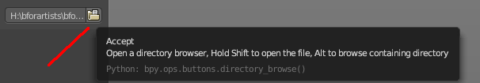

But it is also a Path selector. You can select other library folders here if you want, and append the assets from that folder. The Drop-down box will show the content of all blend files in this folder then.

Every blend file is also a library file. The add-on appends the content of this blend file then. To make your own library file is as easy as saving your blend file with your asset. That's already a library. But note that Mini Lightlib will append the whole content from this blend file. There is no filter as in the Blender append feature. So when you plan to create your own libraries, then take care to remove everything except the asset that you want to load.

.. image:: graphics/7.1.xx_Editors_-_3D_View_-_old_Tool_Shelf/100002010000008C00000026B35AADED054F199C.png

Note that changes in the Path Edit box are not permanent. The path to the Mini Lightlib is hard-coded. So when you restart Blender then every change is gone. That's also a quick method to get the original path to the light library back. Restart Blender.

Simple Usage
------------

Preparation
-----------

Make sure that you have the Cycles renderer selected!

Mini Lightlib is made for the Cycles renderer. It will not work with the Blender Internal renderer. At least not without adjustments.

Throw out all lights and cameras from the scene. 

We don't want to have the standard lights ruin the result. Also the standard camera does not fit to our studio setup. 

This can be done in the Outliner. Or you select the lights and camera in the viewport and hit delete.

Load Assets
-----------

Select in the drop-down box what you want to append. And append it one by one to the scene. 

.. image:: graphics/7.1.xx_Editors_-_3D_View_-_old_Tool_Shelf/10000201000001AB00000117229A11A0C3F2615B.png

Let's start with a studio setup. I suggest to use the bg white, which is a white background. The camera. One of the studio light set-ups. And finally our test asset to have something to render.

So we select bg white, and click at the Append Asset Button.

Then we select Studiocamera, and click at the Append Asset Button.

Then we select let's say the Studio White, and click at the Append Asset Button.

And then we select the Test asset Spheres, and click at the Append Asset Button. What's left is to click at the render button.

The available light set-ups
---------------------------

Here you can get an overview how the result looks like for the different lighting set-ups.

Be careful with the volumetrics examples. Especially the Musgrave example can render eons.

.. image:: graphics/7.1.xx_Editors_-_3D_View_-_old_Tool_Shelf/1000020100000400000002404CFAA00762AC50E6.png

.. image:: graphics/7.1.xx_Editors_-_3D_View_-_old_Tool_Shelf/100002010000040000000240B31215A901C806DF.png

Tool Shelf in Object Mode - Relations Tab
=========================================

The Relations tab contains all tools that has to do with relations between objects. Grouping, Parenting, etc. . 

Note that the Relations tab is empty when there is no object in the scene.

Relation settings also exists for every individual object in the Properties editor.

Group
-----

The Group section contains the group tools. Here you can to add and remove from a group. 

Grouped objects are coloured different in the Viewport. They show green instead of orange. They have no difference in the Outliner though.

New Group
---------

New Group creates a new group. When you have one or more objects selected, then this object(s) becomes part of the new group. You can name this Group in the Last Operator panel.

Last Operator Create New Group
------------------------------

Name is a edit box where you can change the name of the Group.

Add to Active
-------------

Add to Activeadds the selected object to the group of the selected object.

First select the object to add. Then shift select one object of the group where you want to add it. So that both are selected. Then press the Add To Active button, and choose the group name. And the object will be added to this Group.

Last Operator Add Selected to Active Group
------------------------------------------

Name is a edit box where you can change the name of the Group.

Remove from Group
-----------------

Remove from Group removes the selected object from the Group.

Select the object, then click the button and choose the Group where you want to remove it from.

Last Operator Remove from Group
-------------------------------

Name is a edit box where you can choose the group to remove from. 

Remove from Active
------------------

A object can be in more than one group. Remove from Active removes the selected object from the currently active Group.

Select the object, then click the button and choose the group where you want to remove it from.

Last Operator Remove from Group
-------------------------------

Name is a edit box where you can choose the group to remove from. 

Remove from All
---------------

Remove from All removes the selected object from all Groups.

Last Operator Remove from All has no settings.

Parent
------

The Parent section contains a tool to deal with parent child relationships. This includes things like sending an object along a curve. Or skinning an armature.

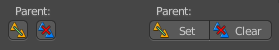

Child objects becomes part of the hierarchy of the parent object. You will see them in the outliner in the hierarchy of the parent object then. See image.

The usual way to parent an object is to select the child object, then shift click add the parent object to the selection, then click the Parent button, and finally choose the parenting method in the upcoming menu.

This menu has different content, dependant of what type the parent object is.

Set Parent to Mesh Object
-------------------------

When your parent object is of type mesh, then you will have the following parent options:

.. image:: graphics/7.1.xx_Editors_-_3D_View_-_old_Tool_Shelf/10000201000000AB00000077919987F214CA918C.png

Object
------

Object simply parents the current object to the target object.

Object (Keep Transform) 
------------------------

Object (Keep Transform) parents the current object to the target object, but keeps the transform intact.

Vertex
------

Vertex parents the current object to a vertex of the target object. The vertex will be chosen automatically, it's the closest vertice of the parent object. When you want to assign the object to a specific vertice, then you have to do the vertex parenting in Edit mode.

Vertex (Triangle)
-----------------

Vertex (Triangle) parents the current object to a face of the target object. The face will be chosen automatically. It's the closest face of the parent object. When you want to assign the object to a specific face, then you have to do the vertex parenting in Edit mode.

Last Operator Make Parent to mesh object
----------------------------------------

Type is a drop-down box where you can change the type of parenting. Note that this list also contains items that does not work for this object type parent relation.Keep Transform applies transformation before parenting.

Set Parent to Armature
----------------------

This is also known as skinning. When your parent object is of type mesh, then you will have the following parent options:

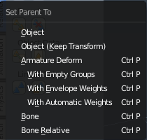

Object
------

Object simply parents the current object to the target object.

Object (Keep Transform) 
------------------------

Object (Keep Transform) parents the current object to the target object, but keeps the transform intact.

Armature Deform
---------------

Armature Deform parents the current object to the armature. But the mesh has no weighting of the vertices. And no groups.

With Empty Groups
-----------------

With Empty Groups parents parents the current object to the armature. But the mesh has no weighting of the vertices.

With Envelope Weights
---------------------

With Envelope Weights parents the current object to the armature. The mesh has weighting from the envelopes. When the mesh has vertices that are outside of the envelope, then this vertices has no weighting.

With Empty Groups
-----------------

With Empty Groups parents parents the current object to the armature. The mesh gets weighted automatically. All vertices are weighted. Even when vertices are outside of envelopes.

Bone
----

Bone parents parents the current object to the currently selected bone. The whole object is influenced by this single bone. When you edit the bones position in edit mode and switch to pose mode, then the child object will follow to the new position.

Bone Relative
-------------

Bone parents parents the current object to the currently selected bone. The whole object is influenced by this single bone. When you edit the bones position in edit mode and switch to pose mode, then the child object will not follow to the new position.

Last Operator Make Parent to Armature
-------------------------------------

Type is a drop-down box where you can change the type of parenting. Note that this list also contains items that does not work for this object type parent relation.X Mirror applies weight symmetrically along X axis for Envelope/ Automatic vertex group creation.Keep Transform applies transformation before parenting

Set Parent to Curve
-------------------

Curves can be used to define motion paths of objects. Curves can also be used to deform objects.

When your parent object is of type Curve, then you will have the following parent options:

Object
------

Object simply parents the current object to the target object.

Object (Keep Transform) 
------------------------

Object (Keep Transform) parents the current object to the target object, but keeps the transform intact.

Curve Deform
------------

Curve Deform parents the current object to the target object. It allows you to deform the object by moving it along the curve axis.

Follow path
-----------

Follow path parents the current object to the target object. The object becomes animated. The number of key frames can be adjusted in the Properties editor. Select the curve, click the Data tab, and in the Path Animation tab adjust the number of frames to your needs.

Path Constraint
---------------

No idea. Seriously, no idea what this should do and how it should work.

Vertex
------

Vertex parents the current object to a vertex of the target object. The vertex will be chosen automatically, it's the closest vertice of the parent object. When you want to assign the object to a specific vertice, then you have to do the vertex parenting in Edit mode.

Vertex (Triangle)
-----------------

Vertex (Triangle) parents the current object to a face of the target object. Problem is, a path has no faces. And so the operation will fail. Just ignore. It's a bug.

Last Operator Make Parent to Curve
----------------------------------

Type is a drop-down box where you can change the type of parenting. Note that this list also contains items that does not work for this object type parent relation.Keep Transform applies transformation before parenting.

Set Parent to other object types
--------------------------------

You can parent an object also to objects like lamps or an empty. 

Object
------

Object simply parents the current object to the target object.

Object (Keep Transform) 
------------------------

Object (Keep Transform) parents the current object to the target object, but keeps the transform intact.

Last Operator Make Parent to other object types
-----------------------------------------------

Type is a drop-down box where you can change the type of parenting. Note that this list also contains items that does not work for this object type parent relation.Keep Transform applies transformation before parenting.

Clear Parent
------------

Clear Parent
------------

Clear Parentclears the parent relation completely, including involved modifiers.

Clear and Keep Transformation
-----------------------------

Clear Parentclears the parent relation completely, including involved modifiers. But keeps the current visual transformation.

Clear Parent Inverse
--------------------

Clear ParentInverse resets the transform corrections applied to the parenting relationship. It does not remove the parenting itself. 

Last Operator Clear Parent
--------------------------

Type is a drop-down box where you can change the type of clearing. Same as the clear parent menu.

Object Data
-----------

The Object data section gives you tools to handle object data.

Link Data
---------

Link Data links the data from the selected to the active object.

Last Operator Link Data
-----------------------

Type is a drop-down box where you can choose what data type you want to link

Make Single User
----------------

Selected Objects makes the linked data local to each selected objects.

All makes the linked data local to all objects.

Last Operator Make Single User
------------------------------

Type is a drop-down box where you can choose if you want to handle selected objects or all objects.The checkboxes defines what data type you want to make local.

Link to SCN
-----------

Link to SCN is a dropdown box where you can link to a specific scene. Obviouisly you need to have more than one scene to be able to do so. But Blender just supports to load one scene at a time. You can however create more than one scene data block in such a single scene. And that's the scene that you can link to.

Link to SCN makes the same object exist in 2 different scenes at once, including its position and animation data. You can tell this is a **multi-user** object by the blue color of its center-circle

If you don’t want the objects to be shared between the scenes, you can make them **Single-User** by using the Make Single User button above the dropddown box.

To create a new scene data block see Properties Editor, Scene Tab, Scene Panel.

Last Operator Link Objects to Scene
-----------------------------------

Scene
-----

Scene is the same dropdown box like in the Relations panel. Here you can again adjust to which scene you want to link.

Linked Objects
--------------

Linked objects means the objects that you might have linked from other blend files. When you don't have linked data in your scene then this buttons are of no use.

Make Local
----------

**Make Local** copies the object data from the original blend file to the new file. And removes the link to the blend file. It calls a menu where you can choose a method.

Selected Objects makes the selected objects local.Selected Objects and Data makes the selected objects and its data local.Selected Objects, Data and Materials makes the selected objects, its data and its material local.

Make Proxy
----------

**Make Proxy** adds a new object and sets it as the parent of the linked data. This allows you to transform the empty while still retaining the link to the original blend file. The mesh is not editable though. T**he Object data block is cloned, but the Mesh data block is not.**

Tool Shelf in Object Mode - Animation Tab
=========================================

The animation tab gives you tools to work with animation. Here you can handle key frames, set keying set, etc.

Keyframes
---------

The Keyframes section allows you to insert and remove key frames, bake actions and clear all animation.

Insert 
-------

Insert inserts a keyframe. 

When your object does have a active keying set, then a click at the button inserts the keyframe directly. 

Insert Keyframe Menu
--------------------

The keying set defines what kind of key frames gets recorded. When you start with an animation, and your object does not have a keying set yet, then you will be prompted with a menu where you can choose the proper keying set. The Insert Keyframe menu.

For the meaning of the single items see Set Keying Set below. It's the same items.

Insert has no settings in the Last Operator panel.

Remove
------

Removes the current active keyframe for the selected object. You will get a confirmation dialogue here. 

Remove has no settings in the Last Operator panel.

Bake Action
-----------

Bake Action bakes the object animation to a new action.

Bake action calls a panel where you can adjust the settings for the new action.

Last Operator Bake Action
-------------------------

Start Frame
-----------

Defines the start frame for baking.

End Frame
---------

Defines the end frame for baking.

Frame Step
----------

Defines the frame step for baking.

Only Selected
-------------

Pose Baking only.

Visual Keying
-------------

Keyframe from the final transform.

Clear Constraints
-----------------

Remove all constraints from keyed objects / bones, and do visual keying.

Clear Parents
-------------

Bake animation onto the object, then clear parents (objects only)

Overwrite current Action
------------------------

Bake Action into current action instead of creating a new one.

Bake Data
---------

Which data transformations to bake to. You have the choice between Pose and Object here.

Clear 
------

Clears all animation, and removes all key frames for the selected object.

Clear has no settings in the Last Operator panel.

Set Keying Set
--------------

The keying set defines what kind of key frames gets recorded. Some keying sets have a specific purpose, and works just in specific context and with specific kind of objects.

A click at the set keying set button brings up a menu where you can choose the keying set. It is nearly the same menu as in the keying set drop-down box, and has the same functionality. With small differences. For example, the two items Whole Character and Available. 

Available is context sensitive. So when you cannot see it in the list, then you can't use it yet. And Whole Character is just available in Pose Mode.

Keying Set in detail:

Location
--------

Location records key frames for the location of the object, absolute in the world.

Rotation
--------

Rotation records key frames for the rotation of the object, absolute in the world.

Scale
-----

Scale records key frames for the scale of the object, absolute in the world.

LocRot
------

LocRot records key frames for the location and rotation of the object, absolute in the world.

LocScale
--------

LocScale records key frames for the location and scale of the object, absolute in the world.

LocRotScale
-----------

LocRotScale records key frames for the location rotation and scale of the object, absolute in the world.

RotScale
--------

RotScale records key frames for the rotation and scale of the object, absolute in the world.

Visual Location
---------------

Location records key frames for the location of the object, at 0/0/0 of the world.

Visual Rotation
---------------

Visual Rotation records key frames for the rotation of the object, at 0/0/0 of the world.

4Visual Scale
-------------

Visual Scale records key frames for the scale of the object, at 0/0/0 of the world.

Visual LocRot
-------------

Visual LocRot records key frames for the location and rotation of the object, at 0/0/0 of the world.

Visual LocScale
---------------

Visual LocScale records key frames for the location and scale of the object, at 0/0/0 of the world.

Visual LocRotScale
------------------

Visual LocRotScale records key frames for the location rotation and scale of the object, at 0/0/0 of the world.

Visual RotScale
---------------

Visual RotScale records key frames for the rotation and scale of the object, at 0/0/0 of the world.

Delta Location
--------------

Delta Location records key frames for the location of the object. It records the difference to the current location. Means local. 

Delta Rotation
--------------

Delta Rotation records key frames for the rotation of the object. It records the difference to the current rotation. Means local. 

Delta Scale
-----------

Delta Scale records key frames for the scale of the object. It records the difference to the current scale. Means local. 

Available
---------

Available records the keyframe in the current active keying set. This means that you need to have an active keying set already. The menu item is not available when you don't have an active keying set.

Motion Paths
------------

Objects can be animated. Let's say you send them from a to b to c. The object will move to b, then to c. Some kind of a path. This path is not visible by default. 

With motion paths you can calculate this path, and make it visible.

Calculate
---------

Calculate calculates the motion path of the selected object. It opens a panel where you can define the start and end frame of the calculation.

Last Operator Calculate Object Path
-----------------------------------

Start defines the start frame of the calculation.

End defines the end frame of the calculation.

Clear
-----

Clear remove the motion path from the object.

Tool Shelf in Object Mode - Physics Tab
=======================================

The Physics panel contains physics tools. It contains just one panel. Rigid Body Tools. You can do basic operations here. The setup has to happen in the Properties editor then.

Add / Remove
------------

Here you can add and remove rigid bodys. Rigid bodies are needed for physics in Bforartists. Think of it as invisible colliders for your object where the forces can work at.

Add Active
----------

Add Active adds a rigid body to the selected object. The type of this rigid body is active. This is useful for any actively moving object. Characters, bullets, etc.

Add Passive
-----------

Add Active adds a rigid body to the selected object. The type of this rigid body is passive. This is useful for any static object, like ground for example.

Last Operator Add Rigid bodies
------------------------------

The rigid body type is a drop-down box where you can choose if the type of the rigid body is active or passive.

Remove
------

Remove simply removes the rigid body from the current object. It has no Last Operator settings

Object Tools
------------

The Object tools gives you some tools for your rigid body.

Change shape 
-------------

Change Shape opens a pop-up menu where you can change the shape of your rigid body.

Last Operator Change Collision shape
------------------------------------

Rigid Body Shape is a pop-up menu where you can change the shape of your rigid body again.

Calculate Mass
--------------

Calculate Mass does NOT calculate the mass. But gives you a pop-up menu where you can choose between different predefined mass set-ups. The corresponding value will then be set in the physics settings in the Rigid Body settings.

Last Operator Calculate Mass
----------------------------

Material Preset is a pop-up menu where you can choose the type of preset again.

Density is the mass value from the Rigid Body panel.

Copy from Active
----------------

Copy from Active allows you to copy all the physics settings from the active object and apply it at the selected. First select the object that contains the physics settings. Then add the target object to the selection. Then press the button.

Apply visual transform
----------------------

Apply visual transform applies the visual transform to the object.

Bake to Keyframe
----------------

Bake to Keyframe bakes the whole physics animation to key frames. A click at the button brings up a menu where you can set the range and the number of frame steps. 

Constraints
-----------

Constraints allows objects and rigid bodys to interact with each other. It can act as a joint. Or limit the movement along one axis, etc. . 

Connect
-------

Connect connects rigid bodies. It creates a new **Empty** object named “Constraint”,which has a physics constraint already attached. And is pointing at the two selected objects. The setup has to happen in the Properties editor then.

Last Operator Connect Rigid Bodies
----------------------------------

Typeis a drop-down box where you can choose the type of the constraint.

Location is a drop-down box where you can choose the location of the constraint empty.

Connection is a drop-down box where you can choose the type of connection pattern.

Tool Shelf in Edit Mode
=======================

The Tool Shelf in Edit Mode provides you the tools to edit the objects. Things like modifying geometry, modify an armature, modify Curves or 3D text, etc. . 

Not all object types are editable. Editable object types are all object types in the Add Primitive panel. Mesh, Curve, Surface, Meta ball. In the Add Misc panel it's Text, Armature and Lattice from the Other category.

The tools differs from object type to object type. Even the available tabs differs. So in Edit mode we have to come from the Object type to explain the tabs and panels.

Tool Shelf in Edit Mode - Mesh Object, Relations Tab
====================================================

Relations Panel
---------------

The Relation panel contains tools around relations. In Edit Mode it's just Make Vertex Parent. 

.. image:: graphics/7.1.xx_Editors_-_3D_View_-_old_Tool_Shelf/100002010000013D000000559F31C285834F64B7.png

In Object mode select the object that you want to parent to a vertex. Shift select the parent object so that both are selected. Enter Edit mode. Then select one vertex for a single point. Or three for an area. Then click the Make Vertex Parent button to make the relation.

Tool Shelf in Edit Mode - Mesh Object, Tools Tab
================================================

The Tools tab contains the tools to edit the mesh object. It contains the panels Mesh Tools, Vertices Tools, Edge Tools, Faces Tools,Clean Up, Weight Tools, History and Bake. 

Which Bake panel is active is dependant of what render engine is selected. When it's cycles then you have the Cycles bake tools. When it's the Blender Render, then you have the Blender Render bake tools.

Mesh Tools Panel
----------------

The Mesh Tools Panel contains the tools to edit and manipulate the geometry of a mesh object.

There are four main tool groups in the Mesh Tools panel. Transform tools, Deform tools, Add tools, and Dissolve tools. The Transform tools at the top doesn't have a label.

Shrink/Fatten
-------------

Shrink/Fatten scales the selected geometry along its normals. Transform orientation and Pivot point gets ignored.

A positive value pushes the vertices outwards. A negative value pushes the vertices inwards.

Last Operator Shrink/Fatten
---------------------------

The Last Operator Shrink/Fatten panel gives you tools to adjust the Shrink/Fatten operation. Here you have numeric input for the strength and a few more options.

Offset
------

Offset is the strength of the offset for Shrink/Fatten.

Offset Even
-----------

Offset Even scales the selection to give more thickness in even areas.

Proportional Editing
--------------------

Proportional Editing is a drop-down box where you can choose to use proportional editing. When you choose one of the active methods then the neighbour geometry gets influenced by Shrink/Fatten too in a proportional way.

Proportional Editing Falloff
----------------------------

Proportional Editing Falloff is a drop-down box where you can choose a method for the falloff for the proportional editing.

Proportional size 
------------------

Proportional size is a edit box where you can adjust the strength of the Proportional falloff

Confirm on Release
------------------

With Confirm on Release checked the action gets performed when you release the mouse button.

Mirror
------

Mirror mirrors the selected geometry along the defined axis. Click the Mirror button, type in X, Y or Z, then confirm with enter.

Last Operator Mirror
--------------------

The Last Operator Mirror panel gives you tools to adjust the mirror action.

The Last Operator Mirror panel gives you tools to adjust the mirror action.

Constraint Axis
---------------

Constraint Axis gives you again the possibility to define the mirror axis. You can choose more than one axis here.

Orientation 
------------

Orientation is a drop-down box where you can choose the type of orientation for the mirroring action.

.. image:: graphics/7.1.xx_Editors_-_3D_View_-_old_Tool_Shelf/1000020100000090000000932D2EC1559DCA838C.png

Proportional Editing
--------------------

Proportional Editing is a drop-down box where you can choose to use proportional editing. When you choose one of the active methods then the neighbour geometry gets influenced by Shrink/Fatten too in a proportional way.

Proportional Editing Falloff
----------------------------

Proportional Editing Falloff is a drop-down box where you can choose a method for the falloff for the proportional editing.

Proportional size 
------------------

Proportional size is a edit box where you can adjust the strength of the Proportional falloff.

Edit Grease Pencil
------------------

Edit Grease Pencil edits the selected Grease Pencil strokes.

Confirm on Release
------------------

With Confirm on Release checked the action gets performed when you release the mouse button.

Mirror Vertex Group
-------------------

This tool requires to have a vertex group assigned. It tries to mirror for example existing Weight Painting from one side to the other.

This tool works only with a perfectly symmetrical mesh along the local X axis. Vertices that have no corresponding vertex on the other side will not be affected.

Use case: 

Let's say you have a rigged character, and do Weight Paint at one side of the mesh. Now you would have to repeat the Weight Painting at the other side. Instead, go to the vertex group panel in the Properties editor, and choose Copy Vertex Group (from the drop down menu) for each group you want to mirror. Then select the copy and choose Mirror Vertex Group.

Last Operator Mirror Vertex Group
---------------------------------

Mirror Weights
--------------

Mirrors the Weight Painting informations from the symmetrical counterpart. When both are selected it will become a group and weight information exchange. If only one is selected, then the information from the unselected vertice will go to the selected vertice.

Flip Group Names
----------------

Flip selected group names. This works with vertex groups with symmetrical name conventions. Like .L , .R, right, left.

All Groups
----------

Pass information to all groups instead of the active one.

Topology Mirror
---------------

Use topology based mirroring.

Symmetrize
----------

The Symmetrize tool mirrors the selected geometry symmetrical along a world axis.

Last Operator Symmetrize
------------------------

Direction
---------

Direction is a drop down box where you can define the mirroring direction.

Threshold
---------

Here you can adjust a distance after which the mirroring should happen, relative to the mirror axis. 0 means it mirrors the geometry directly at the axis.

.. list-table::

	* - 

Modify section
--------------

This section contains tools for general mesh modifications. 

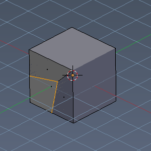

Extrude Region
--------------

The Extrude Region tool extrudes along the vertex normals. This leads at our standard cube with two selected faces and with a value of 1 to a extrude that goes inside of the mesh. 

The method works the same in all Mesh select modes.

Last Operator Extrude Region and Shrink/Fatten
----------------------------------------------

The Last Operator Extrude Region and Shrink/Fatten contains the tools to adjust the Extrude settings for the extrude method Region (Vertex Normals)

Extrude Individual Faces
------------------------

Just ignore, it's a bug. It's the title of the panel when you call this menu by a hotkey. Shrink/Fatten Offset

You have to read the two parts Shrink Fatten and Offset as one. Shrink Fatten Offset is a edit box where you can adjust the strength of the extrude offset numerically.

Offset Even
-----------

Scale the offset to give more even thickness.

Proportional Editing
--------------------

Proportional Editing is a drop-down box where you can choose to use proportional editing. When you choose one of the active methods then the neighbour geometry gets influenced by Shrink/Fatten too in a proportional way.

Proportional Editing Falloff
----------------------------

Proportional Editing Falloff is a drop-down box where you can choose a method for the falloff for the proportional editing.

Proportional size 
------------------

Proportional size is a edit box where you can adjust the strength of the Proportional falloff.

Confirm on Release
------------------

With Confirm on Release checked the action gets performed when you release the mouse button.

Individual Faces 
-----------------

The extrude method Individual Faces is the exact same method than the method Individual - In Face mode

Individual Faces extrudes the faces individually. When you for example select two faces at a cube, then the extrusion happens at both faces in their own direction, which is defined by the normals of the faces. And not as a whole in one shared direction.

Individual Faces works in all mesh select methods the same. It needs selected faces. Stand-alone vertices or edges gets ignored.

Last Operator Extrude Individual Faces and Move
-----------------------------------------------

The Last operator Extrude Individual Faces and Move contains the tools to adjust the Extrude Individual Faces settings. It shows when you use the Individual tool in Face mode. 

Extrude Individual Faces
------------------------

Just ignore, it's a bug. It's the title of the panel when you call this menu by a hotkey. 

Shrink/Fatten Offset
--------------------

You have to read the two parts Shrink Fatten and Offset as one. Shrink Fatten Offset is a edit box where you can adjust the strength of the extrude offset numerically.

Offset Even
-----------

Scale the offset to give more even thickness.

Proportional Editing
--------------------

Proportional Editing is a drop-down box where you can choose to use proportional editing. When you choose one of the active methods then the neighbour geometry gets influenced by Shrink/Fatten too in a proportional way.

.. image:: graphics/7.1.xx_Editors_-_3D_View_-_old_Tool_Shelf/100002010000009C0000007DAE5F5F7DCA1CA15A.png

Proportional Editing Falloff
----------------------------

Proportional Editing Falloff is a drop-down box where you can choose a method for the falloff for the proportional editing.

.. image:: graphics/7.1.xx_Editors_-_3D_View_-_old_Tool_Shelf/10000201000000BA000000D5C32417D7CA2D08A2.png

Proportional size 
------------------

Proportional size is a edit box where you can adjust the strength of the Proportional falloff.

Confirm on Release
------------------

With Confirm on Release checked the action gets performed when you release the mouse button.

Extrude Drop-down box
---------------------

The Extrude drop-down box contains the special Extrude methods. The methods that you don't use this often.

The available Extrude tools depends of the Mesh select mode. Edge, Vertice and Face select. And the tool works then of course for the current mode. Means when you are vertice select mode, then the extrude will extrude the vertices. But it also depends of what you have selected. And so you see different content in the drop-down box.

From left to right, with a whole cube selected: Vertices select mode, Edge select mode, Face select mode.

Dupli Extrude
-------------

Dupli Extrude is a two trick tool. With faces selected it creates a rotated copy of the geometry. With edges or vertices selected it extrudes to the mouse position. That's why it is a good idea to use this tool with the hotkey.

Dupli Extrude - with selected Faces
-----------------------------------

Dupli Extrude with selected faces creates a copy of the selection and rotates it slightly. 

Dupli Extrude - with selected Vertices
--------------------------------------

Dupli Extrude with selected vertices extrudes the vertice to the mouse position.

Extrude Region
--------------

Extrude region is the most common and most used extrude method. That's why it has a default hotkey. Shortcut S. It extrudes the whole selection into the direction of the middled normals of the selection.

Last Operator Region and Move
-----------------------------

The Last operator Extrude Individual Faces and Move contains the tools to adjust the Extrude Individual Faces settings. It shows when you use the Individual tool in Face mode. 

Extrude Region label
--------------------

Just ignore, it's a bug. It's the title of the panel when you call this menu by a hotkey. 

Translate Vector
----------------

You have to read the two parts Translate and Vectoras one. Here you can adjust the extrude amount by a vector.

Constraint Axis
---------------

Tick or untick X, Y Z to limit the extrusion to one or more axis. 

Orientation
-----------

Here you can adjust the orientation of the extrusion. It usually starts with Normal.

Proportional Editing
--------------------

Proportional Editing is a drop-down box where you can choose to use proportional editing. When you choose one of the active methods then the neighbour geometry gets influenced by Shrink/Fatten too in a proportional way.

Proportional Editing Falloff
----------------------------

Proportional Editing Falloff is a drop-down box where you can choose a method for the falloff for the proportional editing.

Proportional size 
------------------

Proportional size is a edit box where you can adjust the strength of the Proportional falloff.

Edit Grease Pencil
------------------

Edit Grease pencil ticked allows you to edit the grease pencil stroke.

Edit Texture Space
------------------

By default extrusion will not modify the UV mapping. With Edit texture Space ticked the UV mapping updates with the extrusion.

Confirm on Release
------------------

With Confirm on Release checked the action gets performed when you release the mouse button.

Extrude Individual - In Face mode
---------------------------------

Individual in Face mode extrudes the elements individually. When you for example select two faces at a cube, then the extrusion happens at both faces in their own direction, which is defined by the normals of the faces. And not as a whole in one shared direction.

Last Operator Extrude Individual Faces and Move
-----------------------------------------------

The Last operator Extrude Individual Faces and Move contains the tools to adjust the Extrude Individual Faces settings. It shows when you use the Individual tool in Face mode. 

Extrude Individual Faces
------------------------

Just ignore, it's a bug. It's the title of the panel when you call this menu by a hotkey. 

Shrink/Fatten Offset
--------------------

You have to read the two parts Shrink Fatten and Offset as one. Shrink Fatten Offset is a edit box where you can adjust the strength of the extrude offset numerically.

Offset Even
-----------

Scale the offset to give more even thickness.

Proportional Editing
--------------------

Proportional Editing is a drop-down box where you can choose to use proportional editing. When you choose one of the active methods then the neighbour geometry gets influenced by Shrink/Fatten too in a proportional way.

Proportional Editing Falloff
----------------------------

Proportional Editing Falloff is a drop-down box where you can choose a method for the falloff for the proportional editing.

Proportional size 
------------------

Proportional size is a edit box where you can adjust the strength of the Proportional falloff.

Confirm on Release
------------------

With Confirm on Release checked the action gets performed when you release the mouse button.

Extrude Individual in Edge and Vertice Mode
-------------------------------------------

For Individual in Edge and Vertice Mode see the extrude methods Edges only and Vertices only. It's the same functionality. 

Spin
----

The Spin tool extrudes the selection and spins it by a defined amount and segments. This amount and number of segments can be adjusted in the Last operator. It is best performed in a orthographic view from side. It depends of the view orientation when extruding out.

Last Operator Spin
------------------

Steps 
------

Steps is the number of segments.

Dupli 
------

With dupli checked the geometry gets duplicated instead of extruded. Angle

Angle defines the angle of the spin.

Centre
------

The Centre edit boxes defines the centre of the radius for the spin operation. In our example the X value is set to 2, and the Z value is set to 1.

Axis
----

Axis defines the extrude direction. With X and Z values you can twist the result.

Screw
-----

With the Screw tool you can extrude edges to a screw shape. Examples:

.. list-table::

	* - 	  - 	  - 

Last Operator Screw
-------------------

Steps 
------

Steps is the number of segments.

Turns
-----

Turns defines the repeating of the screw.

Centre
------

The Centre edit boxes defines the centre of the radius for the screw operation.

Axis
----

Axis defines the extrude direction. 

Inset
-----

Inset insets edges into the selected faces. Think of it as a extrude inwards the face.

Last Operator Inset
-------------------

Boundary
--------

With Boundary ticked you will get the connect edges in the corners.

Offset Even
-----------

Scales the offset to give more even thickness.

Offset Relative
---------------

Scales the offset by surrounding geometry.

Edge Rail
---------

Inset the region along existing edges.

Thickness
---------

Thickness adjusts the thickness of the inset geometry.

Depth
-----

With depth you can bevel the inset geometry. It is then not longer coplanar to the initial face.

Outset
------

With outset ticked the Inset will not extrude inwards but outwards.

Select Outer
------------

With Select Outer the outer ring will be selected after the Inset.

Individual
----------

Inset every face individually.

Interpolate
-----------

Blend Face Data across the inset.

Make Edge/Face
--------------

The Make Edge/Face tool adds a face when you have edges selected. And Edges when you have Vertices selected. It's a Bridge tool.

First select the edges or Vertices that you want to bridge. Then click the Make Edge/Face Button.

.. list-table::

	* - 	  - 
The Last Operator Make Edge/Face has no further options.

Bevel
-----

The Bevel Tool adds a bevel to the selected geometry. 

Usage: first select the geometry that you want to bevel. Then activate the tool. Don't wonder that the mouse movement does nothing. That's by design. Adjust the amount in the Last Operator Bevel panel.

Last Operator Bevel
-------------------

Amount type
-----------

Amount Type is a drop-down box where you can choose the Amount type for the bevel action.

Amount
------

The Bevel amount

Segments
--------

How many segments gets created

Profile
-------

Controls the Profile shape. 0.5 means round.

Vertex only
-----------

Bevel Vertices only.

Clamp Overlap
-------------

Do not allow bevelled geometry to overlap each other.

Loop Slide
----------

Prefer slide along edge to even widths.

Material
--------

Material for bevelled faces. -1 is the surrounding material.

Vertex Bevel
------------

Vertex Bevel is nothing else than Bevel. But with some pre adjustments to perform a vertex bevel directly. This saves some clicks. 

This means that the Last Operator is of course the same than the one from Bevel since it is Bevel.

Subdivide
---------

Subdivide divides the selected edges. It subdivides the involved faces too, and can create new vertices.

A more unknown functionality is that it can also randomize the result with the Fractal slider in the Last operator panel.

Last Operator Subdivide
-----------------------

Number of Cuts
--------------

The number of cuts defines the amount of subdivisions.

Smoothness.
-----------

This value defines how smooth the subdivision result is. From flat to bent.

Quad/Tri Mode
-------------

With this tool ticked it tries to prevent N-Gons while subdivision.

Quad Corner Type
----------------

Here you can adjust the corner type.

Fractal
-------

Randomize the selected vertices.

Along Normal
------------

When randomized, this value defines how strong the subdivision follows the normals of the initial vertices.

Random Seed
-----------

Randomizing value for fractal randomizing.

Bridge Edgeloops
----------------

The Bridge edgeloops tool bridges selected edges, and adds a polygon between them. You need to have at least two edges selected.

Last Operator Bridge Edgeloops
------------------------------

Connect Loops
-------------

Here you can choose the method how to deal with bridging multiple loops

Merge
-----

With merge ticked it will not create a bridge face, but merge the selected edges.

Merge Factor
------------

The merge factor determines at which distance between the selected edges the merge happens. 0.5 is the middle of the selected edges.

Twist
-----

The twist offset for closed loops.

Number of Cuts
--------------

Adds cuts to the bridge face.

Interpolation
-------------

Here you can choose the interpolation mode for the cuts.

Smoothness
----------

Here you can adjust the smoothness for the cuts.

Profile Factor
--------------

Here you can adjust the profile factor for the cuts.

Profile shape
-------------

Here you can adjust the profile shape for the cuts.

.. list-table::

	* - 

Cut Slide panel
---------------

This section contains tools around cut functionality.

Knife tool
----------

The Knife tool cuts the geometry, and adds edges. When it crosses existing geometry then it adds a vertice at the crossing point.

The Knife tool cuts across every geometry, selected or not.

Usage: activate the tool, left click to define the starting point. This can also be a point in the middle of a face. But ideally you choose an existing vertice or an edge as the start and endpoints. When done press Space bar to confirm.

Last Operator Knife Topology Tool
---------------------------------

There is no adjustable setting in the Last Operator Knife Topology Tool.

Just a hint that Redo is not supported for this operator. And the states of the checkboxes are displayed.

Knife Select Tool
-----------------

Knife Select tool works similar to the Knife tool. But it cuts just selected faces.

Last Operator Knife Topology Tool
---------------------------------

There is no adjustable setting in the Last Operator Knife Topology Tool.

Just a hint that Redo is not supported for this operator. And the states of the checkboxes are displayed. For Knife Select this checkboxes are checked different than for the normal knife tool.

Loop Cut and Slide
------------------

Loop Cut and Slide is a tool that works in two steps. In the first step you divide the selected geometry by a loop. When you left click, then the added loop becomes moveable along the edges.

Last Operator Loop Cut and Slide
--------------------------------

Number of Cuts
--------------

The number of cuts that gets added. It can be more than one loop at once.

.. image:: graphics/7.1.xx_Editors_-_3D_View_-_old_Tool_Shelf/10000201000000C0000000C00B29BD20AA34FC02.png

Smoothness
----------

This value defines how smooth the loop cut gets added. From flat to bent.

Falloff
-------

Here you can adjust the Falloff type for smoothness.

Edge Slide Factor
-----------------

Where the loop is centred.

Even 
-----

Make the edge loop match the shape of the adjacent edge loop

Flipped
-------

When Even mode is active, flips between the two adjacent edge loops.

Clamp
-----

Clamp within the edge extend.

Correct UV's
------------

Corrects the UV's when modifying the geometry.

Confirm on Release
------------------

With Confirm on Release checked the action gets performed when you release the mouse button.

Offset Edge Slide
-----------------

Edge slide slides the selected edge(s)

Usage: select the edges that you want to slide. Click to confirm. Then adjust the sliding amount in the Last Operator Offset Edge Slide.

Last Operator Offset Edge Slide
-------------------------------

Cap Endpoint 
-------------

Cap Endpoint caps the loose edges.

Edge Slide Factor
-----------------

Here you can adjust the slide amount.

Even 
-----

Make the edge loop match the shape of the adjacent edge loop

Flipped
-------

When Even mode is active, flips between the two adjacent edge loops.

Clamp
-----

Clamp within the edge extend.

Correct UV's
------------

Corrects the UV's when modifying the geometry.

Confirm on Release
------------------

With Confirm on Release checked the action gets performed when you release the mouse button.

Knife Project
-------------

Knife Project uses an object as a knife to cut edges into a mesh. 

Usage: Create a cube. Create a circle. Rotate the circle by 90 degrees, and move it in front of the cube so that it does not overlap the cube. Now go into front view. Select circle, hold down shift, select Cube. Enter Edit Mode. Click the Knife Project tool.

.. list-table::

	* - 	  - 	  - 	  - 

Last Operator Knife Project
---------------------------

Cut through
-----------

The cut goes through the whole object when the Cut through checkbox is ticked.

Bisect
------

Bisect cuts geometry along a plane. This description is a bit misleading though. You simply cut through the whole geometry by defining a line. And the cut goes through the geometry from the current view.

Last Operator Bisect
--------------------

Plane Point
-----------

Defines the start point of the Bisect cut.

Plane Normal
------------

The direction in which the bisect points.

Fill
----

Fills the cut

Clear Inner
-----------

Removes the inner part of the face to cut.

Clear Outer
-----------

Removes the outer part of the face to cut.

Axis threshold
--------------

Axis threshold.

.. list-table::

	* - 

Merge / Separate
----------------

This section contains the merge and separate tools.

Merge
-----

Merge merges the vertices of the selected geometry. There are three methods available. At centre, At Cursor and Collapse.

At Centre merges the geometry at the centre of the selected vertices.

At Cursor merges the geometry at the 3D Cursor.

Collapse merges the geometry at the centre of the selected vertices.

Last Operator Merge
-------------------

Type
----

Type is the drop-down box again where you can choose what method to use for merge.

UV's
----

With UV's ticked the UV mapping will update with changes at the geometry.

Separate
--------

Separate separates the selected geometry, and creates a new object. The geometry becomes uneditable, since it is now a new object. You will have to leave the Edit mode, select the new object, and re-enter Edit mode when you want to edit it.

Selection separates the current selection.

By Material separates all geometry that has the same material than the current selection.

By Loose parts separates all geometry that is connected by edges to the current selection.

Separate has no Last Operator.

.. list-table::

	* - 

Deform section
--------------

The Deform section contains tools to deform the existing geometry.

Edge Slide
----------

Edge Slide slides the selected edge along the face that it is part of. This is for the edge at a cube into two possible directions.

Last Operator Edge Slide
------------------------

Factor
------

Factor is a sliding box Here you can adjust the slide strength numerically. The width of the face is the 0-1 range.

.. image:: graphics/7.1.xx_Editors_-_3D_View_-_old_Tool_Shelf/10000201000000A0000000CD8839A4B0AC854F2F.png

Even
----

Make the Edge loop match the shape of the adjacent edge loop.

Flipped 
--------

When Even Mode is active, flips between the two adjacent edge loops.

Clamp
-----

Clamp within the edge extend.

Correct UV's 
-------------

Correct UV's corrects the UV's while editing the geometry.

Confirm on Release
------------------

With Confirm on Release checked the action gets performed when you release the mouse button.

Vertex Slide
------------

Vertex Slide slides the selected vertice along the edge that it is part of. This is for the corner vertice at a cube into three possible directions.

Last Operator Vertex Slide
--------------------------

Factor
------

Factor is a sliding box Here you can adjust the slide strength numerically. The width of the face is the 0-1 range.

Even
----

Make the Edge loop match the shape of the adjacent edge loop.

Flipped 
--------

When Even Mode is active, flips between the two adjacent edge loops.

Clamp
-----

Clamp within the edge extend.

Correct UV's 
-------------

Correct UV's corrects the UV's while editing the geometry.

Confirm on Release
------------------

With Confirm on Release checked the action gets performed when you release the mouse button.

Smooth Vertex
-------------

Smooth Vertex smooths the selected vertices. It is a tool to reduce noise at the mesh.

Last Operator Smooth Vertex
---------------------------

Smoothing
---------

Smoothing is the strength of the smoothing

Repeat
------

Repeat is the number of iterations that the smoothing action gets repeated. With 1 the smoothing is just performed once. With 10 it is performed ten times.

Axis
----

The Axis checkboxes lets you limit the smoothing to specific world axis.

Laplacian Smooth Vertex
-----------------------

Laplacian Smooth Vertex smooths the selected vertices. It is a tool to reduce noise at the mesh. It works a bit different than the normal Smooth Vertex tool. And gives a different result. The Laplacian method allows you to preserve the volume, and to adjust border smoothing.

Last Operator Laplacian Smooth Vertex
-------------------------------------

Number of Iterations
--------------------

Number of Iterations is the number of iterations that the smoothing action gets repeated. With 1 the smoothing is just performed once. With 10 it is performed ten times.

Lambda Factor
-------------

Lambda Factor is the strength of the smoothing.

Lambda Factor in border
-----------------------

Lambda Factor is the strength of the smoothing in border areas.

Smooth Axis
-----------

The Smooth Axis checkboxes allows you to limit the smoothing to specific world axis.

Preserve Volume
---------------

Preserve Volume preserves the volume of the object.

.. list-table::

	* - 

Dissolve Section
----------------

Dissolve operations removes for examples selected vertices, edges and faces. But they are not delete operations. It's not simply removing the selected element. Dissolve can behave different than delete. And offers some options. 

When you for example choose Delete vertices from the mesh menu, then the involved faces can get deleted too. When you choose Dissolve vertices, then the vertices gets removed, and the faces stays intact. 

Dissolve Vertices
-----------------

Dissolve Vertices dissolves the selected Vertices.

Note that pressing DEL in Vertice select mode calls Dissolve Vertices already. It's the same operator. But you don't get the Last operator that way.

Last Operator Dissolve Vertices
-------------------------------

Face Split
----------

Split off Face corners to maintain surrounding geometry

Tear Boundary
-------------

Split off Face corners instead of merging faces

Dissolve Edges
--------------

Dissolve Edges dissolves the selected Edges.

Note that pressing DEL in Edge select mode calls Dissolve Edges already. It's the same operator. But you don't get the Last operator that way.

Last Operator Dissolve Edges
----------------------------

Dissolve Verts
--------------

When the dissolve operation leaves vertices behind, then this vertices will be dissolved too.

Face Split
----------

Split off Face corners to maintain surrounding geometry

Dissolve Faces
--------------

Dissolve Faces removes the inlaying edges of the selected faces. This faces becomes one big N-Gon.

Last Operator Dissolve Faces
----------------------------

Dissolve Verts
--------------

When the dissolve operation leaves vertices behind, then this vertices will be dissolved too.

Remove Doubles
--------------

Remove doubles merges vertices that are close to each other or overlapping each other. This is sometimes necessary to remove vertices that overlaps each other, and cannot even be seen therefore.

Last Operator Remove Doubles
----------------------------

Merge Distance
--------------

The distance in which the vertices gets catched and merged.

Unselected
----------

With Unselected ticked all surrounding vertices will be calculated.

Limited Dissolve
----------------

Limited Dissolve dissolves the selected Edges and Vertices, limited by the surrounding geometry.

Last Operator Limited Dissolve
------------------------------

Max Angle
---------

The limiting angle.

All Boundaries
--------------

All Boundaries dissolves in-between face boundaries.

Delimit
-------

You can also delimit by other methods than normals.

Dissolve Selection
------------------

Dissolve Selection dissolves the geometry based at the selection mode.

Last OperatorDissolve Selection
-------------------------------

Dissolve Verts
--------------

When the dissolve operation leaves vertices behind, then this vertices will be dissolved too.

Face Split
----------

Split off Face corners to maintain surrounding geometry.

Tear Boundary
-------------

Split off Face corners instead of merging faces.

Edge Collapse
-------------

Edge Collapse collapses the selected edges to a vertice at the centre of the selection.

Edge Collapse has no adjustable settings in the Last Operator panel.

.. list-table::

	* - 

F2 Tool
-------

The F2 Tool is an addon that speeds up modeling process. It allows you to quickly fill gaps in a mesh.

This addon can be disabled in the addon section of the user preferences.

.. list-table::

	* - 

Vertices Tools is a panel that contains vertices related tools.

Rip
---

Rip splits the edges between the selected vertices. It creates two edges out of one.

This tool works similar to the Edge Split tool. But with selected edges instead of selected vertices. It also selects the outer edges so that you immediately move them. And it provides some options in the Last operator.

Last Operator Rip
-----------------

There are some greyed out parts. We will ignore them since it is most probably a bug, and we cannot edit them anyway.

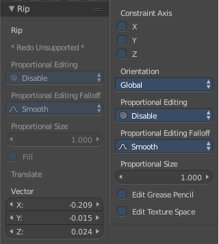

Vector
------

Here you can adjust the position values for the three values

Constraint Axis
---------------

Here you can limit the position relative to the source object.

Orientation
-----------

Orientation is a drop-down box where you can choose the type of orientation for the mirroring action.

.. image:: graphics/7.1.xx_Editors_-_3D_View_-_old_Tool_Shelf/1000020100000090000000932D2EC1559DCA838C.png

Proportional Editing
--------------------

Proportional Editing is a drop-down box where you can choose to use proportional editing. When you choose one of the active methods then the neighbour geometry gets influenced by Shrink/Fatten too in a proportional way.

.. image:: graphics/7.1.xx_Editors_-_3D_View_-_old_Tool_Shelf/100002010000009C0000007DAE5F5F7DCA1CA15A.png

Proportional Editing Falloff
----------------------------

Proportional Editing Falloff is a drop-down box where you can choose a method for the falloff for the proportional editing.

.. image:: graphics/7.1.xx_Editors_-_3D_View_-_old_Tool_Shelf/10000201000000BA000000D5C32417D7CA2D08A2.png

Proportional Size
-----------------

Proportional size is a edit box where you can adjust the strength of the Proportional falloff.

Edit Grease Pencil
------------------

Edit Grease Pencil edits the selected Grease Pencil strokes.

Edit Texture Space
------------------

With Confirm on Release checked the action gets performed when you release the mouse button.

Rip Fill
--------

Rip Fill works similar to the Rip tool. It splits the edges between the selected vertices. It creates two edges out of one. But it fills the gap between the new edges when you move the geometry.

This tool works similar to the Edge Split tool. But with selected edges instead of selected vertices. It also selects the outer edges so that you immediately move them. And it provides some options in the Last operator.

Last Operator Rip Fill
----------------------

There are some greyed out parts. We will ignore them since it is most probably a bug, and we cannot edit them anyway.

Vector
------

Here you can adjust the position values for the three values

Constraint Axis
---------------

Here you can limit the position relative to the source object.

Orientation
-----------

Orientation is a drop-down box where you can choose the type of orientation for the mirroring action.

.. image:: graphics/7.1.xx_Editors_-_3D_View_-_old_Tool_Shelf/1000020100000090000000932D2EC1559DCA838C.png

Proportional Editing
--------------------

Proportional Editing is a drop-down box where you can choose to use proportional editing. When you choose one of the active methods then the neighbour geometry gets influenced by Shrink/Fatten too in a proportional way.

.. image:: graphics/7.1.xx_Editors_-_3D_View_-_old_Tool_Shelf/100002010000009C0000007DAE5F5F7DCA1CA15A.png

Proportional Editing Falloff
----------------------------

Proportional Editing Falloff is a drop-down box where you can choose a method for the falloff for the proportional editing.

.. image:: graphics/7.1.xx_Editors_-_3D_View_-_old_Tool_Shelf/10000201000000BA000000D5C32417D7CA2D08A2.png

Proportional Size
-----------------

Proportional size is a edit box where you can adjust the strength of the Proportional falloff.

Edit Grease Pencil
------------------

Edit Grease Pencil edits the selected Grease Pencil strokes.

Edit Texture Space
------------------

With Confirm on Release checked the action gets performed when you release the mouse button.

Extend Vertices
---------------

Extend vertices extrudes out the selected vertices. When you do this operation at an edge then you will create N-Gons that way.

Last Operator Extend Vertices
-----------------------------

There are some greyed out parts. We will ignore them since it is most probably a bug, and we cannot edit them anyway.

Vector
------

Here you can adjust the position values for the three values

Constraint Axis
---------------

Here you can limit the position relative to the source object.

Orientation
-----------

Orientation is a drop-down box where you can choose the type of orientation for the mirroring action.

.. image:: graphics/7.1.xx_Editors_-_3D_View_-_old_Tool_Shelf/1000020100000090000000932D2EC1559DCA838C.png

Proportional Editing
--------------------

Proportional Editing is a drop-down box where you can choose to use proportional editing. When you choose one of the active methods then the neighbour geometry gets influenced by Shrink/Fatten too in a proportional way.

.. image:: graphics/7.1.xx_Editors_-_3D_View_-_old_Tool_Shelf/100002010000009C0000007DAE5F5F7DCA1CA15A.png

Proportional Editing Falloff
----------------------------

Proportional Editing Falloff is a drop-down box where you can choose a method for the falloff for the proportional editing.

.. image:: graphics/7.1.xx_Editors_-_3D_View_-_old_Tool_Shelf/10000201000000BA000000D5C32417D7CA2D08A2.png

Proportional Size
-----------------

Proportional size is a edit box where you can adjust the strength of the Proportional falloff.

Edit Grease Pencil
------------------

Edit Grease Pencil edits the selected Grease Pencil strokes.

Edit Texture Space
------------------

With Confirm on Release checked the action gets performed when you release the mouse button.

Split
-----

Split works similar to the Rip tool. It splits the edges between the selected vertices. It creates two edges out of one. 

.. image:: graphics/7.1.xx_Editors_-_3D_View_-_old_Tool_Shelf/1000020100000147000000E7A57F3D2CDF85D67C.png

This tool works similar to the Edge Split tool. But with selected edges instead of selected vertices.

Connect Vertex Path
-------------------

Connect Vertex path connects selected vertices, but takes the vertex order into account. It just creates edges between vertices that are not connected in this order.

Connect Vertices
----------------

Connect Vertices connects the selected vertices. It does not fill the selection with edges though, but creates just the edges for the outside of a polygon.

Convex Hull
-----------

Creates a convex hull around the selected vertices. 

Last Operator Convex Hull
-------------------------

Delete Unused
-------------

Removes vertices that are not part of the convex geometry.

Use existing Faces
------------------

Use existing input faces that lies on the hull where possible. This option allows to have N-Gons in the convex hull.

Make Holes
----------

Deletes edges and faces in the hull that were part of the input. This allows to delete faces between the existing mesh and the convex hull.

Join Triangles
--------------

Joins adjacent triangles into quads

Max Face Angle 
---------------

Max Face Angle belongs to the Join Triangles setting. Here you can set the maximum face angle.

Max Shape Angle
---------------

Max Face Angle belongs to the Join Triangles setting. Here you can set the maximum shape angle.

Compare UV's
------------

Takes existing UV patches for the calculation into account.

Compare Vcols
-------------

Takes existing Vertex colors for the calculation into account.

Compare Seam
------------

Takes existing seams for the calculation into account.

Compare Sharp
-------------

Takes existing sharp edges for the calculation into account.

Compare Materials
-----------------

Takes existing materials for the calculation into account.

.. list-table::

	* - 

Edges Tools is a panel where you can find some Edges related tools.

Subdivide Edge ring
-------------------

Subdivides the selected edge ring(s).

Last Operator Subdivide Edge ring
---------------------------------

Number of Cuts
--------------

Here you can adjust the number of cuts for the subdivision.

Interpolation
-------------

Here you can chose a interpolation method for the new geometry.

Linear ends in a equal division and a flat result. Blend Surface interpolates the surrounding geometry. And can end in a curvy result.

Smoothness
----------

The Smoothness factor for the interpolation. 

Profile Factor
--------------

The profile strength

.. image:: graphics/7.1.xx_Editors_-_3D_View_-_old_Tool_Shelf/100002010000008E000000A82674074748FFF4CB.png

Profile Shape
-------------

A drop-down box where you can define a profile for the generated geometry.

Un-Subdivide
------------

Decimates the geometry by trying to make one quad out of four quads. But can also end in Tris where this is not possible.

Last Operator Un-Subdivide
--------------------------

Iterations
----------

Number of iterations. This means how deep the calculation should go. One level of SDS, two levels, three levels, etc. . Down to the point where you cannot decimate any geometry anymore.

Edge Crease
-----------

When you use a Subdivision Surface Modifier, then you can define the sharpness of selected edges with this tool. Crease edges will be marked colored in edit mode.

You will see a value in the header that indicates the current strength when you activate the tool. Move with the mouse to increase or decrease the value. Or type in a value while you are in this mode. You can also scale into negative range. 

A negative crease value will subtract from the current active crease value in case it exists already from a former crease operation. A Crease value of -1 removes the crease from this edge.

Last Operator Edge Crease
-------------------------

Factor
------

Here you can adjust the crease factor.

Edge Bevel Weight
-----------------

This tool adjusts the edge bevel weight for selected edges when you use the Bevel modifier at the mesh.

You will see a value in the header that indicates the current strength when you activate the tool. Move with the mouse to increase or decrease the value. Or type in a value while you are in this mode. You can also scale into negative range. 

A negative Edge Bevel Weight value will subtract from the current active crease value in case it exists already from a former crease operation. A Edge Bevel Weight value of -1 removes the weight from this edge.

Last Operator Edge Bevel Weight
-------------------------------

Factor
------

Here you can adjust the Edge Bevel Weight factor.

Mark Sharp
----------

Mark Sharp is a tool that you need for the Edge Split modifier. Marked edges are displayed and rendered as sharp edges.

Last Operator Mark Sharp
------------------------

Clear
-----

Clears selected edges instead of marking it

Vertices
--------

Calculate by the selected vertices instead of edges to mark the edges.

Clear Sharp
-----------

Clears formerly as sharp marked selected edges

Last Operator Mark Sharp
------------------------

Clear
-----

Clears selected edges instead of marking it.

Vertices
--------

Calculate by the selected vertices instead of edges to mark the edges.

Rotate Edge CW
--------------

Rotate Edge rotates the selected edge clockwise. 

This feature is useful when you have a triangulated quad mesh, and need to have some edges point into another direction as they currently do.

Rotate Edge CW rotates clockwise by default. But you can also rotate counter clockwise.

Last Operator Rotate Selected Edge
----------------------------------

Counter Clockwise
-----------------

Rotate selected edges counter clockwise

Edge Split
----------

Edge split splits the selected edges. It creates two edges out of one.

This tool works similar to the Rip tool. But with selected edges instead of selected vertices. And this tool has no further settings.

Mark Freestyle Edge
-------------------

Freestyle is a comic renderer that is included in Bforartists. Mark Freestyle Edges marks the selected edges as Freestyle feature edges.

Last Operator Mark Freestyle Edge
---------------------------------

Clear
-----

Unmarks the selected edges as Freestyle feature edges.

Clear Freestyle Edge
--------------------

Freestyle is a comic renderer that is included in Bforartists. Clear Freestyle Edges unmarks the selected edges as Freestyle feature edges.

Last Operator Mark Freestyle Edge
---------------------------------

Clear
-----

Unmarks the selected edges as Freestyle feature edges.

.. list-table::

	* - 

Faces
-----

Faces is a menu where you can find some Faces related tools.

Fill
----

Fills holes and triangulates the geometry.

Last Operator Fill
------------------

Beauty
------

Use best triangulation division.

Grid Fill
---------

Grid Fill allows you to fill two edge loops with quad geometry that follows the surrounding geometry.

Usage: select two opposite edge loops. Then perform the tool.

Last Operator Grid Fill
-----------------------

Span
----

Number of sides.

Offset
------

Here you can define a offset.

Simple Blending
---------------

Uses a simple interpolation. Faster but less accurate.

Beautify Faces
--------------

Beautify faces tries to optimize triangulations.

Last Operator Beautify Faces
----------------------------

Max Angle
---------

Here you can set an angle limit.

Solidify
--------

Gives the selected faces a thickness, and makes it solid.

There is also a Solidify modifier available.

Last Operator Solidify
----------------------

Thickness
---------

Here you can adjust the thickness. You can scale also into the negative range.

Intersect
---------

Intersect creates edges where geometry intersects.

This operation happens in Edit mode, and so all parts must be in the same mesh.

Last Operator Intersect
-----------------------

Source 
-------

Source is a drop-down box where you can choose at which mesh part you want to operate.

Selected/Unselectedworks between the selected and unselected geometry. 

Self Intersectworks on the overlapping geometry of the mesh. 

Separate Mode 
--------------

Separate mode is a drop-down box where you can choose the separation mode.

All splits the geometry at the new edge. 

Cutkeeps each side of the intersection separate without splitting the faces in half. 

Mergemerges all the geometry from the intersection. 

Merge Threshold 
----------------

Here you can adjust the merge threshold. Increase it when some geometry is not calculated. But keep it small for fast calculation.

Intersect ( Boolean )
---------------------

Intersect (Boolean) performs a boolean operation between the selected and unselected mesh parts.

This operation happens in Edit mode, and so all parts must be in the same mesh.

Last Operator Intersect (Boolean)
---------------------------------

Boolean
-------

Here you can choose the boolean method.

.. image:: graphics/7.1.xx_Editors_-_3D_View_-_old_Tool_Shelf/100002010000008D000000675C0E150CB9649E53.png

Difference subtracts the source geometry from the target geometry.

Union unions the source geometry with the target geometry. Geometry inside the source and target geometry gets removed.

.. image:: graphics/7.1.xx_Editors_-_3D_View_-_old_Tool_Shelf/10000201000000A4000000A3C6A1BAD43374944B.png

Intersect removes all geometry but the overlapping geometry.

Swap
----

Inverts source and target geometry.

Merge Threshold
---------------

Here you can adjust the tolerance for the boolean operation. Increase it when some geometry is not calculated. But keep it small for fast calculation.

Wire Frame
----------

Wireframe grabs the edges of the faces and turns them into tubes.

Last Operator Wire Frame
------------------------

Boundary
--------

Inset Face Boundaries.

Offset Even
-----------

Scales the offset to give more even thickness.

Offset Relative
---------------

Scales the offset by surrounding geometry.

Replace
-------

Removes the source geometry.

Thickness
---------

Here you can adjust he thickness of the tubes.

Offset
------

Here you can adjust the offset of the tubes.

Crease
------

Crease adds close edges so that you have sharp corners when you use Subdivision Surface.

Crease Weight
-------------

Here you can adjust the crease weight.

Poke Faces
----------

Splits the selected faces to create a triangulated geometry.

Last Operator Poke Faces
------------------------

Poke Offset
-----------

Normally the center vertice of the poke operation is planar with the rest. Here you can adjust an offset.

Offset Relative
---------------

Scale the offset by surrounding geometry.

.. image:: graphics/7.1.xx_Editors_-_3D_View_-_old_Tool_Shelf/10000201000000D600000083EA68E6B0016F4CD5.png

Poke Center
-----------

Poke Center is a drop-down box where you can choose what the center of the poke operation should be. You can choose between weighted mean, mean and bounds.

Triangulate Faces
-----------------

Triangulate Faces triangulates the faces of the selected geometry.

Last Operator Triangulate Faces
-------------------------------

Quad Method
-----------

Here you can choose how quads should be triangulated. 

Shortest diagonal
-----------------

Splits the quads based on their distance between vertices.

Fixed Alternate
---------------

Splits the quads on the second and fourth vertice.

Fixed
-----

Splits the quads on the first and third vertice.

Beauty
------

Tries to optimize the triangulation.

Polygon Method
--------------

Here you can choose how N-Gons should be triangulated. 

Clip
----

Splits the polygons with an ear clipping algorithm.

Beauty
------

Tries to optimize the triangulation.

Tris to Quads
-------------

Tris to quads tries to convert triangulated geometry back to a quad geometry by removing the edges inside of the quads.

Last Operator Tris to Quads
---------------------------

Max Face Angle
--------------

Here you can adjust the threshold to adjacent triangles.

Max Shape Angle
---------------

Here you can adjust the shape angle limit.

Compare UV's
------------

Takes the UV patches for the calculation into account. Border geometry will not be calculated.

Compare VCols
-------------

Takes the Vertex colors for the calculation into account. Border geometry will not be calculated.

Compare Seam
------------

Takes the Vertex colors for the calculation into account. Border geometry will not be calculated.

Compare Sharp
-------------

Takes the as sharp marked edges for the calculation into account. Border geometry will not be calculated.

Compare Materials
-----------------

Takes the Materials colors for the calculation into account. Border geometry will not be calculated.

Split by Edges
--------------

This tool incorporates loose wire edges into selected faces.

You need a loose edge geometry to get it to work. By converting a curve to a Mesh geometry for example. You need to join the edge into the mesh where you want to use it. The operation happens in Edit mode.

In edit mode select the edge and the face where you want it to join. And then perform the tool.

Rotate UV's
-----------

Rotates the UV space for the selected geometry by 90 degrees. This tool requires to have a working UV mapping.

Last Operator Rotate UV's
-------------------------

The tool rotates clockwise by default. With this option ticked the rotation happens counter clockwise.

Reverse UV's
------------

Reverses the UV Space for the selected geometry. This tool requires to have a working UV mapping.

Rotate Colors
-------------

Rotates the vertex colors for the selected geometry. This tool requires to have vertex colors painted at the mesh.

Note that there is no way to display vertex colors in Edit mode. So you need to switch to Vertex paint mode to see the result.

Last Operator Rotate Colors
---------------------------

Counter Clockwise
-----------------

The tool rotates clockwise by default. With this option ticked the rotation happens counter clockwise.

Reverse Colors
--------------

Reverses the vertex colors.

Note that there is no way to display vertex colors in Edit mode. So you need to switch to Vertex paint mode to see the result.

Mark Freestyle Face
-------------------

Mark selected Faces for exclusion from Freestyle Feature edge detection. Freestyle is a cartoon renderer that is also included in Bforartists.

Clear Freestyle Face
--------------------

Unmark selected Faces for exclusion from Freestyle Feature edge detection. Freestyle is a cartoon renderer that is also included in Bforartists.

.. list-table::

	* - 

Clean Up is a menu that contains various functionality to clean up your geometry.

Delete Loose
------------

Delete loose deletes not connected geometry. Vertices, Edges, and Faces. The tool starts with deleting Vertices and Edges. But you can tick Faces in the Last Operator too, and then it also removes not connected Faces.

Last Operator Delete Loose
--------------------------

Vertices
--------

Delete Vertices

Edges
-----

Delete Edges

Faces
-----

Delete Faces

Decimate Geometry
-----------------

Decimate Geometry decimates the currently selected geometry. It starts with a Ratio of 1. Which means no decimation. The lower the ratio the more decimation you will get. The Decimate Modifier works with Tris!

Last Operator Decimate Geometry
-------------------------------

Ratio
-----

Here you can adjust the strength of decimation

Vertex Group
------------

Use active Vertex Group as an influence. You need to have a Vertex Group.

Weight
------

Here you can adjust the Vertex Group Strength.

Invert
------

Invert Vertex Group Influence

Symmetry
--------

Here you can make the decimation geometry symmetric along a chosen world axis.

Degenerate Dissolve
-------------------

Removes zero size Faces and Edges.

Make Planar Faces
-----------------

Make Planar Faces tries to make the selected faces planar. Quads or N-Gons for example can have vertices that are not planar. 

Last Operator Make Planar Faces
-------------------------------

Factor
------

Here you adjust how strong the influence should be.

Iterations
----------

Here you adjust how often it should repeat in the try to find a solution.

Split Non-Planar Faces
----------------------

Split Non Planar Faces splits up non planar Quads and N-Gons to end in planar faces.

Last Operator Split Non-Planar Faces
------------------------------------

Max Angle
---------

Here you can limit the action to a maximum angle.

Split Concave Faces
-------------------

Splits concave faces to make the geometry more stable. This tool is thought for N-Gons.

Fill Holes
----------

Fill holes closes holes in the mesh geometry.

Fill holes can just calculate one face size at one time. So when you have several holes in the mesh, let's say one is a tri, and one is a quad, then you need to calculate twice.

Last Operator Fill Holes
------------------------

Sides
-----

Here you can define what face size will be filled. 

Weight Tools panel
------------------

The Weight Tools panel contains Weight tools. Those tools are meant to modify the weight mapping. At characters for example. The Weight Tools requires Vertex Groups to work with. Such Vertex groups gets created when you do weight painting at a character for example. Here is defined what bone is connected to what vertice.

This Panel also exists in Weight Paint mode. Minus the Weight Gradient and Transfer Weight tools.

Normalize All
-------------

Normalize all normalizes the weight of all Vertex groups so that the values for the single vertices in the sum is 1.

Last Operator Normalize all
---------------------------

Subset
------

Subset is a drop-down menu where you can choose the Subset method.

Lock Active
-----------

Keep the values of the active group while normalizing others.

Normalize
---------

Normalize normalizes the weight of the current selected Vertex group so that the values for the single vertices in the sum is 1. Means when there is influence from other groups, then those values are kept, but the one for the current group gets lowered so that the sum is 1.

The Last Operator Normalize panel has no adjustable settings.

Mirror
------

Mirror Vertex Group mirrors Vertex Groups and flips weights and/or names. It only edits selected Vertices. It flips when both sides are selected. Otherwise it copies from Unselected.

Last Operator Mirror Vertex Group
---------------------------------

Mirror Weights
--------------

With Mirror Weights ticked it mirrors the weights.

Flip Group Names
----------------

With Flip Group Names ticked it flips the Group names

All Groups
----------

Mirrors all Vertex Groups

Topology Mirror
---------------

Uses topology based mirroring. This requires matching mirrored topology.

Invert
------

Invert inverts the weight painting for the selected vertex group.

Last Operator Invert Vertex Group
---------------------------------

Subset
------

Subset is a drop-down menu where you can choose the Subset method.

Add Weights
-----------

Add Vertices from Groups that have zero Weighting before inverting.

Remove Weights
--------------

Remove Vertices from Groups that have zero weight after inverting.

Clean
-----

Removes Vertex group assignments that are not required from the active vertex group.

Last Operator Clean Vertex Group
--------------------------------

Subset
------

Subset is a drop-down menu where you can choose the Subset method.

Limit
-----

Remove weights that are below or equal to the limit value.

.. image:: graphics/7.1.xx_Editors_-_3D_View_-_old_Tool_Shelf/10000201000000A10000007DF3CA0CA96799137A.png

Keep Single
-----------

Keep Vertices assigned to at least one vertex group when cleaning.

Quantize
--------

Quantize quantizes the weight paint values. It starts with 4 steps. With a step of 1 you have a single vertex color, no matter how you have painted it before.

Last Operator Quantize
----------------------

Subset
------

Subset is a drop-down menu where you can choose the Subset method.

Steps
-----

Here you adjust in how many steps the weight paint colors should be divided.

Levels
------

Adds some offset to the Weight paint, and multiplys it with some gain.

Last Operator Levels
--------------------

Subset
------

Subset is a drop-down menu where you can choose the Subset method.

Offset
------

Here you adjust the offset.

Gain
----

Here you adjust the gain.

Smooth
------

Smooths the weight for selected vertices.

Last Operator Smooth Vertex Weights
-----------------------------------

Subset
------

Subset is a drop-down menu where you can choose the Subset method.

Factor
------

Here you adjust the factor.

.. image:: graphics/7.1.xx_Editors_-_3D_View_-_old_Tool_Shelf/10000201000000A10000007DF3CA0CA96799137A.png

Iterations
----------

Here you adjust how many iterations you use.

Expand/Contract
---------------

Expand or contract the weights.

Source
------

A drop-down box where you can choose what should be affected by Smooth.

Limit Total
-----------

Limit number of Weights per vertex. The lowest weights gets removed. 

This is of interest when you have for example five bones associated with a vertice. But your game engine just allows four ...

Last Operator Limit Total
-------------------------

Subset
------

Subset is a drop-down menu where you can choose the Subset method.

.. image:: graphics/7.1.xx_Editors_-_3D_View_-_old_Tool_Shelf/10000201000000A10000006740390AF55EB5A430.png

Limit
-----

Here you adjust how many weights are allowed.

Fix Deforms
-----------

Modify the position of selected vertices by changing only their respective group weights.

This tool may operate slow at too many vertices.

Last Operator Fix Deforms
-------------------------

Distance
--------

Adjust the distance.

Strength
--------

Adjust the strength.

Change Sensitivity
------------------

Adjust the sensitivity.

Tool Shelf in Edit Mode - Mesh Object, Create Tab
=================================================

Add Meshes Panel
----------------

The create tab in edit mode contains an Add Meshes panel with the object types that can be added in Edit mode. That way you can add mesh primitives geometry in edit mode to the current object. 

For detailed information and the Last Operator panels for the single buttons see chapter Tool Shelf in Object Mode - Create Tab .

Tool Shelf in Edit Mode - Mesh Object, Shade/UV's Tab
=====================================================

The Shade / UV's tab contains two panels. Shading and UV's. 

Shading Panel 
--------------

The Shading panel contains shading relevant settings like smooth and flat shading and recalculate normals.

Faces, Edges and Vertices
-------------------------

Faces, Edges and Vertices can have either smooth or flat shading.

Faces, Edges and Vertices does not have content in the Last operator panel.

Faces
-----

Smooth 
-------

Sets the shading for the selected faces to Smooth.

Flat
----

Sets the shading for the selected faces to Flat.

Edges
-----

Smooth 
-------

Sets the shading for the selected edges to Smooth.

Sharp
-----

Sets the shading for the selected edges to sharp.

Vertices
--------

Smooth 
-------

Sets the shading for the selected vertices to Smooth.

Sharp
-----

Sets the shading for the selected vertices to sharp.

Normals 
--------

Normals influences the shading and the direction of a face. They can point inwards or outwards.

Recalc Outside
--------------

Recalculates the normals of the selected geometry so that everything points outwards.

Last Operator Recalc Outside
----------------------------

Inside
------

Inside recalculates the normals of the selected geometry so that everything points inwards.

Recalc Inside
-------------

Recalculates the normals of the selected geometry so that everything points inwards.

Flip
----

Flips the direction of the normals of the selected geometry.

Set from Faces
--------------

Sets the vertex normals from the selected faces. This tool requires to have Autosmooth activated!

UVs Panel 
----------

The UVs Panel contains the Tools for UV Mapping. A drop-down box for the different methods. And a button to mark and to clear seam for the two Unwrap algorithms Angle Based (ABF) and Conformal ( LSCM).

UV Mapping
----------

Unwrap is a drop-down box that contains all the UV Mapping methods that are available in Blender. UV Mapping is best done in the UV Editing Layout. So that you can see what you produce.

Unwrap ABF
----------

Unwrap ABF unwraps the selected geometry with the method Angle based. ABF stands for Angle Based Flattening. ABF can give a bit better result than LSCM when unwrapping organic shapes.

Unwrap LSCM
-----------

Unwrap ABF unwraps the selected geometry with the method Angle based. ABF stands for Angle Based Flattening. LSCM can give a bit better results than ABF with geometric shapes.

Last Operator Unwrap
--------------------

Unwrap ABF and Unwrap LSCM shares the same Last Operator.

Method
------

Method is a drop down box where you can choose between Unwrap method Angle Based and Conformal.

Fill Holes
----------

Fill holes in the mesh before unwrapping.

Correct Aspect
--------------

Take the Image Aspect Ratio into account.

Use Subsurf Modifier
--------------------

Unwraps an existing Subsurf Modifier. You need to add a Subsurf Modifier first.

Margin
------

The distance between the single UV patches.

Smart UV Project
----------------

Smart UV Project projects the UV mapping from different angles. 

Smart UV Project Settings dialogue
----------------------------------

Angle Limit
-----------

The Angle Limit defines after which angle the mapping happens from the next side. With an angle of 66 you have around six sides to map from. The calculation is 360/66.

Island Margin
-------------

Island Margin defines the distance between the UV patches.

Area Weight
-----------

Weight Projection Vector by faces with larger areas.

Correct Aspect
--------------

Take the Image Aspect Ratio into account.

Last Operator Smart UV Project
------------------------------

The Last Operator for Smart UV Project contains the same settings than the Smart UV Project Settings dialogue.

Angle Limit
-----------

The Angle Limit defines after which angle the mapping happens from the next side. With an angle of 66 you have around six sides to map from. The calculation is 360/66.

Island Margin
-------------

Island Margin defines the distance between the UV patches.

Area Weight
-----------

Weight Projection Vector by faces with larger areas.

Correct Aspect
--------------

Take the Image Aspect Ratio into account.

Lightmap Pack
-------------

Lightmap Pack maps each face individually, and puts the result into the UV space. Without margin. 

Lightmap Pack has no Last Operator. 

Settings
--------

Selection 
----------

Selection is a drop-down box where you can choose what will be packed.

Share Tex Space
---------------

Map all objects into one lightmap.

New UV Map
----------

Create a new UV map for every new mesh.

New Image
---------

Assign new Image to every new mesh.

Image Size
----------

The size for new images.

Pack Quality
------------

The pack quality. 

Margin
------

The distance between the single UV patches.

Follow Active Quads
-------------------

Follow Active quads maps UV coordinates starting from an active face, and maps all adjacent faces in quad shape then. This way you can for example unwrap a pipe or a road. You first need to have a face selected. Then select everything. And then click at Follow Active Quads.

Settings
--------

Edge Length Mode
----------------

Edge Length Mode is a drop-down box where you can choose the Length method.

Last Operator Follow Active Quads
---------------------------------

The Last Operator contains the same settings than the Settings dialogue.

Edge Length Mode
----------------

Edge Length Mode is a drop-down box where you can choose the Length method.

Cube Projection
---------------

Cube Projection maps the mesh from six sides, means cubic.

Last Operator Cube Projection
-----------------------------

Cube Size
---------

Cube Size defines the size of the UV mesh in the UV space.

Correct Aspect
--------------

Take Image Aspect ratio into account.

Clip to Bounds
--------------

Clip UV Coordinates to bounds after unwrapping.

Scale to Bounds
---------------

Scale UV Coordinates to bounds after unwrapping.

Cylinder Projection
-------------------

Cylinder Projection tries to map cylindric.

Last Operator Cylinder Projection
---------------------------------

Direction
---------

Direction is a drop-down box where you can choose in which direction the cylindric projection will be mapped.

Align
-----

Align is a drop-down box where you can choose the Align method.

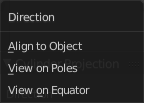

Radius
------

Radius defines the Polar size of the UV mesh in the UV space.

Correct Aspect
--------------

Take Image Aspect ratio into account.

Clip to Bounds
--------------

Clip UV Coordinates to bounds after unwrapping.

Scale to Bounds
---------------

Scale UV Coordinates to bounds after unwrapping.

Sphere Projection
-----------------

Sphere Projection tries to map spherical.

Last Operator Sphere Projection
-------------------------------

Direction
---------

Direction is a drop-down box where you can choose in which direction the spherical projection will be mapped.

Align
-----

Align is a drop-down box where you can choose the Align method.

Correct Aspect
--------------

Take Image Aspect ratio into account.

Clip to Bounds
--------------

Clip UV Coordinates to bounds after unwrapping.

Scale to Bounds
---------------

Scale UV Coordinates to bounds after unwrapping.

Project from View
-----------------

Project from View projects the UV from the current 3D view.

Last Operator Project from View
-------------------------------

Orthographic
------------

User orthographic projection

Camera Bounds
-------------

Map UV's to the camera region taking resolution and aspect into account.

Correct Aspect
--------------

Take Image Aspect ratio into account.

Clip to Bounds
--------------

Clip UV Coordinates to bounds after unwrapping.

Scale to Bounds
---------------

Scale UV Coordinates to bounds after unwrapping.

Project from View (Bounds)
--------------------------

Project from View projects the UV from the current 3D view.

Same as Project from View, but with Scale to Bounds ticked in the Last operator.

Reset
-----

Resets the UV Projection

Reset has no Last Operator. 

Mark Seam
---------

The unwrap algorithms Angle based and Conformal requires to have edges marked as seams. Think of it as a cutting pattern for a trouser for example. Such a trouser is also made of fabric patterns. 

Same goes for the UV patches when you use Angle based or conformal unwrapping. You need to cut your mesh into parts and mark edges as seams, so that the algorithm knows where the seams are.

Mark seam marks the currently selected edge(s) as a seam. Seam edges will be displayed as red in the 3D viewport.

You need to unwrap the mesh again when you want to apply changes.

Last Operator Mark Seam
-----------------------

Clear
-----

Clears the seam instead of marking it.

Clear Seam
----------

Clear seam removes the seam from the currently selected edge(s)

Tool Shelf in Edit Mode - Mesh Object, Options Tab
==================================================

The Options tab provides you with some Mesh Object options.

Mesh Options Panel 
-------------------

X Mirror
--------

X Axis Mirror Editing.

Topology Mirror
---------------

Use Topology based mirroring.

Edge Select Mode
----------------

Edge Select Mode is a drop-down box where you can choose the select method for edges.

Live Unwrap
-----------

Changing edges seam recalculates UV Unwrap.

Double Threshold
----------------

Limit for removing duplicates and 'Auto Merge'.

Tool Shelf in Edit Mode - Curve Object, Relations Tab
=====================================================

Relations Panel
---------------

The Relation panel contains tools around relations. In Edit Mode it's just Make Vertex Parent. 

.. image:: graphics/7.1.xx_Editors_-_3D_View_-_old_Tool_Shelf/100002010000013D000000559F31C285834F64B7.png

In Object mode select the object that you want to parent to a vertex. Shift select the parent object so that both are selected. Enter Edit mode. Then select one vertex for a single point. Or three for an area. Then click the Make Vertex Parent button to make the relation.

Tool Shelf in Edit Mode - Curve Object, Tools Tab
=================================================

Curve Tools Panel
-----------------

The Curve Tools panel contains the tools to modify the curve object in Edit Mode .

Tilt
----

Modifies the Mean Tilt.

Activate the tool, and drag the mouse. You will see a value in the header now. The selected curve path will rotate by dragging the mouse.

The Tilt angle always starts at zero. It is relative. To modify the Mean Tilt use the edit box in the Transform panel.

Last Operator Tilt
------------------

Angle
-----

The Tilt angle.

Proportional Editing
--------------------

Proportional Editing is a drop-down box where you can choose to use proportional editing. When you choose one of the active methods then the neighbour geometry gets influenced by Shrink/Fatten too in a proportional way.

Proportional Editing Falloff
----------------------------

Proportional Editing Falloff is a drop-down box where you can choose a method for the falloff for the proportional editing.

Proportional Size
-----------------

The proportional size in case you have Proportional editing activated.

Confirm on Release
------------------

Always confirm operation when releasing button.

Shrink/ Fatten
--------------

Modifies the Mean Radius.

Activate the tool, and drag the mouse. You will see a value in the header now. The selected curve radius will increase / decrease.

The Radius angle always starts at zero. It is relative. To modify the Mean Radius use the edit box in the Transform panel.

Last Operator Transform
-----------------------

Values
------

Transform values for Shrink Fatten.

Constraint Axis
---------------

Here you can constraint the operation to specific axis.

Proportional Editing
--------------------

Proportional Editing is a drop-down box where you can choose to use proportional editing. When you choose one of the active methods then the neighbour geometry gets influenced by Shrink/Fatten too in a proportional way.

Proportional Editing Falloff
----------------------------

Proportional Editing Falloff is a drop-down box where you can choose a method for the falloff for the proportional editing.

Proportional Size
-----------------

The proportional size in case you have Proportional editing activated.

.. image:: graphics/7.1.xx_Editors_-_3D_View_-_old_Tool_Shelf/10000201000000BA000000D5C32417D7CA2D08A2.png

Edit Grease Pencil 
-------------------

Edit selected Grease Pencil strokes. 

Confirm on Release
------------------

Always confirm operation when releasing button.

Mirror
------

Mirror mirrors the selected geometry along the defined axis. Click the Mirror button, type in X, Y or Z, then confirm with enter.

Last Operator Mirror
--------------------

The Last Operator Mirror panel gives you tools to adjust the mirror action.

Constraint Axis
---------------

Constraint Axis gives you again the possibility to define the mirror axis. You can choose more than one axis here.

Orientation 
------------

Orientation is a drop-down box where you can choose the type of orientation for the mirroring action.

Proportional Editing
--------------------

Proportional Editing is a drop-down box where you can choose to use proportional editing. When you choose one of the active methods then the neighbour geometry gets influenced by Shrink/Fatten too in a proportional way.

.. image:: graphics/7.1.xx_Editors_-_3D_View_-_old_Tool_Shelf/1000020100000090000000932D2EC1559DCA838C.png

Proportional Editing Falloff
----------------------------

Proportional Editing Falloff is a drop-down box where you can choose a method for the falloff for the proportional editing.

.. image:: graphics/7.1.xx_Editors_-_3D_View_-_old_Tool_Shelf/100002010000009C0000007DAE5F5F7DCA1CA15A.png

Proportional size 
------------------

Proportional size is a edit box where you can adjust the strength of the Proportional falloff.

.. image:: graphics/7.1.xx_Editors_-_3D_View_-_old_Tool_Shelf/10000201000000BA000000D5C32417D7CA2D08A2.png

Edit Grease Pencil
------------------

Edit Grease Pencil edits the selected Grease Pencil strokes.

Confirm on Release
------------------

With Confirm on Release checked the action gets performed when you release the mouse button.

Curve 
------

The Curve Tools contains the tools to modify the curves.

Toggle Cyclic
-------------

Toggle Cyclic closes or opens the curve.

Last Operator Toggle Cyclic
---------------------------

Direction
---------

Direction is a drop-down box where you can choose the direction in which the curve gets closed.

Switch Direction
----------------

Switch Direction inverts the direction of the selected curve.

Switch Direction has no settings in the Last Operator panel.

Set Spline Type
---------------

With set Spline Type you can set the type of the curve. 

Last Operator Set Spline Type
-----------------------------

Type
----

Type is a drop-down box where you can choose the spline type

Handles
-------

Use Handles when converting Bezier curves into polygons.

Set Curve Radius
----------------

Set the Point radius which is used for bevel tapering

Last Operator Set Radius
------------------------

Radius
------

Set the Point radius which is used for bevel tapering

Handles
-------

Handles defines the type of handle for the knots of the curve. You have the choice between Auto, Vector, Align and Free. And the Last Operator gives you a fifth possibility to toggle between Free and Align.

Auto
----

Auto aligns the handles automatically.

Vector
------

Set Handle type to Vector.

Align
-----

Set Handle type to Align.

Free
----

Set Handle type to Free.

Last Operator Set Handle Type
-----------------------------

Type
----

Type is a drop-down box where you can set the handle type. You have the choice between Auto, Vector, Align, Free. And the fifth possibility toggles between Free and Align.

Recalc Normals
--------------

Recalculates the normals of the selected curve.

Last Operator Recalc Normals
----------------------------

Length
------

Recalculates the handle length too.

Modelling 
----------

The Modelling Section contains some modelling tools to modify the curve object.

Extrude
-------

Extrudes the selected curve point(s).

Last operator Extrude Curve and Move
------------------------------------

Extrude
-------

Confusing label. Just ignore

Mode
----

A drop-down box where you can choose between different extrude modes.

Translate
---------

Confusing label. Just ignore

Vector
------

The position of the extruded point(s)

Constraint Axis
---------------

Here you can limit the extrusion to specific axes.

Orientation
-----------

Here you can adjust the orientation of the extrusion. It usually starts with Normal.

Proportional Editing
--------------------

Proportional Editing is a drop-down box where you can choose to use proportional editing. When you choose one of the active methods then the neighbour geometry gets influenced by Shrink/Fatten too in a proportional way. Proportional Editing Falloff

Proportional Editing Falloff
----------------------------

Proportional Editing Falloff is a drop-down box where you can choose a method for the falloff for the proportional editing.

.. image:: graphics/7.1.xx_Editors_-_3D_View_-_old_Tool_Shelf/100002010000009C0000007DAE5F5F7DCA1CA15A.png

Proportional size 
------------------

Proportional size is a edit box where you can adjust the strength of the Proportional falloff.

Edit Grease Pencil
------------------

Edit Grease pencil ticked allows you to edit the grease pencil stroke.

Edit Texture Space
------------------

By default extrusion will not modify the UV mapping. With Edit texture Space ticked the UV mapping updates with the extrusion.

Confirm on Release
------------------

With Confirm on Release checked the action gets performed when you release the mouse button.

Subdivide
---------

Subdivide subdivides the selected curve part. You need to have at least two curve points selected.

Subdivide has no Last Operator panel.

Smooth
------

Smooth smooths the selected curve part. You need to have at least two curve points selected.

Smooth has no Last Operator panel.

Split
-----

Splits the curve at the selected control point(s). You need to select two control points to select the segment between it.

Separate
--------

Separates the selected control points, and creates a new curve object out of it. You need to select two control points to select the segment between it.

Make Segment
------------

Joins two curves by adding a segment between the end of the one and the beginning of the other. You can also create a closed curve that way.

Add Vertex
----------

Add Vertex adds a control point under the mouse, extruding from the selected endpoint(s). In case that you don't have an endpoint of your curve selected you will create a not connected control point.

The tool provides similar functionality to the extrude tool. But here you define the end point with the mouse position already.

.. list-table::

	* - Note!

	* - Add Vertex is a hotkey only tool. Since it requires to have the mouse at the right position in the viewport.

Last Operator Add Vertex
------------------------

Location
--------

Here you can change the position of the new created control point.

Smooth Curve Tilt
-----------------

Smooths the curve tilt of the selected control point(s).

Smooth Curve Radius
-------------------

Smooths the curve radius of the selected control point(s).

Smooth Curve Weight
-------------------

Interpolates the weight of the selected control point(s).

Set Goal Weight
---------------

This tool requires to have a Soft Body physics applied to the curve. With this tool you can adjust the goal weight of the selected control points. A setting of zero allows to pin this control point vertice(s).

When you activate the tool then you will see a dialogue where you can adjust the weight.

Last Operator Set Goal Weight
-----------------------------

Weight
------

Here you can again adjust the weight strength.

Tool Shelf in Edit Mode - Curve Object, Create Tab
==================================================

Add Curves Panel
----------------

The create tab in edit mode contains an Add Curves panel with the object types that can be added in Edit mode. That way you can add other curves edit mode to the current curve. 

For detailed information and the Last Operator panels for the single buttons see chapter Tool Shelf in Object Mode - Create Tab 

Tool Shelf in Edit Mode - Curve Object, Options Tab
===================================================

Curve Stroke Panel
------------------

The Curve Stroke Panel provides you with some options to draw and modify the curves. It is divided into two parts. The curve type Bezier. And the curve type Poly. 

Curve Stroke Panel type Bezier
------------------------------

Type
----

Here you switch between the curve type Bezier and Poly.

Bezier Options
--------------

Tolerance
---------

Allow deviation for a smoother but less precise line

Method
------

The curve fitting method. Here you can choose between Refit and Split.

Detect Corners
--------------

Detect corners and use non aligned angles.

Corner Angle
------------

Corners above this angle are considered as corners.

Pressure Radius
---------------

Pressure radius is interesting when you use a tablet. Here you can adjust the Minimum and Maximum pressure radius. When you don't use a tablet then the maximum pressure value will be used.

Taper Radius
------------

Taper factor for the radius of each point along the curve.

Projection depth
----------------

Here you can set the method of projection depth.

Cursor
------

Sets the projection depth to 3D Cursor.

Surface
-------

Sets the projection depth to Surface. Then the curve paints at a surface that is placed under the stroke. It also reveals some more settings for Projection Depth method Surface 

Offset
------

Offset the stroke from the surface

Absolute Offset
---------------

Apply a fixed offset

Only First
----------

Use the start of the stroke for depth.

Curve Stroke Panel type Poly
----------------------------

Type
----

Here you switch between the curve type Bezier and Poly.

Pressure Radius
---------------

Pressure radius is interesting when you use a tablet. Here you can adjust the Minimum and Maximum pressure radius. When you don't use a tablet then the maximum pressure value will be used.

Taper Radius
------------

Taper factor for the radius of each point along the curve.

Projection depth
----------------

Here you can set the method of projection depth.

Cursor
------

Sets the projection depth to 3D Cursor.

Surface
-------

Sets the projection depth to Surface. Then the curve paints at a surface that is placed under the stroke. It also reveals some more settings for Projection Depth method Surface 

Offset
------

Offset the stroke from the surface

Absolute Offset
---------------

Apply a fixed offset

Only First
----------

Use the start of the stroke for depth.

Tool Shelf in Edit Mode - Surface Object, Tools Tab
===================================================

Surface Tools Panel
-------------------

The Surface Tools panel contains the tools to modify the Surface object in Edit Mode.

Mirror
------

Mirror mirrors the selected geometry along the defined axis. Click the Mirror button, type in X, Y or Z, then confirm with enter.

Last Operator Mirror
--------------------

The Last Operator Mirror panel gives you tools to adjust the mirror action.

Constraint Axis
---------------

Constraint Axis gives you again the possibility to define the mirror axis. You can choose more than one axis here.

Orientation 
------------

Orientation is a drop-down box where you can choose the type of orientation for the mirroring action.

Proportional Editing
--------------------

Proportional Editing is a drop-down box where you can choose to use proportional editing. When you choose one of the active methods then the neighbour geometry gets influenced by Shrink/Fatten too in a proportional way.

.. image:: graphics/7.1.xx_Editors_-_3D_View_-_old_Tool_Shelf/1000020100000090000000932D2EC1559DCA838C.png

Proportional Editing Falloff
----------------------------

Proportional Editing Falloff is a drop-down box where you can choose a method for the falloff for the proportional editing.

.. image:: graphics/7.1.xx_Editors_-_3D_View_-_old_Tool_Shelf/100002010000009C0000007DAE5F5F7DCA1CA15A.png

Proportional size 
------------------

Proportional size is a edit box where you can adjust the strength of the Proportional falloff.

Edit Grease Pencil
------------------

Edit Grease Pencil edits the selected Grease Pencil strokes.

Confirm on Release
------------------

With Confirm on Release checked the action gets performed when you release the mouse button.

Curve 
------

The Curve Tools contains the tools to modify the curves.

Toggle Cyclic
-------------

Toggle Cyclic closes or opens the curve.

Last Operator Toggle Cyclic
---------------------------

Direction
---------

Direction is a drop-down box where you can choose the direction in which the curve gets closed.

Switch Direction
----------------

Switch Direction inverts the direction of the selected curve.

Switch Direction has no settings in the Last Operator panel.

Modelling 
----------

The Modelling Section contains some modelling tools to influence the curve object. 

Extrude
-------

Extrudes the selected curve point(s).

Last operator Extrude Curve and Move
------------------------------------

Extrude
-------

Confusing label. Just ignore

Mode
----

A drop-down box where you can choose between different extrude modes.

Translate
---------

Confusing label. Just ignore

Vector
------

The position of the extruded point(s)

Constraint Axis
---------------

Here you can limit the extrusion to specific axes.

Orientation
-----------

Here you can adjust the orientation of the extrusion. It usually starts with Normal.

Proportional Editing
--------------------

Proportional Editing is a drop-down box where you can choose to use proportional editing. When you choose one of the active methods then the neighbour geometry gets influenced by Shrink/Fatten too in a proportional way.

Proportional Editing Falloff
----------------------------

Proportional Editing Falloff is a drop-down box where you can choose a method for the falloff for the proportional editing.

.. image:: graphics/7.1.xx_Editors_-_3D_View_-_old_Tool_Shelf/100002010000009C0000007DAE5F5F7DCA1CA15A.png

Proportional size 
------------------

Proportional size is a edit box where you can adjust the strength of the Proportional falloff.

.. image:: graphics/7.1.xx_Editors_-_3D_View_-_old_Tool_Shelf/10000201000000BA000000D5C32417D7CA2D08A2.png

Edit Grease Pencil
------------------

Edit Grease pencil ticked allows you to edit the grease pencil stroke.

Edit Texture Space
------------------

By default extrusion will not modify the UV mapping. With Edit texture Space ticked the UV mapping updates with the extrusion.

Confirm on Release
------------------

With Confirm on Release checked the action gets performed when you release the mouse button.

Spin
----

Extrudes the selected curve part around the pivot point. You need to have at least two curve points selected.

Last Operator Spin
------------------

Centre
------

Edit boxes to set the position of the Centre point

Axis
----

The rotation of the extrusion

Subdivide
---------

Subdivide subdivides the selected curve part. You need to have at least two curve points selected.

Subdivide has no Last Operator panel.

Split
-----

Splits the curve at the selected control point(s). You need to select two control points to select the segment between it.

Separate
--------

Separates the selected control points, and creates a new curve object out of it. You need to select two control points to select the segment between it.

Make Segment
------------

Joins two curves by adding a segment between the end of the one and the beginning of the other. You can also create a closed curve that way.

Add Vertex
----------

Add Vertex adds a control point under the mouse, extruding from the selected endpoint(s). In case that you don't have an endpoint of your curve selected you will create a not connected control point.

The tool provides similar functionality to the extrude tool. But here you define the end point with the mouse position already.

.. list-table::

	* - Note!

	* - Add Vertex is a hotkey only tool. Since it requires to have the mouse at the right position in the viewport.

Last Operator Add Vertex
------------------------

Location
--------

Here you can change the position of the new created control point.

Smooth Curve Tilt
-----------------

Smooths the curve tilt of the selected control point(s).

Smooth Curve Radius
-------------------

Smooths the curve radius of the selected control point(s).

Smooth Curve Weight
-------------------

Interpolates the weight of the selected control point(s).

Set Goal Weight
---------------

This tool requires to have a Soft Body physics applied to the curve. With this tool you can adjust the goal weight of the selected control points. A setting of zero allows to pin this control point vertice(s).

When you activate the tool then you will see a dialogue where you can adjust the weight.

Last Operator Set Goal Weight
-----------------------------

Weight
------

Here you can again adjust the weight strength.

Tool Shelf in Edit Mode - Surface Object, Create Tab
====================================================

Add Surfaces Panel
------------------

The create tab in edit mode contains an Add Surfaces panel with the object types that can be added in Edit mode. That way you can add other Surfaces edit mode to the current Surface object. 

For detailed information and the Last Operator panels for the single buttons see chapter Tool Shelf in Object Mode - Create Tab 

Tool Shelf in Edit Mode - Surface Object, Relations Tab
=======================================================

Relations Panel
---------------

The Relation panel contains tools around relations. In Edit Mode it's just Make Vertex Parent. 

.. image:: graphics/7.1.xx_Editors_-_3D_View_-_old_Tool_Shelf/100002010000013D000000559F31C285834F64B7.png

In Object mode select the object that you want to parent to a vertex. Shift select the parent object so that both are selected. Enter Edit mode. Then select one vertex for a single point. Or three for an area. Then click the Make Vertex Parent button to make the relation.

Tool Shelf in Edit Mode - Metaball Object, Tools Tab
====================================================

Meta Tools Panel
----------------

The Meta Tools panel contains the tools to modify the Metaball object in Edit Mode.

Mirror
------

Mirror mirrors the selected geometry along the defined axis. Click the Mirror button, type in X, Y or Z, then confirm with enter. 

Last Operator Mirror
--------------------

The Last Operator Mirror panel gives you tools to adjust the mirror action.

Constraint Axis
---------------

Constraint Axis gives you again the possibility to define the mirror axis. You can choose more than one axis here.

Orientation 
------------

Orientation is a drop-down box where you can choose the type of orientation for the mirroring action.

Proportional Editing
--------------------

Proportional Editing is a drop-down box where you can choose to use proportional editing. When you choose one of the active methods then the neighbour geometry gets influenced by Shrink/Fatten too in a proportional way.

Proportional Editing Falloff
----------------------------

Proportional Editing Falloff is a drop-down box where you can choose a method for the falloff for the proportional editing.

.. image:: graphics/7.1.xx_Editors_-_3D_View_-_old_Tool_Shelf/100002010000009C0000007DAE5F5F7DCA1CA15A.png

Proportional size 
------------------

Proportional size is a edit box where you can adjust the strength of the Proportional falloff.

Edit Grease Pencil
------------------

Edit Grease Pencil edits the selected Grease Pencil strokes.

Confirm on Release
------------------

With Confirm on Release checked the action gets performed when you release the mouse button.

Tool Shelf in Edit Mode - Metaball Object, Create Tab
=====================================================

Add Metaball Panel
------------------

The create tab in edit mode contains an Add Metaball panel with the object types that can be added in Edit mode. That way you can add other Metaballs in edit mode to the current Metaball object. 

For detailed information and the Last Operator panels for the single buttons see chapter Tool Shelf in Object Mode - Create Tab 

Tool Shelf in Edit Mode - Metaball Object, Relations Tab
========================================================

Relations Panel
---------------

The Relation panel contains tools around relations. In Edit Mode it's just Make Vertex Parent. 

.. image:: graphics/7.1.xx_Editors_-_3D_View_-_old_Tool_Shelf/100002010000013D000000559F31C285834F64B7.png

In Object mode select the object that you want to parent to a vertex. Shift select the parent object so that both are selected. Enter Edit mode. Then select one vertex for a single point. Or three for an area. Then click the Make Vertex Parent button to make the relation.

Tool Shelf in Edit Mode - Text Object, Tools Tab
================================================

Text Tools Panel
----------------

The Text tools panel contains the tools to adjust the created text object.

Select the text part that you want to modify, then click at the tools.

Set Case
--------

Set case sets selected the letters to be uppercase or lower case.

Last Operator Set Case
----------------------

Set Case has one Last Operator for all items.

Case
----

Case is a drop-down box where you can choose to set the selected letters to be uppercase or lower case.

To Upper
--------

To Upper sets the selected text to be uppercase letters.

To Lower
--------

To Lower sets the selected text to be lowercase letters.

Style
-----

Style sets the selected letters to some styles.

Last Operator Toggle Style
--------------------------

Style has one Last Operator for all items.

Style is a drop-down box where you can choose to set the selected letters to be displayed in some styles.

Bold
----

Bold sets the selected letters to be displayed as bold letters.

Italic
------

Italic sets the selected letters to be displayed as italic letters.

Underline
---------

Underline sets the selected letters to be displayed as underlined letters.

Toggle Small Caps
-----------------

Toggle small caps sets the selected letters to be displayed as if they were upper case letters, but with lower case size.

Tool Shelf in Edit Mode - Text Object, Relations Tab
====================================================

Relations Panel
---------------

The Relation panel contains tools around relations. In Edit Mode it's just Make Vertex Parent. 

.. image:: graphics/7.1.xx_Editors_-_3D_View_-_old_Tool_Shelf/100002010000013D000000559F31C285834F64B7.png

In Object mode select the object that you want to parent to a vertex. Shift select the parent object so that both are selected. Enter Edit mode. Then select one vertex for a single point. Or three for an area. Then click the Make Vertex Parent button to make the relation.

Tool Shelf in Edit Mode - Armature Object,Tools Tab
===================================================

Armature Tools Panel
--------------------

The Armature Tools panel contains the tools to modify the selected armature in Edit mode.

Mirror
------

Mirror mirrors the selected geometry along the defined axis. Click the Mirror button, type in X, Y or Z, then confirm with enter.

Last Operator Mirror
--------------------

The Last Operator Mirror panel gives you tools to adjust the mirror action.

Constraint Axis
---------------

Constraint Axis gives you again the possibility to define the mirror axis. You can choose more than one axis here.

Orientation 
------------

Orientation is a drop-down box where you can choose the type of orientation for the mirroring action.

Proportional Editing
--------------------

Proportional Editing is a drop-down box where you can choose to use proportional editing. When you choose one of the active methods then the neighbour geometry gets influenced by Shrink/Fatten too in a proportional way.

.. image:: graphics/7.1.xx_Editors_-_3D_View_-_old_Tool_Shelf/1000020100000090000000932D2EC1559DCA838C.png

Proportional Editing Falloff
----------------------------

Proportional Editing Falloff is a drop-down box where you can choose a method for the falloff for the proportional editing.

.. image:: graphics/7.1.xx_Editors_-_3D_View_-_old_Tool_Shelf/100002010000009C0000007DAE5F5F7DCA1CA15A.png

Proportional size 
------------------

Proportional size is a edit box where you can adjust the strength of the Proportional falloff.

Edit Grease Pencil
------------------

Edit Grease Pencil edits the selected Grease Pencil strokes.

Confirm on Release
------------------

With Confirm on Release checked the action gets performed when you release the mouse button.

Symmetrize
----------

Creates a symmetrical mirrored copy of the currently selected bones along the X axis. The mirror center is the pivot of the armature.

Symmetrize follows the name conventions for bones. If there is a lower or upper case “L”, “R”, “left” or “right” with a separating dotin the bone name, then this tool renames the bones names to its counter part. Bone.L becomes Bone.R. 

Last Operator Symmetrize
------------------------

Direction
---------

Here you can define the calculation direction. From -X to + X or from +X to -X

Bones section
-------------

The Bones section contains tools around the bones of the armature.

Add
---

Adds a new bone to the armature. This new created bone is not connected to other bones of the armature.

Last Operator Add Bone
----------------------

Name
----

Name is an edit field where you can rename the created bone

Merge Bones
-----------

Merges two connected bones in a chain into one bone.

When you click the Merge Bones button then you will get a pop-up where you can choose between exactly nothing since there is one choice. Within chains.

Last Operator Merge Bones
-------------------------

Type
----

Type is a drop-down box where you can choose between exactly nothing since there is one choice. Within chains.

Fill between Joints
-------------------

Fill between joints fills a bone between two selected joints. 

When there is just one joint selected, then the bone is created between this selected joint and the 3D cursor.

The Last operator for Fill Between Joints has no content.

Split
-----

Split splits the selected bone(s) from connected bones. They are still part of the armature. But the bone is now floating. And you can pull this bone(s) around without pulling the rest of the armature around.

The Last operator for Split has no content.

Separate
--------

Separate separates the selected bone(s) from the armature. And creates a new, independent, armature.

The Last operator for Separate has no content.

Switch Direction
----------------

Switches the direction in which the bone points at. The head becomes the tail, and the tail becomes the head.

The Last operator for Switch Direction has no content.

Tool Shelf in Edit Mode - Armature Object, Relations Tab
========================================================

Relations Panel
---------------

The Relation panel contains tools around relations inside the currently edited armature.

Make Vertex Parent
------------------

In Object mode select the object that you want to parent to a vertex. Shift select the parent object so that both are selected. Enter Edit mode. Then select one vertex for a single point. Or three for an area. Then click the Make Vertex Parent button to make the relation.

Make
----

Make calls a sub menu. When you have one bone selected then you get just the Connected menu part. But this doesn't make much sense since then there is nothing to parent. 

Make requires to have at least two bones selected that are not parented to each other already. Select first bone, hold down shift, select second bone. The first selected bone will be the child, the second selected bone the parent.

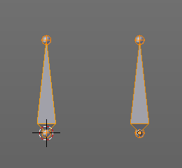

Connected 
----------

Connected connects the Head joint of the one bone with the Tail joint of the other. The child bone will be placed at the position of the head joint of the parent bone. And the joints will be merged.

Keep Offset
-----------

Keep Offset connects the Head joint of the one bone with the Tail joint of the other. The target bone will remain in its position. The joints are not merged. The relationship is indicated by the black dotted line. The child bone will move with the parent bone.

Last Operator Make Parent
-------------------------

Parent Type
-----------

Parent Type is a drop-down box where you can again choose to use the method Connected or the method Keep Offset.

Tool Shelf in Edit Mode - Armature Object, Options Tab
======================================================

Armature Options Panel
----------------------

The Armature Options panel contains some options.

X Axis Mirror
-------------

X Axis Mirror is made to sync the right side of a symmetrical armature with the left side of a symmetrical armature. Means you can create just one half of a skeleton. And then simply mirror it over to the other half. And any further changes that you do at the one side will also apply to the other side of the armature. This includes the whole FK IK setup. And can save you lots of work therefore.

To get X Axis mirror to work requires a bit preparation work. 

Create a armature, with some bones at the one side. Like this. The 3D cursor needs to be at 0/0/0. The left bone is in the middle. Think of it as the backbone. The right bone has an offset, and shall represent our right side of the armature.

.. image:: graphics/7.1.xx_Editors_-_3D_View_-_old_Tool_Shelf/10000201000001C8000000B8088AB84047C87D8B.png

Change the Pivot Point in the Header to 3D Cursor. Important step. We want to mirror around the 3D Cursor.

Now select the right side of the armature. Border select is one fast way. But NOT the bone in the middle, which is our backbone. We don't want to mirror this one too. 

Duplicate what we have selected. And click immediately to leave the duplicate mode. Or you will pull the duplicated part around. Which is not what we want. 

Next we will scale our new created armature part by -1 to mirror it over to the other side. Activate Scale, don't move the mouse, but type immediately in X for the axis and -1 for the scale factor.

This will create our mirrored armature part.

Next important step is to Flip Names. This renames the mirrored bones. Bone.001.R becomes without this step Bone.001.R.001. With rename we get Bone.001.L

And now we are finally arrived at X Axis Mirror. Tick it. 

Now you should be able to modify the one side of the armature, and the other side will be modified too. This includes as told above also FK IK set-ups that you do in Pose mode.

.. image:: graphics/7.1.xx_Editors_-_3D_View_-_old_Tool_Shelf/100002010000021E00000141E931995C23C4BCA1.png

Tool Shelf in Edit Mode - Lattice Object, Tools Tab
===================================================

Lattice Tools Panel
-------------------

Lattice is a deform cage. You can use it to deform other objects.

Mirror
------

Mirror mirrors the selected geometry along the defined axis. Click the Mirror button, type in X, Y or Z, then confirm with enter. 

Last Operator Mirror
--------------------

The Last Operator Mirror panel gives you tools to adjust the mirror action.

Constraint Axis
---------------

Constraint Axis gives you again the possibility to define the mirror axis. You can choose more than one axis here.

Orientation 
------------

Orientation is a drop-down box where you can choose the type of orientation for the mirroring action.

Proportional Editing
--------------------

Proportional Editing is a drop-down box where you can choose to use proportional editing. When you choose one of the active methods then the neighbour geometry gets influenced by Shrink/Fatten too in a proportional way.

.. image:: graphics/7.1.xx_Editors_-_3D_View_-_old_Tool_Shelf/1000020100000090000000932D2EC1559DCA838C.png

Proportional Editing Falloff
----------------------------

Proportional Editing Falloff is a drop-down box where you can choose a method for the falloff for the proportional editing.

Proportional size 
------------------

Proportional size is a edit box where you can adjust the strength of the Proportional falloff.

Edit Grease Pencil
------------------

Edit Grease Pencil edits the selected Grease Pencil strokes.

.. image:: graphics/7.1.xx_Editors_-_3D_View_-_old_Tool_Shelf/10000201000000BA000000D5C32417D7CA2D08A2.png

Confirm on Release
------------------

With Confirm on Release checked the action gets performed when you release the mouse button.

Mirror Vertex Group
-------------------

This tool requires to have a vertex group assigned. It mirrors the selected vertex group.

This tool works only with a perfectly symmetrical mesh along the local X axis. Vertices that have no corresponding vertex on the other side will not be affected.

Last Operator Mirror Vertex Group
---------------------------------

Mirror Weights
--------------

Mirrors the Weight Painting informations from the symmetrical counterpart. When both are selected it will become a group and weight information exchange. If only one is selected, then the information from the unselected vertice will go to the selected vertice.

Flip Group Names
----------------

Flip selected group names. This works with vertex groups with symmetrical name conventions. Like .L , .R, right, left.

All Groups
----------

Pass information to all groups instead of the active one.

Topology Mirror
---------------

Use topology based mirroring.

Make Regular
------------

Make regular sets the shape of the Lattice cage back to a regular cube.

The Last operator Make Regular has no settings.

Tool Shelf in Edit Mode - Force Field, Curve Guide Force
========================================================

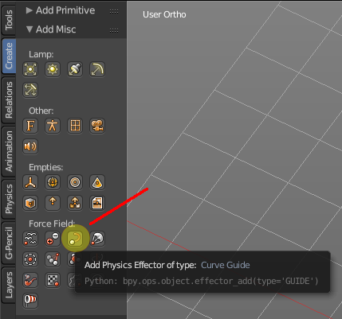

Normally the Force Fields does not have any edit mode. With one exception. The force Curve Guide. It is not only a force object, but also a curve object. And so you need a way to modify the curve.

When you enter the edit mode with the force object "Curve Guide", then you will find yourself in the same panels in the tool shelf like if you would edit a normal curve object. And in fact that's what you do here.

Please have a look at the Curve Object chapters to find out more about the functionality.

Tool Shelf in Pose Mode
=======================

The Pose Mode is a mode especially for armatures. Other object types have no Pose mode. In Pose mode you can pose and animate your armature. This is best done in the Animation layout.

Tool Shelf in Pose Mode - Armature Object, Tools Tab
====================================================

Pose Tools Panel
----------------

The Pose Tools Panel contains the tools that are needed to pose the armature.

In Between
----------

In Between are tools to influence the look of the pose between the keyframes.

For example, record a keyframe at frame 1, then record a keyframe at frame 20. Then go to frame 10, and activate one of the tools. Now you can play around with the settings. And when you are satisfied with the result then you can record a keyframe at this position.

Push
----

Push exxagerrates the current pose. When you activate it then you will see a percentage value in the header.

Last Operator Push Pose
-----------------------

Previous Keyframe
-----------------

The keyframe position before the current frame.

Next Keyframe
-------------

The keyframe position after the current frame.

Percentage
----------

The percentage of exxageration. Interestingly the value in the Last operator differs from the value in the header.

Relax
-----

Relax relaxes the current pose.When you activate it then you will see a percentage value in the header. And some hotkeys. The hotkeys W E and R allows you just to move, rotate or scale. Hotkey B stands for Bendy Bones. And C is for a custom property. This hotkeys are hard coded, and cannot be changed in the input manager.

Last Operator Relax Pose
------------------------

Previous Keyframe
-----------------

The keyframe position before the current frame.

Next Keyframe
-------------

The keyframe position after the current frame.

Percentage
----------

The percentage of exxageration. Interestingly the value in the Last operator differs from the value in the header.

Channels
--------

Here you can again choose if you just want to limit a specific channel.

Axis Lock
---------

Allows you to lock a specific axis.

Breakdowner
-----------

Creates a suitable breakdowner pose on the current frame.When you activate it then you will see a percentage value in the header.

Last Operator Pose Breakdowner
------------------------------

Previous Keyframe
-----------------

The keyframe position before the current frame.

Next Keyframe
-------------

The keyframe position after the current frame.

Percentage
----------

The percentage of exxageration. Interestingly the value in the Last operator differs from the value in the header.

Pose
----

The Pose section contains the Propagate tool. The Propagate tool automates the process of copying and pasting between keyframes. It copies the pose of the selected bones on the current frame over to the keyframes by the chosen Termination mode in the Last Operator Propagate Pose.

The different Propagate methods can be adjustetd in the Last operator.

Usage example with Termination mode "On Selected Keyframes".

Create a little armature.Set a keyframe at frame 0.Set a keyframe at frame 20.Pose frame 20.Set a keyframe at frame 40. It will most probably be identical with Frame 20. Now select those Keyframes at position 40 in the Dope Sheet Editor. Set position to Frame 0.Press Propagate, and in the Last operator Propagate Pose choose On Selected Keyframes. The selected keyframes at frame 40 will now turn into the corresponding keyframes from position 0.

Last Operator Propagate Pose
----------------------------

Terminate Mode 
---------------

A dropdown box where you can choose between different termination modes for Propagate.

While Held 
-----------

While held it tries to guess when to stop propagating by examining the pauses in the animation curves per control (This means all F-Curves for a bone instead of per F-Curve). 

To Next Keyframe 
-----------------

Copies the pose to the first keyframe after the current frame. 

To Last Keyframe 
-----------------

Replaces the last keyframe.

Before Frame 
-------------

Copies to all keyframes between current frame and the **End frame** option. 

Before Last Keyframe 
---------------------

To all keyframes from current frame until no more are found. 

On Selected Keyframes 
----------------------

Applies the pose of the selected bones to all selected keyframes. 

On Selected Markers 
--------------------

Copies to all keyframes on frames with Scene Markers after the current frame. 

End Frame
---------

Defines the end frame for the Propagate.

Keyframes
---------

Contains some keyframing tools.

Insert
------

Inserts keyframes for the specified keying set. Insert has no settings in the Last Operator.

Remove
------

Removes the keyframes at the current frame. Remove has no settings in the Last Operator.

Bake Action
-----------

Calls a popup where you can adjust the bake settings to bake the action. Bake Action bakes the current action into a clip for the NLA editor.

Last Operator Bake Action
-------------------------

The Last Operator Bake Action contains the same settings from the Popup.

Start Frame
-----------

Defines the start frame.

End Frame
---------

Defines the end frame. 

Frame Step
----------

Defines the number of keyframes per step.

Only Selected
-------------

Only key selected bones.

Visual Keying
-------------

Keyframe from the final transformations.

Clear Constraints
-----------------

Remove all constraints and do visual keying.

Clear Parents
-------------

Bake animation onto teh object, then clear parents. This is for objects only.

Overwrite current Action
------------------------

Bake animation into current action.

Bake Data
---------

You can either bake to pose, or bake to object.

Set keying set
--------------

Set keying set is a dropdown box where you can choose between the different available keying sets.

Motion Paths
------------

Calculate Bone Paths 
---------------------

Calculate Bone Paths calculates the paths of the bones. And displays them visually in the 3D space.

Last Operator Calculate Bone Paths
----------------------------------

Start 
------

Defines the start frame

End
---

Defines the end frame

Bake Locaton
------------

Here you can adjust if the motion path gets displayed at the tail of the bone(s) or the head of the bone(s).

Clear Bone Path
---------------

Clears the calculated Bone paths.

Last Operator Clear Bone Paths
------------------------------

Only Selected
-------------

Only clear paths from selected bones.

Tool Shelf in Pose Mode - Armature Object, Relations Tab
========================================================

Relations Panel
---------------

The Relation panel contains tools around relations. 

Parent
------

Set
---

Set calls a menu where you can choose between different parenting methods.

Object
------

Sets the parent to selected object.

Object ( Keep Transform)
------------------------

Sets the parent to selected object, but keeps the transform position / rotation

Armature Deform
---------------

Sets the parent to selected Armature.

With empty Groups
-----------------

Sets the parent to selected Armature, using empty groups.

With Envelope Weights
---------------------

Sets the parent to selected Armature, using envelope weights

With automatic Weights
----------------------

Sets the parent to selected Armature, with automatic weights.

Bone
----

Sets the parent absolute to selected Bone.

Bone Relative
-------------

Sets the parent relative to selected Bone.

Last Operator Make Parent
-------------------------

Type 
-----

is a dropdown box where you can choose between different parenting methods. The working methods are the same than from the Parent popup. The other methods doesn't belong to Armature. 

Keep Transform
--------------

Apply transformation before parenting.

Clear
-----

Clears the parenting.

Tool Shelf in Pose Mode - Armature Object, Options Tab
======================================================

Pose Options Panel
------------------

Auto IK
-------

Add temporary IK constraints while grabbing bones in Pose mode.

Tool Shelf in Sculpt Mode
=========================

The Tool Shelf in Sculpt Mode provides you the tools to sculpt a mesh. The high poly version of a game character for example, where you bake the normal map from.

The Sculpt mode is just available for mesh objects. And requires a tesselated mesh to have useful results.

Tool Shelf in Sculpt Mode - Mesh Object, Tools Tab
==================================================

Brush Panel
-----------

The Brush Panel contains the different Sculpt Brushes and some Brush settings.

Browse Brush
------------

The big image at the top is a dropdown box where you can choose a brush. Click at it, and you will see the different brushes. A click at one of the images will choose this brush then.

Persistent and Set Persistent Base is just available with the brush type Layer.

When you have added a few more brushes then the dropdown box may be more than full. You will see some little white arrows then. Either in the top left or in the bottom right corner. They indicate that some brushes are hidden before or after the current display.

To scroll to this hidden content use the mouse wheel, or the arrow up and down buttons at the keyboard.

The edit box below the Image shows you the name of the current active brush. 

.. image:: graphics/7.1.xx_Editors_-_3D_View_-_old_Tool_Shelf/10000201000001080000001876773D8EAEA47BEA.png

The number right of it, in this case 2, indicates how much number of users ( internally ) this brush uses. This means that this data block (the brush) shares currently settings with at least one other object. Most probably the parent brush where we have created it from. Click at the value to make this brush a single user. The button will vanish then.

F set the brush to have a fake user. Zero user data-blocks are normally not saved. But sometimes you want to force the data to be kept even when the data block has no user.

The + button allows you to add a new pencil with the current settings. Note that the brushes are NOT saved when you close Bforartists. You can save them into the current blend file. Or you can save the startup file. But be careful here. This saves everything else of the current state of Bforartists too.

The X button deletes the brush as the active one. It does NOT delete it from the brushes list.

Radius 
-------

The Radius edit box allows you to adjust the radius of the brush. When the Lock symbol at the front is ticked, then the pencil keeps its size relative to the object when zooming in and out. The button behind the edit box enables tablet pressure sensitivity for radius.

And the button at the end allows you to set the radius of the pencil by hotkey. A click at this button works of course too. But this is a hotkey tool. The button is just a visible reminder.

Strength
--------

The Strength edit box allows you to adjust the strength of the brush. When the Lock symbol at the front is ticked, then the pencil keeps its strength relative to the object when zooming in and out. The button behind the edit box enables tablet pressure sensitivity for strength.

And the button at the end allows you to set the strength by hotkey. A click at this button works of course too. But this is a hotkey tool. The button is just a visible reminder.

Autosmooth
----------

The autosmooth edit box allows you to adjust the amout of smoothing that gets automatically applied to each stroke. The button behind the edit box enables tablet pressure sensitivity for autosmooth.

.. image:: graphics/7.1.xx_Editors_-_3D_View_-_old_Tool_Shelf/100002010000008B00000023F4D7C3AB4824C5DE.png

Sculpt Plane
------------

The sculpt plane defines how the sculpting is aligned. It is a dropdown box where you can choose different methods. By default the Area Plane gets used.

.. image:: graphics/7.1.xx_Editors_-_3D_View_-_old_Tool_Shelf/100002010000007900000092CE7514CC93DCAA46.png

When the Lock symbol at the front is ticked, then it keeps using the normal of the surface where the stroke was initiated.

Front Faces Only
----------------

Front Faces only means that the stroke just affects the vertices that are pointing forwards to the camera.

Add / Subtract
--------------

Add means the stroke adds to the geometry. Subtract means the stroke subtracts from the geometry. 

Accumulate, Persistent, etc.
----------------------------

In this area you will find the brush related settings. They differ from brush to brush.

Texture Panel
-------------

The Texture panel allows you to sculpt with textures. This allows you for example to grab a foto from some fish scales, and simply sculpt them into the surface of your object by using this image as a pencil. Or as a blueprint where you calk through ( Stencil method ).

Note that the following shots are made with Symmetry off and without Brush falloff. Since they disturbed.

Symmetry can be turned off here:

And the brush falloff can be adjusted here. Choose the last method here to have no falloff towards the borders of the brush.

Browse Texture to be linked
---------------------------

The image at the top of the panel is a image browser. Here you can choose a texture that you can choose for sculpting then. You can also have more than one image loaded at once. 

In this shot there is already a texture added. The way to add the texture here is a bit more complicated. And not done with clicking at the New button.

First click at the New button below the image. This will create a new texture slot. This slot is still empty, it displays black. 

.. image:: graphics/7.1.xx_Editors_-_3D_View_-_old_Tool_Shelf/10000201000000C400000098ECBD4A692DFFD559.png

We need to load the texture in this slot. This must be done in the Properties editor in the Textures tab. And then the texture finally shows in the Texture panel in the Tool Shelf.

Texture Edit box
----------------

The Texture edit box is the edit box below the Image browser. When there's no image loaded then it displays the New button. When there's a image (or more) loaded, then you will see the name of the current texture. 

The F button turns this texture into a data block with a fake user. Means it will exists even when there is no data connected to it anymore.

When you activate Fake User, then you may get a value in front of it, which displays how much users this data block (our texture slot) currently has.

The + Button adds another texture slot. Note that you will have to load a texture too, as explained above.

The X button deletes the texture slot.

Brush Mapping
-------------

Our texture can be mapped in different methods. The Brush mapping is a dropdown box where you can choose this different brush mapping methods.

The settings vary. So we will go through them by the different brush mapping methods.

Brush Mapping with mapping method View Plane and Area Plane
-----------------------------------------------------------

The brush mapping method View Plane maps the brush onto the surface of the object, calculating the mapping from the current view. The result may be distorted when the view does not align with the surface of the object.

The brush mapping method Area Plane maps the brush onto the surface of the object, calculating the mapping from the current view. The result is not distorted.

Angle edit box
--------------

Here you can adjust the angle of the brush.

Rake
----

The angle follows the direction of the brush stroke. 

Random
------

The brush angle gets set random.

Random edit box
---------------

Becomes visible when you tick Random. Here you can adjust the maximum value of the random angle.

Offset
------

Fine tune the offset of the texture in the brush.

Size
----

Fine tune the size of the texture in the brush. 

Sample Bias
-----------

Here you can add to or subtract from the amount that gets added by the brush texture. 

Brush Mapping with mapping method Tiled
---------------------------------------

The brush mapping method View Plane maps the brush onto the surface of the object, and tiles the pencil onto the surface. The mapping happens from the View plane. Means you get distortions when you sculpt from an angle.

.. image:: graphics/7.1.xx_Editors_-_3D_View_-_old_Tool_Shelf/10000201000001D1000001971E4FB34B4E0E264B.png

Angle edit box
--------------

Here you can adjust the angle of the brush.

Offset
------

Fine tune the offset of the texture in the brush.

Size
----

Fine tune the size of the texture in the brush. 

Sample Bias
-----------

Here you can add to or subtract from the amount that gets added by the brush texture. 

Brush Mapping with mapping method 3D
------------------------------------

The brush mapping method View Plane and Area Planesculpts where the pencil is. The method 3D sculpts at the initial position of the pencil, as long as you don't release the mouse. The mapping happens from the View plane. Means you get distortions when you sculpt from an angle.

Offset
------

Fine tune the offset of the texture in the brush.

Size
----

Fine tune the size of the texture in the brush. 

Sample Bias
-----------

Here you can add to or subtract from the amount that gets added by the brush texture. 

Brush Mapping with mapping method Random
----------------------------------------

The brush mapping method Random randomizes the texture position of the pencil texture. And so it sculpts random fragments of the pencil.

.. image:: graphics/7.1.xx_Editors_-_3D_View_-_old_Tool_Shelf/100002010000026B000001229840E9A6F959CC0C.png

Angle edit box
--------------

Here you can adjust the angle of the brush.

Rake
----

The angle follows the direction of the brush stroke. 

Random
------

The brush angle gets set random.

Random edit box
---------------

Becomes visible when you tick Random. Here you can adjust the maximum value of the random angle.

Offset
------

Fine tune the offset of the texture in the brush.

Size
----

Fine tune the size of the texture in the brush. 

Sample Bias
-----------

Here you can add to or subtract from the amount that gets added by the brush texture. 

Brush Mapping with mapping method Stencil
-----------------------------------------

The former methods uses the textures for the brush. The method Stencil works different. You have your texture displayed in the workspace above the object, and you paint this texture onto your object with your pencil strokes.

Note that the texture in the 3d space is just visible when you are with the mouse over the viewport.

Image Aspect
------------

Adjust the stencil size to fit to the image aspect ratio

Stencil Brush controls
----------------------

Here you can move, rotate and scale the stencil image in the 3D viewport. And reset the transform. You better use the hotkeys here that gets displayed in the tool tips, since the image is not displayed when the mouse is not over the 3D viewport.

.. image:: graphics/7.1.xx_Editors_-_3D_View_-_old_Tool_Shelf/10000201000000A20000002ED7A7486B55A01165.png

Angle edit box
--------------

Here you can adjust the angle of the brush. The button at the end allows you to set the radius by dragging the mouse. This should be done in the viewport and with the hotkey. This button is just a visible reminder.

Offset
------

Fine tune the offset of the texture in the brush.

Size
----

Fine tune the size of the texture in the brush. 

Stroke Panel
------------

The Stroke panel contains settings to influence the behaviour of the brush stroke. There are various stroke methods available. We will go through them one by one.

Stroke Panel with Stroke method Space
-------------------------------------

This is the default Stroke method. The sculpt stroke gets added continuously with given settings.

.. image:: graphics/7.1.xx_Editors_-_3D_View_-_old_Tool_Shelf/100002010000027F00000166135C929238FCFF21.png

Spacing Edit Box
----------------

The sculpt drawing happens by mapping the pencil onto the mouse position. And when you move the mouse then the next mapping happens. Here you can adjust the spacing after what mouse movement the next mapping should happen. The lower the value, the lower the distance between the single dots.

.. image:: graphics/7.1.xx_Editors_-_3D_View_-_old_Tool_Shelf/1000020100000155000000E532BFC83EE2B89FBC.png

The icon behind the edit box enables tablet pressure sensitivity for tablets.

Jitter Edit Box
---------------

Here you can add Jitter to the brush while painting.

The icon in front of the edit box toggles between jittering in screen space and relative to brush size.

The icon behind the edit box enables tablet pressure sensitivity for tablets.

Smooth Stroke
-------------

The brush lags behind the mouse position, and produces a much smoother stroke by that.

Smooth Stroke Radius Edit Box
-----------------------------

Is just active when Smooth Stroke is activated. Here you can adjust the radius of the smoothing.

Smooth Stroke Factor Edit Box
-----------------------------

Is just active when Smooth Stroke is activated. Here you can adjust the factor of the smoothing.

Input Samples Edit Box
----------------------

Average multiple input samples together to smooth the brush stroke.

Stroke Panel with Stroke method Curve
-------------------------------------

The Stroke method curve doesn't simply influence the way how the stroke is painted. It is a special method. First you draw a curve object by holding down ctrl and clicking with left mouse button. Then you tweak the curve. You can click at the curve point, and drag out handlers to make the curve points smoooth

Then you hit the Draw Curve button. And the curve gets sculpted.

.. image:: graphics/7.1.xx_Editors_-_3D_View_-_old_Tool_Shelf/10000201000003D00000021039632AA1FFFC8901.png

Spacing Edit Box
----------------

The sculpt drawing happens by mapping the pencil onto the mouse position. And when you move the mouse then the next mapping happens. Here you can adjust the spacing after what mouse movement the next mapping should happen. The lower the value, the lower the distance between the single dots.

.. image:: graphics/7.1.xx_Editors_-_3D_View_-_old_Tool_Shelf/1000020100000155000000E532BFC83EE2B89FBC.png

The icon behind the edit box enables tablet pressure sensitivity for tablets.

Paint Curve edit box
--------------------

Here you set the active curve.

The first element is a dropdown box where you will find your curves objects. You can have more than one.

The second element is the edit box that displays the active curve.

The number right of it, in this case 2, indicates how much number of users ( internally ) this brush uses. This means that this data block (the brush) shares currently settings with at least one other object. Most probably the parent brush where we have created it from. Click at the value to make this brush a single user. The button will vanish then.

F set the brush to have a fake user. Zero user data-blocks are normally not saved. But sometimes you want to force the data to be kept even when the data block has no user.

The + button allows you to add a new pencil with the current settings. Note that the brushes are NOT saved when you close Bforartists. You can save them into the current blend file. Or you can save the startup file. But be careful here. This saves everything else of the current state of Bforartists too.

The X button deletes the brush as the active one. It does NOT delete it from the brushes list.

Draw Curve Button
-----------------

A click at it to turns the curve into a sculpt stroke.

Jitter Edit Box
---------------

Here you can add Jitter to the brush while painting.

The icon in front of the edit box toggles between jittering in screen space and relative to brush size.

The icon behind the edit box enables tablet pressure sensitivity for tablets.

Input Samples Edit Box
----------------------

Average multiple input samples together to smooth the brush stroke.

Stroke Panel with Stroke method Line
------------------------------------

With Stroke method line you draw a line between a starting point and a endpoint. And when you release the mouse then the line gets sculpted.

Spacing Edit Box
----------------

The sculpt drawing happens by mapping the pencil onto the mouse position. And when you move the mouse then the next mapping happens. Here you can adjust the spacing after what mouse movement the next mapping should happen. The lower the value, the lower the distance between the single dots.

.. image:: graphics/7.1.xx_Editors_-_3D_View_-_old_Tool_Shelf/1000020100000155000000E532BFC83EE2B89FBC.png

The icon behind the edit box enables tablet pressure sensitivity for tablets.

Jitter Edit Box
---------------

Here you can add Jitter to the brush while painting.

The icon in front of the edit box toggles between jittering in screen space and relative to brush size.

The icon behind the edit box enables tablet pressure sensitivity for tablets.

Input Samples Edit Box
----------------------

Average multiple input samples together to smooth the brush stroke.

Stroke Panel with Stroke method Airbrush
----------------------------------------

The sculpt stroke acts like an airbrush pencil. The dots gets placed randomly.

.. image:: graphics/7.1.xx_Editors_-_3D_View_-_old_Tool_Shelf/100002010000025B0000017CA98DAA3BB438D225.png

Rate Edit Box
-------------

Here you can define the rate of the drawing.

Jitter Edit Box
---------------

Here you can add Jitter to the brush while painting.

The icon in front of the edit box toggles between jittering in screen space and relative to brush size.

The icon behind the edit box enables tablet pressure sensitivity for tablets.

Smooth Stroke
-------------

The brush lags behind the mouse position, and produces a much smoother stroke by that.

Smooth Stroke Radius Edit Box
-----------------------------

Is just active when Smooth Stroke is activated. Here you can adjust the radius of the smoothing.

Smooth Stroke Factor Edit Box
-----------------------------

Is just active when Smooth Stroke is activated. Here you can adjust the factor of the smoothing.

Input Samples Edit Box
----------------------

Average multiple input samples together to smooth the brush stroke.

Stroke Panel with Stroke method Anchored
----------------------------------------

Click and drag to place a dot and to scale it.

.. image:: graphics/7.1.xx_Editors_-_3D_View_-_old_Tool_Shelf/100002010000024F00000179BDAF655D6E033445.png

Edge to Edge
------------

Without Edge to Edge the scaling happens from the center of the brush. With edge to edge the scaling happesn from the edge of the brush.

Input Samples Edit Box
----------------------

Average multiple input samples together to smooth the brush stroke.

Stroke Panel with Stroke method Drag dot
----------------------------------------

Click and drag to place a dot.

.. image:: graphics/7.1.xx_Editors_-_3D_View_-_old_Tool_Shelf/100002010000008B000000556F2506F507BFAF83.png

Input Samples Edit Box
----------------------

Average multiple input samples together to smooth the brush stroke.

Curve Panel
-----------

The curve panel allows you to define different fallofs methods for the border of the brush.

Navigation elements
-------------------

The navigation elements at the top are described from left to right

Zoom in and out
---------------

The two buttons with the magnifying glass at it zooms in and out in the curve window.

Tools
-----

Tools is a menu where you can find some cuve related tools.

Reset View
----------

Resets the curve windows zoom

Vector Handle
-------------

Set handle type to Vector

Auto Handle
-----------

Set handle type to Auto

Auto Clamped Handle
-------------------

Set handle type to Auto Clamped

Reset Curve
-----------

Resets the curve to the initial shape.

Curve Presets
-------------

Here you can find some predefined curve presets.

Dyntopo Panel
-------------

Dyntopo stands for Dynamic Topology Sculpting.

Without dyntopo you just deform the existing geometry. With Dyntopo geometry gets subdivided when needed. This makes it possible to sculpt complex shapes out of a block.

Left without Dyntopo, right with Dyntopo.

.. image:: graphics/7.1.xx_Editors_-_3D_View_-_old_Tool_Shelf/10000201000001B2000000EE6B8C50E48E9226B0.png

Note that some brushes does not work with Dyntopo. They are Grab brush, Rotate brush, Thumb brush, Layer brush, Smooth brush (including alt-key smoothing with a different brush) and Mask brush.

The topology will also not be updated if the stroke mode is Anchored or Drag Dot.

Detail Size
-----------

The Detail size defines how fine the subdivision will be. When you click at the upper button then a widget appears where you can set the detail size by dragging. This button contains also the hotkey to change the detail size in the viewport so that you don't have to grab the slider all the time when working.

The edit box below does the same. But with a slider, and without visible feedback in form of a widget.

Detail Refine method
--------------------

Here you can define the Detail refine method.

Subdivide Collapse
------------------

Both methods in one. Subdivide long edges to add mesh detail where needed. And collapse short edges to remove mesh detail where possible.

Collapse Edges
--------------

Collapse short edges to remove mesh detail where possible.

Subdivide Edges
---------------

Subdivide long edges to add mesh detail where needed.

Detail Type Method
------------------

Here you can define the Detail Type method.

Brush Detail
------------

Mesh Detail is relative to brush radius.

Constant Detail
---------------

Mesh detail is constant in object space according to detail size.

Relative Detail
---------------

Mesh Detail is relative to brush size and detail size

Smooth shading
--------------

Show faces in smooth shading instead of flat shading.

Optimize
--------

Recalculate the sculpt BVH to improve performance.

Detail Floodfill
----------------

Flood fill the mesh with the selected detail settings.

Direction
---------

Source and Destination for Symmetrize operator. This has to do with the symmetrize button below.

Symmetrize 
-----------

Symmetrize the topology modifications.

Symmetry / Lock
---------------

The Symmetry Lock panel contains tools around symmetry and lock features. Here you can turn on or off mirroring along axis, etc.

Mirror
------

Mirror sculpt along activated axis. By default the mirroring is activated around X axis.

Radial
------

Adjust the repeatings across some axis. For example, when you change Z to 32, then you can draw 32 segments simultaneously around the Z axis instead of just one, distributed around the Z axis.

Feather
-------

Reduce the strength of the brush where it overlaps symmetrical daubs

Lock
----

Disallow vertices movement in locked axis direction.

Tiling
------

Produces a mesh that is tilable in the activated directions.

Tile Offset
-----------

Here you can adjust the offset of the tiling.

Tool Shelf in Sculpt Mode - Mesh Object, Options tab
====================================================

The Options tab for sculpting provides you with some settings and options for sculpting.

Overlay Panel
-------------

Curve
-----

This setting is interesting for the Stroke method Curve. Here you can adjust how transparent the curve is.

The eye icon button in front of the slider is to show the curve object in viewport. The brush icon button behind the slider is to hide the overlay during a stroke.

Texture
-------

This setting is interesting for Texture painting. Here you can adjust how transparent the texture is.

The eye icon button in front of the slider is to show the texture in the viewport. The brush icon button behind the slider is to hide the overlay during a stroke.

The Stencil map texture has no eye icon button since it gets shown in the viewport anyways.

Options Panel
-------------

Dab Gravity
-----------

Here you can add gravity after each stroke. 

Factor
------

The factor silder defines the amount.

Orientation
-----------

Here you define an object that gets used to determine the gravity from. The Z axis of this object gets used.

Threaded Sculpt
---------------

Use multiple CPU cores for sculpting.

Fast Navigate
-------------

For Multires, show Low Res mesh when navigating.

Use Deform only
---------------

Use only deformation modifiers ( The other constructive modifiers except multi-resolution gets temporary disabled)

Show Diffuse Color
------------------

Show the diffuse color of the object while sculpting.

Unified Settings
----------------

Size
----

Instead of per Brush radius, the radius is shared across brushes.

Strength
--------

Instead of per Brush strength, the strength is shared across brushes.

Color
-----

Instead of per Brush color, the color is shared across brushes.

Enabled Brush Modes
-------------------

Enabled Modes
-------------

Enabled modes is a dropdown menu where you can adjust in which modes the brushes shows.

Appearance Panel
----------------

The Appearance panel provides you with some settings to adjust the appearance of the brush.

Show Brush
----------

Show the brush in 3D view.

Add
---

The color that the brush cursor has when adding to geometry.

Subtract
--------

The color of the brush cursor when subtracting from the geometry.

Custom Brush Icon
-----------------

Here you can define a custom icon for the brush.

Tool Shelf in Vertex Paint Mode
===============================

The Tool Shelf in Vertex Paint Mode provides you the tools to paint vertices.

Vertex painting assigns colors to single vertices. And this color gets interpolated between the different vertices then. This is what makes the faces colored. And this means that you can NOT paint in the middle of a face with this method. You just paint the vertices from the mesh.

The Vertex Paint mode is just available for mesh objects.

Tool Shelf in Vertex Paint Mode - Mesh Object, Tools Tab
========================================================

Brush Panel
-----------

The Brush Panel contains the different Brushes and some Brush settings. Here you can choose and adjust your current active brush.

At down left you can find the display options. The button with the gear symbol at it. Here you will find two toggles to hide away the color picker and the palette edit box. 

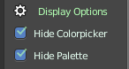

Browse Brush
------------

The big image at the top is a dropdown box where you can choose a brush. Click at it, and you will see the different brushes. A click at one of the images will choose this brush then.

When you have added a few more brushes then the dropdown box may be more than full. You will see some little white arrows then. Either in the top left or in the bottom right corner. They indicate that some brushes are hidden before or after the current display.

.. image:: graphics/7.1.xx_Editors_-_3D_View_-_old_Tool_Shelf/100002010000028C000001560EBA49FB8F3DDB81.png

To scroll to this hidden content use the mouse wheel, or the arrow up and down buttons at the keyboard.

The edit box below the Image shows you the name of the current active brush. 

.. image:: graphics/7.1.xx_Editors_-_3D_View_-_old_Tool_Shelf/10000201000001080000001876773D8EAEA47BEA.png

The number right of it, in this case 2, indicates how much number of users ( internally ) this brush uses. This means that this data block (the brush) shares currently settings with at least one other object. Most probably the parent brush where we have created it from. Click at the value to make this brush a single user. The button will vanish then.

F set the brush to have a fake user. Zero user data-blocks are normally not saved. But sometimes you want to force the data to be kept even when the data block has no user.

The + button allows you to add a new pencil with the current settings. Note that the brushes are NOT saved when you close Bforartists. You can save them into the current blend file. Or you can save the startup file. But be careful here. This saves everything else of the current state of Bforartists too.

The X button deletes the brush as the active one. It does NOT delete it from the brushes list.

Color dialog
------------

The color dialog is hidden by default. See display options at the bottom of the panel. You can define the color in the color element below the brush browser. It will also open a color dialog then.

When you set it to visible, then you can set the color for painting by a click with the mouse in the color wheel. The slider at the right defines the brightness.

The button below shows you the active color. 

A click at the color button will open a more detailed color dialog, where you can set up rgb, hsv and hex colors and with sliders.

Color Element
-------------

Here you can set a primary and a secondary color. The button with the arrows at it switches the active and the secondary color. And with the pipette you can pick a color from the screen. This will reveal some more elements, and create a palette. Here you can choose now the color to use it for painting. You can add and remove colors here too.

This color picker can just pick a color in the 3D view. It does not work elsewhere.

Radius 
-------

The Radius edit box allows you to adjust the radius of the brush. The button behind the edit box enables tablet pressure sensitivity for radius.

And the button at the end allows you to set the radius of the pencil by hotkey. A click at this button works of course too. But this is a hotkey tool. The button is just a visible reminder.

Strength
--------

The Strength edit box allows you to adjust the strength of the brush. The button behind the edit box enables tablet pressure sensitivity for strength.

And the button at the end allows you to set the strength by hotkey. A click at this button works of course too. But this is a hotkey tool. The button is just a visible reminder.

Blending Modes
--------------

Here you can define how the stroke will blend.

Accumulate, Alpha, etc. 
------------------------

This are brush specific settings. They change with the brush.

Palette Editbox
---------------

Palette Edit box is hidden by default. 

Here you can give your palette a name, create another palette, remove palette, and give it a fake user.

Display options
---------------

Here you can show or hide the Colorpicker and the Palette Editbox.

Texture Panel
-------------

The Texture panel allows you to paint with textures. This allows you for example to grab a foto from some fish scales, and simply paint them onto the vertices by using this image as a pencil. Or as a blueprint where you calk through ( Stencil method ).

Browse Texture to be linked
---------------------------

The image at the top of the panel is a image browser. Here you can choose a texture that you can choose for sculpting then. You can also have more than one image loaded at once. 

In this shot there is already a texture added. The way to add the texture here is a bit more complicated. And not done with clicking at the New button.

First click at the New button below the image. This will create a new texture slot. This slot is still empty, it displays black. 

.. image:: graphics/7.1.xx_Editors_-_3D_View_-_old_Tool_Shelf/10000201000000C400000098ECBD4A692DFFD559.png

We need to load the texture in this slot. This must be done in the Properties editor in the Textures tab. And then the texture finally shows in the Texture panel in the Tool Shelf.

Texture Edit box
----------------

The Texture edit box is the edit box below the Image browser. When there's no image loaded then it displays the New button. When there's a image (or more) loaded, then you will see the name of the current texture. 

The F button turns this texture into a data block with a fake user. Means it will exists even when there is no data connected to it anymore.

When you activate Fake User, then you may get a value in front of it, which displays how much users this data block (our texture slot) currently has.

The + Button adds another texture slot. Note that you will have to load a texture too, as explained above.

The X button deletes the texture slot.

Brush Mapping
-------------

Our texture can be mapped in different methods. The Brush mapping is a dropdown box where you can choose this different brush mapping methods.

The settings vary. So we will go through them by the different brush mapping methods.

Brush Mapping with mapping method Tiled
---------------------------------------

The brush mapping method Tiled tiles the brush stroke at the surface. The mapping happens from the current view. The result may be distorted when the view does not align with the surface of the object.

.. image:: graphics/7.1.xx_Editors_-_3D_View_-_old_Tool_Shelf/10000201000003C8000001B8639A43562C5F2530.png

Angle
-----

The angle of the brush.

Offset 
-------

The offset of the texture in the brush.

Size
----

The size of the texture in the brush.

Brush Mapping with mapping method View Plane
--------------------------------------------

The brush mapping method View Plane simply paints onto the surface. The mapping happens from the current view. The result may be distorted when the view does not align with the surface of the object.

.. image:: graphics/7.1.xx_Editors_-_3D_View_-_old_Tool_Shelf/10000201000003C4000001BF95E4D705C6ADBA6E.png

Angle
-----

The angle of the brush.

Rake
----

The angle follows the direction of the brush stroke. 

Random
------

The brush angle gets set random.

Offset 
-------

The offset of the texture in the brush.

Size
----

The size of the texture in the brush.

Brush Mapping with mapping method 3D
------------------------------------

The brush mapping method 3D paints the texture at the surface, by tiling it 1/1 at the object surface. 

.. image:: graphics/7.1.xx_Editors_-_3D_View_-_old_Tool_Shelf/10000201000003C6000001BF1D8496AB365DD815.png

Offset 
-------

The offset of the texture in the brush.

Size
----

The size of the texture in the brush.

Brush Mapping with mapping method Random
----------------------------------------

The brush mapping method Random paints onto the surface, and randomizes the texture position in the brush while that. The mapping happens from the current view. The result may be distorted when the view does not align with the surface of the object.

.. image:: graphics/7.1.xx_Editors_-_3D_View_-_old_Tool_Shelf/10000201000003C4000001BF95E4D705C6ADBA6E.png

Angle
-----

The angle of the brush.

Rake
----

The angle follows the direction of the brush stroke. 

Random
------

The brush angle gets set random.

Offset 
-------

The offset of the texture in the brush.

Size
----

The size of the texture in the brush.

Brush Mapping with mapping method Stencil
-----------------------------------------

The former methods uses the textures for the brush. The method Stencil works different. You have your texture displayed in the workspace above the object, and you paint this texture onto your object with your pencil strokes.

Note that the texture in the 3d space is just visible when you are with the mouse over the viewport.

Image Aspect
------------

Adjust the stencil size to fit to the image aspect ratio

Stencil Brush controls
----------------------

Here you can move, rotate and scale the stencil image in the 3D viewport. And reset the transform. You better use the hotkeys here that gets displayed in the tool tips, since the image is not displayed when the mouse is not over the 3D viewport.

.. image:: graphics/7.1.xx_Editors_-_3D_View_-_old_Tool_Shelf/10000201000000A20000002ED7A7486B55A01165.png

Angle edit box
--------------

Here you can adjust the angle of the brush. The button at the end allows you to set the radius by dragging the mouse. This should be done in the viewport and with the hotkey. This button is just a visible reminder.

Offset
------

Fine tune the offset of the texture in the brush.

Size
----

Fine tune the size of the texture in the brush. 

Stroke Panel
------------

The Stroke panel contains settings to influence the behaviour of the brush stroke. There are various stroke methods available. We will go through them one by one.

Stroke Panel with Stroke method Space
-------------------------------------

This is the default Stroke method. The sculpt stroke gets added continuously with given settings.

.. image:: graphics/7.1.xx_Editors_-_3D_View_-_old_Tool_Shelf/10000201000003C8000001B7582C0A35C882257A.png

Spacing Edit Box
----------------

The sculpt drawing happens by mapping the pencil onto the mouse position. And when you move the mouse then the next mapping happens. Here you can adjust the spacing after what mouse movement the next mapping should happen. The lower the value, the lower the distance between the single dots.

.. image:: graphics/7.1.xx_Editors_-_3D_View_-_old_Tool_Shelf/10000201000003C7000001B87D6E2E8D14564287.png

The icon behind the edit box enables tablet pressure sensitivity for tablets.

Jitter Edit Box
---------------

Here you can add Jitter to the brush while painting.

The icon in front of the edit box toggles between jittering in screen space and relative to brush size.

The icon behind the edit box enables tablet pressure sensitivity for tablets.

Smooth Stroke
-------------

The brush lags behind the mouse position, and produces a much smoother stroke by that. The Smooth Stroke relatet settings are hidden as long as Smooth Stroke is not activated.

Smooth Stroke Radius Edit Box
-----------------------------

Is just active when Smooth Stroke is activated. Here you can adjust the radius of the smoothing.

Smooth Stroke Factor Edit Box
-----------------------------

Is just active when Smooth Stroke is activated. Here you can adjust the factor of the smoothing.

Input Samples Edit Box
----------------------

Is just active when Smooth Stroke is activated.Average multiple input samples together to smooth the brush stroke.

Stroke Panel with Stroke method Curve
-------------------------------------

The Stroke method curve doesn't simply influence the way how the stroke is painted. It is a special method. First you draw a curve object by holding down ctrl and clicking with left mouse button. Then you tweak the curve. You can click at the curve point, and drag out handlers to make the curve points smoooth.

Then you hit the Draw Curve button. And the curve gets drawn onto the surface.

Spacing Edit Box
----------------

The drawing happens by mapping the pencil onto the mouse position. And when you move the mouse then the next mapping happens. Here you can adjust the spacing after what mouse movement the next mapping should happen. The lower the value, the lower the distance between the single dots.

.. image:: graphics/7.1.xx_Editors_-_3D_View_-_old_Tool_Shelf/10000201000003C7000001B87D6E2E8D14564287.png

The icon behind the edit box enables tablet pressure sensitivity for tablets.

Paint Curve edit box
--------------------

Here you set the active curve.

The first element is a dropdown box where you will find your curves objects. You can have more than one.

The second element is the edit box that displays the active curve.

The number right of it, in this case 2, indicates how much number of users ( internally ) this brush uses. This means that this data block (the brush) shares currently settings with at least one other object. Most probably the parent brush where we have created it from. Click at the value to make this brush a single user. The button will vanish then.

F set the brush to have a fake user. Zero user data-blocks are normally not saved. But sometimes you want to force the data to be kept even when the data block has no user.

The + button allows you to add a new pencil with the current settings. Note that the brushes are NOT saved when you close Bforartists. You can save them into the current blend file. Or you can save the startup file. But be careful here. This saves everything else of the current state of Bforartists too.

The X button deletes the brush as the active one. It does NOT delete it from the brushes list.

Draw Curve Button
-----------------

A click at it to turns the curve into a sculpt stroke.

Jitter Edit Box
---------------

Here you can add Jitter to the brush while painting.

The icon in front of the edit box toggles between jittering in screen space and relative to brush size.

The icon behind the edit box enables tablet pressure sensitivity for tablets.

Input Samples Edit Box
----------------------

Average multiple input samples together to smooth the brush stroke.

Stroke Panel with Stroke method Line
------------------------------------

With Stroke method line you draw a line between a starting point and a endpoint. And when you release the mouse then the line gets sculpted.

.. image:: graphics/7.1.xx_Editors_-_3D_View_-_old_Tool_Shelf/10000201000003C8000001B845D794207DF1DAA4.png

Spacing Edit Box
----------------

The sculpt drawing happens by mapping the pencil onto the mouse position. And when you move the mouse then the next mapping happens. Here you can adjust the spacing after what mouse movement the next mapping should happen. The lower the value, the lower the distance between the single dots.

.. image:: graphics/7.1.xx_Editors_-_3D_View_-_old_Tool_Shelf/10000201000003C7000001B87D6E2E8D14564287.png

The icon behind the edit box enables tablet pressure sensitivity for tablets.

Jitter Edit Box
---------------

Here you can add Jitter to the brush while painting.

The icon in front of the edit box toggles between jittering in screen space and relative to brush size.

The icon behind the edit box enables tablet pressure sensitivity for tablets.

Input Samples Edit Box
----------------------

Average multiple input samples together to smooth the brush stroke.

Stroke Panel with Stroke method Airbrush
----------------------------------------

The stroke acts like an airbrush pencil. The dots gets placed randomly.

Rate Edit Box
-------------

Here you can define the rate of the drawing.

Jitter Edit Box
---------------

Here you can add Jitter to the brush while painting.

The icon in front of the edit box toggles between jittering in screen space and relative to brush size.

The icon behind the edit box enables tablet pressure sensitivity for tablets.

Smooth Stroke
-------------

The brush lags behind the mouse position, and produces a much smoother stroke by that.

Smooth Stroke Radius Edit Box
-----------------------------

Is just active when Smooth Stroke is activated. Here you can adjust the radius of the smoothing.

Smooth Stroke Factor Edit Box
-----------------------------

Is just active when Smooth Stroke is activated. Here you can adjust the factor of the smoothing.

Input Samples Edit Box
----------------------

Average multiple input samples together to smooth the brush stroke.

Stroke Panel with Stroke method Dots
------------------------------------

The stroke method Dots draws dots of the pencil onto the surface. The mapping happens from the current view. Means you will get distortions when your view is not aligned with the surface of the object.

Jitter Edit Box
---------------

Here you can add Jitter to the brush while painting.

The icon in front of the edit box toggles between jittering in screen space and relative to brush size.

The icon behind the edit box enables tablet pressure sensitivity for tablets.

Smooth Stroke
-------------

The brush lags behind the mouse position, and produces a much smoother stroke by that.

Smooth Stroke Radius Edit Box
-----------------------------

Is just active when Smooth Stroke is activated. Here you can adjust the radius of the smoothing.

Smooth Stroke Factor Edit Box
-----------------------------

Is just active when Smooth Stroke is activated. Here you can adjust the factor of the smoothing.

Input Samples Edit Box
----------------------

Average multiple input samples together to smooth the brush stroke.

Curve Panel
-----------

The curve panel allows you to define different fallofs methods for the border of the brush.

Navigation elements
-------------------

The navigation elements at the top are described from left to right

Zoom in and out
---------------

The two buttons with the magnifying glass at it zooms in and out in the curve window.

Tools
-----

Tools is a menu where you can find some cuve related tools.

Reset View
----------

Resets the curve windows zoom

Vector Handle
-------------

Set handle type to Vector

Auto Handle
-----------

Set handle type to Auto

Auto Clamped Handle
-------------------

Set handle type to Auto Clamped

Reset Curve
-----------

Resets the curve to the initial shape.

Curve Presets
-------------

Here you can find some predefined curve presets.

Tool Shelf in Vertex paint Mode - Mesh Object, Options tab
==========================================================

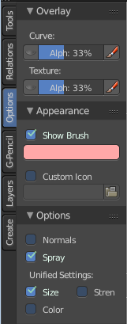

The Options tab for sculpting provides you with some settings and options for vertex painting.

Overlay Panel
-------------

Curve
-----

This setting is interesting for the Stroke method Curve. Here you can adjust how transparent the curve is.

The eye icon button in front of the slider is to show the curve object in viewport. The brush icon button behind the slider is to hide the overlay during a stroke.

Texture
-------

This setting is interesting for Texture painting. Here you can adjust how transparent the texture is.

The eye icon button in front of the slider is to show the texture in the viewport. The brush icon button behind the slider is to hide the overlay during a stroke.

The Stencil map texture has no eye icon button since it gets shown in the viewport anyways.

Appearance Panel
----------------

The Appearance panel provides you with some settings to adjust the appearance of the brush.

Show Brush
----------

Show the brush in 3D view.

Color of cursor when adding
---------------------------

The color that the brush cursor has when painting

Custom Icon
-----------

Here you can define a custom icon for the brush.

Options Panel
-------------

Unified Settings
----------------

Size
----

Instead of per Brush radius, the radius is shared across brushes.

Strength
--------

Instead of per Brush strength, the strength is shared across brushes.

Color
-----

Instead of per Brush color, the color is shared across brushes.

Enabled Brush Modes
-------------------

Enabled Modes
-------------

Enabled modes is a dropdown menu where you can adjust in which modes the brushes shows.

Tool Shelf in Weight Paint Mode
===============================

Weightpainting general
----------------------

The Tool Shelf in Weight Paint Mode provides you the tools to do weight painting at a mesh. Skinned characters for example.

The vertices becomes a "weighting" assigned in this process. Means a per centage influence of the bone to a vertice. And under the hood you create vertex groups with the vertices that are assigned to the bones.

The amount of influence is defined by the weight paint color. Pure red has an influence value of 1. Pure blue has an influence value of 0. And the gradients between red and blue defines the inbetween steps in the 0-1 range. This is needed since there can be more than one bone influence and deform a vertice. Usually at the transition areas between two bones. The green areas in this shot.

The Weight Paint mode is just available for mesh objects.

Weight painting at characters
-----------------------------

The main purpose for Weightpainting is to weight the skin for characters. So that they deform proper when you pose your armature.

Skinning
--------

To do weightpainting at a character you first have to assign the skin to the armature. So we need a mesh and a armature here.

.. image:: graphics/7.1.xx_Editors_-_3D_View_-_old_Tool_Shelf/100002010000015E000001461B894ED8DF53D183.png

Let's do a quick run through skinning. This method works in Object mode, but also in Pose mode.

First we activate X Ray at the armature. So that we can still see the armature inside of the mesh.

Position the mesh at its final location.

Now select the Mesh, hold down Shift key, and select the Armature. Both should be selected now.

In the Tool Shelf switch to the Relations tab and click at the Parent button. You can also press the hotkey Ctrl P. This calls the parenting menu under the mouse position.

Here we choose "With Automatic Weights". Automatic weighting means that the bones grabs the nearest vertices within a given radius, and assignes them to this bone.

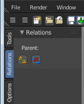

When everything went well then the mesh, in our case the Cylinder, is now part of the hierarchy of the armature. Which can be seen in the outliner.

And when you select the armature, and switch to Pose mode now, then you can already deform the mesh by posing the armature.

.. image:: graphics/7.1.xx_Editors_-_3D_View_-_old_Tool_Shelf/1000020100000166000001772AB4C935B71BE369.png

Enter and leave Weightpainting
------------------------------

You can enter Weight Painting for the mesh in any state of the armature. But weight painting should happen in Pose mode so that you can pose your mesh to see the resulting deformings.

So with the armature in Pose mode, select the mesh by clicking at it. Then enter Weight Paint mode. You can now do weight painting at the mesh.

To leave Weight painting, simply switch back to Object mode.

Switch bones
------------

The weighting that gets displayed when you enter Weight Paint mode is from the last active bone. You might want to do weight painting for another bone. So we need to switch the bone.

.. image:: graphics/7.1.xx_Editors_-_3D_View_-_old_Tool_Shelf/10000201000000EB0000011583A0637AEB4C49CA.png

Hold down Ctrl, and click at the bone that you want to set active. Then the weighting for this bone gets displayed.

Weightpainting without any further combination
----------------------------------------------

You can also do weightpainting without an armature. Just at the pure mesh. In this case you just create the vertex groups for the mesh. And those vertex groups can be accessed in edit mode then for further useage. As shown in the shots below.

Weightpainting in combination with particles
--------------------------------------------

You can also combine weight painting with particles. To influence the length of hair for example. The weightmap can be assigned in the Vertex Groups panel in the Particles tab.

Tool Shelf in Weight Paint Mode - Mesh Object, Tools Tab
========================================================

Brush Panel
-----------

The Brush Panel contains the different Brushes and some Brush settings. Here you can choose and adjust your current active brush.

Browse Brush
------------

The big image at the top is a dropdown box where you can choose a brush. Click at it, and you will see the different brushes. A click at one of the images will choose this brush then.

When you have added a few more brushes then the dropdown box may be more than full. You will see some little white arrows then. Either in the top left or in the bottom right corner. They indicate that some brushes are hidden before or after the current display.

.. image:: graphics/7.1.xx_Editors_-_3D_View_-_old_Tool_Shelf/100002010000028C000001560EBA49FB8F3DDB81.png

To scroll to this hidden content use the mouse wheel, or the arrow up and down buttons at the keyboard.

The edit box below the Image shows you the name of the current active brush. 

.. image:: graphics/7.1.xx_Editors_-_3D_View_-_old_Tool_Shelf/10000201000001080000001876773D8EAEA47BEA.png

The number right of it, in this case 2, indicates how much number of users ( internally ) this brush uses. This means that this data block (the brush) shares currently settings with at least one other object. Most probably the parent brush where we have created it from. Click at the value to make this brush a single user. The button will vanish then.

F set the brush to have a fake user. Zero user data-blocks are normally not saved. But sometimes you want to force the data to be kept even when the data block has no user.

The + button allows you to add a new pencil with the current settings. Note that the brushes are NOT saved when you close Bforartists. You can save them into the current blend file. Or you can save the startup file. But be careful here. This saves everything else of the current state of Bforartists too.

The X button deletes the brush as the active one. It does NOT delete it from the brushes list.

Weight edit box
---------------

Here you can adjust the strength of the weight painting.

Radius 
-------

The Radius edit box allows you to adjust the radius of the brush. The button behind the edit box enables tablet pressure sensitivity for radius.

.. image:: graphics/7.1.xx_Editors_-_3D_View_-_old_Tool_Shelf/100002010000007C000000184EBF6647A0110BD4.png

And the button at the end allows you to set the radius of the pencil by hotkey. A click at this button works of course too. But this is a hotkey tool. The button is just a visible reminder.

Strength
--------

The Strength edit box allows you to adjust the strength of the brush. The button behind the edit box enables tablet pressure sensitivity for strength.

And the button at the end allows you to set the strength by hotkey. A click at this button works of course too. But this is a hotkey tool. The button is just a visible reminder.

Blend
-----

Blend is a dropdown box where you can choose between different blend modes for the color that you paint.

Darken 
-------

Darkens the color under the brush.

Lighten
-------

Brightens the color under the brush.

Blur
----

Blurs the color under the brush.

Multiply
--------

Multiplys with the color under the brush.

Subtract
--------

Subtract from the color under the brush.

Add
---

Adds to the color under the brush.

Mix
---

Mixes with the color under the brush.

Auto Normalize
--------------

Auto normalizes the weighting so that in the sum all vertex groups does not go over 1.0

Multipaint
----------

Paint across the weights of all selected bones, maintaining their relative influence.

Stroke Panel
------------

The Stroke panel contains settings to influence the behaviour of the brush stroke. There are various stroke methods available. We will go through them one by one.

Stroke Panel with Stroke method Space
-------------------------------------

This is the default Stroke method. The sculpt stroke gets added continuously with given settings.

.. image:: graphics/7.1.xx_Editors_-_3D_View_-_old_Tool_Shelf/1000020100000275000001210282D9194FD3ABB2.png

Spacing Edit Box
----------------

The drawing happens by mapping the pencil onto the mouse position. And when you move the mouse then the next mapping happens. Here you can adjust the spacing after what mouse movement the next mapping should happen. The lower the value, the lower the distance between the single dots.

.. image:: graphics/7.1.xx_Editors_-_3D_View_-_old_Tool_Shelf/100002010000023000000102808F4DF492A77E4B.png

The icon behind the edit box enables tablet pressure sensitivity for tablets.

Jitter Edit Box
---------------

Here you can add Jitter to the brush while painting.

The icon in front of the edit box toggles between jittering in screen space and relative to brush size.

The icon behind the edit box enables tablet pressure sensitivity for tablets.

Smooth Stroke
-------------

The brush lags behind the mouse position, and produces a much smoother stroke by that.

Smooth Stroke Radius Edit Box
-----------------------------

Is just active when Smooth Stroke is activated. Here you can adjust the radius of the smoothing.

Smooth Stroke Factor Edit Box
-----------------------------

Is just active when Smooth Stroke is activated. Here you can adjust the factor of the smoothing.

Input Samples Edit Box
----------------------

Average multiple input samples together to smooth the brush stroke.

Stroke Panel with Stroke method Curve
-------------------------------------

The Stroke method curve doesn't simply influence the way how the stroke is painted. It is a special method. First you draw a curve object by holding down ctrl and clicking with left mouse button. Then you tweak the curve. You can click at the curve point, and drag out handlers to make the curve points smoooth.

Then you hit the Draw Curve button. And the curve gets drawn onto the surface.

.. image:: graphics/7.1.xx_Editors_-_3D_View_-_old_Tool_Shelf/1000020100000228000000FBF911E2EC41B14556.png

Spacing Edit Box
----------------

The drawing happens by mapping the pencil onto the mouse position. And when you move the mouse then the next mapping happens. Here you can adjust the spacing after what mouse movement the next mapping should happen. The lower the value, the lower the distance between the single dots.

.. image:: graphics/7.1.xx_Editors_-_3D_View_-_old_Tool_Shelf/100002010000023000000102808F4DF492A77E4B.png

The icon behind the edit box enables tablet pressure sensitivity for tablets.

Paint Curve edit box
--------------------

Here you set the active curve.

The first element is a dropdown box where you will find your curves objects. You can have more than one.

The second element is the edit box that displays the active curve.

The number right of it, in this case 2, indicates how much number of users ( internally ) this brush uses. This means that this data block (the brush) shares currently settings with at least one other object. Most probably the parent brush where we have created it from. Click at the value to make this brush a single user. The button will vanish then.

F set the brush to have a fake user. Zero user data-blocks are normally not saved. But sometimes you want to force the data to be kept even when the data block has no user.

The + button allows you to add a new pencil with the current settings. Note that the brushes are NOT saved when you close Bforartists. You can save them into the current blend file. Or you can save the startup file. But be careful here. This saves everything else of the current state of Bforartists too.

The X button deletes the brush as the active one. It does NOT delete it from the brushes list.

Draw Curve Button
-----------------

A click at it to turns the curve into a sculpt stroke.

Jitter Edit Box
---------------

Here you can add Jitter to the brush while painting.

The icon in front of the edit box toggles between jittering in screen space and relative to brush size.

The icon behind the edit box enables tablet pressure sensitivity for tablets.

Input Samples Edit Box
----------------------

Average multiple input samples together to smooth the brush stroke.

Stroke Panel with Stroke method Line
------------------------------------

With Stroke method line you draw a line between a starting point and a endpoint. And when you release the mouse then the line gets sculpted.

.. image:: graphics/7.1.xx_Editors_-_3D_View_-_old_Tool_Shelf/1000020100000228000000FFF195576D5B072048.png

.. image:: graphics/7.1.xx_Editors_-_3D_View_-_old_Tool_Shelf/1000020100000227000000F9A8054542EE007C86.png

Spacing Edit Box
----------------

The sculpt drawing happens by mapping the pencil onto the mouse position. And when you move the mouse then the next mapping happens. Here you can adjust the spacing after what mouse movement the next mapping should happen. The lower the value, the lower the distance between the single dots.

.. image:: graphics/7.1.xx_Editors_-_3D_View_-_old_Tool_Shelf/100002010000023000000102808F4DF492A77E4B.png

The icon behind the edit box enables tablet pressure sensitivity for tablets.

Jitter Edit Box
---------------

Here you can add Jitter to the brush while painting.

The icon in front of the edit box toggles between jittering in screen space and relative to brush size.

The icon behind the edit box enables tablet pressure sensitivity for tablets.

Input Samples Edit Box
----------------------

Average multiple input samples together to smooth the brush stroke.

Stroke Panel with Stroke method Airbrush
----------------------------------------

The stroke acts like an airbrush pencil. The dots gets sprayed randomly.

.. image:: graphics/7.1.xx_Editors_-_3D_View_-_old_Tool_Shelf/100002010000022A000000FE67B870EA0DB6639A.png

Rate Edit Box
-------------

Here you can define the rate of the drawing.

Jitter Edit Box
---------------

Here you can add Jitter to the brush while painting.

The icon in front of the edit box toggles between jittering in screen space and relative to brush size.

The icon behind the edit box enables tablet pressure sensitivity for tablets.

Smooth Stroke
-------------

The brush lags behind the mouse position, and produces a much smoother stroke by that.

Smooth Stroke Radius Edit Box
-----------------------------

Is just active when Smooth Stroke is activated. Here you can adjust the radius of the smoothing.

Smooth Stroke Factor Edit Box
-----------------------------

Is just active when Smooth Stroke is activated. Here you can adjust the factor of the smoothing.

Input Samples Edit Box
----------------------

Average multiple input samples together to smooth the brush stroke.

Stroke Panel with Stroke method Dots
------------------------------------

The stroke method Dots draws dots of the pencil onto the surface. The mapping happens from the current view. Means you will get distortions when your view is not aligned with the surface of the object.

Jitter Edit Box
---------------

Here you can add Jitter to the brush while painting.

The icon in front of the edit box toggles between jittering in screen space and relative to brush size.

The icon behind the edit box enables tablet pressure sensitivity for tablets.

Smooth Stroke
-------------

The brush lags behind the mouse position, and produces a much smoother stroke by that.

Smooth Stroke Radius Edit Box
-----------------------------

Is just active when Smooth Stroke is activated. Here you can adjust the radius of the smoothing.

Smooth Stroke Factor Edit Box
-----------------------------

Is just active when Smooth Stroke is activated. Here you can adjust the factor of the smoothing.

Input Samples Edit Box
----------------------

Average multiple input samples together to smooth the brush stroke.

Curve Panel
-----------

The curve panel allows you to define different fallofs methods for the border of the brush.

Navigation elements
-------------------

The navigation elements at the top are described from left to right

Zoom in and out
---------------

The two buttons with the magnifying glass at it zooms in and out in the curve window.

Tools
-----

Tools is a menu where you can find some cuve related tools.

Reset View
----------

Resets the curve windows zoom

Vector Handle
-------------

Set handle type to Vector

Auto Handle
-----------

Set handle type to Auto

Auto Clamped Handle
-------------------

Set handle type to Auto Clamped

Reset Curve
-----------

Resets the curve to the initial shape.

Curve Presets
-------------

Here you can find some predefined curve presets.

Weight Tools
------------

The Weight Tools provides you with tools to manipulate the existing weight painting and its vertex groups in various ways. 

Normalize All
-------------

Normalize all vertex groups. So that for each vertex the sum of all weights is 1.0

Last Operator Normalize All Vertex Groups
-----------------------------------------

Subset
------

Defines which group of subset shall be used. There is just one in the dropdown list. So nothing really to choose here.

Lock Active
-----------

Keep the values of the active groupd while normalizing the others.

Normalize
---------

Normalize the current active vertex group.

Normalize has no settings in the Last operator.

Mirror
------

Mirrors the weighting of the current active vertex group. 

Last Operator Mirror Vertex Group
---------------------------------

Mirror Weights
--------------

Mirror the weights

Flip Group Names
----------------

Flip the vertex group names

All Groups
----------

Mirror all groups, not just the current active one.

Topology Mirror
---------------

Use topology based mirroring (for when both sides of th emesh have matching, unique topology)

Invert
------

Inverts the colors of the weight painting.

Last Operator Invert Vertex Groups
----------------------------------

Subset
------

A dropdown box where you can choose to work with the Active Group or All Groups.

Add Weights
-----------

Add Vertices to groups that has zero weighting before inverting.

Remove Weights
--------------

Remove Vertices from groups that have zero weighting after inverting.

Clean
-----

Remove Vertex Group assignments that are below a defined limit. This limit can be set in the Last Operator panel.

Last Operator Clean Vertex Groups
---------------------------------

Subset
------

A dropdown box where you can choose to work with the Active Group or All Groups.

Limit
-----

Here you can define the limit. Every vertice with a weighting below this value will be removed from the current vertex group.

Keep Single
-----------

Keep vertices assigned to at least one vertex group when cleaning.

Quantize
--------

Reduces the number of colours that are used for weight painting. A smooth gradient reduces to a few colors.

Last Operator Quantize Vertex Weights
-------------------------------------

Subset
------

A dropdown box where you can choose to work with the Active Group or All Groups.

Steps
-----

The number of colors after quantize.

Levels
------

Here you can manipulate the colors of the weight painting similar to contrast and brightness. The tool adds an offset and a scale to all weights of the selected Weight Groups. 

Last Operator Vertex Group Levels
---------------------------------

Subset
------

A dropdown box where you can choose to work with the Active Group or All Groups.

Offset 
-------

Adjust the brightness of the color.

Gain
----

Adjust the contrast of the color.

Smooth
------

Smooth smoothens the weight painting by blending the weights of selected vertices with adjacent unselected vertices. 

You need to have Vertex Selection masking set to active to set this tool active. Then every vertice of the mesh gets displayed as a dot. And then you can select the vertices that you want to smooth.

Last Operator Smooth Vertex Weights
-----------------------------------

Subset
------

A dropdown box where you can choose to work with the Active Group or All Groups.

Factor
------

The smoothing factor.

Iterations
----------

The number of iterations to smooth.

Expand/Contract
---------------

With positive values it expands the smoothing. With negative values it contracts the smoothing.

Source
------

A dropdown box where you can choose with what vertices you want to work.

Limit Total
-----------

Limit the number of deform weights for a vertex by removing the lowest weights. For example when five vertex groups are assigned to one vertice, and you set the limit to 4, then the vertice will just be assigned to the four vertex groups with the highest weight. This is useful for game content where the game engine has a limit for how much bones can be connected to one vertice.

Last Operator Limit Number of Weights
-------------------------------------

Subset
------

A dropdown box where you can choose to work with the Active Group or All Groups.

Limit
-----

Here you can set the limit.

Fix Deforms 
------------

When complex models are deformed to their most extreme poses, they often show visibly incorrect deformations. Shoulder or elbow for example. Fix Deforms tries to fix this incorrect deformations by modifying the positions of the selected vertices to fit better into the positions of the surrounding vertices.

The problem with this tool is that it is meant for complex models, but doesn't play well with complex models at all. More than a handful selected vertices slows even strong PC's down to a crawl. So you might be better suited to fix the incorrect deformations by simply doing manual weight painting at the trouble makers. Or by adding a shape key in the extreme pose to clean up the incorrect deformations.

Usage
-----

Make sure that there is no mirroring applied. The tool does not work with mirroring.

In Pose mode pose your mesh into the extreme pose. 

Select the mesh, switch to Weigth Paint.

.. image:: graphics/7.1.xx_Editors_-_3D_View_-_old_Tool_Shelf/10000201000000F20000011A5DC349AB4D86E857.png

In Weight Paint mode turn on Vertex Selection Masking.

Then select the trouble vertices. By Border select for example. Or by Shift LMB click.

Then click at Fix Deforms. You might or might not get a visible result. 

Play around with the Distance in the Last Operator to get other results.

Last Operator Fix Vertex Group Deform
-------------------------------------

Distance
--------

The distance to move to.

Strength
--------

A modifier for the Distance.

Change Sensitivity
------------------

Change the amount that the weights are altered with each iteration. The lower the value the slower the calculation.

Weight Gradient
---------------

Weight gradient allows you to draw a gradient by defining the start point and the end point.

Last Operator Weight Gradient
-----------------------------

Type
----

A dropdown box where you can choose between a linear gradient and a radial gradient.

Transfer Weights
----------------

Transfer weights allows you to transfer weights from one object to another object in the same space. For example to copy the weight of a body shape to a covering cloth.

Usage
-----

Make sure the target part is at its location.

In Object mode Select the source object(s). Then shift click to select the target object too. This makes the target object the active object

Switch to Weight Paint mode. 

Click the Transfer Weight Button, and the weighting should be transfered to the target object.

You can adjust the result in the Last Operator Transfer Mesh Data panel.

.. image:: graphics/7.1.xx_Editors_-_3D_View_-_old_Tool_Shelf/100002010000015E000000FF2EB47952B591332B.png

Last Operator Transfer Mesh Data 
---------------------------------

Freeze Operator
---------------

Prevent the operator to rerun when you tweak the settings. So that you can tweak many settings at once, then untick to run the operator again.

Data Type
---------

A dropdown box where you can choose the data type to work with.

Create Data
-----------

Add Data layers on target object if needed.

Vertex Mapping
--------------

A dropdown box where you can choose the vertex mapping method.

Auto Transform
--------------

Automatically compute transformation to get the best possible match between source and target object.

Object Transform
----------------

Calculate the objects in Global space. Unticked means the transfer happens from and to the origin of the objects.

Only Neighbour Geometry
-----------------------

Source Objects must be closer than given distance to the target objects.

Ray Radius
----------

The ray distance for Only Neighbour Geometry.

Source Layers Selection
-----------------------

A dropdown box where you can choose the Source Layer selection method.

Destination Layers Matching
---------------------------

A dropdown box where you can choose the Destination Layers matching.

Mix Mode
--------

A dropdown box where you can choose the mix mode. That's how the mapping gets transfered into the target object.

Mix Factor
----------

The strength of the chosen mix mode.

Tool Shelf in Weight Paint Mode - Options Tab
=============================================

The Options tab provides you with some options for the weight painting tools.

Overlay Panel
-------------

Curve
-----

This item is for the Stroke method Curve. Here you can adjust how transparent the curve itself gets drawn.

The eye icon in front of the edit box shows or hides the cursor while drawing a curve.

The pencil icon behind the edit box is for don't show overlay during a stroke.

Appearance Panel
----------------

Show Brush
----------

Show or hide the brush in the viewport.

Brush color
-----------

The color of the brush icon.

Custom Icon
-----------

Here you can define a custom brush icon.

Options Panel
-------------

Normals
-------

Apply the vertex normals before painting.

Spray
-----

Keep applying paint effect while holding down mouse button.

Restrict
--------

Restrict painting to vertices in the group.

X Mirror
--------

X Axis Mirror Editing.

Topology Mirror
---------------

Needs X Mirror ticked. Use topology based mirroring. For when both sides of the mesh have matching, unique topology.

Show Zero Weights
-----------------

None
----

Doesn't show zero weights. Not weighted vertices gets displayed as blue. Which is also the color for very low weighted vertices.

Active
------

Displays the not weighted vertices for the active vertex group as black.

All
---

Displays the not weighted vertices for all vertex groups as black.

Unified Settings
----------------

Size
----

The radius of the brush is shared across brushes.

Strength
--------

The strength is shared across brushes.

Weight
------

The weight is shared across brushes.

Enabled Brush Modes
-------------------

Enabled Modes
-------------

Enabled modes is a dropdown menu where you can adjust in which modes the brushes shows.

Tool Shelf in Texture Paint Mode
================================

The Tool Shelf in Texture Paint Mode provides you the tools to paint directly at the texture of your mesh in the viewport. To fix visible seams for example.

The Texture Paint mode is just available for mesh objects.

Requirements
------------

Texture Painting requires to have a working UV mapping and a texture applied. When there is no UV mapping and no assigned texture, then you will get a warning about missing data. In this warning dialog you can fix the problem to some degree. The simple UV's is no substitute for real UV mapping though. It is simple cubic mapping. And also the material might need some tweaking to get it rendered.

Available Renderers
-------------------

Currently you can choose between two render engines for texture painting. Blender Internal and Cycles. This means that you end in two possible materials.

Save Texture
------------

The result of texture painting can be found in the UV Image Editor. You can also paint in the UV editor.

The modified texture does NOT save with the scene. You have to save out the image when you want to save the changes at the texture. There is no warning. So DON'T FORGET TO SAVE THE TEXTURE.

Tool Shelf in Texture Paint Mode - Mesh Object, Tools Tab
=========================================================

Missing Data Panel
------------------

Texture Painting requires to have a working UV mapping and a texture applied. When your mesh already has UV mapping and a texture applied then you won't see this warning. When there is no UV mapping and no assigned texture, then you will see the warning about missing data. You have to add those two missing elements to get texture painting to work.

Add Simple UV's
---------------

Add Simple UV's adds a simple cubic UV Mapping.

The shot from the simple UV mapping is taken in Edit mode to make the UV patches more visible. Left 3D View, right UV Image Editor.

In case you need better UV mapping, then the recommended method is to unwrap it with Angle Based or Conformal method. Or any other method that doesn't produce overlapping geometry in the UV's. LikeSmart UV project. This is done in Edit mode. When done switch back to Texture Paint mode.

Add Paint Slot
--------------

Here you can add a paint slot, and choose what texture type you want to paint. This creates a material with a blank texture. When unsure start with a Diffuse Color. You can at a later point use any texture for any purpose. It's the useage that defines if a texture is the normal map or the diffuse, not the name.

We have two integrated render engines in Bforartists, and so we have two possible materials that can be created. Bforartists has Cycles as the default renderer. When you use the Cycles renderer then it will create a Cycles material. When you switch to Blender Internal then it will create a BI Material.

Add Paint Slot with Cycles
--------------------------

When you add a Paint slot with Cycles then a Cycles material will be created.

The texture of this material will not render yet. We have to fix one thing here.

Switch to Compositing layout. Have a look at the nodes. You will notice that the Texture node is not connected. Connect Color output with Color input as shown in the image. 

And the texture will now render too.

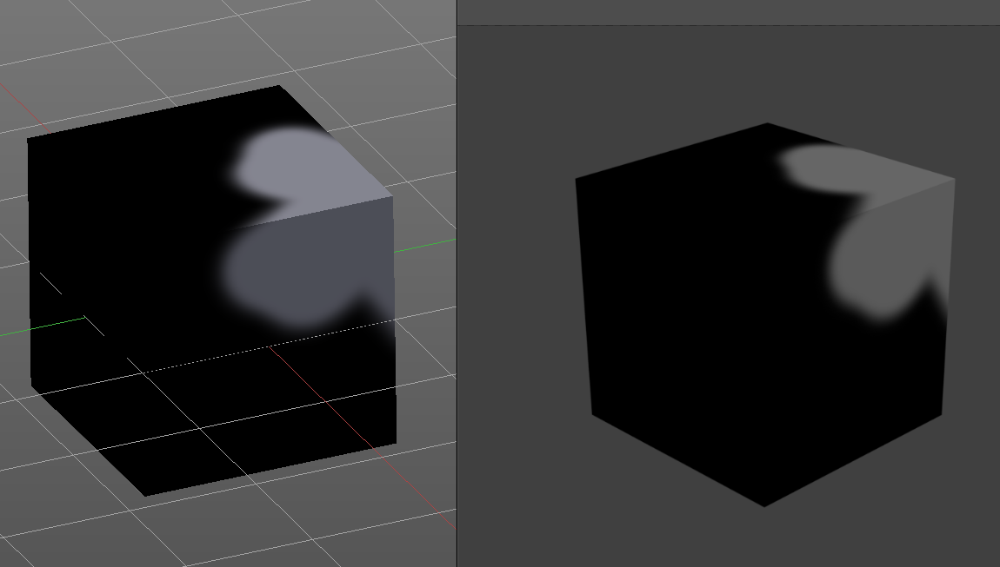

Add Paint Slot with Blender Internal
------------------------------------

When you add a Paint slot with Cycles then a BI material will be created.

The texture of this material will immediately render.

Brush Panel 
------------

The Brush Panel contains the different paintbrushes, a color dialog, and some brush settings.

At down left you can find the display options. The button with the gear symbol at it. Here you will find two toggles to hide away the color picker and the palette edit box. 

Browse Brush
------------

The big image at the top is a dropdown box where you can choose a brush. Click at it, and you will see the different brushes. A click at one of the images will choose this brush then.

When you have added a few more brushes then the dropdown box may be more than full. You will see some little white arrows then. Either in the top left or in the bottom right corner. They indicate that some brushes are hidden before or after the current display.

To scroll to this hidden content use the mouse wheel, or the arrow up and down buttons at the keyboard.

The edit box below the Image shows you the name of the current active brush. 

The number right of it, in this case 2, indicates how much number of users ( internally ) this brush uses. This means that this data block (the brush) shares currently settings with at least one other object. Most probably the parent brush where we have created it from. Click at the value to make this brush a single user. The button will vanish then.

F set the brush to have a fake user. Zero user data-blocks are normally not saved. But sometimes you want to force the data to be kept even when the data block has no user.

The + button allows you to add a new pencil with the current settings. Note that the brushes are NOT saved when you close Bforartists. You can save them into the current blend file. Or you can save the startup file. But be careful here. This saves everything else of the current state of Bforartists too.

The X button deletes the brush as the active one. It does NOT delete it from the brushes list.

Color dialog
------------

The color dialog is hidden by default. See display options at the bottom of the panel. You can define the color in the color element below the brush browser. It will also open a color dialog then.

When you set it to visible, then you can set the color for painting by a click with the mouse in the color wheel. The slider at the right defines the brightness.

The button below shows you the active color. 

A click at the color button will open a more detailed color dialog, where you can set up rgb, hsv and hex colors and with sliders.

Color Element
-------------

Here you can set a primary and a secondary color. The button with the arrows at it switches the active and the secondary color. And with the pipette you can pick a color from the screen. This will reveal some more elements, and create a palette. Here you can choose now the color to use it for painting. You can add and remove colors here too.

This color picker can just pick a color in the 3D view. It does not work elsewhere.

Radius 
-------

The Radius edit box allows you to adjust the radius of the brush. The button behind the edit box enables tablet pressure sensitivity for radius.

.. image:: graphics/7.1.xx_Editors_-_3D_View_-_old_Tool_Shelf/100002010000007C000000184EBF6647A0110BD4.png

And the button at the end allows you to set the radius of the pencil by hotkey. A click at this button works of course too. But this is a hotkey tool. The button is just a visible reminder.

Strength
--------

The Strength edit box allows you to adjust the strength of the brush. When the Lock symbol at the front is ticked, then the pencil keeps its strength relative to the object when zooming in and out. The button behind the edit box enables tablet pressure sensitivity for strength.

And the button at the end allows you to set the strength by hotkey. A click at this button works of course too. But this is a hotkey tool. The button is just a visible reminder.

Blend
-----

A dropdown box where you can adjust the blend mode of the paint stroke. Default method is Mix.

Accumulate
----------

Accumulates stroke daubs on top of each other.

Alpha
-----

When unchecked, lock Alpha while painting.

Use Gradient
------------

When you tick Use Gradient then you reveal a Gradient dialog. Here you can set up a gradient.

Important!

Painting a gradient requires to have the Fill pencil chosen. It will not work with the other pencil types.

Gradient Colors dialog
----------------------

The + Button adds a color ramp point. That way you can have more than one color in the gradient.

.. image:: graphics/7.1.xx_Editors_-_3D_View_-_old_Tool_Shelf/100002010000016D00000020DF772CB3BF2B6774.png

The - Button removes the currently selected color ramp point.

The <> Element flips the color ramp

Color Mode is a dropdown box where you can choose the color mode for the gradient.

.. image:: graphics/7.1.xx_Editors_-_3D_View_-_old_Tool_Shelf/10000201000000740000007D5CBD019881346198.png

Interpolation is a dropdown box where you can choose the interpolation mode for the gradient. 

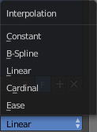

In the Color Ramp element you will see the color ramp with the single color points.

.. image:: graphics/7.1.xx_Editors_-_3D_View_-_old_Tool_Shelf/100002010000016F0000001BD707FA2BE116305F.png

Choose Active Color Stop is the stop point of the gradient.

.. image:: graphics/7.1.xx_Editors_-_3D_View_-_old_Tool_Shelf/10000201000000450000001C950C858F30EBFA94.png

Position is a edit box where you can fine tune the position of the currently selected color point

.. image:: graphics/7.1.xx_Editors_-_3D_View_-_old_Tool_Shelf/10000201000000740000001990178AA61449B886.png

Set Color of selected color stop is the color of the currently selected color point. When you click at it then you will get a color dialog that allows you to setup the color.

Usage
-----

Set up the gradient in the Gradient dialog.

Choose the Fill pencil. Gradient will not work with other pencils.

Click at the start point of the gradient. 

Drag the mouse to the end point of the gradient. This will draw a line that defines the gradient direction.

Release the mouse.

Palette
-------

When you pick up a color with the color picker then a palette of colors gets created. This color palette is stored here. You can have more than one palette. 

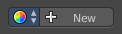

Palettes saves with the scene.

The icon with the color wheel is a dropdown box where you can choose the active palette.

The Palette edit box shows you the current active palette. Here you can also rename it.

The number right of it, in this case 2, indicates how much number of users ( internally ) this palette uses. This means that this data block (the palette) shares currently settings with at least one other object. Most probably the parent palette where we have created it from. Click at the value to make this palette a single user. The button will vanish then.

F set the item to have a fake user. Zero user data-blocks are normally not saved. But sometimes you want to force the data to be kept even when the data block has no user.

The + button allows you to add a new palette with the current settings. 

The X button deletes the palette as the active one. You will see the "New" button then. It does NOT delete it from the palette list.

Texture Panel
-------------

The Texture panel allows you to paint with textures. This allows you for example to grab a foto from some fish scales, and simply paint them onto the mesh by using this image as a pencil. Or as a blueprint where you calk through ( Stencil method ).

Browse Texture to be linked
---------------------------

The image at the top of the panel is a image browser. Here you can choose a texture that you can choose for painting then. You can also have more than one image loaded at once. 

In this shot there is already a texture added. The way to add the texture here is a bit more complicated. And not done with clicking at the New button.

First click at the New button below the image. This will create a new texture slot. This slot is still empty, it displays black. 

.. image:: graphics/7.1.xx_Editors_-_3D_View_-_old_Tool_Shelf/10000201000000C400000098ECBD4A692DFFD559.png

We need to load a texture in this slot. This must be done in the Properties editor in the Textures tab.

The problem is, we have an object with a material and a texture already selected. And when we change this texture , then we don't get the pencil texture loaded. But we change the texture at our mesh.

What we need to do is to create a material first. And in this material we load our pencil texture then. And then this texture becomes available in the image browser of the Texture panel.

Texture Edit box
----------------

The Texture edit box is the edit box below the Image browser. When there's no image loaded then it displays the New button. When there's a image (or more) loaded, then you will see the name of the current texture. 

The F button turns this texture into a data block with a fake user. Means it will exists even when there is no data connected to it anymore.

When you activate Fake User, then you may get a value in front of it, which displays how much users this data block (our texture slot) currently has.

The + Button adds another texture slot. Note that you will have to load a texture too, as explained above.

The X button deletes the texture slot.

Brush Mapping
-------------

Our texture can be mapped in different methods. The Brush mapping is a dropdown box where you can choose this different brush mapping methods.

The settings vary. So we will go through them by the different brush mapping methods.

Brush Mapping with mapping method Tiled
---------------------------------------

The brush mapping method Tiled tiles the brush stroke at the surface. The mapping happens from the current view. The result may be distorted when the view does not align with the surface of the object.

Angle
-----

The angle of the brush.

Offset 
-------

The offset of the texture in the brush.

Size
----

The size of the texture in the brush.

Brush Mapping with mapping method View Plane
--------------------------------------------

The brush mapping method View Plane simply paints onto the surface. The mapping happens from the current view. The result may be distorted when the view does not align with the surface of the object.

.. image:: graphics/7.1.xx_Editors_-_3D_View_-_old_Tool_Shelf/1000020100000209000000F301EEA9AC91E9CE2E.png

Angle
-----

The angle of the brush.

Rake
----

The angle follows the direction of the brush stroke. 

Random
------

The brush angle gets set random.

Offset 
-------

The offset of the texture in the brush.

Size
----

The size of the texture in the brush.

Brush Mapping with mapping method 3D
------------------------------------

The brush mapping method 3D paints the texture at the surface, by tiling it 1/1 at the object surface. 

Offset 
-------

The offset of the texture in the brush.

Size
----

The size of the texture in the brush.

Brush Mapping with mapping method Random
----------------------------------------

The brush mapping method Random paints onto the surface, and randomizes the texture position in the brush while that. The mapping happens from the current view. The result may be distorted when the view does not align with the surface of the object.

Angle
-----

The angle of the brush.

Rake
----

The angle follows the direction of the brush stroke. 

Random
------

The brush angle gets set random.

Offset 
-------

The offset of the texture in the brush.

Size
----

The size of the texture in the brush.

Brush Mapping with mapping method Stencil
-----------------------------------------

The former methods uses the textures for the brush. The method Stencil works different. You have your texture displayed in the workspace above the object, and you paint this texture onto your object with your pencil strokes.

Note that the texture in the 3d space is just visible when you are with the mouse over the viewport.

.. image:: graphics/7.1.xx_Editors_-_3D_View_-_old_Tool_Shelf/100002010000037700000230D22782E4FDAC3BC9.png

Image Aspect
------------

Adjust the stencil size to fit to the image aspect ratio

Stencil Brush controls
----------------------

Here you can move, rotate and scale the stencil image in the 3D viewport. And reset the transform. You better use the hotkeys here that gets displayed in the tool tips, since the image is not displayed when the mouse is not over the 3D viewport.

.. image:: graphics/7.1.xx_Editors_-_3D_View_-_old_Tool_Shelf/10000201000000A20000002ED7A7486B55A01165.png

Angle edit box
--------------

Here you can adjust the angle of the brush. The button at the end allows you to set the radius by dragging the mouse. This should be done in the viewport and with the hotkey. This button is just a visible reminder.

Offset
------

Fine tune the offset of the texture in the brush.

Size
----

Fine tune the size of the texture in the brush. 

Texture Mask Panel
------------------

The texture mask panel allows you to use a texture as a mask to define the strength of painting. In the shot example we use a tiled Texture as a pencil, and a stencil map as our texture mask. And it paints just where the mask texture is bright. You can of course use gradients here to define the paint strength.

Browse Texture to be linked
---------------------------

The image at the top of the panel is a image browser. Here you can choose a texture that you can choose for painting then. You can also have more than one image loaded at once. 

In this shot there is already a texture added. The way to add the texture here is a bit more complicated. And not done with clicking at the New button.

First click at the New button below the image. This will create a new texture slot. This slot is still empty, it displays black. 

.. image:: graphics/7.1.xx_Editors_-_3D_View_-_old_Tool_Shelf/10000201000000C400000098ECBD4A692DFFD559.png

We need to load a texture in this slot. This must be done in the Properties editor in the Textures tab.

The problem is, we have an object with a material and a texture already selected. And when we change this texture , then we don't get the pencil texture loaded. But we change the texture at our mesh.

What we need to do is to create a material first. And in this material we load our pencil texture then. And then we can choose this texture in the image browser of the texture.

Brush Mapping with mapping method Tiled
---------------------------------------

The brush mapping method Tiled tiles the brush stroke at the surface. The mapping happens from the current view. The result may be distorted when the view does not align with the surface of the object.

Mask Pressure Mode
------------------

A dropdown box where you can choose the mask pressure mode for tablets.

Angle
-----

The angle of the brush.

Offset 
-------

The offset of the texture in the brush.

Size
----

The size of the texture in the brush.

Brush Mapping with mapping method View Plane
--------------------------------------------

The brush mapping method View Plane simply paints onto the surface. The mapping happens from the current view. The result may be distorted when the view does not align with the surface of the object.

.. image:: graphics/7.1.xx_Editors_-_3D_View_-_old_Tool_Shelf/10000201000002680000011E202E7CD384196A03.png

Mask Pressure Mode
------------------

A dropdown box where you can choose the mask pressure mode for tablets.

Angle
-----

The angle of the brush.

Rake
----

The angle follows the direction of the brush stroke. 

Random
------

The brush angle gets set random.

Offset 
-------

The offset of the texture in the brush.

Size
----

The size of the texture in the brush.

Brush Mapping with mapping method Random
----------------------------------------

The brush mapping method Random paints onto the surface, and randomizes the texture position in the brush while that. The mapping happens from the current view. The result may be distorted when the view does not align with the surface of the object.

.. image:: graphics/7.1.xx_Editors_-_3D_View_-_old_Tool_Shelf/10000201000001B0000000C3DCC30C0BC6CE812A.png

Mask Pressure Mode
------------------

A dropdown box where you can choose the mask pressure mode for tablets.

Angle
-----

The angle of the brush.

Rake
----

The angle follows the direction of the brush stroke. 

Random
------

The brush angle gets set random.

Offset 
-------

The offset of the texture in the brush.

Size
----

The size of the texture in the brush.

Brush Mapping with mapping method Stencil
-----------------------------------------

The former methods uses the textures for the brush. The method Stencil works different. You have your texture displayed in the workspace above the object, and you paint this texture onto your object with your pencil strokes.

Note that the texture in the 3d space is just visible when you are with the mouse over the viewport.

Mask Pressure Mode
------------------

A dropdown box where you can choose the mask pressure mode for tablets.

Stencil Brush controls Secondary
--------------------------------

Here you can move, rotate and scale the stencil image from the TEXTURE MASK panel, And reset the transform. You better use the hotkeys here that gets displayed in the tool tips, since the image is not displayed when the mouse is not over the 3D viewport.

.. image:: graphics/7.1.xx_Editors_-_3D_View_-_old_Tool_Shelf/10000201000000A20000002ED7A7486B55A01165.png

Angle edit box
--------------

Here you can adjust the angle of the brush. The button at the end allows you to set the radius by dragging the mouse. This should be done in the viewport and with the hotkey. This button is just a visible reminder.

Offset
------

Fine tune the offset of the texture in the brush.

Size
----

Fine tune the size of the texture in the brush. 

Stroke Panel
------------

The Stroke panel contains settings to influence the behaviour of the brush stroke. There are various stroke methods available. We will go through them one by one.

Stroke Panel with Stroke method Space
-------------------------------------

This is the default Stroke method. The sculpt stroke gets added continuously with given settings.

.. image:: graphics/7.1.xx_Editors_-_3D_View_-_old_Tool_Shelf/10000201000001AA000000C2049C3FC2522A9EA2.png

Spacing Edit Box
----------------

The sculpt drawing happens by mapping the pencil onto the mouse position. And when you move the mouse then the next mapping happens. Here you can adjust the spacing after what mouse movement the next mapping should happen. The lower the value, the lower the distance between the single dots.

.. image:: graphics/7.1.xx_Editors_-_3D_View_-_old_Tool_Shelf/10000201000001AA000000C268EEB793291FE805.png

The icon behind the edit box enables tablet pressure sensitivity for tablets.

Jitter Edit Box
---------------

Here you can add Jitter to the brush while painting.

The icon in front of the edit box toggles between jittering in screen space and relative to brush size.

The icon behind the edit box enables tablet pressure sensitivity for tablets.

Smooth Stroke
-------------

The brush lags behind the mouse position, and produces a much smoother stroke by that.

Smooth Stroke Radius Edit Box
-----------------------------

Is just active when Smooth Stroke is activated. Here you can adjust the radius of the smoothing.

Smooth Stroke Factor Edit Box
-----------------------------

Is just active when Smooth Stroke is activated. Here you can adjust the factor of the smoothing.

Input Samples Edit Box
----------------------

Average multiple input samples together to smooth the brush stroke.

Stroke Panel with Stroke method Curve
-------------------------------------

The Stroke method curve doesn't simply influence the way how the stroke is painted. It is a special method. First you draw a curve object by holding down ctrl and clicking with left mouse button. Then you tweak the curve. You can click at the curve point, and drag out handlers to make the curve points smoooth.

Then you hit the Draw Curve button. And the curve gets drawn onto the surface.

.. image:: graphics/7.1.xx_Editors_-_3D_View_-_old_Tool_Shelf/10000201000003C5000001BBF1BE63996C580D2A.png

.. image:: graphics/7.1.xx_Editors_-_3D_View_-_old_Tool_Shelf/10000201000003C5000001BB7D96E9D7A807FFAE.png

Spacing Edit Box
----------------

The drawing happens by mapping the pencil onto the mouse position. And when you move the mouse then the next mapping happens. Here you can adjust the spacing after what mouse movement the next mapping should happen. The lower the value, the lower the distance between the single dots.

.. image:: graphics/7.1.xx_Editors_-_3D_View_-_old_Tool_Shelf/10000201000001AA000000C268EEB793291FE805.png

The icon behind the edit box enables tablet pressure sensitivity for tablets.

Paint Curve edit box
--------------------

Here you set the active curve.

The first element is a dropdown box where you will find your curves objects. You can have more than one.

The second element is the edit box that displays the active curve.

The number right of it, in this case 2, indicates how much number of users ( internally ) this brush uses. This means that this data block (the brush) shares currently settings with at least one other object. Most probably the parent brush where we have created it from. Click at the value to make this brush a single user. The button will vanish then.

F set the brush to have a fake user. Zero user data-blocks are normally not saved. But sometimes you want to force the data to be kept even when the data block has no user.

The + button allows you to add a new pencil with the current settings. Note that the brushes are NOT saved when you close Bforartists. You can save them into the current blend file. Or you can save the startup file. But be careful here. This saves everything else of the current state of Bforartists too.

The X button deletes the brush as the active one. It does NOT delete it from the brushes list.

Draw Curve Button
-----------------

A click at it to turns the curve into a sculpt stroke.

Jitter Edit Box
---------------

Here you can add Jitter to the brush while painting.

The icon in front of the edit box toggles between jittering in screen space and relative to brush size.

The icon behind the edit box enables tablet pressure sensitivity for tablets.

Input Samples Edit Box
----------------------

Average multiple input samples together to smooth the brush stroke.

Stroke Panel with Stroke method Line
------------------------------------

With Stroke method line you draw a line between a starting point and a endpoint. And when you release the mouse then the line gets sculpted.

Spacing Edit Box
----------------

The drawing happens by mapping the pencil onto the mouse position. And when you move the mouse then the next mapping happens. Here you can adjust the spacing after what mouse movement the next mapping should happen. The lower the value, the lower the distance between the single dots.

.. image:: graphics/7.1.xx_Editors_-_3D_View_-_old_Tool_Shelf/10000201000001AA000000C268EEB793291FE805.png

The icon behind the edit box enables tablet pressure sensitivity for tablets.

Jitter Edit Box
---------------

Here you can add Jitter to the brush while painting.

The icon in front of the edit box toggles between jittering in screen space and relative to brush size.

The icon behind the edit box enables tablet pressure sensitivity for tablets.

Input Samples Edit Box
----------------------

Average multiple input samples together to smooth the brush stroke.

Stroke Panel with Stroke method Airbrush
----------------------------------------

The stroke acts like an airbrush pencil. The dots gets placed randomly.

.. image:: graphics/7.1.xx_Editors_-_3D_View_-_old_Tool_Shelf/10000201000001AA000000C2644FCC4B92DDCE13.png

Rate Edit Box
-------------

Here you can define the rate of the drawing.

Jitter Edit Box
---------------

Here you can add Jitter to the brush while painting.

The icon in front of the edit box toggles between jittering in screen space and relative to brush size.

The icon behind the edit box enables tablet pressure sensitivity for tablets.

Smooth Stroke
-------------

The brush lags behind the mouse position, and produces a much smoother stroke by that.

Smooth Stroke Radius Edit Box
-----------------------------

Is just active when Smooth Stroke is activated. Here you can adjust the radius of the smoothing.

Smooth Stroke Factor Edit Box
-----------------------------

Is just active when Smooth Stroke is activated. Here you can adjust the factor of the smoothing.

Input Samples Edit Box
----------------------

Average multiple input samples together to smooth the brush stroke.

Stroke Panel with Stroke method Dots
------------------------------------

The stroke method Dots draws dots of the pencil onto the surface. The mapping happens from the current view. Means you will get distortions when your view is not aligned with the surface of the object.

Jitter Edit Box
---------------

Here you can add Jitter to the brush while painting.

The icon in front of the edit box toggles between jittering in screen space and relative to brush size.

The icon behind the edit box enables tablet pressure sensitivity for tablets.

Smooth Stroke
-------------

The brush lags behind the mouse position, and produces a much smoother stroke by that.

Smooth Stroke Radius Edit Box
-----------------------------

Is just active when Smooth Stroke is activated. Here you can adjust the radius of the smoothing.

Smooth Stroke Factor Edit Box
-----------------------------

Is just active when Smooth Stroke is activated. Here you can adjust the factor of the smoothing.

Input Samples Edit Box
----------------------

Average multiple input samples together to smooth the brush stroke.

Curve Panel
-----------

The curve panel allows you to define different fallofs methods for the border of the brush.

Navigation elements
-------------------

The navigation elements at the top are described from left to right

Zoom in and out
---------------

The two buttons with the magnifying glass at it zooms in and out in the curve window.

Tools
-----

Tools is a menu where you can find some cuve related tools.

Reset View
----------

Resets the curve windows zoom

Vector Handle
-------------

Set handle type to Vector

Auto Handle
-----------

Set handle type to Auto

Auto Clamped Handle
-------------------

Set handle type to Auto Clamped

Reset Curve
-----------

Resets the curve to the initial shape.

Curve Presets
-------------

Here you can find some predefined curve presets.

External Panel
--------------

The external panel allows you to do projection painting by using an external 2d image editor. The projection happens from the current view. So this can lead to distortions.

Quick Edit 
-----------

Opens a shot of the current view in your 2D Image Editor.

Apply
-----

Applies the changes that you made and saved in your 2D Image Editor.

Resolution
----------

Here you can set the resolution of the shot.

Apply Camera Image
------------------

Project an edited render from the active camera back onto the object.

This feature requires to have a background image loaded. Then this background image can be projected onto the object from the camera view.

Preparations
------------

You first have to link your software that you want to use here. When there is no image editor linked then you will get a warning.

Open the User Preferences, go to the File tab. Here choose the Image Editor section, and browse for your image editor. I have chosen Gimp here at Windows 7.

Save User Settings.

For further options have a look in the Project Paint panel in the Options tab in Weight paint mode. There can be quite a few things adjusted.

Usage
-----

Click at the Quick Edit Button. And your image editor will open up with a shot from the current view. Modify your image. 

.. image:: graphics/7.1.xx_Editors_-_3D_View_-_old_Tool_Shelf/1000020100000427000002F64CE00D20056CF129.png

Then overwrite the image. Sorry for the german shot ...

.. image:: graphics/7.1.xx_Editors_-_3D_View_-_old_Tool_Shelf/10000201000001BF0000021621F0BBAC8497695C.png

Back in Bforartists click at the Apply button. And the result gets mapped onto your object.

Symmetry Panel
--------------

Here you can turn on/off symmetry painting along X, Y and Z axis. The mirroring happens along the world axis.

Tool Shelf in Texture Paint Mode - Slots Tab
============================================

The slots tab contains some settings around the paint slots.

Slots Panel
-----------

Here you can choose to paint by using the textures in a material. Those textures gets auto detected. Material is the standard settings. 

Or directly onto an image that you choose or create. This image is not part of the material then. But uses the UV mapping from the mesh.

With painting mode Material
---------------------------

Painting Mode
-------------

The dropdown box where you can choose between Material and Image.

Available Paint Slots
---------------------

The list of available materials. A mesh can have more than one material applied.

Save all Images
---------------

Saves all images at once. This feature requires valid texture paths, means that the images are already saved somewhere at your pc. It throws a "Invalid Path" warning when one or more images does not have a valid texture path. This is for example the case when you create a texture in Blender. And you haven't saved it yet.

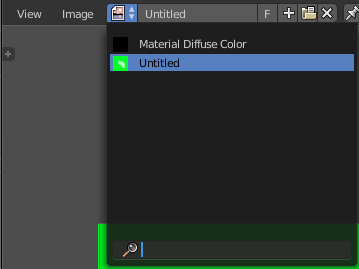

So when you get this warning, switch to the UV Image Editor and check which image in the list isn't saved yet. The ones that aren't saved yet shows an asterisk in the Header when you choose them.

With painting mode Image
------------------------

Painting Mode
-------------

The dropdown box where you can choose between Material and Image.

Canvas Image
------------

Here you can choose or create a Image that gets used for the texture painting. You can choose any image that is loaded.

UV Map
------

A dropdown box with the UV map to use for image painting. A mesh can have more than one material and more than one UV Map applied.

Save all Images
---------------

Saves all images at once. This feature requires valid texture paths, means that the images are already saved somewhere at your pc. It throws a "Invalid Path" warning when one or more images does not have a valid texture path. This is for example the case when you create a image in Blender's UV Image Editor. And you haven't saved it to file yet.

So when you get this warning, switch to the UV Image Editor and check which image in the list isn't saved yet. The ones that aren't saved yet shows an asterisk in the Header when you choose them. Unfortunately not in the list itself. So you have to go through one by one.

Mask Panel
----------

Here you can load a stencil map to mask out parts of the texture. You have to activate it in the panel header.

UV Map
------

A dropdown box with the UV map to use for image painting. A mesh can have more than one material and more than one UV Map applied.

Stencil Image
-------------

Here you can choose or create a Image that gets used for the masking. You can choose any image that is loaded.

Visualization
-------------

You usually want a black n white image for masking. But here you can set up the color for the stencil map. A click at the button opens a color dialog. The button at the right flips the colors. 

Tool Shelf in Texture Paint Mode - Options Tab
==============================================

Here you can find some more options and settings for texture painting tools.

Overlay Panel
-------------

Curve
-----

This setting is interesting for the Stroke method Curve. Here you can adjust how transparent the curve is.

The eye icon button in front of the slider is to show the curve object in viewport. The brush icon button behind the slider is to hide the overlay during a stroke.

Texture
-------

This setting is interesting for Texture painting. Here you can adjust how transparent the texture is.

The eye icon button in front of the slider is to show the texture in the viewport. The brush icon button behind the slider is to hide the overlay during a stroke.

Mask Texture
------------

This setting is interesting for Texture painting. Here you can adjust how transparent the Mask texture is.

The eye icon button in front of the slider is to show the texture in the viewport. The brush icon button behind the slider is to hide the overlay during a stroke.

Appearance panel
----------------

The Appearance panel provides you with some settings to adjust the appearance of the brush.

Show Brush
----------

Show the brush in 3D view.

Color Button
------------

The color that the brush cursor has when adding to geometry.

Custom Icon
-----------

Here you can define a custom icon for the brush.

Project Paint panel
-------------------

The Project Paint panel contains the settings for the External painting panel from the Tools tab.

Occlude
-------

Only paint the faces directly under the mouse

Cull
----

Ingore faces that points away from the current view.

Normal
------

This defines the angle after which the painting is not applied anymore. That way you can avoid heavy distortions at higher angles since it projects from the current view.

Cavity Mask
-----------

Mask painting according to mesh geometry cavity

Bleed
-----

An edit box to adjust the amount of bleeding into the areas outside of the faces uv.

Dither
------

An Edit box to adjust the amount of dither when painting on byte images

Unified Settings
----------------

Size
----

Instead of per Brush radius, the radius is shared across brushes.

Strength
--------

Instead of per Brush strength, the strength is shared across brushes.

Color
-----

Instead of per Brush color, the color is shared across brushes.

Enabled Brush Modes
-------------------

Enabled Modes
-------------

Enabled modes is a dropdown menu where you can adjust in which modes the brushes shows.

Tool shelf in Particle edit mode- Tools Tab
===========================================

The particle edit mode requires to have a particle system at the object.

.. list-table::

	* - 
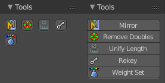

Tools Panel
-----------

This panel contains tools to modify the particles.

Mirror
------

Mirrors the selected particles.

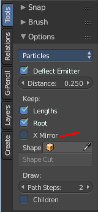

If you want a symmetrical haircut, first select all particles, then mirror the particles, then tick X Mirror in the Particle panel.

Remove Doubles
--------------

Remove double vertices that are very close to each other. This can for example happen when you mirror the particles.

Unify Length
------------

Unifies the length of the selected hair particles. The length is calculated by the average length of the selection.

Rekey
-----

You need to have some hair particles selected.

Rekey changes the number of keys for the selected particles, including root and tip keys. This tool brings up a popup where you can adjust the number of keys. Two means you have only a root and a tip key. Everything more subdivides the selected hair particle with more keys.

Last Operator Rekey
-------------------

Number of keys
--------------

Here you can again adjust the number of keys.

Weight Set
----------

Here you can manually set a weight for the selected keys to interpolate between the current key weight and the brushes weight.

Using this tool activates and reveals Free Edit in the particle system settings.

Last Operator Weight Set
------------------------

Factor
------

The strength of the keys weighting.

.. list-table::

	* - 

Brush Panel
-----------

The Brush panel contains brushes to modify the particles in various ways. Dependant of what brush is selected you will also see some settings below the brush buttons.

The brushes are meant for the particle system type Hair.

None
----

No Brush is selected

Comb
----

Allows you to comb the strands of the particle system.

Radius
------

The brush radius. The button behind the edit box allows you to set the radius by mouse move. This is a hotkey tool, and should be performed in the viewport.

Strength
--------

The brush strength. The button behind the edit box allows you to set the radius by mouse move. This is a hotkey tool, and should be performed in the viewport.

Smooth
------

Allows you to smooth the strands of the particle system.

Radius
------

The brush radius. The button behind the edit box allows you to set the radius by mouse move. This is a hotkey tool, and should be performed in the viewport.

Strength
--------

The brush strength. The button behind the edit box allows you to set the radius by mouse move. This is a hotkey tool, and should be performed in the viewport.

Add
---

Allows you to add strands to the particle system.

Radius
------

The brush radius. The button behind the edit box allows you to set the radius by mouse move. This is a hotkey tool, and should be performed in the viewport.

Count
-----

The amount of strands.

Interpolate
-----------

Interpolate new particles from the existing ones.

Steps
-----

Brush steps. Steps is connected with Interpolate. 

Keys
----

How many keys to make new particles with

Length
------

Manipulate the length of the strands

Radius
------

The brush radius. The button behind the edit box allows you to set the radius by mouse move. This is a hotkey tool, and should be performed in the viewport.

Strength
--------

The brush strength. The button behind the edit box allows you to set the radius by mouse move. This is a hotkey tool, and should be performed in the viewport.

Grow/ Shrink
------------

Grow or shrink the particles.

Puff
----

Manipulate the volume of the strands.

Radius
------

The brush radius. The button behind the edit box allows you to set the radius by mouse move. This is a hotkey tool, and should be performed in the viewport.

Strength
--------

The brush strength. The button behind the edit box allows you to set the radius by mouse move. This is a hotkey tool, and should be performed in the viewport.

Add / Sub
---------

Add or subtract to the current volume.

Puff Volume
-----------

Apply Puff to unselected end points.

Cut
---

Cut away particles.

Radius
------

The brush radius. The button behind the edit box allows you to set the radius by mouse move. This is a hotkey tool, and should be performed in the viewport.

Strength
--------

The brush strength. The button behind the edit box allows you to set the radius by mouse move. This is a hotkey tool, and should be performed in the viewport.

Weight
------

Manipulate the weight of the strands

Radius
------

The brush radius. The button behind the edit box allows you to set the radius by mouse move. This is a hotkey tool, and should be performed in the viewport.

Strength
--------

The brush strength. The button behind the edit box allows you to set the radius by mouse move. This is a hotkey tool, and should be performed in the viewport.

.. list-table::

	* - 

Options Panel
-------------

The Options panel provides you some options and settings for particle editing.

Particle Edit Type 
-------------------

Particle Edit Type Dropdown box.

Honestly, i don't have the slightest idea what this is good for. Thanks Blender Devs for your "fabulous" documentation.

Most obviously you can switch to other editing modes here. But it is not to find out under what circumstances.

Deflect Emitter
---------------

Keep Paths from intersecting the emitter

Distance
--------

Is connected with the Deflect Emitter. The distance to the emitter.

Keep Lengths
------------

Keep Path Lengths constant.

Keep Root
---------

Keep Root keys unmodified.

X Mirror
--------

X Axis Mirror Editing

Shape
-----

Define a outer shape object to use for tools.

Shape Cut
---------

Is connected with Shape, Cut hair to conform to the defined shape object.

Draw Path Steps
---------------

How many steps a path should draw.

Children
--------

Draw actual particles.

Tool Shelf in all Modes but Edit Mode
=====================================

There are a few panels that are visible in all modes and with all object types. Snapping for example. Or layers. To list them again and again in all modes with all available combinations would just blow up the manual. So we list them in the following chapters instead.

Tool Shelf in all Modes but Edit Mode - Layers Tab
==================================================

Layers are a way to organize the scene. With Object layers you can display objects from a layer, and hide others. Physics and particles is also layer dependant. Means you can exclude objects from physics by simply putting them onto another layer. You can also in- or exclude complete layers from rendering. For compositing you can use render layers. And for armatures you can use Armature layers.

Bforartists offers currently 20 layers. Which can be named in the Layers tab.

The layers tab is available in all modes but the Edit mode. And shows for all object types the same content.

Layer Manager Panel
-------------------

The layer manager panel gives you the tools to manage the layers in a quick way.

Move to Layer
-------------

The move to Layer button opens a pop-up where you can move the currently selected object to a new layer.

An object does not necessarily have to be at one layer only. You can place it at multiple layers. Shift click adds the selected object(s) to more than one layer. You can also use the Move to Layer tool ...

Last Operator Move to Layer
---------------------------

The last operator Move to Layer gives you again the possibility to move your selected object(s) to a new layer.

Visible Layers 
---------------

Visible layers is a quick access element to manage the layers and to have an overview if the layer has any content. A orange or grey dot in the button means there is content in this layer.

Visible is what is activated. Active layers gets indicated as blue. To select more than one layer hold down shift, and select the other elements that you want to select.

Lock Camera and Layers
----------------------

With Lock camera and layers activated the active camera and layers in this view gets used instead local layers. Means the camera renders all layers then.

Show Hide all Layers
--------------------

Show Hide all Layers shows or hides all layers at once.

Named Layers Panel
------------------

The named layers panel gives you an extended overview of the layers, with the possibility to give the layers a name. 

Options
-------

The options are hidden at first. Click at the Options title to reveal them.

Classic
-------

The classic option shows the eye icon for the layer visibility grey instead blue.

Options
-------

The Options option shows the option buttons at the layers. Select, Lock, Move to Layer, Show as Wire.

Indices
-------

The Indices option shows numbers before the layers.

Hide Empty
----------

The Hide Empty option hides all not active layers.

Layer Bar
---------

The layer bar in the Named Layers tab is made of some sub elements.

Eye icon at the left
--------------------

You can show or hide the layer with this button.

Edit box
--------

The edit box is where you can name a layer. Click with the left mouse into the edit box to make it editable. Type in your text. Then press enter to confirm the change.

The green check icon tells you that this is the currently active layer.

The option buttons
------------------

When you have Options ticked then you will see the options buttons at the right of the edit box. They are from left to right: Select, Lock, Move to Layer, Render as Wire

Select
------

Clicking at the Select icon button will select all objects in this layer.

Lock
----

Clicking at the Lock icon button will lock all objects in this layer. They become unelectable.

Move to Layer
-------------

With this button you can move objects to other layers. Select the object, click at the Move to Layer button. Shift click to attach the object to several layers.

Render as Wire
--------------

Render as wire will toggle the display for all objects between chosen state and wireframe.

Layer Groups Panel
------------------

The Layer groups panel enables you to create groups of layers. It is pretty self explaining. Create a group with the + button. Name it. And activate which layers are affected by this group by clicking at the corresponding fields in the layers widget.

To remove a layer group select the group and click at the - Button

Tool Shelf in all Modes - Grease Pencil Tab
===========================================

The Grease Pencil tool is a tool with which you can paint strokes in editors like the 3D view. They can be converted into polygons. The Grease Pencil tool is available in all modes. 

It is unfortunately cluttered across two shelves. The Tool Shelf and the Properties Editor. Means you have to adjust settings at two places.

The first thing that you have to do is to create a new Grease pencil. This can either be done in the Properties Editor by clicking at New. Or in the Grease Pencil Tab in the Tool Shelf by simply clicking at the Draw button. Then all Grease Pencil tools becomes visible. And a Grease Pencil layer gets created.

Grease Pencil Panel
-------------------

The Grease Pencil panel contains the general Grease Pencil tools. The Draw tool, eraser, some settings and tools.

Draw
----

The Draw section contains the draw tools.

Draw
----

Draw activates the freehand draw mode.

Erase
-----

Erase is the eraser tool with which you can delete strokes.

Line 
-----

Line paints a straight line between start and end point.

Poly 
-----

Poly allows you to paint polygon shapes.

Eraser Radius
-------------

Here you can adjust the radius of the eraser tool. Have a look at the hotkey, it's a hotkey only tool for proper functionality.

Insert Blank Frame
------------------

Insert a blank frame on the current frame.

Delete all active frames
------------------------

Delete the active frame(s) of all editable grease pencil layers.

Draw Settings
-------------

The draw settings are placed besides each other, to save space. 

Additive Drawing
----------------

When you create new frames then the strokes from the previous active frame are included as the base for the current frame.

Continuous Draw
---------------

The Continuous Draw checkbox enables and disables the continuous draw mode. Normally the draw mode ends when you stop drawing the current line. And you have to activate the draw tool again when you want to continue with painting. With continuous draw you can immediately paint the second stroke without to enable the draw tool again. 

Eraser in Continuous Draw
-------------------------

The draw tools are disabled as long as you are in continuous draw. To erase a stroke use the right mouse button. The pencil turns into a red circle. With which you can erase strokes now.

End Continuous Draw
-------------------

The draw tools are disabled as long as you are in continuous draw. To end the continuous draw mode click outside of the viewport. In the tool shelf for example.

Draw on Back
------------

New strokes will be drawn behind all other strokes in the layer

Data Source
-----------

Data source defines if the paint stroke is placed in the data block of the scene or the data block of the currently selected object.

Stroke Placement
----------------

Stroke Placement defines where the Grease Pencil stroke is placed.

View
----

View will place the stroke at the top of the viewport. It is not drawn in the 3D view.

Cursor
------

Cursor will place the stroke aligned with the 3d cursor, and aligned with the current camera view. It is drawn in the 3D view.

Surface
-------

Surface will place the stroke aligned to the surface of the underlying object. It is drawn in the 3D View.

Stroke
------

New strokes will align to existing visible strokes. Does not work with View strokes. It is drawn in the 3D View.

Only Endpoints
--------------

The only Endpoints checkbox is connected to the Stroke setting. And just shows when Stroke is selected. With Only Endpoints enabled the alignment of the stroke is just applied to the endpoints.

Tools
-----

The Tools section contains one tool. Ruler/Protractor. It activates a ruler protractor tool with which you can measure distances.

Edit Strokes
------------

Sometimes you want to edit the strokes that you have placed. Edit Strokes is a mode of the 3D view. And can be entered in the header of the 3d view in the modes drop-down box. 

When you are in Edit Strokes mode, then you will see the Edit Strokes Panel. Where you will find the tools to edit the Grease Pencil strokes.

Edit Strokes Panel
------------------

The Edit Strokes Panel contains the tools to edit the Grease Pencil strokes. Most of the tools are pretty self explaining.

.. Note!:: The Edit Strokes Panel is just visible in Edit Strokes Mode!

Toggle Cyclic
-------------

Toggle Cyclic closes a stroke to become a loop.

Last operator Set Cyclical State
--------------------------------

The Last operator for Toggle cyclic contains a drop-down box where you can adjust the cyclic state. 

Mirror
------

Mirror mirrors the selection.

Last Operator Mirror
--------------------

The Last Operator Mirror panel gives you tools to adjust the mirror action.

Constraint Axis
---------------

Constraint Axis gives you again the possibility to define the mirror axis. You can choose more than one axis here.

Orientation 
------------

Orientation is a drop-down box where you can choose the type of orientation for the mirroring action.

.. image:: graphics/7.1.xx_Editors_-_3D_View_-_old_Tool_Shelf/1000020100000090000000932D2EC1559DCA838C.png

Proportional Editing
--------------------

Proportional Editing is a drop-down box where you can choose to use proportional editing. When you choose one of the active methods then the neighbour geometry gets influenced by Shrink/Fatten too in a proportional way.

Proportional Editing Falloff
----------------------------

Proportional Editing Falloff is a drop-down box where you can choose a method for the falloff for the proportional editing.

Proportional size 
------------------

Proportional size is a edit box where you can adjust the strength of the Proportional falloff.

Edit Grease Pencil
------------------

Edit Grease Pencil edits the selected Grease Pencil strokes.

Confirm on Release
------------------

With Confirm on Release checked the action gets performed when you release the mouse button.

Shrink / Fatten 
----------------

Shrink / Fatten shrink fattens the selection.

Bend
----

Bend bends the selection.

Last Operator Bend
------------------

The last operator Bend is disabled for Grease Pencil.

Shear
-----

Shear shears the selection.

Last Operator Shear
-------------------

Offset
------

Adjust the offset 

Proportional Editing
--------------------

Proportional Editing is a drop-down box where you can choose to use proportional editing. When you choose one of the active methods then the neighbour geometry gets influenced by Shrink/Fatten too in a proportional way.

.. image:: graphics/7.1.xx_Editors_-_3D_View_-_old_Tool_Shelf/100002010000009C0000007DAE5F5F7DCA1CA15A.png

Proportional Editing Falloff
----------------------------

Proportional Editing Falloff is a drop-down box where you can choose a method for the falloff for the proportional editing.

.. image:: graphics/7.1.xx_Editors_-_3D_View_-_old_Tool_Shelf/10000201000000BA000000D5C32417D7CA2D08A2.png

Edit Grease Pencil
------------------

Edit Grease Pencil edits the selected Grease Pencil strokes.

Confirm on Release
------------------

With Confirm on Release checked the action gets performed when you release the mouse button.

To Sphere
---------

To Sphere transforms the selection into a spherical form.

Last Operator To Sphere
-----------------------

Factor
------

Adjust the rounding factor

Proportional Editing
--------------------

Proportional Editing is a drop-down box where you can choose to use proportional editing. When you choose one of the active methods then the neighbour geometry gets influenced by Shrink/Fatten too in a proportional way.

Proportional Editing Falloff
----------------------------

Proportional Editing Falloff is a drop-down box where you can choose a method for the falloff for the proportional editing.

Proportional Size
-----------------

Adjust the proportional size

.. image:: graphics/7.1.xx_Editors_-_3D_View_-_old_Tool_Shelf/10000201000000BA000000D5C32417D7CA2D08A2.png

Edit Grease Pencil
------------------

Edit Grease Pencil edits the selected Grease Pencil strokes.

Confirm on Release
------------------

With Confirm on Release checked the action gets performed when you release the mouse button.

Move to Color
-------------

Recolors the currently selected grease pencil stroke with the active color in the Grease Pencil Colors color.

The grease pencil colors can be found in the properties sidebar at the right.

Arrange Strokes drop-down box
-----------------------------

Arrange the layering of the current stroke. 

Subdivide
---------

Subdivide subdivides the current selection.

Last Operator Subdivide Stroke
------------------------------

Number of Cuts
--------------

Adjust the number of subdivisions

Join
----

Joins strokes.

Last Operator Join Strokes
--------------------------

Type
----

Here you can choose if it should only join, or join and also copy the strokes.

Leave Gaps
----------

Leave Gaps between joined strokes instead of linking them.

Join & Copy
-----------

Joins strokes and copies it.

For last operator see above.

Flip Direction
--------------

Change the direction of the stroke.

Show Directions
---------------

Shows the direction of the stroke by displaying a green dot at the beginning, and a red dot at the end of the stroke.

Re project Strokes Drop-down Box
--------------------------------

Here you can re project the stroke(s) planar or across the surface of the target object as if you would have drawn it new to the current viewport.

Interpolate Panel
-----------------

The Interpolate Panel provides some tools for interpolation between different animation frames.

.. Note!:: The Interpolate Panel is just visible in Edit Strokes Mode!

Interpolate
-----------

Interpolate Grease Pencil Strokes between frames.

Sequence
--------

Generate In-Betweens for smooth interpolation between Grease Pencil Frames.

Remove Breakdowns
-----------------

Remove Breakdown Frames generated by interpolation between two Grease Pencil frames.

Interpolate all Layers
----------------------

Interpolate all layers, not only active

Interpolate selected Strokes
----------------------------

Interpolate only selected strokes in the original frame

Sequence Options, Type
----------------------

Sequence Options, Type is a drop-down box where you can choose between three different effect types. Interpolation, Easing and Dynamic Effects. You can get even more options, depending of the type you choose here.

Sculpt Strokes Panel
--------------------

The Sculpt Strokes Panel provides tools to sculpt the Grease pencil strokes. 

.. Note!:: The ``Sculpt Strokes`` Panel is just visible in Edit Strokes Mode!

Sculpt Strokes Button
---------------------

The Sculpt Strokes Button activates the Sculpt brush. Now you can sculpt the Grease Pencil stroke with left mouse button. Clicking with right mouse button ends the sculpt mode.

Radius
------

The radius of the sculpt brush.

The button behind the edit box allows you to set the radius by moving the mouse. This should be done in the viewport and with the hotkey. This button is just a visible reminder.

Strength
--------

The strength of the sculpt brush.

The button behind the edit box allows you to set the strength by moving the mouse. This should be done in the viewport and with the hotkey. This button is just a visible reminder.

Use Falloff
-----------

Defines if the brush has a falloff from the centre to the border of the pencil.

Position
--------

The Brush affects the position of the point.

Strength
--------

The Brush affects the strength of the point.

Thickness
---------

The Brush affects the thickness of the point.

Selection Mask 
---------------

Only sculpt the selected points.

Alpha
-----

Alpha value for selected vertices.

Affect Pressure
---------------

Affect pressure values as well when smoothing strokes.

Drawing Brushes panel
---------------------

The Drawing Brushes panel contains everything around the Brushes and their settings. It is visible in all modes. But the content just shows when you have activated the draw tool already.

Brushes selection box
---------------------

Here you can choose different brush types. At the right you can add and remove brushes. And you can sort the brushes order.

Thickness
---------

Defines the thickness of the stroke.

Sensitivity
-----------

Pressure sensitivity for new strokes.

Strength
--------

Color strength for new strokes. The alpha factor of the color is affected.

Randomness
----------

Randomness factor for pressure and strength of new strokes.

Jitter
------

Jitter factor for new strokes.

Angle
-----

Direction of the stroke at which the brush gives the maximum thickness.

Factor
------

Reduce Brush thickness by this factor when stroke is perpendicular to angle direction

Smooth
------

Amount of smoothing to apply to newly created strokes to reduce jitter / noise.

Iterations
----------

Number of times to smooth newly created strokes.

Subdivision
-----------

Number of times to subdivide newly created strokes, for less jagged strokes.

Randomness
----------

Randomness factor for new strokes after subdivision.

Brush Curves Panel
------------------

The Brush curves panel is meant for usage with tablets. Here you can manipulate the curves for Sensitivity, Strength and Jitter.

Tool Shelf in all Modes - Tools Tab - Snap panel
================================================

Snap Panel
----------

The Snap panel contains the snapping tools. 

Theone half snaps a selected element to ... The other half snaps the 3D cursor to ...

In Edit Mode with Mesh object you will also have the Snap to Symmetry tool here.

Selection to Grid
-----------------

Selection to Grid snaps the selected element(s) to the closest Grid point.

Selection to Cursor
-------------------

Selection to Grid snaps the selected element(s) to the 3D cursor. ALL selected elements will end at cursor position. For example all selected vertices.

Selection to Cursor ( Offset )
------------------------------

Selection to Grid snaps the selected element(s) to the 3D cursor. The centre of the selected elements will snap to the 3D cursor. A group of vertices for example will remain its shape.

Selection to Active
-------------------

Selection to Active snaps the selected element(s) to the current active element.

Cursor to Selected
------------------

Cursor to Selected snaps the 3D cursor to the selected element.

Cursor to Centre
----------------

Cursor to Centre snaps the 3D cursor to the centre of the world.

Cursor to Grid
--------------

Cursor to Grid snaps the 3D cursor to the closest Grid point.

Cursor to Active
----------------

Cursor to Grid snaps the 3D cursor to the current active element.

Snap to Symmetry
----------------

Tries to snap the selected vertices symmetrical along the chosen world orientation. 

Last Operator Snap to Symmetry
------------------------------

Direction
---------

The calculation direction. 

Threshold
---------

The threshold defines the radius in which matching vertices gets located. When you get a warning that snapping failed try increasing the threshold value.

Factor
------

The snapping factor. Blend mirrored locations from one side to the other. 0.5 is blending both sides equal.

Center
------

Snap vertices in the center axis to zero.

Tool Shelf in all Modes - Tools Tab - Transform panel
=====================================================

Transform is a menu that contains some special transform functionality. It exists in all modes. But is not functional in all modes. 

In Edit Mode with a mesh object we have a few more options. For armatures we have some tools fewer, and one more. Align Bones.

Set dimensions is an addon meant for Mesh Objects in Edit Mode. Using it will lead you to Edit mode.

In Object mode some tools requires to have more than one object selected. To Sphere for example.

To Sphere
---------

To Sphere tries to transform the selection to a sphere shape, using the center of the selected objects as a center point for the operation.

While the operation you will see in the header the strength value for the spherical shape.

Last Operator To Sphere
-----------------------

Factor
------

A edit box where you can adjust the strength of influence of the tool.

Proportional Editing
--------------------

Proportional Editing is a drop-down box where you can choose to use proportional editing. When you choose one of the active methods then the neighbour geometry gets influenced by Shrink/Fatten too in a proportional way.

Proportional Editing Falloff
----------------------------

Proportional Editing Falloff is a drop-down box where you can choose a method for the falloff for the proportional editing.

Proportional Size
-----------------

Proportional size is a edit box where you can adjust the strength of the Proportional falloff.

Edit Grease Pencil
------------------

Edit Grease Pencil edits the selected Grease Pencil strokes.

Shear
-----

Shearshears the object positions relative to the center of the selection.

While the operation you can press x or y to change the direction of shearing. 

While the operation you will see the strength value in the header.

Last Operator Shear
-------------------

Factor
------

A edit box where you can adjust the strength of influence of the tool.

Proportional Editing
--------------------

Proportional Editing is a drop-down box where you can choose to use proportional editing. When you choose one of the active methods then the neighbour geometry gets influenced by Shrink/Fatten too in a proportional way.

Proportional Editing Falloff
----------------------------

Proportional Editing Falloff is a drop-down box where you can choose a method for the falloff for the proportional editing.

Proportional Size
-----------------

Proportional size is a edit box where you can adjust the strength of the Proportional falloff.

Edit Grease Pencil
------------------

Edit Grease Pencil edits the selected Grease Pencil strokes.

Bend
----

Bends the selected objects between 3D cursor and mouse. 

HOTKEY ONLY TOOL!

You might want to add/use a hotkey here, since the operation calculates from the mouse position starting point. And the menu item might not be at the wanted position.

While the operation you will see in the header the strength value for the bend. Holding down Alt turns off Clamp.

The Last operator for Bend is greyed out. Undo is not supported.

Push/Pull
---------

In Object mode this tool requires to have more than one object selected. It pushes or pulls the object positions relative to the center of the selection.

Last Operator Shear
-------------------

Factor
------

A edit box where you can adjust the strength of influence of the tool.

Proportional Editing
--------------------

Proportional Editing is a drop-down box where you can choose to use proportional editing. When you choose one of the active methods then the neighbour geometry gets influenced by Shrink/Fatten too in a proportional way.

Proportional Editing Falloff
----------------------------

Proportional Editing Falloff is a drop-down box where you can choose a method for the falloff for the proportional editing.

Proportional Size
-----------------

Proportional size is a edit box where you can adjust the strength of the Proportional falloff.

Move Texture Space
------------------

This tool relies at the move tool. With the difference that it moves the texture space instead of the object. It has also a very special use case, and just works with a material with a Texture Coordinate / Generated node. And requires to have the shading at Material or Rendered to see a result in the viewport.

.. image:: graphics/7.1.xx_Editors_-_3D_View_-_old_Tool_Shelf/10000201000003E1000001989B188B3DC790D0A9.png

Last Operator Translate
-----------------------

Vector
------

Here you can adjust the position values for the three axis.

Constraint Axis
---------------

Here you can limit the position relative to the source object.

Orientation
-----------

Orientation is a drop-down box where you can choose the type of orientation for the mirroring action.

.. image:: graphics/7.1.xx_Editors_-_3D_View_-_old_Tool_Shelf/1000020100000090000000932D2EC1559DCA838C.png

Proportional Editing
--------------------

Proportional Editing is a drop-down box where you can choose to use proportional editing. When you choose one of the active methods then the neighbour geometry gets influenced by Shrink/Fatten too in a proportional way.

.. image:: graphics/7.1.xx_Editors_-_3D_View_-_old_Tool_Shelf/100002010000009C0000007DAE5F5F7DCA1CA15A.png

Proportional Editing Falloff
----------------------------

Proportional Editing Falloff is a drop-down box where you can choose a method for the falloff for the proportional editing.

.. image:: graphics/7.1.xx_Editors_-_3D_View_-_old_Tool_Shelf/10000201000000BA000000D5C32417D7CA2D08A2.png

Proportional Size
-----------------

Proportional size is a edit box where you can adjust the strength of the Proportional falloff.

Edit Grease Pencil
------------------

Edit Grease Pencil edits the selected Grease Pencil strokes.

Edit Texture Space
------------------

With Confirm on Release checked the action gets performed when you release the mouse button.

Scale Texture Space
-------------------

This tool relies at the scale tool. With the difference that it scales the texture space instead of the object. It has also a very special use case, and just works with a material with a Texture Coordinate / Generated node. And requires to have the shading at Material or Rendered to see a result in the viewport.

.. image:: graphics/7.1.xx_Editors_-_3D_View_-_old_Tool_Shelf/10000201000003E1000001989B188B3DC790D0A9.png

Last Operator Resize Texture
----------------------------

Vector
------

Here you can adjust the position values for the three values

Constraint Axis
---------------

Here you can limit the position relative to the source object.

Orientation
-----------

Orientation is a drop-down box where you can choose the type of orientation for the mirroring action.

.. image:: graphics/7.1.xx_Editors_-_3D_View_-_old_Tool_Shelf/1000020100000090000000932D2EC1559DCA838C.png

Proportional Editing
--------------------

Proportional Editing is a drop-down box where you can choose to use proportional editing. When you choose one of the active methods then the neighbour geometry gets influenced by Shrink/Fatten too in a proportional way.

.. image:: graphics/7.1.xx_Editors_-_3D_View_-_old_Tool_Shelf/100002010000009C0000007DAE5F5F7DCA1CA15A.png

Proportional Editing Falloff
----------------------------

Proportional Editing Falloff is a drop-down box where you can choose a method for the falloff for the proportional editing.

.. image:: graphics/7.1.xx_Editors_-_3D_View_-_old_Tool_Shelf/10000201000000BA000000D5C32417D7CA2D08A2.png

Proportional Size
-----------------

Proportional size is a edit box where you can adjust the strength of the Proportional falloff.

Edit Grease Pencil
------------------

Edit Grease Pencil edits the selected Grease Pencil strokes.

Edit Texture Space
------------------

With Confirm on Release checked the action gets performed when you release the mouse button.

Align to Transform Orientation
------------------------------

Rotates the selected objects so that their local orientation matches the active transform orientation in the Transform orientation panel or the **Orientation** selection in the Transform Operator panels. 

For example when you have a few cubes that are rotated differently, then perform align to transform orientation with Global coordinates, then the cubes rotations gets set back to 0/0/0

Last Operator Transform
-----------------------

Align Transform Orientation is a subset of the Transform tool. And so it comes with the full set.

Values
------

The transform values for the single axis.

Constraint Axis
---------------

Here you can limit the transform of single axis.

Orientation
-----------

Orientation is a drop-down box where you can choose the type of orientation for the mirroring action.

Proportional Editing
--------------------

Proportional Editing is a drop-down box where you can choose to use proportional editing. When you choose one of the active methods then the neighbour geometry gets influenced by Shrink/Fatten too in a proportional way.

Proportional Editing Falloff
----------------------------

Proportional Editing Falloff is a drop-down box where you can choose a method for the falloff for the proportional editing.

Proportional Size
-----------------

Proportional size is a edit box where you can adjust the strength of the Proportional falloff.

Edit Grease Pencil
------------------

Edit Grease Pencil edits the selected Grease Pencil strokes.

Randomize Transform
-------------------

This tool allows to randomize position rotation and scale of selected objects. Each object gets threaten individually by a random value.

It starts with zeroed values. You need to adjust the values in the last operator.

Last Operator Randomize Transform
---------------------------------

Random Seed
-----------

Here you can adjust the random seed value.

Transform Delta
---------------

Randomize Delta transform values instead of the regular transform values.

Randomize Location checkbox
---------------------------

With this checkbox ticked the location of the selected objects gets randomized.

Location edit boxes
-------------------

Here you can adjust the strength of the transform for the single axis.

Randomize Rotation checkbox
---------------------------

With this checkbox ticked the rotation of the selected objects gets randomized.

Rotation edit boxes
-------------------

Here you can adjust the strength of the transform for the single axis.

Randomize Scale checkbox
------------------------

With this checkbox ticked the scale of the selected objects gets randomized.

Scale Even
----------

Use the same scale values for all axis.

Scale edit boxes
----------------

Here you can adjust the strength of the transform for the single axis.

Align Objects
-------------

Align Objects allows you to align the selected objects in various ways. You need to adjust the settings in the Last operator panel. The align operation happens in world coordinates.

Last Operator Align Objects
---------------------------

High Quality
------------

When ticked the calculation gets performed in a higher precision.

Align Mode
----------

Align Mode is a drop-down box where you can choose between different align modes.

Relative To
-----------

Relative to is a drop-down box. Here you adjust in what method the alignment happens. Relative to the active object, to the center of selection, to the 3D cursor or to the scene origin.

Align
-----

Here you can turn on or off the single axis for the align operation.

Warp
----

Edit Mode only! Warps the selected vertices around the 3D cursor.

Last Operator Warp
------------------

Warp Angle
----------

The amount to wrap around the 3D cursor.

Offset Angle
------------

Angle to use as the basis for warping

Min 
----

The minimum amount

Max
---

The maximum amount

Randomize
---------

Edit Mode Only! Randomizes the positions of the selected vertices.

Last Operator Randomize
-----------------------

Amount
------

The distance to offset.

Uniform
-------

Increase for uniform offset distance.

Normal
------

Align Offset direction to normals.

Random Seed
-----------

The seed for the random number generator.

Skin Resize
-----------

This tool requires to have a skin modifier at the mesh. It scales the thickness of the skin.

While the operation you will see in the header the strength value for the skin.

Last Operator Skin Resize
-------------------------

Vector
------

Here you can adjust the position values for the three values.

Constraint Axis
---------------

Here you can limit the position relative to the source object.

Orientation
-----------

Orientation is a drop-down box where you can choose the type of orientation for the mirroring action.

.. image:: graphics/7.1.xx_Editors_-_3D_View_-_old_Tool_Shelf/1000020100000090000000932D2EC1559DCA838C.png

Proportional Editing
--------------------

Proportional Editing is a drop-down box where you can choose to use proportional editing. When you choose one of the active methods then the neighbour geometry gets influenced by Shrink/Fatten too in a proportional way.

.. image:: graphics/7.1.xx_Editors_-_3D_View_-_old_Tool_Shelf/100002010000009C0000007DAE5F5F7DCA1CA15A.png

Proportional Editing Falloff
----------------------------

Proportional Editing Falloff is a drop-down box where you can choose a method for the falloff for the proportional editing.

.. image:: graphics/7.1.xx_Editors_-_3D_View_-_old_Tool_Shelf/10000201000000BA000000D5C32417D7CA2D08A2.png

Proportional Size
-----------------

Proportional size is a edit box where you can adjust the strength of the Proportional falloff.

Align Bones
-----------

Armature only. 

Align bones aligns the selected bones.

Set Dimensions
--------------

Edit Mode Only!

Normally all scale operations in Bforartists are relative to the current selection and dimensions. Set dimensions allows to scale mesh selections in absolute world values. No matter how the initial values are. The new values gets set in the Last Operator.

Set dimensions is an add-on. You can turn it off in the add-ons section of the user preferences when you want.

Last Operator Set Dimensions
----------------------------

New Dimensions
--------------

When you activate the tool then you will see the world coordinates of the selection. Here you can change the values to other world coordinates.

Tool Shelf in all Modes - Tools Tab - History Panel
===================================================

History Panel
-------------

The History Panel contains the tools around undo , redo and repeat. It is in the Tools tab.

Undo
----

Undo undoes the previous action.

Redo 
-----

Redo redoes the previous action.

Undo History
------------

Undo History opens a menu where you can redo a last action in history.

Repeat last
-----------

Repeat last repeats the last operation. For example, when you have moved a object by 5 in x, then it moves the object by 5 in x with every new repeat last step.

Repeat History
--------------

Repeat History calls a menu with the last actions where yon can choose an action to be repeated.

Tool Shelf in all Modes - Tools Tab - Bake Panel general
========================================================

Bake Panel
----------

Texture baking is the process to bake specific informations from one object into the texture or the vertex colors of another object. Ambient Occlusion. Or a Normal Map for example.

.. NOTE:: 

How to use: Select the source object where you want to bake from, hold down Shift, select the target object where you want to bake to, so that both objects are selected. Adjust the settings to your needs. Then hit the Bake button.

Texture baking can be done with two available render engines. Blender Internal. And Cycles. The list of available bake types differs a bit, even when some of the texture types are similar.

Which renderer gets used for baking can be adjusted in the Properties Editor.

When you have the Blender Render selected then the Bake Panel is called Bake Blender Render. When you have the Cycles Render selected then the Bake Panel is called Bake Cycles.

.. NOTE:: The Bake panel is visible in all Modes. But you have to bake in Object Mode.

Tool Shelf in all Modes - Tools Tab - Bake Blender Render
=========================================================

When you have Blender Renderer selected then the Bake panel will show the settings to bake with Blender Render.

Texture baking uses the settings of the chosen renderer. This includes Antialias, Global Illumination, Ambient Occlusion, etc.

Settings for all Texture types
------------------------------

Most settings in the Bake panel are available for all texture types. 

Bake 
-----

The Bake Button will start the baking process.

Bake Mode
---------

Bake Mode is a drop-down box where you can choose what type of information you want to bake from the source object into the texture or the vertex colors of the target object.

You can bake Specular Colors, Specular Intensity, Mirror Colors, Mirror Intensity, Alpha, Emission, Vertex Colors, Derivate, Displacement, Textures, Normals, Shadow, Ambient Occlusion and Full Render.

Specular Colors
---------------

Bakes the specular colors of a material into the texture of the target object.

Specular Intensity
------------------

Bakes the specular intensity of a material into the texture of the target object.

Mirror Colors 
--------------

Bakes the Mirror colors into the texture of the target object.

Mirror Intensity
----------------

Bakes the Mirror Intensity of a material into the texture of the target object.

Alpha
-----

Bakes the Alpha channel colors of a material into the texture of the target object.

Emission
--------

Bakes the Emission colors of a material into the texture of the target object.

Vertex Colors
-------------

Bakes the Vertex colors of the source object into the texture of the target object.

Derivate
--------

Bakes the Derivate colors of a material into the texture of the target object.

Displacement
------------

Creates a displacement map by using the vertex positions of the source object, and baking them as greyscale colors into the texture of the target object. 

Textures
--------

Bakes the texture colors of the source object into the texture of the target object.

Normals
-------

Creates a Normal map by using the normals of the source object, and baking them as colors into the texture of the target object.

Shadow 
-------

Bakes the Shadow into the texture of the target object.

Ambient Occlusion
-----------------

Bakes the Vertex colors of the source object into the texture of the target object.

Full Render
-----------

Bakes the full rendering, means materials, textures, lightning, into the texture of the target object.

Selected to Active
------------------

The usual way to bake is first select the Source Object, where you want to bake from, hold down Shift, select the target object where you want to bake to, so that both objects are selected. Then hit the Bake button. That's Selected to Active.

Bake to Vertex Color
--------------------

Usually bake bakes into the texture of the target object. Bake to Vertex Color bakes the information into the Vertex colors of the mesh instead into the texture.

Clear
-----

Clear clears the target image before baking.

Split
-----

Here you can adjust the Quad Split method for baking.

Margin
------

Adjust the margin width.

Distance
--------

Maximum Distance in Blender Units from source object to target object(s).

Bias
----

Bias in Blender Units towards faces further away from the object(s).

Settings for specific Texture types
-----------------------------------

Derivative
----------

Bake from Multires
------------------

Bake directly from Multires mesh.

User
----

Here you can apply a user scale to the derivate map instead of automatically normalizing to 0-1.

Displacement
------------

Bake from Multires
------------------

Bake directly from Multires mesh.

Normalized
----------

Normalizes to the Distance.

Normals
-------

Bake from Multires
------------------

Bake directly from Multires mesh.

Normal Space
------------

Normal Space is a drop-down box where you can choose what normals to calculate.

Ambient Occlusion
-----------------

Bake from Multires
------------------

Bake directly from Multires mesh.

Normalized
----------

Normalizes without using material settings.

Tool Shelf in all Modes - Tools Tab - Bake Cycles
=================================================

When you have Cycles as the Renderer selected then the Bake panel will show the settings to bake with Cycles Render.

Texture baking uses the settings of the chosen renderer. This includes Antialias, Global Illumination, Ambient Occlusion, etc.

Settings for all Texture types
------------------------------

Most settings in the Bake panel are available for all texture types. 

Bake 
-----

The Bake Button will start the baking process.

Bake Type
---------

Bake Mode is a drop-down box where you can choose what type of information you want to bake from the source object into the texture or the vertex colors of the target object.

You can bake Subsurface, Transmission, Glossy, Diffuse, Environment, Emit, UV, Normal, Shadow, Ambient Occlusion and Combined.

Subsurface
----------

Bakes the Subsurface Passes of a material into the texture of the target object.

Transmission
------------

Bakes the transmission Passes of a material into the texture of the target object.

Glossy
------

Bakes the Glossy Passes of a material into the texture of the target object.

Environment
-----------

Bakes the Environment texture into the texture of the target object. As seen from the center of the object.

Emit
----

Bakes the Emission or the glow color of a material into the texture of the target object.

UV
--

Bakes colors of materials and textures only, without shading. 

Normals
-------

Creates a Normal map by using the normals of the source object, and baking them as colors into the texture of the target object.

Shadow 
-------

Bakes the Shadow into the texture of the target object.

Ambient Occlusion
-----------------

Bakes ambient occlusion as specified in the World panels. Ignores all lights in the scene. 

Combined
--------

Bakes the full rendering, means materials, textures, lightning, into the texture of the target object. Except Specularity.

Margin
------

Adjust the margin width.

Clear
-----

Clear clears the target image before baking.

Selected to Active
------------------

The usual way to bake is first select the Source Object, where you want to bake from, hold down Shift, select the target object where you want to bake to, so that both objects are selected. Then hit the Bake button. That's Selected to Active.

Cage
----

This setting is hidden as long as Selected to active is not ticked.

Cast Rays to active object from a cage.

Ray Distance
------------

Distance to use for the inward ray cast when using Selected to Active.

Settings for specific Texture types
-----------------------------------

Subsurface, Transmission, Glossy, Diffuse
-----------------------------------------

Direct
------

Add direct Light.

Indirect
--------

Add indirect Light.

Color
-----

Add Color.

Normal
------

Space
-----

A drop-down box where you can chooses the Normal Space to use.

Swizzle
-------

Axis to bake in red, green and blue channels.

Normals
-------

Bake from Multires
------------------

Bake directly from Multires mesh.

Normal Space
------------

Normal Space is a drop-down box where you can choose what normals to calculate.

Ambient Occlusion
-----------------

Bake from Multires
------------------

Bake directly from Multires mesh.

Normalized
----------

Normalizes without using material settings.

Combined
--------

Direct
------

Bake directly from Multires mesh.

Indirect
--------

Normalizes without using material settings.

Diffuse
-------

Bake with Diffuse.

Glossy
------

Bake with Glossy.

Transmission
------------

Bake with Transmission.

Subsurface
----------

Bake with Subsurface.

AO
--

Bake with Ambient Occlusion.

Emit
----

Bake with Emit.

