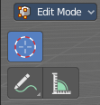

********************************************************
7.2.11 Editors - 3D View - Tool Shelf - Text - Edit Mode
********************************************************

.. contents:: Contents

Tool Shelf - Text - Edit Mode
=============================

The tool shelf does not have any tools in the tool shelf yet for the Metaball object.

3D Cursor, Measure and Annotate tools
-------------------------------------

The 3D Cursor, Measure and annotate tools at the end of the list are explained in the chapter 7.1.1 Editors - 3D View - Tool Shelf - Object Mode. We won't cover this tools again here.

