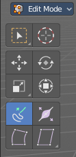

*****************************************************************
7.2.12 Editors - 3D View - Tool Shelf - Grease Pencil - Edit Mode
*****************************************************************

.. contents:: Contents

Tool Shelf - Grease Pencil - Edit Mode
======================================

Here you can find tools to edit the curve geometry of the grease pencil strokes.

Select, 3D Cursor, Transform, Measure and Annotate tools
--------------------------------------------------------

The Select , 3D Cursor, Transform, Measure and Annotate tools at the end of the list are explained in the chapter 7.1.1 Editors - 3D View - Tool Shelf - Object Mode. We won't cover this tools again here.

Extrude 
--------

Extrude out selected curve points.

Snapping
--------

Holding down Ctrl activates temporary global snapping.

Precision movement
------------------

When you hold down shift, then you will have a much slower but also much preciser movement.

Header Values
-------------

When you move the mouse then you will see some values in the header, which defines the current position of the object. 

The value m stands for the default metric system. Meters. You can change the units in the Properties editor in the Scene properties in the Units panel. When you choose kilometers here then you will see a km instead m.

The value D stands for the distance of the current selected axis. This can also be two axis. Then you have two d values. The value in the brackets is then the direct distance to the starting point.

These values are always relative to the starting point. You always start with zero, regardless of the real world position.

Move without Widget
-------------------

You don't have to use the widget to move the object. You can also click aside of it, and drag the object around. The mouse turns into a move cursor. The standard behaviour then is to move in screen space. When you want to move into a specific axis, then press X or Y or Z to limit the movement to this axis.

Limit Axis
----------

When you want to move along a specific axis, then press X or Y or Z to limit the movement to this axis. You usually start in global orientation. But you can change this in the Orientation settings.

.. image:: graphics/7.2.12_Editors_-_3D_View_-_Tool_Shelf_-_Grease_Pencil_-_Edit_Mode/100002010000011D000000CC2D097956E90B5F42.png

.. image:: graphics/7.2.12_Editors_-_3D_View_-_Tool_Shelf_-_Grease_Pencil_-_Edit_Mode/10000201000000F00000001AC426EC5611FEF97B.png

By holding down the mouse button and pressing the X, Y or Z key twice you can toggle this to local. But also to other orientations. This depends in what orientation you start. With normal you can toggle that way between Normal and Global.

Tool Settings
-------------

Axis Type
---------

You can choose between the regular axis type. That's the yellow widget with just one handler. It always points in the direction of the middled normals of the selection.

.. image:: graphics/7.2.12_Editors_-_3D_View_-_Tool_Shelf_-_Grease_Pencil_-_Edit_Mode/100002010000011D000000CC2D097956E90B5F42.png

Or you can use the XYZ axis type. That's a handler with three axis. This widget can be aligned with the transform orientation methods.

Last Operator Extrude Stroke Points
-----------------------------------

Move X, Y Z
-----------

The position. Attention, the actual world orientation and rotation does not matter here. It always starts with a value of zero, and moves relative to this zero then. For the actual location values have a look in the sidebar in the transform panel.

Orientation
-----------

The widget can have different orientations. The menu items should be self explaining.

Proportional editing
--------------------

Enables proportional editing. Activating proportional editing reveals further settings.

Proportional Falloff
--------------------

Here you can adjust the falloff methods.

Proportional Size
-----------------

Here you can see and adjust the falloff radius.

Connected
---------

The proportional falloff gets calculated for connected parts only.

Projected(2D)
-------------

The proportional falloff gets calculated in the screen space. Depth doesn't play a role. When it's in the radius, then it gets calculated.

Radius
------

Increases the thickness of the stroke for the selected curve points.

Snapping
--------

Holding down Ctrl activates temporary global snapping.

Precision movement
------------------

When you hold down shift, then you will have a much slower but also much preciser movement.

Header Values
-------------

When you move the mouse then you will see some values in the header, which shows the current scale factor. This value is relative to the starting value, which always starts with 1.

Last Operator Transform
-----------------------

Transform X, Y Z
----------------

The scale factor. Actually just the Value X does really matter. The other values have no effect. 

Axis
----

Here you can define an axis to scale. But this setting has no effect.

Orientation
-----------

The widget can have different orientations. The menu items should be self explaining.

Proportional editing
--------------------

Enables proportional editing. Activating proportional editing reveals further settings.

Proportional Falloff
--------------------

Here you can adjust the falloff methods.

Proportional Size
-----------------

Here you can see and adjust the falloff radius.

Connected
---------

The proportional falloff gets calculated for connected parts only.

Projected(2D)
-------------

The proportional falloff gets calculated in the screen space. Depth doesn't play a role. When it's in the radius, then it gets calculated.

Bend
----

Bends the selection.

Snapping
--------

Holding down Ctrl activates temporary global snapping.

Precision movement
------------------

When you hold down shift, then you will have a much slower but also much preciser movement.

Header Values
-------------

When you move the mouse then you will see some values in the header, which shows the current scale factor. This value is relative to the starting value, which always starts with 1.

.. image:: graphics/7.2.12_Editors_-_3D_View_-_Tool_Shelf_-_Grease_Pencil_-_Edit_Mode/10000201000001270000001FD2A643C3C07FFB22.png

Shear / To Sphere Tools group
-----------------------------

Shear
-----

Snapping
--------

Holding down Ctrl activates temporary global snapping.

Precision movement
------------------

When you hold down shift, then you will have a much slower but also much preciser movement.

Header Values
-------------

When you move the mouse then you will see some values in the header, which shows the current scale factor. This value is relative to the starting value, which always starts with 1.

Hotkeys
-------

As shown in the header, you can press X or Y to set the shear axis.

Last Operator Shear
-------------------

Offset
------

The shear offset. This value always starts at zero.

Axis
----

Here you can define the first axis for the shear transformation.

Axis Ortho
----------

Here you can define the second axis for the shear transformation

Orientation
-----------

The widget can have different orientations. The menu items should be self explaining.

Proportional editing
--------------------

Enables proportional editing. Activating proportional editing reveals further settings.

Proportional Falloff
--------------------

Here you can adjust the falloff methods.

Proportional Size
-----------------

Here you can see and adjust the falloff radius.

Connected
---------

The proportional falloff gets calculated for connected parts only.

Projected(2D)
-------------

The proportional falloff gets calculated in the screen space. Depth doesn't play a role. When it's in the radius, then it gets calculated.

To Sphere
---------

Transforms the selection into a sphere shape.

Snapping
--------

Holding down Ctrl activates temporary global snapping.

Precision movement
------------------

When you hold down shift, then you will have a much slower but also much preciser movement.

Header Values
-------------

When you move the mouse then you will see some values in the header, which shows the current to sphere factor. This value is relative to the starting value, which always starts with 0.

Last Operator To Sphere
-----------------------

Offset
------

The to sphere factor. This value is relative to the starting value, which always starts with 0.

Proportional editing
--------------------

Enables proportional editing. Activating proportional editing reveals further settings.

Proportional Falloff
--------------------

Here you can adjust the falloff methods.

Proportional Size
-----------------

Here you can see and adjust the falloff radius.

Connected
---------

The proportional falloff gets calculated for connected parts only.

Projected(2D)
-------------

The proportional falloff gets calculated in the screen space. Depth doesn't play a role. When it's in the radius, then it gets calculated.

