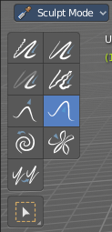
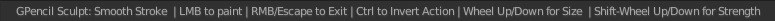

*******************************************************************
7.2.13 Editors - 3D View - Tool Shelf - Grease Pencil - Sculpt Mode
*******************************************************************

.. contents:: Contents

Tool Shelf - Grease Pencil - Sculpt Mode
========================================

In Sculpt Mode you will mainly find brushes in the tool shelf.

The brushes settings are covered in the chapter 25.1.8 Editors - Properties Editor - Tools Tab - Grease Pencil Object

Select Tools
------------

When you activate one of the mask modes then the select tool group appears. It is explained in the chapter 7.1.1 Editors - 3D View - Tool Shelf - Object Mode. We won't cover this tools again here.

Footer
------

When you use a brush then you will see some further informations to the brush. Scroll Wheel changes for example the brush radius.

Smooth brush
------------

Smoothens the stroke under the brush.

Thickness
---------

Changes the thickness of the stroke under the brush.

Strength
--------

Adjust the transparency of the stroke under the brush. Note that the effect is pretty weak with even a strength of 1. You need several strokes until you get a visible effect.

Randomize
---------

Randomizes the curve points.

Grab
----

Grab the stroke and pull it around

Push
----

Push the stroke under the brush around.

Twist
-----

Twist the stroke under the mouse. Clockwise or counter clockwise.

Pinch
-----

Pinches or inflates the stroke under the mouse.

Clone
-----

Clones strokes. You first need to copy a stroke before you can clone it.

Currently you need to be in one of the mask selection modes for that. Then select a stroke. With circle select for example. Copy it with ctrl c. And then you should be able to clone the current stroke around with a mouse click.

Note that it clones the whole stroke, and not just the selected stroke geometry. The clone brush is more of a copy and paste stroke tool.

