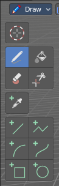
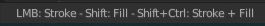
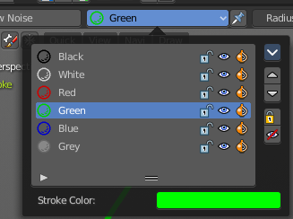
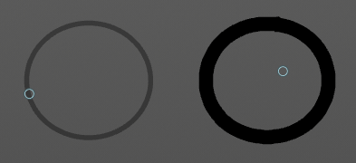
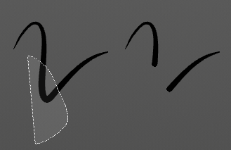
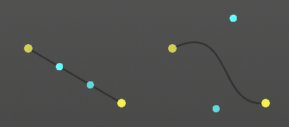
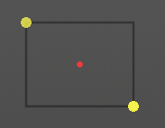
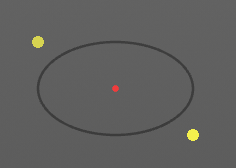

*****************************************************************
7.2.14 Editors - 3D View - Tool Shelf - Grease Pencil - Draw Mode
*****************************************************************

.. contents:: Contents

Tool Shelf - Grease Pencil - Draw Mode
======================================

In Sculpt Mode you will mainly find draw tools in the tool shelf.

The brushes settings are covered in the chapter 25.1.8 Editors - Properties Editor - Tools Tab - Grease Pencil Object.

3D Cursor Tool
--------------

The 3D cursor tool is explained in the chapter 7.1.1 Editors - 3D View - Tool Shelf - Object Mode. We won't cover this tool again here.

Footer
------

Some of the brushes and tools shows some further information in the footer.

Hotkeys
-------

Some tools have some additional hotkey functionality. We will cover it one by one.

Draw
----

The Draw tool allows you to draw free-hand strokes. You paint with the left mouse.

Holding down Shift while drawing reveals a stabilizer widget which gives you more fine control over painting the stroke.

Holding down ALT while drawing ill allow you to draw straight horizontal or vertical lines.

Holding down CTRL while drawing will turn the brush into an eraser brush.

Pressing B will allow you to box select stroke parts and delete them.

Draw Color
----------

The Draw color is in real a material. To change the color you need to change the material. Or create one with the color that you need. The Grease Pencil Stroke object comes already with a few predefined colors. You can choose between them in the header tools area.

New materials can be created in the Properties editor in the Materials tab. You can also change the color of an existing material. But note that all previously drawn strokes will also change their color then. It is one material for one color.

Brushes
-------

In the Brush browser you will find some more brush types for the Draw tool.

Guides
------

When you activate the Draw tool, then the Guides panel shows in the header. The Guides tools are directly connected with the Draw brush, it is a tools subset for it, and allows you to draw some guide shapes. Some perform around a center point called Reference Point.

You need to activate the Guides by clicking at the button at the left side of the dropdown box.

Guides Hotkeys
--------------

There are some special hotkeys just for the Guides tools. They don't have a regular menu entry. Better said, they are connected to the Guides panel.

J/Kadjust guide angle by 15°, with holding alt key by 45°

Cturn on Circular guide then toggle between Circular and Radial

Vturn off guides

Lturn on Parallel Line guide

Alt LUse angle of last freehand stroke for Parallel mode

Mtoggle between Circular & Radial mode or 90° in Parallel mode

Osets the reference point (only in Cursor or Custom mode)

Circular
--------

Draws a circle around the reference point.

Radial
------

Draws a line from the starting point through the reference point.

Parallel
--------

Draws parallel horizontal lines. You can draw rotated lines with changing the angle slider.

Grid
----

Draws parallel horizontal and vertical lines.

Isometric
---------

Draws parallel horizontal and vertical lines. You can draw rotated lines with changing the angle slider. Vertical lines can still be drawn.

Angle 
------

Radial, Angle, Isometric. The angle.

Use Snapping
------------

Enable snapping to guides angle or spacing options.

Reference Point
---------------

Circular, Radial. What reference point to use.

Fill
----

This tool does not fill, but extendstrokes ofclosed strokes areas by click drag, coming from the border. For example, when you create a bezier circle. When you then click in the inner area, drag the mouse and release it, then the outer line of this bezier circle gets extended into the inner direction by the in the brush panel adjusted amount.

When you use this tool outside of closed geometry, then it draws a frame around the current view.

Erase
-----

Erase stroke curve points under the mouse.

Cutter
------

Lasso select delete tool. Erases stroke curve points in the selection.

Eye Dropper
-----------

Pick a grease pencil material and make it the draw color.

Line
----

Draw straight lines by click drag. The yellow points are handlers that can be dragged around. Right mouse abandons the action. Pressing enter or middle mouse button confirms and makes the stroke real.

Hotkey E allows you to extrude the line.

Polyline
--------

Draw straight lines by click drag. Clicking creates a new line in the polygon. Right mouse abandons the action. Pressing enter or middle mouse button confirms and makes the stroke real.

The polygon cannot be closed.

Arc
---

Draw simple arcs by click drag. The yellow points are handlers that can be dragged around. Right mouse abandons the action. Pressing enter or middle mouse button confirms and makes the stroke real.

Curve
-----

Draw complex Bézier style curves by click drag. First you create a straight line. The handlers allows you to deform the curve to your needs. Right mouse abandons the action. Pressing enter or middle mouse button confirms and makes the stroke real.

Box
---

Draw rectangular shapes by click drag. Hold Shift to create square shapes. The handlers allows you to adjust the rectangle to your needs. Right mouse abandons the action. Pressing enter or middle mouse button confirms and makes the stroke real.

Circle
------

Draw oval shapes by click drag. Hold Shift to create square shapes. The handlers allows you to adjust the rectangle to your needs. Right mouse abandons the action. Pressing enter or middle mouse button confirms and makes the stroke real.

