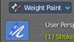

*************************************************************************
7.2.15 Editors - 3D View - Tool Shelf - Grease Pencil - Weight Paint Mode
*************************************************************************

.. contents:: Contents

Tool Shelf - Grease Pencil - Weight Paint Mode
==============================================

You can rig grease pencil strokes. And so you need a weight paint mode. In Weight Paint Mode you will just find one tool. The weight paint pencil.

The brush settings are covered in the chapter 25.1.8 Editors - Properties Editor - Tools Tab - Grease Pencil Object.

Footer
------

When you paint then you will see some further information in the footer.

Weight
------

Allows you to weight paint the current stroke with the settings defined in the brush panel.

Hotkeys
-------

F adjusts the brush radius.Holding down lmb and scroll wheel adjusts the brush radius.Shift F adjustst the brush strength.Holding down lmb and ctrl and scroll wheel adjusts the brush strength.Holding down Ctrl inverts the weight that gets drawn.

