************************************************************
7.2.16 Editors - 3D View - Tool Shelf - Armature - Edit Mode
************************************************************

.. contents:: Contents

Tool Shelf - Armature - Edit Mode
=================================

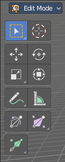

Here you find some tools to edit and extend the armature.

Select, 3D Cursor, Transform, Annotate and Measure
--------------------------------------------------

The select and transform tools and the annotation and measure tool is already described in the chapter Object Mode. So we won't cover it here again.

Bone Roll
---------

Adjust the bone roll of the selected bone(s).

Snapping
--------

Rotate and holding down Ctrl activates temporary global snapping. The rotation snaps every 5 degrees. With holding shift too it snaps every 1 degree. 

Precision movement
------------------

When you hold down shift, then you will have a much slower but also much preciser rotation.

Header Values
-------------

When you move the mouse then you will see some values in the header, which shows the current rotation factor. This value is relative to the starting value, which always starts with 0.

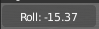

Last Operator Transform
-----------------------

Values X, Y Z
-------------

The rotation. Attention, the actual world orientation and rotation does not matter here. It always starts with a value of zero, and moves relative to this zero then. For the actual location values have a look in the sidebar in the transform panel.

The only relevant setting here is Value X. All other values and settings does not have any effect.

Axis
----

The axis to use. Axis has no effect, the bone axis X is always used.

Orientation
-----------

The widget can have different orientations. The menu items should be self explaining.

Orientation has no effect, the bone axis X is always used.

Proportional editing
--------------------

Enables proportional editing. Activating proportional editing reveals further settings.

Proportional Falloff
--------------------

Here you can adjust the falloff methods.

Proportional Size
-----------------

Here you can see and adjust the falloff radius.

Connected
---------

The proportional falloff gets calculated for connected parts only.

Projected(2D)
-------------

The proportional falloff gets calculated in the screen space. Depth doesn't play a role. When it's in the radius, then it gets calculated.

Bone Size / Envelope Tools group
--------------------------------

Bone Size
---------

This tool just works with bone display type Bbone. With other bone display types nothing happens. Here you can scale the bbones.

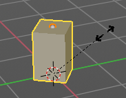

The bone display can be changed in the properties editor in the Object Data tab in the Viewport Display panel.

Snapping
--------

Move and holding down Ctrl activates temporary global snapping. The rotation snaps every 5 degrees. With holding shift too it snaps every 1 degree. 

Precision movement
------------------

When you hold down shift, then you will have a much slower but also much preciser rotation.

Header Values
-------------

When you move the mouse then you will see some values in the header, which shows the current rotation factor. This value is relative to the starting value, which always starts with 0.

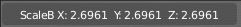

Last Operator Transform
-----------------------

Values X, Y Z
-------------

The rotation. Attention, the actual world orientation and rotation does not matter here. It always starts with a value of zero, and moves relative to this zero then. For the actual location values have a look in the sidebar in the transform panel.

The only relevant setting here is Value X. All other values and settings does not have any effect.

Axis
----

The axis to use. Axis has no effect, the bone axis X is always used.

Orientation
-----------

The widget can have different orientations. The menu items should be self explaining.

Orientation has no effect, the bone axis X is always used.

Proportional editing
--------------------

Enables proportional editing. Activating proportional editing reveals further settings.

Proportional Falloff
--------------------

Here you can adjust the falloff methods.

Proportional Size
-----------------

Here you can see and adjust the falloff radius.

Connected
---------

The proportional falloff gets calculated for connected parts only.

Projected(2D)
-------------

The proportional falloff gets calculated in the screen space. Depth doesn't play a role. When it's in the radius, then it gets calculated.

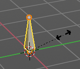

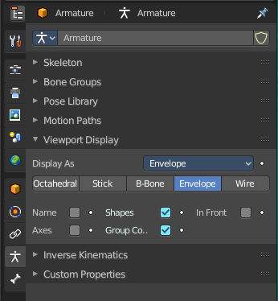

Envelope Size
-------------

This tool just works with bone display type Bbone. With other bone display types nothing happens. Here you can scale the envelope of the bones.

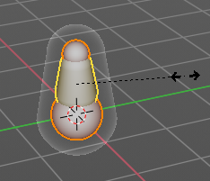

The bone display can be changed in the properties editor in the Object Data tab in the Viewport Display panel.

Snapping
--------

Move and holding down Ctrl activates temporary global snapping. The rotation snaps every 5 degrees. With holding shift too it snaps every 1 degree. 

Precision movement
------------------

When you hold down shift, then you will have a much slower but also much preciser rotation.

Header Values
-------------

When you move the mouse then you will see some values in the header, which shows the current rotation factor. This value is relative to the starting value, which always starts with 0.

Last Operator Transform
-----------------------

Values X, Y Z
-------------

The rotation. Attention, the actual world orientation and rotation does not matter here. It always starts with a value of zero, and moves relative to this zero then. For the actual location values have a look in the sidebar in the transform panel.

The only relevant setting here is Value X. All other values and settings does not have any effect.

Axis
----

The axis to use. Axis has no effect, the bone axis X is always used.

Orientation
-----------

The widget can have different orientations. The menu items should be self explaining.

Orientation has no effect, the bone axis X is always used.

Proportional editing
--------------------

Enables proportional editing. Activating proportional editing reveals further settings.

Proportional Falloff
--------------------

Here you can adjust the falloff methods.

Proportional Size
-----------------

Here you can see and adjust the falloff radius.

Connected
---------

The proportional falloff gets calculated for connected parts only.

Projected(2D)
-------------

The proportional falloff gets calculated in the screen space. Depth doesn't play a role. When it's in the radius, then it gets calculated.

Extrude Tools group
-------------------

This group contains some extrude tools. 

There are some general settings, since they all have some move settings We will cover them all here for all of the tools.

Snapping
--------

Holding down Ctrl activates temporary global snapping.

Precision movement
------------------

When you hold down shift, then you will have a much slower but also much preciser movement.

Header Values
-------------

When you move your object then you will see some values in the header, which defines the current position of the object. 

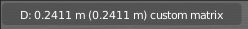

The value m stands for the default metric system. Meters. You can change the units in the Properties editor in the Scene properties in the Units panel. When you choose kilometers here then you will see a km instead m.

The value D stands for the distance of the current selected axis. This can also be two axis. Then you have two d values. The value in the brackets is then the direct distance to the starting point.

These values are always relative to the starting point. You always start with zero, regardless of the real world position.

Move without Widget
-------------------

You don't have to use the widget to move the object. You can also click aside of it, and drag the object around. The mouse turns into a move cursor. The standard behaviour then is to move in screen space. When you want to move into a specific axis, then press X or Y or Z to limit the movement to this axis.

Limit Axis
----------

When you want to move along a specific axis, then press X or Y or Z to limit the movement to this axis. You usually start in global orientation. But you can change this in the Orientation settings.

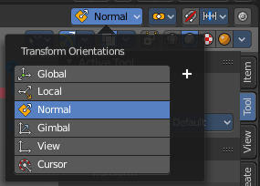

.. image:: graphics/7.2.16_Editors_-_3D_View_-_Tool_Shelf_-_Armature_-_Edit_Mode/10000201000000F00000001AC426EC5611FEF97B.png

By holding down the mouse button and pressing the X, Y or Z key twice you can toggle this to local. But also to other orientations. This depends in what orientation you start. With normal you can toggle that way between Normal and Global.

Extrude 
--------

The Extrude tool extrudes out bones from selected joints.

When you activate the tool, then you will by default see a yellow widget at the selection. Drag it to extrude the selection.

Tool Settings
-------------

Axis Type
---------

You can choose between the regular axis type. That's the yellow widget with just one handler. It always points in the direction of the middled normals of the selection.

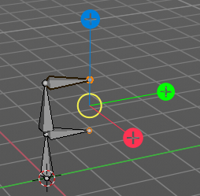

Or you can use the XYZ axis type. That's a handler with three axis. This widget can be aligned with the transform orientation methods.

Last Operator Extrude
---------------------

Forked
------

You need to tick X Axis Mirror.When you tick Forked, then the bone that you extrude to the one side will now be extruded to the other side too. The extrude gets mirrored along the x axis. This allows you to create a symmetrical armature.

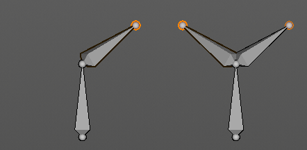

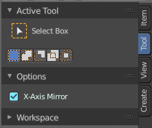

Move X , Y, Z
-------------

The transform values for the new created joint(s)

Orientation
-----------

Orientation is a drop-down box where you can choose the type of orientation for the mirroring action.

Proportional editing
--------------------

Proportional editing is disfunctional. You cannot activate it.

Extrude to cursor
-----------------

Extrudes the selection towards the mouse cursor by clicking and dragging The extruded geometry will rotate towards the mouse pointer.

