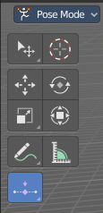

************************************************************
7.2.17 Editors - 3D View - Tool Shelf - Armature - Pose Mode
************************************************************

.. contents:: Contents

Tool Shelf - Armature - Pose Mode
=================================

The Pose mode provides some pose tools.

Select, 3D Cursor, Transform, Annotate and Measure
--------------------------------------------------

The select and transform tools and the annotation and measure tool is already described in the chapter Object Mode. So we won't cover it here again.

Breakdowner Push Relax tools group
----------------------------------

Breakdowner
-----------

Creates a suitable breakdowner pose on the current frame. Requires to have a keyframe before and after the current position.

Header Values
-------------

When you move the mouse then you will see some values in the header, which shows the current factor. This value is relative to the starting value, which always starts with 0.

It also shows some more available transform hotkeys. The hotkeys W E and R allows you just to move, rotate or scale. Hotkey B stands for Bendy Bones. And C is for a custom property. This hotkeys are hard coded, and cannot be changed in the input manager.

Last Operator Pose Breakdowner
------------------------------

Percentage
----------

The percentage of exxageration. Interestingly the value in the Last operator differs from the value in the header.

Previous Keyframe
-----------------

The keyframe position before the current frame.

Next Keyframe
-------------

The keyframe position after the current frame.

Channels
--------

Which channels to affect.

Axis Lock
---------

Lock the action to specific axis.

Push
----

Push exxagerrates the current pose. 

Header Values
-------------

When you move the mouse then you will see some values in the header, which shows the current factor. This value is relative to the starting value, which always starts with 0.

It also shows some more available transform hotkeys. The hotkeys W E and R allows you just to move, rotate or scale. Hotkey B stands for Bendy Bones. And C is for a custom property. This hotkeys are hard coded, and cannot be changed in the input manager.

Last Operator Push Pose from Breakdown.
---------------------------------------

Previous Keyframe
-----------------

The keyframe position before the current frame.

Next Keyframe
-------------

The keyframe position after the current frame.

Percentage
----------

The percentage of exxageration. Interestingly the value in the Last operator differs from the value in the header.

Channels
--------

Which channels to affect.

Axis Lock
---------

Lock the action to specific axis.

Relax
-----

Relax relaxes the current pose.

Header Values
-------------

When you move the mouse then you will see some values in the header, which shows the current factor. This value is relative to the starting value, which always starts with 0. It also shows some more available transform hotkeys.

It also shows some more available transform hotkeys. The hotkeys W E and R allows you just to move, rotate or scale. Hotkey B stands for Bendy Bones. And C is for a custom property. This hotkeys are hard coded, and cannot be changed in the input manager.

Last Operator Relax Pose to Breakdown
-------------------------------------

Previous Keyframe
-----------------

The keyframe position before the current frame.

Next Keyframe
-------------

The keyframe position after the current frame.

Percentage
----------

The percentage of exxageration. Interestingly the value in the Last operator differs from the value in the header.

Channels
--------

Here you can again choose if you just want to limit a specific channel.

Axis Lock
---------

Allows you to lock a specific axis.

