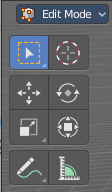

***********************************************************
7.2.18 Editors - 3D View - Tool Shelf - Lattice - Edit Mode
***********************************************************

.. contents:: Contents

Tool Shelf - Lattice - Edit Mode
================================

The tool shelf does not have any tools in the tool shelf yet for the Lattice object.

Select, 3D Cursor, Transform, Measure and Annotate tools
--------------------------------------------------------

The Select , 3D Cursor, Transform, Measure and Annotate tools at the end of the list are explained in the chapter 7.1.1 Editors - 3D View - Tool Shelf - Object Mode. We won't cover this tools again here.

