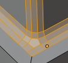

*******************************************************
7.2.2 Editors - 3D View - Tool Shelf - Mesh - Edit Mode
*******************************************************

.. contents:: Contents

Detailed table of content
=========================

Tool Shelf - Mesh - Edit Mode
=============================

In Edit mode with a mesh object you will find some polygon tools in the tool shelf.

Select, 3D Cursor, Transform, Annotate and Measure
--------------------------------------------------

The select and transform tools and the annotation and measure tool is already described in the chapter Object Mode. So we won't cover it here again. And start directly with the polygon tools.

Extrude Region tools group
--------------------------

This group contains some extrude tools. A few more exotic ones can be found in the mesh menu.

There are some general settings, since they all have some move settings We will cover them all here for all of the tools.

Snapping
--------

Holding down Ctrl activates temporary global snapping.

Precision movement
------------------

When you hold down shift, then you will have a much slower but also much preciser movement.

Header Values
-------------

When you move your object then you will see some values in the header, which defines the current position of the object. 

.. image:: graphics/7.2.2_Editors_-_3D_View_-_Tool_Shelf_-_Mesh_-_Edit_Mode/10000201000000F80000001D15C41FA67F556308.png

The value m stands for the default metric system. Meters. You can change the units in the Properties editor in the Scene properties in the Units panel. When you choose kilometers here then you will see a km instead m.

The value D stands for the distance of the current selected axis. This can also be two axis. Then you have two d values. The value in the brackets is then the direct distance to the starting point.

These values are always relative to the starting point. You always start with zero, regardless of the real world position.

Move without Widget
-------------------

You don't have to use the widget to move the object. You can also click aside of it, and drag the object around. The mouse turns into a move cursor. The standard behaviour then is to move in screen space. When you want to move into a specific axis, then press X or Y or Z to limit the movement to this axis.

Limit Axis
----------

When you want to move along a specific axis, then press X or Y or Z to limit the movement to this axis. You usually start in global orientation. But you can change this in the Orientation settings.

.. image:: graphics/7.2.2_Editors_-_3D_View_-_Tool_Shelf_-_Mesh_-_Edit_Mode/100002010000011D000000CC2D097956E90B5F42.png

.. image:: graphics/7.2.2_Editors_-_3D_View_-_Tool_Shelf_-_Mesh_-_Edit_Mode/10000201000000F00000001AC426EC5611FEF97B.png

By holding down the mouse button and pressing the X, Y or Z key twice you can toggle this to local. But also to other orientations. This depends in what orientation you start. With normal you can toggle that way between Normal and Global.

Extrude Region
--------------

The Extrude Region tool extrudes by default along the vertex normals of the current selection. When it's more than one vertex, edge or face, then the middle will be used. 

The method works the same in all Mesh select modes. Vertice, Edge and Face Mode.

When you activate the tool, then you will by default see a yellow widget at the selection. Drag it to extrude the selection.

Tool Settings
-------------

Axis Type
---------

You can choose between the regular axis type. That's the yellow widget with just one handler. It always points in the direction of the middled normals of the selection.

.. image:: graphics/7.2.2_Editors_-_3D_View_-_Tool_Shelf_-_Mesh_-_Edit_Mode/100002010000011D000000CC2D097956E90B5F42.png

Or you can use the XYZ axis type. That's a handler with three axis. This widget can be aligned with the transform orientation methods.

Last Operator Extrude Region and Move
-------------------------------------

Flip Normals
------------

Flips the normals of the extruded faces.

Move X, Y Z
-----------

The position. Attention, the actual world orientation and rotation does not matter here. It always starts with a value of zero, and moves relative to this zero then. For the actual location values have a look in the sidebar in the transform panel.

Orientation
-----------

The widget can have different orientations. The menu items should be self explaining.

Proportional editing
--------------------

Enables proportional editing. Activating proportional editing reveals further settings.

Proportional Falloff
--------------------

Here you can adjust the falloff methods.

Proportional Size
-----------------

Here you can see and adjust the falloff radius.

Connected
---------

The proportional falloff gets calculated for connected parts only.

Projected(2D)
-------------

The proportional falloff gets calculated in the screen space. Depth doesn't play a role. When it's in the radius, then it gets calculated.

Extrude Region
--------------

Extrudes the selection along local normals. You won't see a widget here. Simply drag. 

The method works the same in all Mesh select modes. Vertice, Edge and Face Mode.

Header Value
------------

This tool works like a shrink fatten extrude. And so you will see a corresponding set of values in the header.

Tool Settings
-------------

Offset Even
-----------

Scales the offset to give more even thickness. Without this checked the farer away faces will have a bigger extrude amount.

Last Operator Extrude Region and Shrink/Fatten
----------------------------------------------

Flip Normals
------------

Flips the normals of the extruded faces.

Offset
------

The current extrude amount. 

Offset Even
-----------

Scales the offset to give more even thickness. Without this checked the farer away faces will have a bigger extrude amount.

Proportional editing
--------------------

Enables proportional editing. Activating proportional editing reveals further settings.

Proportional Falloff
--------------------

Here you can adjust the falloff methods.

Proportional Size
-----------------

Here you can see and adjust the falloff radius.

Connected
---------

The proportional falloff gets calculated for connected parts only.

Projected(2D)
-------------

The proportional falloff gets calculated in the screen space. Depth doesn't play a role. When it's in the radius, then it gets calculated.

Extrude Individual
------------------

Extrudes the selection along local normals of each individual face. You won't see a widget here. Simply drag. 

The method works the same in all Mesh select modes. Vertice, Edge and Face Mode.

Header Value
------------

This tool works like a shrink fatten extrude. And so you will see a corresponding set of values in the header.

Last Operator Extrude Individual Faces and Move
-----------------------------------------------

Offset
------

The current extrude amount. 

Offset Even
-----------

Scales the offset to give more even thickness. Without this checked the farer away faces will have a bigger extrude amount.

Proportional editing
--------------------

Enables proportional editing. Activating proportional editing reveals further settings.

Proportional Falloff
--------------------

Here you can adjust the falloff methods.

Proportional Size
-----------------

Here you can see and adjust the falloff radius.

Connected
---------

The proportional falloff gets calculated for connected parts only.

Projected(2D)
-------------

The proportional falloff gets calculated in the screen space. Depth doesn't play a role. When it's in the radius, then it gets calculated.

Extrude to cursor
-----------------

Extrudes the selection towards the mouse cursor by clicking and dragging The extruded geometry will rotate towards the mouse pointer.

Tool Settings
-------------

Rotate Source
-------------

In theory this setting should rotate the source geometry too to achieve a better result. In practice this setting does nothing. 

Last Operator Move
------------------

Move X Y Z
----------

The current extrude amount. 

Orientation
-----------

The widget can have different orientations. The menu items should be self explaining.

Proportional editing
--------------------

Enables proportional editing. Activating proportional editing reveals further settings.

Proportional Falloff
--------------------

Here you can adjust the falloff methods.

Proportional Size
-----------------

Here you can see and adjust the falloff radius.

Connected
---------

The proportional falloff gets calculated for connected parts only.

Projected(2D)
-------------

The proportional falloff gets calculated in the screen space. Depth doesn't play a role. When it's in the radius, then it gets calculated.

Inset
-----

Inset insets edges into the selected faces. Think of it as a extrude inwards the face.

Activate the tool, drag the mouse. But carefully. The control is not the best. You better adjust the amount in the last operator.

Tool Settings
-------------

Outset
------

With outset ticked the Inset will not extrude inwards but outwards.

Interpolate
-----------

Blend Face Data across the inset.

Offset Even
-----------

Scales the offset to give more even thickness.

Offset Relative
---------------

Scales the offset by surrounding geometry.

Last Operator Inset Faces
-------------------------

Boundary
--------

With Boundary ticked you will get the connect edges in the corners. Without the edges ends straight.

Offset Even
-----------

Scales the offset to give more even thickness.

Offset Relative
---------------

Scales the offset by surrounding geometry.

Edge Rail
---------

Inset the region along existing edges.

Thickness
---------

Thickness adjusts the thickness of the inset geometry.

Depth
-----

With depth you can bevel the inset geometry. It is then not longer coplanar to the initial face.

Outset
------

With outset ticked the Inset will not extrude inwards but outwards.

Select Outer
------------

With Select Outer the outer ring will be selected after the Inset.

Individual
----------

Inset every face individually.

Interpolate
-----------

Blend Face Data across the inset.

Bevel
-----

The Bevel Tool adds a bevel to the selected geometry. 

Usage: first select the geometry that you want to bevel. Then activate the tool. Don't wonder that the mouse movement does nothing. That's by design. Adjust the amount in the Last Operator Bevel panel.

Tool Settings
-------------

Width type
----------

Here you can choose the Amount type for the bevel action.

Segments
--------

How many segments gets created.

Profile
-------

Controls the Profile shape. 0.5 means round.

Vertex only
-----------

Bevel Vertices only.

Last Operator Bevel
-------------------

Width type
----------

Here you can choose the Amount type for the bevel action.

Width
-----

The Bevel amount

Segments
--------

How many segments gets created

Profile
-------

Controls the Profile shape. 0.5 means round.

Vertex only
-----------

Bevel Vertices only.

Clamp Overlap
-------------

Do not allow bevelled geometry to overlap each other.

Loop Slide
----------

Prefer slide along edge to even widths.

Mark Seams
----------

Mark the edges of the new created geometry as seams.

Mark Sharp
----------

Mark the edges of the new created geometry sharp.

Material
--------

Material for bevelled faces. -1 is the surrounding material.

Harden Normals 
---------------

When enabled, the per-vertex face normals of the bevel faces are adjusted to match the surrounding faces, and the normals of the surrounding faces are not affected. This will keep the surrounding faces flat (if they were before), with the bevel faces shading smoothly into them. For this effect to work, custom split normals need to be enabled, which requires Auto Smooth to be enabled (see Normals). As a convenience, that option will be enabled for you if it is not already when you enable Harden Normals here.

Face Strength Mode
------------------

Set Face Strength on the faces involved in the bevel, according to the specified mode. This can be used in conjunction with a Weight Normals Modifier (with the Face Influence option checked).

None
----

Do not set face strength.

New
---

Set the face strength of new faces along edges to Medium, and the face strength of new faces at vertices to Weak.

Affected
--------

In addition to those set for the New case, also set the faces adjacent to new faces to have strength Strong.

All
---

In addition to those set for the Affected option, also set all the rest of the faces of the model to have strength Strong.

Outer Miter
-----------

How the outer miter is set. Miter is how the bevel rounding at a corner is done.

Sharp
-----

Creates a sharp miter.

Patch
-----

This replaces the outside vertex of a miter with 3 vertices. And uses a patch pattern there.

Arc
---

This replaces the vertex of a miter with 2 vertices, joined by an arc. A separate Spread parameter says how far to move the vertices away from their original position.

Inner Miter
-----------

How the inner miter is set.Miter is how the bevel rounding at a corner is done.

.. image:: graphics/7.2.2_Editors_-_3D_View_-_Tool_Shelf_-_Mesh_-_Edit_Mode/10000201000000970000005290A37F7B107269DE.png

Sharp
-----

Creates a sharp miter.

Arc
---

This replaces the vertex of a miter with 2 vertices, joined by an arc. A separate Spread parameter says how far to move the vertices away from their original position.

Spread
------

Belongs to inner miter method Arc. Here you can adjust how strong the inner radius is bent.

Loop Cut tools group
--------------------

Loop Cut and Slide
------------------

Loop Cut and Slide adds edge loops. When you hover with the mouse over the geometry then you will see a yellow line in the exact middle of the face(s). This is what will be the new cutted edge. 

When you click once, then this edge gets created. When you click and hold, then you can move this edge to a new location.

Loop cut ignores selections. It will try to divide the face under the mouse, and continue the loop until it is closed, or until it cannot continue. At poles for example.

Tool Settings
-------------

Number of Cuts
--------------

You can with one cut add more than one edge. Here you can adjust the amount. 

Note that here you need to adjust this setting before adding the loop. Note also that the yellow preview line will not show all added loops. But just the yellow line.

.. image:: graphics/7.2.2_Editors_-_3D_View_-_Tool_Shelf_-_Mesh_-_Edit_Mode/10000201000001080000010BFDDF365835F9C522.png

The settings remains its values as long as you don't close Bforartists and restart it.

Correct UV's
------------

Correct the UV's when transforming the new added loop.

Last Operator Loop Cut and Slide
--------------------------------

Note that all settings here just changes the latest added loop. Not all added loops in the current session.

Number of Cuts
--------------

The number of cuts that gets added. It can be more than one loop at once. 

Smoothness
----------

This value defines how smooth the loop cut gets added. From flat to bent.

Falloff
-------

Here you can adjust the Falloff type for smoothness.

Factor
------

Here you can change the center of the added loop.

Even 
-----

Make the edge loop match the shape of the adjacent edge loop

Flipped
-------

When Even mode is active, flips between the two adjacent edge loops.

Clamp
-----

Clamp within the edge extend.

Correct UV's
------------

Corrects the UV's when modifying the geometry.

Offset Edge Loop Cut
--------------------

Slides the selected edge(s)

Usage: select the edges that you want to slide. Click to confirm. 

You can adjust the sliding amount in the Last Operator Offset Edge Slide.

Last Operator Offset Edge Slide
-------------------------------

Cap Endpoint 
-------------

Cap Endpoint caps the loose edges.

Edge Slide Factor
-----------------

Here you can adjust the slide amount.

Even 
-----

Make the edge loop match the shape of the adjacent edge loop

Flipped
-------

When Even mode is active, flips between the two adjacent edge loops.

Clamp
-----

Clamp within the edge extend.

Correct UV's
------------

Corrects the UV's when modifying the geometry.

Knife Tool Group
----------------

Knife tool
----------

The Knife tool cuts the geometry, and adds edges. When it crosses existing geometry then it adds a vertice at the crossing point.

Useage: activate the tool, left click to define the starting point. This can also be a point in the middle of a face. But ideally you choose an existing vertice or an edge as the start and endpoints. The knife tool tries to snap to them when you get close with the mouse cursor. 

When done press Enter or Spacebar to confirm. Right click abandons the operation.

When you create a vertice in the middle of a face, then the knife tool will try to connect this vertice by an existing vertice of this face when you confirm with spacebar.

Hotkey functionality in the footer text
---------------------------------------

Have a look at the footer when you work with this tool. Here you will find further instructions and hotkeys.

Enter, Pad Enter, Spacebar - confirm

Esc key, RMB - cancel the operation

LMB start the cut

Double LMB - close the cut

E - create new cut

Ctrl or Shift while dragging - Snap to the middle of an edge

Z - cut through the whole geometry, also the backfaces.

MMB - pan the view.

Alt MMB - rotate the view.

Tool Settings
-------------

Occlude Geometry
----------------

Just cut the visible geometry that points towards you. Not the backfaces.

Only Selected
-------------

Just cut through selected geometry. Not through not selected.

Bisect
------

Bisect cuts geometry along a plane. This description is a bit misleading though. You simply cut through the whole geometry by defining a line. And the cut goes through the geometry from the current view.

When you have set your cut and release the mouse then you reveal a widget with which you can move and rotate the cut. Clicking at the arrow and drag moves the cut. Clicking at the circle and drag rotates the cut.

Tool Settings
-------------

Fill
----

Fills the cut.

Clear Inner
-----------

Removes the inner part of the face to cut.

Clear Outer
-----------

Removes the outer part of the face to cut.

Axis threshold
--------------

Axis threshold.

Last Operator Bisect
--------------------

Plane Point X , Y , Z
---------------------

Defines the start point of the Bisect cut.

Plane Normal X , Y , Z
----------------------

The direction in which the bisect points.

Fill
----

Fills the cut.

Clear Inner
-----------

Removes the inner part of the face to cut.

Clear Outer
-----------

Removes the outer part of the face to cut.

Axis threshold
--------------

Axis threshold.

Poly Build
----------

This tool extrudes out edges and faces from the border of existing open geometry.

The tool will not work at a cube, since here it cannot extrude out an existing polygon from a border. There is no border since the geometry is closed.

Usage:
------

Move the mouse over an edge until it turns blue. Then you can left click and drag to extrude it out.

Holding ctrl and clicking will extrude the last selected element to the mouse cursor. To extrude out an edge from a vertice don't click with left mouse. This would create a polygon. But with right mouse button.

Holding down shift allows you to mark vertices, edges or polygons that you want to remove. By clicking the selected geometry will be deleted.

You can just work at one edge at a time.

Tool Settings
-------------

Create Quads
------------

Create quad or tri geometry.

Last Operator
-------------

We have two last operators here, dependant of which method we use. Dragging out edges will reveal the Extrude At Cursor Move panel. Holding down CTRL will reveal the Face at Cursor Move panel.

Extrude At Cursor Move panel
----------------------------

Flip Normals
------------

Flips the normals of the extruded faces.

Move X, Y Z
-----------

The position of the new created element. Attention, the actual world orientation and rotation does not matter here. It always starts with a value of zero, and moves relative to this zero then. For the actual location values have a look in the sidebar in the transform panel.

Orientation
-----------

The widget can have different orientations. The menu items should be self explaining.

Face at Cursor Move panel
-------------------------

Move X, Y Z
-----------

The position of the new created element. Attention, the actual world orientation and rotation does not matter here. It always starts with a value of zero, and moves relative to this zero then. For the actual location values have a look in the sidebar in the transform panel.

Orientation
-----------

The widget can have different orientations. The menu items should be self explaining.

Proportional editing
--------------------

Enables proportional editing. Activating proportional editing reveals further settings.

Proportional Falloff
--------------------

Here you can adjust the falloff methods.

Proportional Size
-----------------

Here you can see and adjust the falloff radius.

Connected
---------

The proportional falloff gets calculated for connected parts only.

Projected(2D)
-------------

The proportional falloff gets calculated in the screen space. Depth doesn't play a role. When it's in the radius, then it gets calculated.

Spin Tools Group
----------------

Spin
----

The Spin tool extrudes the selection and spins it by a defined amount and segments. This amount and number of segments can be adjusted. 

When you activate the tool then you reveal some widgets with various handlers.

You can spin vertices, edges and faces. And even whole closed objects.

Usage
-----

Select the geomertry that you want to spin out. In our case we choose a face at a cube.

The first thing that you need to is to activate the correct Axis widget, which can be done in the Tool Settings. The ones with the big + buttons at the end defines in which direction the extrusion happens. And when you touch them then you start the spin extrusion. The rest of the widget functionality should be self explaining. You have handlers to pull and to rotate.

Hint, you activate all three axis widgets by holding down shift, and clicking at the axis buttons in the tool settings.

The second step is then to move the center of the spin to the desired location to get the rotation that you want. This can be done by the move handler. Or you click into the middle of the widget, at the white circle there, and drag it around.

For an accurate rotation around a single axis you should work in one of the orthographic views.

Tool Settings
-------------

Steps
-----

The number of divisions.

Axis
----

Activates the axis handler to perform the spin operation.

Hint, you activate all three axis widgets by holding down shift, and clicking at the axis buttons in the tool settings.

Last Operator Spin
------------------

Steps 
------

Steps is the number of segments.

Duplicate
---------

With duplicate checked the geometry gets duplicated instead of extruded. 

Angle
-----

Angle defines the angle of the spin.

Center X Y Z
------------

The Centre edit boxes defines the centre of the radius for the spin operation. In our example the X value is set to 2, and the Z value is set to 1.

Axis X Y Z
----------

Axis defines the extrude direction. With X and Z values you can twist the result.

Spin Duplicate
--------------

Spin Duplicate is the exact same tool than Spin. It uses the same operator under the hood, and has no extra functionality. Not even the checkbox for duplicate is checked in the identical Adjust Last Operation Panel.

I think that this tool is meant to create duplicates by default. Simply use the Spin tool, and in the last operator panel tick Duplicate.

Smooth / Randomize Tools group
------------------------------

Smooth
------

Smoothens the selected vertices.

Usage
-----

Activate the tool, move the mouse.

Tool Settings
-------------

Repeat
------

How often the smoothing should be applied.

Last Operator Smooth Vertices
-----------------------------

Smoothing
---------

The smoothing factor.

Repeat
------

How often the smoothing should be applied.

X Axis, Y Axis, Z Axis
----------------------

Which axis to affect

Randomize
---------

Randomizes the selected vertices.

Usage
-----

Activate the tool, move the mouse.

Tool Settings
-------------

Uniform
-------

Uniform offset. The higher the value the more uniform the offset becomes.

Normal
------

Align the random offset to the normals. This is a factor. 0 means no offset but completely random vertices positions. 1 means completely aligned with the normal axis, and just along this normal axis.

Random Seed
-----------

The seed for the randomization.

Last Operator Smooth Vertices
-----------------------------

Amount
------

The randomization amount.

Uniform
-------

Uniform offset. The higher the value the more uniform the offset for all vertices becomes.

Normal
------

Align the random offset to the normals. This is a factor. 0 means no offset but completely random vertices positions. 1 means completely aligned with the normal axis, and just along this normal axis.

Random Seed
-----------

The seed for the randomization.

Edge and Vertex Slide Tools Group
---------------------------------

Edge Slide
----------

Edge Slide slides the selected edge along the face that it is part of. This is for the edge at a cube into two possible directions.

This tool requires to have at least one edge selected.

Header Values
-------------

The header values shows you the current transformation. But also hints towards a hotkey.

Holding down ALT will allow you to slide the edges behind the limits of the guide edge. Yellow infinite guide lines appears.

Tool Settings
-------------

Correct UV's 
-------------

Correct UV's corrects the UV's while editing the geometry.

Last Operator Edge Slide
------------------------

Factor
------

Factor is a sliding box Here you can adjust the slide strength numerically. The width of the face is the 0-1 range.

Even
----

Make the Edge loop match the shape of the adjacent edge loop.

Flipped 
--------

When Even Mode is active, flips between the two adjacent edge loops.

Clamp
-----

Clamp within the edge extend.

Correct UV's 
-------------

Correct UV's corrects the UV's while editing the geometry.

Vertex Slide
------------

Vertex Slide slides the selected vertice along the edge that it is part of. This is for the corner vertice at a cube into three possible directions.

Header Values
-------------

The header values shows you the current transformation. But also hints towards a hotkey.

Holding down ALT will allow you to slide the edges behind the limits of the guide edge. Yellow infinite guide lines appears.

Tool Settings
-------------

Correct UV's 
-------------

Correct UV's corrects the UV's while editing the geometry.

Last Operator Vertex Slide
--------------------------

Factor
------

Factor is a sliding box Here you can adjust the slide strength numerically. The width of the face is the 0-1 range.

Even
----

Make the Edge loop match the shape of the adjacent edge loop.

Flipped
-------

When Even Mode is active, flips between the two adjacent edge loops.

Clamp
-----

Clamp within the edge extend.

Correct UV's 
-------------

Correct UV's corrects the UV's while editing the geometry.

Shrink/Fatten / Push/Pull Tools Group
-------------------------------------

Shrink / Fatten
---------------

Shrink / Fatten shrinks or fattens the selection. The faces moves along the normals of the faces.

Header Values
-------------

The header values shows you the current transformation. But also hints towards a hotkey. Holding down ALT will turn off Even Thickness.

Tool Settings
-------------

Offset Even
-----------

Scales the offset to give more even thickness. Without this checked the farer away faces will have a bigger extrude amount.

Last Operator Shrink/Fatten
---------------------------

Offset
------

The offset amount

Offset Even
-----------

Scales the offset to give more even thickness. Without this checked the farer away faces will have a bigger extrude amount.

Proportional editing
--------------------

Enables proportional editing. Activating proportional editing reveals further settings.

Proportional Falloff
--------------------

Here you can adjust the falloff methods.

Proportional Size
-----------------

Here you can see and adjust the falloff radius.

Connected
---------

The proportional falloff gets calculated for connected parts only.

Projected(2D)
-------------

The proportional falloff gets calculated in the screen space. Depth doesn't play a role. When it's in the radius, then it gets calculated.

Push/Pull
---------

It pushes or pulls the selection relative to the center of the selection.

Header Values
-------------

The header values shows you the current transformation. 

Last Operator Push/Pull
-----------------------

Distance
--------

The push pull amount

Proportional editing
--------------------

Enables proportional editing. Activating proportional editing reveals further settings.

Proportional Falloff
--------------------

Here you can adjust the falloff methods.

Proportional Size
-----------------

Here you can see and adjust the falloff radius.

Connected
---------

The proportional falloff gets calculated for connected parts only.

Projected(2D)
-------------

The proportional falloff gets calculated in the screen space. Depth doesn't play a role. When it's in the radius, then it gets calculated.

Shear and To Sphere Tools Group 
--------------------------------

Shear
-----

Shear shears the selection. When you activate the tool then you will reveal a widget. This widget allows you to shear the selection in all possible axis.

Tool Settings
-------------

Orientation
-----------

Here you can choose the orientation for the shear action.

Last Operator Shear
-------------------

Offset
------

Here you can adjust an offset.

Axis
----

Defines one axis of the imaginary shear axis plane.

Axis Ortho
----------

Defines the other axis of the imaginary shear axis plane.

Orientation
-----------

Here you can choose the orientation for the shear action.

Proportional editing
--------------------

Enables proportional editing. Activating proportional editing reveals further settings.

.. image:: graphics/7.2.2_Editors_-_3D_View_-_Tool_Shelf_-_Mesh_-_Edit_Mode/1000020100000119000000773CD5255E7E68F4C5.png

Proportional Falloff
--------------------

Here you can adjust the falloff methods.

Proportional Size
-----------------

Here you can see and adjust the falloff radius.

Connected
---------

The proportional falloff gets calculated for connected parts only.

Projected(2D)
-------------

The proportional falloff gets calculated in the screen space. Depth doesn't play a role. When it's in the radius, then it gets calculated.

To Sphere
---------

Shapes a selection of objects into the shape of a sphere. The calculation happens with the object origins.

In Object mode this tools requires to have more than one object selected. 

Usage
-----

Select the vertices, activate the tool, then drag the mouse in the 3D viewport. In the header you will read the current factor then. Which tells you how close you are towards the sphere shape.

.. image:: graphics/7.2.2_Editors_-_3D_View_-_Tool_Shelf_-_Mesh_-_Edit_Mode/10000201000000920000002B567D115A122ADB2E.png

.. image:: graphics/7.2.2_Editors_-_3D_View_-_Tool_Shelf_-_Mesh_-_Edit_Mode/10000201000000C2000000D566799059F4AA0E74.png

Last Operator To Sphere Panel
-----------------------------

Factor
------

The factor to transform the selection into a shape form.

Proportional editing
--------------------

Enables proportional editing. Activating proportional editing reveals further settings.

Proportional Falloff
--------------------

Here you can adjust the falloff methods.

Proportional Size
-----------------

Here you can see and adjust the falloff radius.

Connected
---------

The proportional falloff gets calculated for connected parts only.

Projected(2D)
-------------

The proportional falloff gets calculated in the screen space. Depth doesn't play a role. When it's in the radius, then it gets calculated.

Rip Tools Group
---------------

Rip Vertices
------------

Rip splits the edges between the selected vertices. It creates two edges out of one.

This tool works similar to the Edge Split tool. It also selects the outer edges so that you immediately move them. Right click will snap them back to the initial space.

Tool Settings
-------------

Fill
----

Fills the gap between the new edges when you move the geometry.

Last Operator Rip
-----------------

Move X , Y , Z
--------------

Here you can adjust the position.

Constraint Axis
---------------

Here you can limit the position relative to the source object.

Orientation
-----------

Orientation is a drop-down box where you can choose the type of orientation for the mirroring action.

Proportional editing
--------------------

Enables proportional editing. Activating proportional editing reveals further settings.

.. image:: graphics/7.2.2_Editors_-_3D_View_-_Tool_Shelf_-_Mesh_-_Edit_Mode/1000020100000119000000773CD5255E7E68F4C5.png

Proportional Falloff
--------------------

Here you can adjust the falloff methods.

Proportional Size
-----------------

Here you can see and adjust the falloff radius.

Connected
---------

The proportional falloff gets calculated for connected parts only.

Projected(2D)
-------------

The proportional falloff gets calculated in the screen space. Depth doesn't play a role. When it's in the radius, then it gets calculated.

Extend Vertices
---------------

Extend vertices extrudes out the selected vertices. When you do this operation at an edge then you will create N-Gons that way.

Last Operator Extend Vertices
-----------------------------

Move X , Y , Z
--------------

Here you can adjust the position.

Constraint Axis
---------------

Here you can limit the position relative to the source object.

Orientation
-----------

Orientation is a drop-down box where you can choose the type of orientation for the mirroring action.

Proportional editing
--------------------

Enables proportional editing. Activating proportional editing reveals further settings.

.. image:: graphics/7.2.2_Editors_-_3D_View_-_Tool_Shelf_-_Mesh_-_Edit_Mode/1000020100000119000000773CD5255E7E68F4C5.png

Proportional Falloff
--------------------

Here you can adjust the falloff methods.

Proportional Size
-----------------

Here you can see and adjust the falloff radius.

Connected
---------

The proportional falloff gets calculated for connected parts only.

Projected(2D)
-------------

The proportional falloff gets calculated in the screen space. Depth doesn't play a role. When it's in the radius, then it gets calculated.

