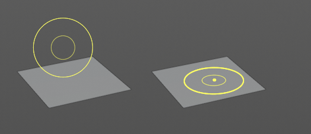
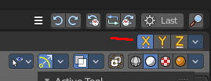

*********************************************************
7.2.3 Editors - 3D View - Tool Shelf - Mesh - Sculpt Mode
*********************************************************

.. contents:: Contents

Tool Shelf - Mesh - Sculpt Mode
===============================

.. image:: graphics/7.2.3_Editors_-_3D_View_-_Tool_Shelf_-_Mesh_-_Sculpt_Mode/10000201000000620000024D8DA1ECB20FB87F0D.png

In Sculpt mode with a mesh object you will find mainly brushes in the tool shelf. 

Transform and Annotate tools
----------------------------

The transform and annotate tools at the end of the list are explained in the chapter 7.1.1 Editors - 3D View - Tool Shelf - Object Mode. We won't cover this tools again here.

Brush cursor
------------

When you activate one of the brushes then the mouse cursor turns into a brush cursor. This cursor represents the size of the current brush. It aligns to the surface under the mouse. When you start to draw then the brush cursor will disappear except for one little yellow dot in the center.

Brushes settings
----------------

The different brushes settings can be found in the sidebar in the tools tab. Or in the properties editr in the Active Tool and Workspace settings tab. Or above the header area.

The different brushes settings in the Active Tool and Workspace settings are explained in the chapter 25.1 Editors - Properties Editor - Tools Tab.

We won't cover this chapters again, but just explain what the different brushes does.

Hotkeys
-------

Pressing F allows you to change the brush size onscreen. Drag the mouse to increase or decrease the size. Left click applies the new size, right click cancels the resizing.

Pressing Shift F allows you to change the strength of the brush. Drag the mouse to increase or decrease the size. Left click applies the new size, right click cancels the resizing.

Symmetry
--------

Note that the sculpting mode starts with Symmetry in X axis on. You can turn this off up right in the header.

Draw
----

Draws a stroke.

Draw Sharp
----------

Draws a negative stroke. In the Brush panel you will see that the direction is set to subtract instead of add. But you can also set it to add. This brush is a bit sharper than the Draw brush.

Clay
----

Draws a stroke. The pencil reacts different than with draw. It's more like sculpting, not so much like drawing, and deforms the surface also more in a sculpting style. The brush has a pretty weak effect in its default settings.

Clay Strips
-----------

Draws little strips on top of each other.

Layer
-----

Adds a layer stroke with a predefined height. This height can be adjusted with the height slider in the Brushes panel.

Inflate
-------

Inflates or deflates existing strokes. See Inflate/Deflate setting in the Brush panel.

Blob
----

Reacts pretty similar to Draw. It draws a stroke.

Crease
------

Draws a negative stroke. 

Smooth
------

Smoothens the surface.

Flatten
-------

Flattens the surface.

Fill
----

Tries to fill the valley between two hill strokes. Hard to see in the shot. And the default values have a very weak influence.

Scrape
------

As the name says. With this brush you can scrape.

Pinch
-----

Pinches existing strokes. Hard to see in the shot. What happens is that the stroke at the top becomes much sharper.

Grab
----

Allows you to grab a portion of the sculpt mesh and drag it around.

Elastic Deform
--------------

Allows you to grab a portion of the sculpt mesh and drag it around. This brush tries to preserve the volume of closed meshes. So it's best used at a closed geometry.

Snake Hook
----------

Allows you to grab a portion of the sculpt mesh and drag it around. The tool reacts a bit different than the Grab tool.

Thumb
-----

Allows you to pull geometry around than you would press your thumb into the claw.

Pose
----

Allows you to pose the geometry under the brush by rotating it freely.

Nudge
-----

Nudges the geometry. Drag it sidewards.

Rotate
------

Rotates the geometry under the brush, aligned with the brush alignment.

Simplify
--------

Has no effect on quad geometry. This tool is of interest for Dyntopo sculpting. It simplifies the geometry, using the less dense areas as reference.

Mask
----

Allows you to mask out specific parts of the mesh by painting it black. Black means no sculpt stroke possible in this area.

In the Brush panel you can negate the effect. And remove the mask by repainting over it with Direction set to Subtract.

The mask menu in the header provides you with further functionality like clear and invert the mask.

Box/ Lasso Mask Tools group
---------------------------

Allows you to mask out specific parts of the mesh by selecting mesh parts, and mask them with black. Black means no sculpt stroke possible in this area.

This tools is, different from the mask brush not brushes, but select tools. It behaves like the general box and lasso select methods. To subtract hold down ctrl.

The mask menu in the header provides you with further functionality like clear and invert the mask.

Hide
----

This tool allows you to box select parts of the mesh that gets hidden then. To reveal hidden mesh parts left click anywhere.

Mesh Filter
-----------

Apply a Mesh Filter Type. Mesh filters are something like deform modifiers.

Usage
-----

Choose the filter type that you want to apply in the Tool Settings panel. Then drag with the mouse to adjust the amount.

You have to adjust everything beforehand. This tool has no last operator.

Tool Settings
-------------

Filter Type
-----------

Smooth
------

Smoothens the surface.

Scale
-----

Scales the surface.

Inflate
-------

Inflates the surface.

Sphere
------

Forms the surface to a sphere.

Random
------

Randomizes the vertices positions.

Strength
--------

The strength of the effect.

Deform Axis
-----------

Here you can limit the effect to single world axis.

