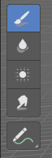
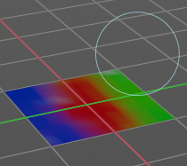
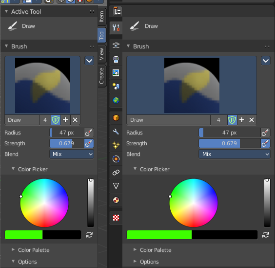
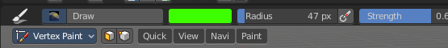
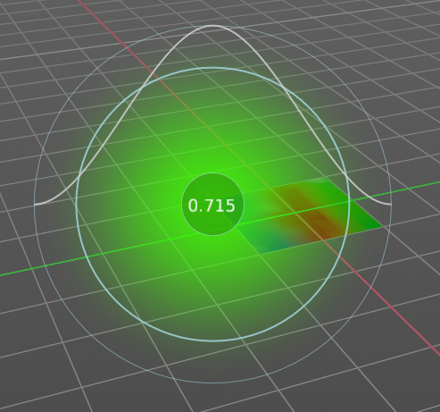
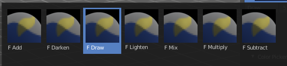

***************************************************************
7.2.4 Editors - 3D View - Tool Shelf - Mesh - Vertex Paint Mode
***************************************************************

.. contents:: Contents

Tool Shelf - Mesh - Vertex Paint Mode
=====================================

In Vertex Paint mode with a mesh object you will find mainly brushes in the tool shelf. Vetex painting allows you to paint the vertices of a mesh object with a specific color. This can then be used in various ways. As direct painting without any UV mapping. Or for some special calculations. There is a shader node that reads the vertex color values.

Annotate tools
--------------

The annotate tools at the end of the list are explained in the chapter 7.1.1 Editors - 3D View - Tool Shelf - Object Mode. We won't cover this tools again here.

Brush cursor
------------

When you activate one of the brushes then the mouse cursor turns into a brush cursor. This cursor represents the size of the current brush. It does not align with the surface under the mouse. But always faces towards you. 

Brushes settings
----------------

The different brushes settings can be found in the sidebar in the tools tab. Or in the properties editor in the Active Tool and Workspace settings tab. Or above the header area.

The different brushes settings in the Active Tool and Workspace settings are explained in the chapter 25.1.4 Editors - Properties Editor - Tools Tab - Vertex Paint Mode

We won't cover this chapters again, but just explain what the different brushes does.

Symmetry
--------

You can enable Symmetry painting up right in the header.

Hotkeys
-------

Pressing F allows you to change the brush size onscreen. Drag the mouse to increase or decrease the size. Left click applies the new size, right click cancels the resizing.

Pressing Shift F allows you to change the strength of the brush. Drag the mouse to increase or decrease the size. Left click applies the new size, right click cancels the resizing.

Draw
----

Draws a stroke. The Draw tool has several sub brushes in the Brush panel. The names of the brushes are pretty self explaining.

Add
---

The specified weight value is added to the vertex weights. The strength determines which fraction of the weight gets added per stroke. But the brush will not paint weight values above 1.0.

Darken
------

Darkens the current color at the vertices down to the specified target value.Only weights above the target weight are affected. Weights below the target weight remain unchanged.

Draw
----

Draws a stroke.

Lighten
-------

Lightens the current color at the vertices up to the specified target value. Only weights below the target weight are affected. Weights above the target weight remain unchanged.

Mix
---

Mix the color that you draw with the background color.

Multiply
--------

Multiplies the color that you draw with the background color.

Subtract
--------

Removes the color from the vertex with drawing.

Blur
----

Smooths out the colors of adjacent vertices. In this mode the Color Value is ignored. The strength defines how much the colors are blurred.

Average
-------

Smooths color by painting the average resulting color from all colors under the brush.

Smear
-----

Smudges colors by grabbing the colors under the brush and “dragging” them.

