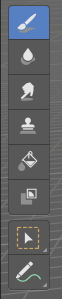
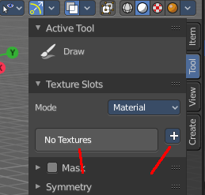
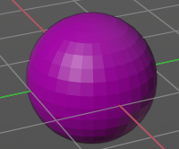
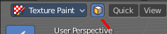
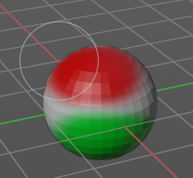
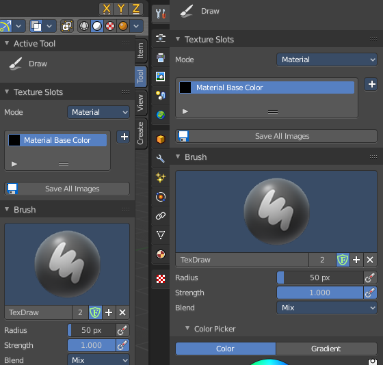
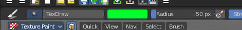
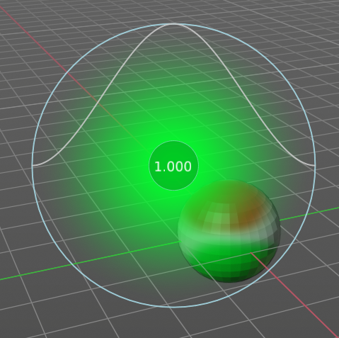

****************************************************************
7.2.6 Editors - 3D View - Tool Shelf - Mesh - Texture Paint Mode
****************************************************************

.. contents:: Contents

Tool Shelf - Mesh - Weight Paint Mode
=====================================

In Texture Paint mode with a mesh object you will find mainly brushes in the tool shelf. Texture painting allows you to paint directly onto the texture of the mesh.

Texture painting requires to have a proper UV mapping and a texture at the mesh. When there is no texture at the mesh then the mesh shows pink. And you will get a No Texures message in the tools settings in the Texture Slots panel. You can add a texture paint slot under the tiny little button at the right.

Transform and Annotate tools
----------------------------

The transform and annotate tools at the end of the list are explained in the chapter 7.1.1 Editors - 3D View - Tool Shelf - Object Mode. We won't cover this tools again here.

The transform tools group shows when you activate Paint Mask sub mode.

Brush cursor
------------

When you activate one of the brushes then the mouse cursor turns into a brush cursor. This cursor represents the size of the current brush. It does not align with the surface under the mouse. But always faces towards you.

Brushes settings
----------------

The different brushes settings can be found in the sidebar in the tools tab. Or in the properties editor in the Active Tool and Workspace settings tab. Or above the header area.

The different brushes settings in the Active Tool and Workspace settings are explained in the chapter 25.1.6 Editors - Properties Editor - Tools Tab - Texture Paint Mode

We won't cover this chapters again, but just explain what the different brushes does.

Symmetry
--------

You can enable Symmetry painting up right in the header.

Hotkeys
-------

Pressing F allows you to change the brush size onscreen. Drag the mouse to increase or decrease the size. Left click applies the new size, right click cancels the resizing.

Pressing Shift F allows you to change the strength of the brush. Drag the mouse to increase or decrease the size. Left click applies the new size, right click cancels the resizing.

Draw
----

Draws a stroke. The color and quite a few other settings can be defined in the Tools settings.

Soften
------

Softens the texture region under the brush cursor.

Smear
-----

Smears the color under the brush cursor

Clone
-----

Clone a texture area and paint with it. 

Useage
------

Hold down CTRL and click at the source area that you want to draw with. Then draw with left mouse strokes

Fill
----

Fills the whole selection with the chosen color.

Mask
----

Mask out mesh parts by painting these areas with the mask color, which is by default black. Masked texture parts won't be painted when you paint over it. Turn off the mask to see the effect.

This tool requires to have a stencil texture. This stencil texture can be created or loaded in the tools tab in the Mask panel.

