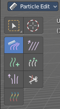
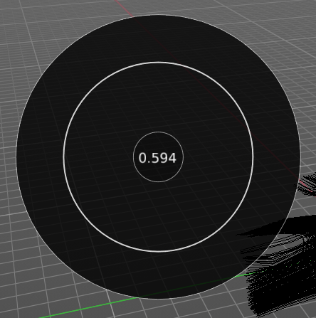

****************************************************************
7.2.7 Editors - 3D View - Tool Shelf - Mesh - Particle Edit Mode
****************************************************************

.. contents:: Contents

Tool Shelf - Mesh - Particle Edit Mode
======================================

You can attach a particle system to a mesh object. And then you can switch to a Particle Edit Mode.

This mode allows you to edit the particles. In the tool shelf you will find several brushes. These brushes are of use for particles of type hair. They can be combed, cut etc. .

Select and 3D Cursor tools
--------------------------

Select tools group and 3D Cursor are explained in the chapter 7.1.1 Editors - 3D View - Tool Shelf - Object Mode. We won't cover this tools again here.

Hotkeys
-------

Pressing F allows you to change the brush size onscreen. Drag the mouse to increase or decrease the size. Left click applies the new size, right click cancels the resizing.

Pressing Shift F allows you to change the strength of the brush. Drag the mouse to increase or decrease the size. Left click applies the new size, right click cancels the resizing.

Comb
----

Allows you to comb the strands of the particle system.

Tool Settings
-------------

Radius
------

The brush radius. The button behind the edit box allows you to set the radius by mouse move. This is a hotkey tool, and should be performed in the viewport.

Strength
--------

The brush strength. The button behind the edit box allows you to set the radius by mouse move. This is a hotkey tool, and should be performed in the viewport.

Deflect Emitter
---------------

Prevent paths to intersect the emitter mesh geometry.

Distance
--------

The distance to keep particles away from the emitter mesh geometry.

Smooth
------

Allows you to smooth the strands of the particle system.

Tool Settings
-------------

Radius
------

The brush radius. The button behind the edit box allows you to set the radius by mouse move. This is a hotkey tool, and should be performed in the viewport.

Strength
--------

The brush strength. The button behind the edit box allows you to set the radius by mouse move. This is a hotkey tool, and should be performed in the viewport.

Add
---

Allows you to add strands to the particle system.

Tool Settings
-------------

Radius
------

The brush radius. The button behind the edit box allows you to set the radius by mouse move. This is a hotkey tool, and should be performed in the viewport.

Count
-----

The amount of strands.

Interpolate
-----------

Interpolate new particles from the existing ones.

Steps
-----

Brush steps. Steps is connected with Interpolate. 

Keys
----

How many keys to make new particles with.

Length
------

Manipulate the length of the strands.

Tool Settings
-------------

Radius
------

The brush radius. The button behind the edit box allows you to set the radius by mouse move. This is a hotkey tool, and should be performed in the viewport.

Strength
--------

The brush strength. The button behind the edit box allows you to set the radius by mouse move. This is a hotkey tool, and should be performed in the viewport.

Length Mode
-----------

Grow or shrink the particles.

Puff
----

Manipulate the volume of the strands.

Tool Settings
-------------

Radius
------

The brush radius. The button behind the edit box allows you to set the radius by mouse move. This is a hotkey tool, and should be performed in the viewport.

Strength
--------

The brush strength. The button behind the edit box allows you to set the radius by mouse move. This is a hotkey tool, and should be performed in the viewport.

Add / Sub
---------

Add or subtract to the current volume.

Puff Volume
-----------

Apply Puff to unselected end points.

Cut
---

Cut away particles.

Tool Settings
-------------

Radius
------

The brush radius. The button behind the edit box allows you to set the radius by mouse move. This is a hotkey tool, and should be performed in the viewport.

Strength
--------

The brush strength. The button behind the edit box allows you to set the radius by mouse move. This is a hotkey tool, and should be performed in the viewport.

Weight
------

Manipulate the weight of the strands.

Tool Settings
-------------

Radius
------

The brush radius. The button behind the edit box allows you to set the radius by mouse move. This is a hotkey tool, and should be performed in the viewport.

Strength
--------

The brush strength. The button behind the edit box allows you to set the radius by mouse move. This is a hotkey tool, and should be performed in the viewport.

