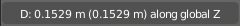

********************************************************
7.2.8 Editors - 3D View - Tool Shelf - Curve - Edit Mode
********************************************************

.. contents:: Contents

Tool Shelf - Curve - Edit Mode
==============================

With a curve object in edit mode you will find some tools to edit the curve geometry in the tool shelf.

Transform, Measure and Annotate tools
-------------------------------------

The transform , Measure and annotate tools at the end of the list are explained in the chapter 7.1.1 Editors - 3D View - Tool Shelf - Object Mode. We won't cover this tools again here.

Curve Stroke Panel
------------------

The curve stroke panel is covered in the chapter 25.1.1 Editors - Properties Editor - Tools Tab - Edit Mode. We won't cover this tools again here.

Draw
----

Allows you to draw a curve into the viewport.

Tool Settings
-------------

Type
----

Here you can set the draw method for the curve. Poly draws a simple polygon shape. Bezier creates a bezier curve type with handlers.

With type Bezier you will get more options.

Tolerance
---------

Allow deviation for a smoother but less precise line.

Method
------

The curve fitting method. Here you can choose between Refit and Split.

Detect Corners
--------------

Detect corners and use non aligned angles.

Corner Angle
------------

Corners above this angle are considered as corners.

Last Operator Draw Curve
------------------------

Error
-----

Here you can adjust the error distance threshold in object units

Fit Method
----------

The curve fitting method. Here you can choose between Refit and Split.

Corner Angle
------------

Corners above this angle are considered as corners.

Cyclic
------

With curve type bezier the curve gets closed. Has no effect at curve type Poly.

Extrude Tools Group
-------------------

This tools allows you to extrude out a new curve segment from the current selection

Snapping
--------

Holding down Ctrl activates temporary global snapping.

Precision movement
------------------

When you hold down shift, then you will have a much slower but also much preciser movement.

Header Values
-------------

When you move your selection then you will see some values in the header, which defines the current position of the extrude point. 

Move without Widget
-------------------

You don't have to use the widget to move the object. You can also click aside of it, and drag the object around. The mouse turns into a move cursor. The standard behaviour then is to move in screen space. When you want to move into a specific axis, then press X or Y or Z to limit the movement to this axis.

Limit Axis
----------

When you want to move along a specific axis, then press X or Y or Z to limit the movement to this axis. You usually start in global orientation. But you can change this in the Orientation settings.

.. image:: graphics/7.2.8_Editors_-_3D_View_-_Tool_Shelf_-_Curve_-_Edit_Mode/100002010000011D000000CC2D097956E90B5F42.png

By holding down the mouse button and pressing the X, Y or Z key twice you can toggle this to local. But also to other orientations. This depends in what orientation you start. With normal you can toggle that way between Normal and Global.

Extrude
-------

The Extrude tool extrudes the current selection in the direction of the widget.

When you activate the tool, then you will by default see a yellow widget at the selection. Drag it to extrude the selection.

Header Value
------------

When you extrude curve points then you will see a value in the header. It tells you the current target position relative to the initial starting point(s) . This factor always starts with 0.

Tool Settings
-------------

Axis Type
---------

You can choose between the regular axis type. That's the yellow widget with just one handler. It always points in the direction of the middled normals of the selection.

.. image:: graphics/7.2.8_Editors_-_3D_View_-_Tool_Shelf_-_Curve_-_Edit_Mode/100002010000011D000000CC2D097956E90B5F42.png

Or you can use the XYZ axis type. That's a handler with three axis. This widget can be aligned with the transform orientation methods.

Last operator Extrude Curve and Move
------------------------------------

Mode
----

A drop-down box where you can choose between different extrude modes.

.. image:: graphics/7.2.8_Editors_-_3D_View_-_Tool_Shelf_-_Curve_-_Edit_Mode/100002010000012D00000188D78515D9D831B596.png

Default is Translation. Most other methods has no effect.

Move X , Y , Z
--------------

The position of the extruded point(s).

Orientation
-----------

Here you can adjust the orientation of the extrusion. It usually starts with Normal.

Proportional editing
--------------------

Enables proportional editing. Activating proportional editing reveals further settings.

.. image:: graphics/7.2.8_Editors_-_3D_View_-_Tool_Shelf_-_Curve_-_Edit_Mode/1000020100000119000000773CD5255E7E68F4C5.png

Proportional Falloff
--------------------

Here you can adjust the falloff methods.

Proportional Size
-----------------

Here you can see and adjust the falloff radius.

Connected
---------

The proportional falloff gets calculated for connected parts only.

Projected(2D)
-------------

The proportional falloff gets calculated in the screen space. Depth doesn't play a role. When it's in the radius, then it gets calculated.

Extrude Cursor
--------------

Extrudes the control points to where you click.

Last Operator Add Vertex
------------------------

Location X Y Z
--------------

The location of the new created control point(s).

Radius
------

Bezier curves have a radius. This is displayed by the black lines that points away from the curve. The radius tool allows you to resize this radius.

Header Value
------------

When you resize the curve radius then you will see a value in the header. It tells you the current scale factor. This factor always starts with 1.

Last Operator Transform
-----------------------

Values X Y Z W
--------------

The axis to increase the radius. Just X has an effect with the curve radius.

Axis
----

The axis to use. This has no effect with a curve object.

Orientation
-----------

Here you can adjust the orientation of the extrusion. It usually starts with Normal.

Proportional editing
--------------------

Enables proportional editing. Activating proportional editing reveals further settings.

.. image:: graphics/7.2.8_Editors_-_3D_View_-_Tool_Shelf_-_Curve_-_Edit_Mode/1000020100000119000000773CD5255E7E68F4C5.png

Proportional Falloff
--------------------

Here you can adjust the falloff methods.

Proportional Size
-----------------

Here you can see and adjust the falloff radius.

Connected
---------

The proportional falloff gets calculated for connected parts only.

Projected(2D)
-------------

The proportional falloff gets calculated in the screen space. Depth doesn't play a role. When it's in the radius, then it gets calculated.

Tilt
----

With this tool you can tilt the curve. It is the mean tilt value in the Transform panel of the Sidebar.

Header Value
------------

When you rotate the curve with the tilt tool, then you will see a value in the header. It tells you the current rotation relative to the starting rotation. This value always starts with 0.

Last Operator Transform
-----------------------

Angle
-----

This value tells you the current rotation relative to the starting rotation. This value always starts with 0.

Proportional editing
--------------------

Enables proportional editing. Activating proportional editing reveals further settings.

.. image:: graphics/7.2.8_Editors_-_3D_View_-_Tool_Shelf_-_Curve_-_Edit_Mode/1000020100000119000000773CD5255E7E68F4C5.png

Proportional Falloff
--------------------

Here you can adjust the falloff methods.

Proportional Size
-----------------

Here you can see and adjust the falloff radius.

Connected
---------

The proportional falloff gets calculated for connected parts only.

Projected(2D)
-------------

The proportional falloff gets calculated in the screen space. Depth doesn't play a role. When it's in the radius, then it gets calculated.

Randomize
---------

Randomize the position of the selected polygon or control points.

Header Value
------------

When you randomize the points, then you will see a value in the header. It tells you the current randomization amount. This value always starts with 0.

Tool Settings
-------------

Uniform
-------

With a value of 0 the randomization happens uniformly. The higher the value the more uniform the randomization affects the selected points.

Normal
------

Align the offset direction to normals. This value has no effect.

Random Seed
-----------

A random seed value.

Last Operator Transform
-----------------------

Amount
------

The randomization amount.

Uniform
-------

With a value of 0 the randomization happens uniformly. The higher the value the more uniform the randomization affects the selected points.

Normal
------

Align the offset direction to normals. This value has no effect.

Random Seed
-----------

A random seed value.

