**********************************
7.2 Editors - 3D View - Tool Shelf
**********************************

.. contents:: Contents

3D View editor
==============

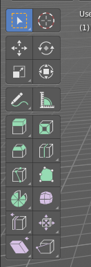

Some editors have a tool shelf at the left. Here you can find and use various tools.

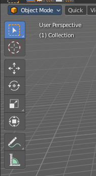

Active Tool
-----------

In the tool shelf there can just be one active tool in the tool shelf. An activated tool stays active as long as you don't change it. To deactivate the current tool you have to choose another tool. One of the select tools for example.

Tool Settings
-------------

When you activate a tool in the tool shelf then you will also reveal its tool settings. There are three locations where you can find the tool settings. In the header, in the sidebar in the Tool tab. And in the Properties in the Tools and Workspace Settings tab.

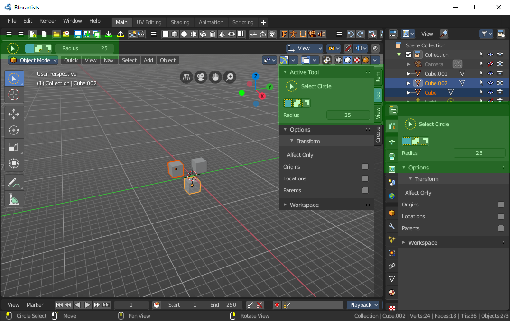

Mode dependant content
----------------------

The content of the tool shelf is changing dependand of the mode that you are in, and dependant of the object type. A mesh object in edit mode has another set of tools than a metaball. But there are some tools that are available in all modes. 3D Cursor, Select tools and Transform tools.

Tooltips
--------

The new tool system works here and there different from the old tool system. It is one gigantic hack on top of the old tool system. Already the tooltips are different. It misses the Python strings. And some tools misses a proper description. The tooltips are separated from the operators.

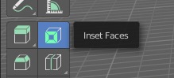

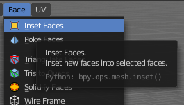

Old and new Operators
---------------------

The new tool system uses the old operators from Blender 2.79 and below. And so you can have both in the UI. Box select for example can be found in the tool shelf, but also in the select menu. The entry in the menu is the old tool system. The entry in the toolbar is the new tool system.

Most of the times the old and the new operators does the same. However, the new tool system has some differences. When you activate a tool with the old way, then this tool is immediately active. This means that for example lasso select performed from the text menu starts where the mouse is when you click at the menu item. When you activate the lasso select from the tool shelf, then the lasso select starts with the first mouse click.

Another difference is that the old tool is usually deactivated after you have used it. For example you activate the old Box select tool with hotkey B. And every time you want to do another box select you have to press hotkey B again. The box select tool in the tool shelf stays active as long as you don't choose another tool.

Also the hotkey entries in the keymap are different. The old operators calls the tools directly. The new tool system runs an special operator first to call the tools. Every entry from the tool shelf has its own category for that reason.

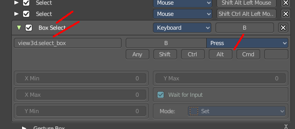

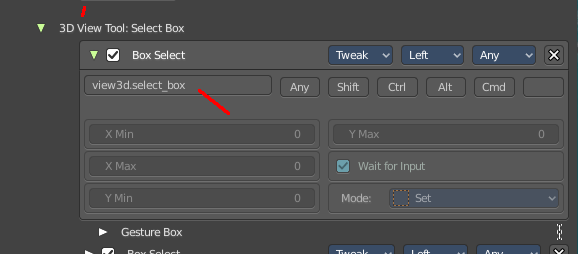

Conflicts between old and new tools
-----------------------------------

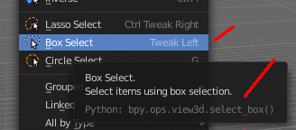

Unfortunately the new tool system collides with the old tool system here and there. In case of Box select it messes up the hotkeys. The old operator in the text menu should show hotkey B. And it should also show it in the tooltip. What it shows is the hotkey from the box select in the tool shelf.

Using old and new operators
---------------------------

The old tools can be used in mix with the new tools. You can for example have the knife tool active, but with the hotkey for Box select still box select with the old tool system, while keeping the knife tool active.

Everything that exists in the tool shelf but also in the text menus can be considered as double menu entries. They will be removed over the time.

Tool groups
-----------

Some icons have a white small triangle down right. This indicates that this icon is part of a tool group. This group can be revealed by holding down the mouse until the popup reveals the hidden tools. You can then choose the needed tool in this group. And it will become the one that gets displayed.

Resizing the tool shelf
-----------------------

The tool shelf can be resized by dragging the border of it in and out.

You have the choice between one and two icon rows. And text and icon buttons.

Currently the default starts with one row, which is a bug in the source code. But you can save the state by saving the startup file.

Switching Tools
---------------

The Blender keymap provides a way to call the tools from the tool shelf under the mouse in a popup menu. And with hotkeys. Even when they don't have a hotkey assigned in the toolbar yet.

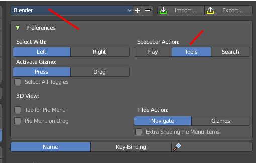

Keyboard tool switching is not enabled by default. You need to set the key-map preference Spacebar Action to Tools. And when you press spacebar, then you will see the tool shelf content under the mouse. But with an hotkey assigned. And then you can use this hotkey in combination with the spacebar to activate the tool.

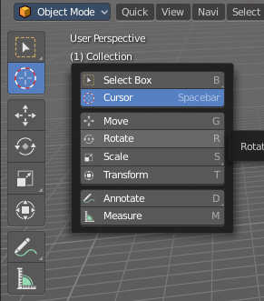

Spacebar-T for Transform, Spacebar-D for Annotate, Spacebar-M for measure, and so on.

The accelerator keys are displayed in the tooltips of the tools in the tool shelf. The hotkeys are hardcoded. And are NOT the hotkeys for the tools in the tool shelf. But just the hotkeys in conjunction with the spacebar menu!

Attention, this is not implemented in the Bforartists keymap yet. This feature is just available in the Blender keymap!

Cycling through Tools in groups
-------------------------------

You can assign a hotkey to a group of tools, and then activate Cycle in the keymap manager. This allows you to cycle through the tools in this group with the hotkey. 

For example, i have assigned F5 here to the select box. Then in the keymap manager i searched for the entry, and activated Cylce. And when i press F5 now in the 3D viewport, then the tool cycles through the different select methods by pressing the hotkey.

This example also shows the pitfall here. The keaymap is already heavily reduced to the core. But you will always run into hotkey conflicts at one point. So be careful.

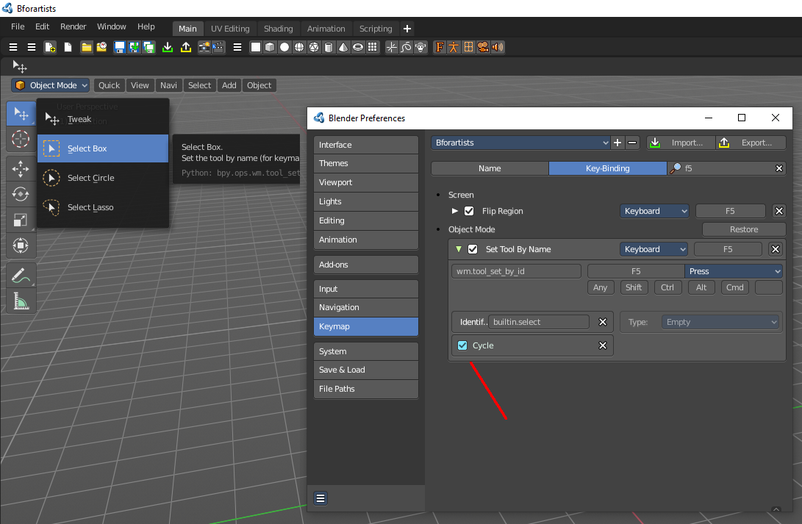

