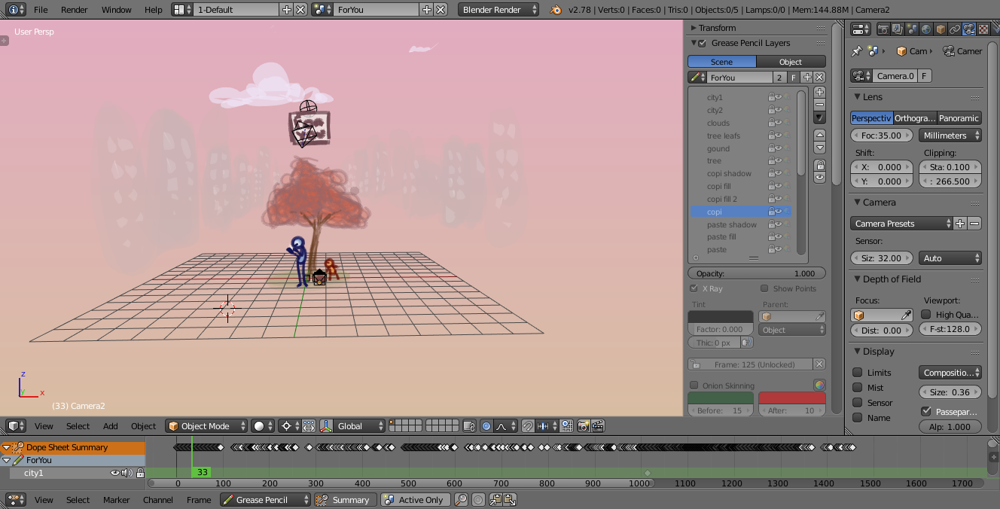
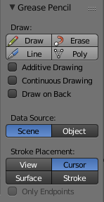
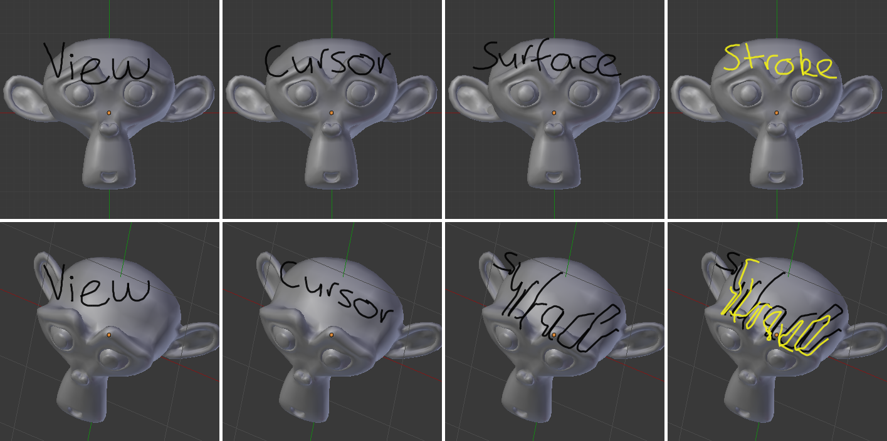
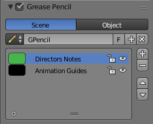
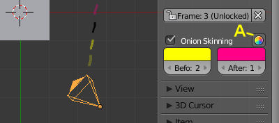
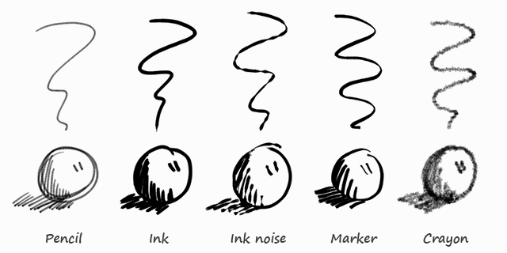
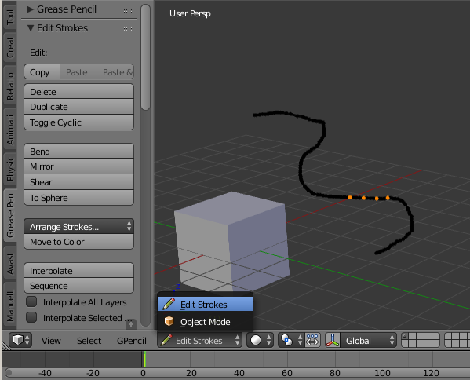
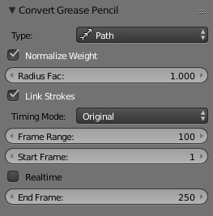

************************************
7.3 Editors - Header - Grease Pencil
************************************

.. contents:: Contents

Grease Pencil Introduction
==========================

Years ago people needed a way to quickly draw on their monitors, they did this with a tool called a grease pencil. This is especially helpful for animators who need to add notes directly on their screen. However, not everyone wants to draw on their monitors. So a digital version was made, also called a grease pencil.

You can use the Grease Pencil tool to draw freehand sketches and annotations in most of the Editors. The sketches that are made are saved with the blend-file so they can be seen at any time, a disadvantage of the old grease pencil. However, you can also do much more with the digital grease pencil such as:

- Planning animation poses and motion curves. 
- Sketching out model topology. 
- Hand-drawn storyboarding in 3D. 
- As director’s tool to review shots. 
- 2D animations 

An advanced use of **Grease Pencil** is for different tools (e.g. add-ons). Allowing you to draw where the tool is to take effect.

https://player.vimeo.com/video/155635261

Drawing Strokes
===============

Enable the **Grease Pencil** by clicking **Draw, Line, Poly or Erase** from the Tool Shelf T. A new layer will be automatically added for you to draw on.

A new layer can be added from the Grease Pencil panel in the Properties region. This panel can also be used to customize the color, opacity and thickness of the pencil lines. Changes to these settings will affect all strokes on the current layer.

An example of the Grease Pencil.

**Grease Pencil** sketches can be converted to editable geometry and used to aid the animation process.

Drawing
-------

Reference
=========

The Tool Shelf provides a number of options for drawing with the **Grease Pencil** which are detailed below.

Draw D-LMB

Draw a new stroke (multiple short, connected lines). The stroke will finish when you release the mouse button. 

Line Ctrl-D-LMB

Draw a new line in rubber band mode. The line will finish when you release the mouse button. 

Poly Ctrl-D-RMB

Draw connected lines by clicking on position you want to add the next point. Lines will be automatically added to connect the two points. Holding LMB down and sliding mouse lets you place the new point/segment preview. The transformation of the point is locked to X/Y axis set by initial direction of the mouse movement. 

Erase D-RMB, Eraser

	Erases segments of strokes that fall within the radius of the eraser “brush” (with a linear falloff from the center of the eraser circle). The erasing will continue until the mouse button is released, while trying to reduce the thickness of strokes before removing them. The eraser operates on all visible and editable layers. If begun with **Erase**, either RMB or LMB will erase strokes. Its cursor is a red circle with a dashed outline.

	The size of the eraser “brush” can be controlled with Wheel, or with NumpadPlus and NumpadMinus, while still holding RMB.

Additive Drawing
----------------

With the “Additive Drawing” option enabled the active frame’s strokes will be carried over/copied if you start drawing on an empty frame (i.e. one without any keyframe already). This saves the effort of keeping a Dopes sheet open, and to remember to duplicate the current frame before starting to draw the next pose (or risk managing to draw the perfect pose, but without everything else).

This option makes it easier to animate shots where you’re building on a result from a previous frame. Examples of cases where this comes in handy includes animating facial expressions (when all outlines are on the same layer), or animating “growing” things (e.g. vines, or concentric circles growing from a central point).

.. list-table::

	* - Note

	* - Even without this option enabled, this is the default behavior when using the eraser on an “empty” frame. This makes it easier to do shots where you’re just changing parts of the facial expression, or if you’re animating an “eraser” effect.

Continuous Drawing
------------------

Continuous Drawing allows for rapid sketching with the **Grease Pencil** when multiple strokes are desired. So that you only have to hold D once for the first stroke. Besides the checkbox Continuous Drawing is also enabled if the D key is released while pressing LMB. The eraser for one-off strokes (RMB) is still available. Note that with the **Eraser** both LMB or RMB can be used when drawing has started.

Use Esc or Return or clicking outside the current viewport (e.g. another region or editor) to exit the mode. Continuous drawing can be disabled using E key in order to get fast access to sculpt mode.

Draw on Back
------------

New strokes are moved behind the drawing when confirming the drawing tool (lowered to the bottom of the stack).

Stroke Placement
----------------

Grease Pencil panel.

Defines how the strokes are converted to 3D (or 2D) space.

View 

New strokes are placed in screen space (2D) and are locked to the view. 

Cursor 

New strokes are drawn in 3D-space, with position determined by the 3D cursor and the view rotation at the time of drawing. **Cursor** is available as an option in the **UV/Image Editor** but it functions identically to the **View** option. **(3D View only)**

Surface 

New strokes are drawn in 3D-space, with their position projected onto the first visible surface. **(3D View only)**

Stroke 

New strokes are drawn in 3D-space, with their position projected onto existing visible strokes. Note that strokes created with **View** are not in 3D-space and are not considered for this projection. **(3D View only)**

Only Endpoints 

Applies the drawing setting only to the endpoints of the stroke. The part of the stroke between the endpoints is adjusted to lie on a plane passing through the endpoints. 

The effect of different Drawing Settings on Grease Pencil strokes.

.. list-table::

	* - Tip

	* - Notes For Tablet Users:

Enable Editing 

See Stroke Edit Mode. A overlay is displayed in the top-right corner of editors when enabled. 

Tools
-----

- Convert to Geometry 
- Ruler and Protractor 

Layers
======

Reference
=========

Grease Pencil sketches are organized in layers, much like the image layers in the GIMP or Photoshop®. These layers are not related to any of the other layer systems in Bforartists.

The layers’ main purpose is to gather sketches that are related in some meaningful way (e.g. “blocking notes”, “director’s comments on blocking”, or “guidelines”). For this reason, all the strokes on a layer (not just those made after a particular change) are affected by that layer’s color, opacity, and stroke thickness settings.

Layers are managed in the **Grease Pencil Panel** of the **Properties region**N shown here.

Grease Pencil Panel.

Grease Pencil Data
------------------

Use the following controls to Add, Remove or adjust the position of a layer in the list.

Source 

	Scene 

	Grease Pencil data is attached to the current scene is used, unless the active object already has Grease Pencil data (i.e old files). 

	Object 

	Grease Pencil data is attached to the active object are used. This is required when using pre 2.73 add-ons. 

Grease Pencil 

Used to select the Grease Pencil data-block to use for layers. For controls see Data-Block Menu. 

Active Layer 

	A List Views & Presets of layers attached to each scene or object.

	Parent (bone icon) 

	Indicates that a parent has been set for the layer. 

	Lock (padlock icon) 

	Locks the ability to edit the current layers layer. 

	Hide (eye icon) H

	Hides the current layer in the drawing region. 

	Unlock Color (palette with arrow icon) 

	Unprotects selected colors from further editing and/or frame changes. 

	Isolate (padlock icon) NumpadAsterix

	To restrict editing to the active layer only. 

	Isolate (visible) (eye icon) 

	An option of **Isolate** to also affect the visibility. 

	Specials 

	Duplicate Layer 

	Creates a copy of the current layer. 

	Show All Alt-H

	Makes all hidden layers visible. 

	Hide Others Shift-H

	Makes all non selected layers hidden. 

	Lock/Unlock All 

	Locks/Unlocks all of the layers. This can be useful to prevent unwanted editing. 

	Merge Down 

	Merges the current layer with the layer below it. 

.. list-table::

	* - Note

	* - By default, most operations occur only on the **active** layer highlighted in the list.

Appearance Settings
-------------------

These settings can be used to change how the active layer appears.

Opacity 

The transparency of the layer. 

X-Ray 

Makes the lines visible when they pass behind other objects in the scene. 

Show Points 

Draws the start/end points that make up the stroke. 

Tint 

	Color 

	The color to tint the layer. 

	Factor 

	The amount that the **Tint Color** has on the layer. 

Thickness Change 

	A relative change in pixels to apply to the thickness of all stroke in the active layer (works like a modifier).

	Apply (hand and bulged in blue line icon) 

	If the apply button is pressed, the thickness change is applied and the value is reset to zero. 

Animation
---------

Parent 

	An Data ID to select the parent object. The strokes of the layer will follow parent transformations.

	Type 

	Type of parent relation.

	Object, Armature, Bone

Lock Frame 

Locks the current frame displayed by layer. 

Delete Frame 

Deletes the active frame for the active Grease Pencil Layer. 

Onion Skinning
--------------

Onion-skinning, also known as ghosting, helps an animator by displaying the neighboring frames as a faded trail.

Grease Pencil Onion Skinning.

A: Use Custom Colors

Onion Skinning 

Checkbox to enable onion skinning. 

Always Use (camera icon) 

If enabled ghosts are displayed when scrubbing the view and/or playing back animation. 

Use Custom Colors (palette icon) 

Toggles to use the **Before** and **After** controls to change the color of the ghosted frames. 

Before/After 

	Color 

	The color of the strokes before/after the current frame. 

	Before/After Range 

	The maximum number of ghosts to show before/after the current frame. 0 will only show the previous/next sketch, and -1 will not show any frames before/after current. 

Colors
======

Reference
=========

Palette 

	A Data-Block Menu to select a palette, which is a set of colors. Switching palettes will change all strokes color in all layers if the same color are linked.

	New +

	If there are more than one palette, all colors of the old palette will be transferred to the new selected palette.

- If the color exist in the new palette (same name), the stroke is linked to new color. 
- If the color does not exist in the new palette, a new color is added to the palette in order to keep the stroke. 

	Colors 

	A List Views & Presets of colors grouped in the palette linked as stroke or fill colors. If a color with strokes is removed, all strokes of this color are removed. Any change to line color or fill color, will change any stroke of any layer using this color. A palette must contain at least one color, so the last one cannot be deleted.

	Lock (padlock icon) 

	ToDo. 

	Hide (eye icon) 

	ToDo. 

	Ghost (ghost icon) 

	ToDo. 

	Specials 

	ToDo. 

Stroke 

Sets the line color and the maximum opacity (which is also affected by the brush strength). 

Fill 

Sets the color of the interior space enclosed by the strokes. Increase the opacity from zero to make the fill visible. Fill works best on convex shapes, unless you are using **High Quality Fill** (see below). 

Volumetric Strokes 

An alternative drawing technique by drawing strokes as a series of filled screen-aligned discs. Get best results with partial opacity and large stroke widths. 

High Quality Fill 

Uses a better fill algorithm that works better for concave drawings. 

Brushes
=======

Drawing Brushes
---------------

Reference
=========

Brushes 

A List Views & Presets of preset brushes. You can switch between the brushes using keyboard numbers from 1 to 0. The selected drawing brush is the brush in the list located at that position. 

Thickness 

Width of full pressure strokes in pixels constant to the viewport i.e. not affected by the zoom. The thickness can be lower depending of the pressure. 

Sensibility 

Adjust the sensibility of the thickness to the pressure of the pencil on the tablet. This pressure can be disabled using the right small button. 

Strength 

Similar to sensibility, but affect the alpha value of the color. This parameter allows to get effects as color fading or watercolor. 

Randomness 

The properties for **Sensibility** and **Strength** additionally have a randomness factor which can be enabled using the jagged line icon to the right of the number sliders. 

Jitter 

Define a jitter randomness in the stroke. 

Angle 

	Defines the angle when the thickness of the stroke will be 100%. Any change in the direction will change the thickness.

	Factor 

	Defines the effect for drawing angle changes in the thickness. 

.. list-table::

	* - Tip

	* - The **Angle** and **Angle Factor** parameters allow to create drawing brushes such as markers that change the thickness depending of the angle of drawing. This gets a more artistic drawing and less “computer” lines.

Preset Brushes.

Stoke Quality
-------------

These settings are per-brush settings that are applied after each stroke is drawn (when converting from 2D/screen space coordinates to 3D/data space coordinates). These are per-brush settings so that you can apply varying proprieties to different types of brushes. E.g higher smoothing and/or subdivision for final “beauty”, and less smoothing/subdivision for initial “blocking” strokes.

Smooth 

	Defines how much smoothing is applied (using the same method as the “Smooth” Brush). It is used to get rid of jagged edges and jitter/hand shake.

	Smoothing Iterations 

	Defines how many times smoothing is applied. On each additional round of smoothing performed, the strength of the smoothing applied is halved, i.e. on the first round, it will be 100% of smoothing factor, then 50%, then 25%, etc. This setting is most useful for improving the quality of heavily subdivided strokes, where the multiple rounds of smoothing can help reduce “faceting” artifacts. 

Subdivision Steps 

	Defines how many times the stroke will be subdivided. Each time the stroke is subdivided, extra stroke points are added between each pair of existing stroke points. The main use of this setting is to make strokes look less “faceted” (especially large strokes drawn quickly). Strokes are subdivided before smoothing is applied.

	Randomness 

	Amount of randomness to add new new strokes after subdivision. 

Brush Curves
------------

Reference
=========

This panel allows you to adjust the parameters used with tablets to get personal preferences. The available curves that can be edited are:

- Sensitivity 
- Strength 
- Jitter 

Read more about using the Curve Widget.

Stroke Edit Mode
================

Enter Stroke Edit Mode with the **Mode** select menu in the 3D Views header or toggle the **Enable Editing** in the Grease Pencil panel, or use D-Tab. In this mode, many common editing tools will operate on Grease Pencil stroke points instead.

These tools let you move and reshape grease pencil strokes after they have been drawn.

Open the Grease Pencil tab on the Tool Shelf. Look for the tools in the Edit Strokes panel shown here:

Edit panel with grease pencil strokes.

Selecting
---------

Grease pencil strokes are formed from a series of connected vertex points. To make changes, first select points on the strokes that you want to edit. You can only select points on the active layer. The selected points are highlighted as in the image above.

.. list-table::

	* - Hint

	* - Set the layer’s **Stroke Thickness** to 1 to make the points more visible.

Use the mouse to select the points, or one of the selection buttons in the panel as detailed in Basic Selection.

Various selection functions similar to those available when editing meshes can be used:

.. list-table::

	* - Select All
	  - A

	* - Border Select
	  - B

	* - Circle Select
	  - C

	* - Lasso Select
	  - Ctrl-LMB

	* - Select Linked
	  - L, Ctrl-L

	* - Select More
	  - Ctrl-NumpadPlus

	* - Select Less
	  - Ctrl-NumpadMinus

	* - Select Stroke
	  - Alt-LMB

Editing
-------

Header
------

Some tools can be access through the 3D View header. e.g. Copy/Paste.

Onion Skinning 

Toggles Onion Skinning. 

Selection Mask, Alpha 

See Further Options. 

Menu
----

Shrink/Flatten Alt-S

Adjust the pressure values of selected stroke points. This provides a way to modify the thickness of strokes by moving the mouse or the Wheel. 

Delete All Active Frame D-X

Deletes all strokes in the active frame. It can be accessed using D-X (anywhere), as well as Shift-X (Edit Strokes Mode only) or the GPencil > Delete menu. This makes it easier to quickly get rid of throwaway scribbles. 

Move to Layer M

Can be used to move strokes between layers (including to a new layer). 

Edit Strokes Panel
------------------

Reference
=========

Copy Ctrl-C

Copies the selected Grease Pencil strokes (or actually, points and segments). 

Paste Ctrl-V

Pastes the previously copied strokes. 

Paste & Merge 

Pastes the previously copied strokes and merge in active layer. 

Delete X

	Points 

	Delete the selected points, leaving a gap in the stroke. 

	Dissolve 

	Reconnect the ends so there is no gap in the stroke. 

	Strokes 

	Delete the entire stroke containing any selected points. 

	Frame 

	Delete a frame when doing Animating Sketches. 

Duplicate Shift-D

Make a copy of the selected points at the same location. Use the mouse to **Translate** them into position. LMB places them at their new position. RMB cancels and removes the duplicates. 

Toggle Cyclic 

Close or open the selected stroke by adding an edge from the last to first point. 

Bend Shift-W

Bends selected item between the 3D cursor and the mouse. 

Mirror Ctrl-M

Mirrors selected strokes along one or more axises. 

Shear Shift-Ctrl-Alt-S

Shears selected items along the horizontal screen axis. 

To Sphere Shift-Alt-S

Move selected vertices outward in a spherical shape around the midpoint. 

Arrange Strokes 

	Arranges the selection of strokes up/down in the drawing order of the active layer.

	Bring Froward, Send Backward, Bring to Front, Send to Back

Move to Color 

Sets the active color as the new color to all selected strokes. 

Interpolate 

	Interpolate Ctrl-Alt-E

	Interpolates grease pencil strokes between frames. 

	Sequence Shift-Ctrl-E

	Interpolates full grease pencil strokes sequence between frames. 

	Interpolate All Layers 

	Checkbox to interpolates all layers, not only active. 

	Interpolate Selected Strokes 

	Checkbox to interpolates only the selected strokes in the original frame. 

Join Strokes 

	Type 

	Join Ctrl-J

	Joins selected strokes. 

	Join & Copy Shift-Ctrl-J

	Joins selected strokes as a new stroke. 

	Leave Gaps 

	Leaves gaps between joined strokes instead of linking them. 

Flip Direction 

Flips the start and end of a stroke. 

Show Directions 

Displays stroke drawing direction with a bigger green dot of the start point and a smaller red dot for the end point. 

Reproject Strokes 

Reprojects the selected strokes from the current viewpoint to get all points on the same plane again. This can be useful to fix problem from accidental 3D cursor movement, or viewport changes. 

Sculpt Strokes Panel
--------------------

Reference
=========

Several tools for editing Grease Pencil strokes are provided in the form of brushes which you can use to “paint” or “sculpt” the appearance of the strokes without having to keep doing a tedious select-tweak-select-tweak pattern of edits.

Hold E-LMB and drag to sculpt.

Brushes
-------

The brushes currently implemented are:

Smooth 

	Allows you to selectively relax jitter/shake and bumpiness, to tidy up messy parts of your sketches.

	Affect Pressure 

	Use this option to perform smoothing on stroke thickness values. 

Thickness 

The Thickness Brush can be used to increase (Add) or decrease (Subtract) the thickness of the parts of the stroke under the cursor. 

Strength 

Increase/decrease (Ctrl) the alpha value of the stroke, E.g. for creating fading effects. 

Grab 

Takes the stroke points which fall within the brush circle when the sculpting action begins, and allows you to translate this set of points. 

Push 

The Push Brush is very similar to the Grab brush, in that it also allows the user to translate stroke points. However, unlike the Grab Brush, the Push Brush is not restricted to operating only on the first set of points which were under the brush when the sculpt action was initiated. Instead, on each brush movement, the points currently under the brush get moved based on the amount the brush has moved since the last time it was evaluated. 

Twist 

Used to twist/rotate points around the cursor, creating a “swirling” effect. It is useful for applying low levels of distortion to stroke points. The **Direction** controls whether the points are rotated in a clockwise (CW) or anti-clockwise (CCW) direction. 

Pinch/Inflate 

	Used to draw points away from the cursor, or towards it.

	Pinch 

	Draw points towards the cursor. 

	Inflate 

	Push points away from the cursor. 

Randomize 

Randomizes the stoke attributes. e.g. with **Position** enabled it displaces the points randomly in screen space to create jittered/jagged lines. 

Clone Brush 

	Used to paste the previously copied points (in the Copy/Paste buffer on the active layer), located at the point where you clicked.

Hold LMB and drag to position and adjust the pasted strokes. The strokes center follows the movements of the brush/cursor (“Stamp Mode”).

	Use Falloff 

	When the **Use Falloff** option is enabled, instead of moving all the newly pasted strokes by the same amount, only the points that are currently under the cursor get affected. Thus, this in this mode of operation, the brush is closer to a Paste and Push operation instead (“Stamp and Smudge”). 

Common Options
--------------

Radius Shift-F/Wheel

The size of the brush. Increase/decrease brush size with Shift-F when not sculpting or with Wheel while sculpting (i.e. with the pen tip down, or mouse button held). 

Strength Ctrl-F/Shift-Wheel

The Strength off the brush, can be changed by the pressure of the stylus. (In/decrease see **Radius**). 

Use Falloff 

Enables a linear falloff to calculate the influence of the brush on a point. That is, a point closer to the midpoint of the brush (i.e. the point under the cursor) will get affected more than the ones at the edges. 

Direction E-Ctrl-LMB

Radio button to invert the brush effect. 

Affect 

Enable sculpt for position, strength (alpha value) and thickness in Smooth and Randomize brush. 

Further Options
---------------

Selection Mask 

Used to restrict the brush to only operating on the selected points. 

Alpha Ctrl-H

Alpha value of the visualization for selected vertices. The visibility can be toggled (hide/unhide) using Ctrl-H. 

Animating Sketches
==================

You can use Grease Pencil to create 2D animations (e.g. in flipbook style) and mixing it with 3D objects and composition.

Sketches are stored on the frame that they were drawn on, as a separate drawing (only on the layer that they exist on). A keyframe is automatically add per layer. Each drawing is visible until the next drawing for that layer is encountered. The only exception to this is the first drawing for a layer, which will also be visible before the frame it was drawn on.

Therefore, it is simple to make a pencil-test/series of animated sketches:

- Go to first relevant frame. Draw. 
- Jump to next relevant frame. Draw some more. 
- Keep repeating process, and drawing until satisfied. Voila! Animated sketches. 

.. list-table::

	* - See also

	* - Grease Pencil mode in the Dope Sheet editor.

Compositing
-----------

The grease pencil layers create a pass inside OpenGL render result. This result can be exported to EXR multilayer and used in composition.

ToDo.

https://youtu.be/vSD5mN7LT_g

Convert to Geometry
===================

Reference
=========

Panel: Tool Shelf > Grease Pencil > Grease Pencil > Tools: Convert to Geometry...

Menu: GPencil > Convert to Geometry...

Hotkey: Alt-C

The Convert to Curve options.

In the 3D View, sketches on the active layer can be converted to geometry, based on the current view settings, by transforming the points recorded when drawing (which make up the strokes) into 3D-space. Currently, all points will be used, so it may be necessary to simplify or subdivide parts of the created geometry for standard use.

Sketches can currently be converted into curves, as proposed by the **Convert Grease Pencil** menu popped-up by the **Convert** button in the grease pencil properties.

Options
-------

Type 

	The type of object to convert to.

	Path 

	Create NURBS 3D curves of order 2 (i.e. behaving like polylines). 

	Bézier Curve 

	Create Bézier curves, with free “aligned” handles (i.e. also behaving like polylines). 

	Polygon Curve 

	Bézier Curve with strait line segments (auto handles). 

.. list-table::

	* - Note

	* - Converting to Mesh

Normalize Weight 

	Will scale weights value so that they tightly fit into the (0.0 to 1.0) range. (enabled by default)

	All this means that with a pressure tablet, you can directly control the radius and weight of the created curve, which can affect e.g. the width of an extrusion, or the size of an object through a **Follow Path**Constraint or **Curve** Modifier!

Link Strokes 

Will create a single spline, i.e. curve element. (enabled by default) from all strokes in active grease pencil layer. This especially useful if you want to use the curve as a path. All the strokes are linked in the curve by “zero weights/radii” sections. 

Timing
------

Grease pencil stores “dynamic” data, i.e. how fast strokes are drawn. When converting to curve, this data can be used to create an **Evaluate Time** F-Curve (in other words, a path animation), that can be used e.g. to control another object’s position along that curve (**Follow Path** constraint, or, trough a driver, **Curve** modifier). So this allows you to reproduce your drawing movements.

.. list-table::

	* - Warning

	* - All those “timing” options need **Link Stroke** to be enabled, else they would not make much sense!

Timing Mode 

	This control let you choose how timing data are used.

	No Timing 

	Just create the curve, without any animation data (hence all following options will be hidden). 

	Linear 

	The path animation will be a linear one. 

	Original 

	The path animation will reflect to original timing, including for the “gaps” (i.e. time between strokes drawing). 

	Custom Gaps 

	The path animation will reflect to original timing, but the “gaps” will get custom values. This is especially useful if you have very large pauses between some of your strokes, and would rather like to have “reasonable” ones! 

Frame Range 

The “length” of the created path animation, in frames. In other words, the highest value of **Evaluation Time**. 

Start Frame 

The starting frame of the path animation. 

Realtime 

When enabled, the path animation will last exactly the same duration it took you do draw the strokes. 

End Frame 

When **Realtime** is disabled, this defines the end frame of the path animation. This means that the drawing timing will be scaled up or down to fit into the specified range. 

Gap Duration 

**Custom Gaps** only. The average duration (in frames) of each gap between actual strokes. Please note that the value entered here will only be exact if **Realtime** is enabled, else it will be scaled, exactly as the actual strokes’ timing is! 

Example
-------

Here is a simple “hand writing” video created with curves converted from sketch data:

https://youtu.be/VwWEXrnQAFI

The blend-file from the above example can be found here.

https://wiki.blender.org/index.php/file:ManGreasePencilConvertToCurveDynamicExample.blend

